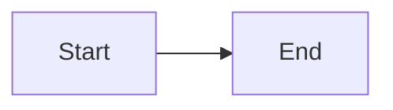

# Claude Code Rules

## Project Context

This is an Astro-based technical blog for experienced software professionals. All content is highly technical and structured for cohesive reading.

**Documentation**: See `llm_docs/` for detailed guides:

- [content.md](../llm_docs/content.md) - Content categories, schemas, frontmatter
- [content-guidelines.md](../llm_docs/content-guidelines.md) - Writing standards, research requirements, quality checklist
- [markdown-features.md](../llm_docs/markdown-features.md) - Expressive Code, Mermaid, KaTeX
- [code-standards.md](../llm_docs/code-standards.md) - TypeScript, CSS, accessibility
- [commands.md](../llm_docs/commands.md) - Commands and draft workflow

## Skills Available

Claude Code has specialized skills for content operations. Trigger them with these phrases:

### Write Blog Skill

**Trigger**: "Write blog...", "Create article...", "Write a deep-dive..."

**What it does**:
1. Performs deep web research (official docs, source code, benchmarks)
2. Creates draft structure in `content/drafts/`
3. Writes comprehensive content with mermaid diagrams
4. Follows content-guidelines.md standards
5. Validates and saves to production location

**Example**: "Write blog about Node.js event loop internals"

### Review Blog Skill

**Trigger**: "Review blog...", "Audit article...", "Improve blog...", "Check blog..."

**What it does**:
1. Locates article by path or topic
2. Performs fact-checking via web research
3. Checks structure against requirements
4. Assesses quality and depth
5. Generates detailed report with recommendations
6. Optionally applies fixes

**Example**: "Review blog content/deep-dives/tools/2023-09-01-libuv/index.md"

## Critical Rules

### TypeScript

- **Strictest mode** - No implicit any, strict null checks
- Use `import type` for type-only imports
- All code must be properly typed

### Content Creation

- **Title**: Extracted from H1 heading (don't add to frontmatter)
- **Description**: Paragraphs between H1 and "Table of Contents"
- **Publish date**: From filename `YYYY-MM-DD-slug.md`
- **Required**: "Table of Contents" heading after description
- **Audience**: Experienced professionals, highly technical
- **Required elements**: Abstract, overview mermaid diagram, comprehensive TLDR, references

### Code Blocks

- **ALWAYS collapse boilerplate** using `collapse={1-5, 20-25}`
- Use `title="filename.ts"` for file context
- Highlight key lines with `{2-4}`
- Use diff syntax for changes (`+` / `-`)

### CSS

- **Minimalistic approach** - Prefer Tailwind utilities
- No unnecessary wrappers or redundant styles
- Use dark mode variants (`dark:`)

### Accessibility

- Semantic HTML elements
- Alt text for all images
- ARIA labels where needed
- Keyboard navigable

## Content Categories

| Collection | Path                  | Required Fields       |
| ---------- | --------------------- | --------------------- |
| writing    | `content/writing/`    | tags                  |
| deep-dives | `content/deep-dives/` | tags, subcategory     |
| work       | `content/work/`       | tags, type (optional) |
| uses       | `content/uses/`       | tags                  |

## Quick Reference

### File Naming

```
YYYY-MM-DD-slug-name.md
2024-03-15-react-hooks.md
```

### Frontmatter Template

```yaml
---
lastUpdatedOn: 2024-01-15
tags:
  - tag-id
---
```

### Code Block with Collapse

````markdown
```ts title="example.ts" collapse={1-3}
import { a } from "a"
import { b } from "b"
import { c } from "c"

// Visible main code
function main() {
  return "hello"
}
```
````

### Mermaid Diagram

````markdown
<figure>



<figcaption>Description of what the diagram shows</figcaption>

</figure>
````
