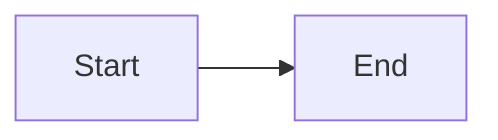

# Claude Code Rules

## Project Context

Astro-based technical blog for experienced software professionals (senior/staff/principal engineers). All content is highly technical and structured for cohesive reading.

**Documentation**: Reference guides are in the `llm_docs/` directory at the project root.

## Project Structure

**IMPORTANT**: This project uses a non-standard Astro layout:

| Directory  | Purpose                                        |
| ---------- | ---------------------------------------------- |
| `src/`     | Source code (components, pages, styles, utils) |
| `content/` | Content collections (NOT `src/content/`)       |

**Key content files** (all at project root `content/` folder):

- `content/posts/` - Blog post markdown files
- `content/in-research/` - Research material
- `content/tags.jsonc` - Tag definitions (NOT `src/content/tags.json`)
- `content/categories.jsonc` - Category definitions
- `content/postTypes.jsonc` - Post type definitions

**IMPORTANT**: Before executing any skill, read the relevant documentation files using absolute paths from the project root:

| Document           | Path (from project root)         | Description                                       |
| ------------------ | -------------------------------- | ------------------------------------------------- |
| Content Structure  | `llm_docs/content.md`            | Content categories, schemas, frontmatter          |
| Content Guidelines | `llm_docs/content-guidelines.md` | Writing standards, conciseness, quality checklist |
| Markdown Features  | `llm_docs/markdown-features.md`  | Expressive Code, Mermaid, KaTeX syntax            |
| Code Standards     | `llm_docs/code-standards.md`     | TypeScript, CSS, accessibility requirements       |
| Commands           | `llm_docs/commands.md`           | Build commands and workflow                       |

**Note**: These paths are relative to the project root, NOT relative to the `.claude/` directory.

## Claude Skills

### Content Skills

| Skill             | Trigger                                    | Description                                   |
| ----------------- | ------------------------------------------ | --------------------------------------------- |
| `/write-post`     | `/write-post <topic>`                      | Write new blog post with deep research        |
| `/review-posts`   | `/review-posts <path/topic>`               | Review and improve existing post              |
| `/sys-design`     | `/sys-design <topic>`                      | Write system design solution document         |
| `/research-post`  | `/research-post <topic>`                   | Generate research material for future article |
| `/write-research` | `/write-research <type> <category> <path>` | Convert research into blog post               |
| `/review-all`     | `/review-all`                              | Review all posts one by one                   |

### Code Skills

| Skill             | Trigger           | Description                              |
| ----------------- | ----------------- | ---------------------------------------- |
| `/review-code`    | `/review-code`    | Review entire codebase against standards |
| `/review-changes` | `/review-changes` | Review uncommitted changes only          |

## Critical Rules

### Content Creation

- **Audience**: Senior/staff/principal engineers only
- **Conciseness**: No padding, no filler, no tutorial-style hand-holding
- **Every paragraph earns its place** - if removing doesn't reduce understanding, remove it
- **Reading time**: Target < 30 minutes, max 60 minutes
- **Title**: Extracted from H1 heading (don't add to frontmatter)
- **Description**: Paragraphs between H1 and "Table of Contents"
- **Publish date**: From filename `YYYY-MM-DD-slug.md`
- **No manual ToC**: Auto-generated

### Code Blocks

**ALWAYS collapse boilerplate:**

````markdown
```ts title="example.ts" collapse={1-3}
import { a } from "a"
import { b } from "b"
import { c } from "c"

// Visible main code
function main() {
  return "hello"
}
```
````

- Use `title="filename.ts"` for file context
- Highlight key lines with `{2-4}`
- Collapse imports, setup, helpers unless directly relevant

### TypeScript

- **Strictest mode** - No implicit any, strict null checks
- Use `import type` for type-only imports
- All code must be properly typed
- Use path aliases: `@/*`, `@constants/*`

### CSS

- **Minimalistic** - Prefer Tailwind utilities
- Semantic class names for 3+ utilities
- CSS variables for theming
- Use dark mode variants (`dark:`)

### Accessibility

- Semantic HTML elements
- Alt text for all images
- ARIA labels where needed
- Keyboard navigable

## Content Collections

| Collection  | Path                   | Required Fields |
| ----------- | ---------------------- | --------------- |
| posts       | `content/posts/`       | tags            |
| in-research | `content/in-research/` | topic, status   |

**Content metadata files** (all JSONC format with comments):

- Tags: `content/tags.jsonc`
- Categories: `content/categories.jsonc`
- Post Types: `content/postTypes.jsonc`

## Quick Reference

### File Naming

```
YYYY-MM-DD-slug-name.md
2024-03-15-react-hooks.md
```

### Frontmatter Template

```yaml
---
lastReviewedOn: 2024-01-15
tags:
  - tag-id
---
```

### Mermaid Diagram

````markdown
<figure>



<figcaption>Description of diagram</figcaption>

</figure>
````
