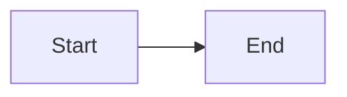

# Claude Code Rules

## Project Context

Astro-based technical blog for experienced software professionals (senior/staff/principal engineers). Content is highly technical and structured for cohesive reading.

**Documentation**: Canonical guidance lives in `llm_docs/guidelines-content/` and `llm_docs/guidelines-code/`.

## Project Structure

**IMPORTANT**: This project uses a non-standard Astro layout:

| Directory  | Purpose                                        |
| ---------- | ---------------------------------------------- |
| `src/`     | Source code (components, pages, styles, utils) |
| `content/` | Content collections (NOT `src/content/`)       |

**Key content paths**:

- `content/articles/` - Category/Topic/Article hierarchy
- `content/ordering.json5` - Global ordering config
- `content/home.json5` - Homepage config
- `content/site.json5` - Site metadata
- `content/vanity.json5` - Redirects

**IMPORTANT**: Before executing any skill, read the relevant documentation files using absolute paths from the project root:

| Document                 | Path (from project root)                                    | Description                             |
| ------------------------ | ----------------------------------------------------------- | --------------------------------------- |
| Content Structure        | `llm_docs/guidelines-content/content-structure.md`          | Content hierarchy and metadata pipeline |
| Content Guidelines       | `llm_docs/guidelines-content/content-guidelines.md`         | Writing and review rules                |
| Research & Fact-Checking | `llm_docs/guidelines-content/research-and-fact-checking.md` | Source quality and verification         |
| Markdown Features        | `llm_docs/guidelines-content/markdown-features.md`          | Expressive Code, Mermaid, KaTeX         |
| Persona                  | `llm_docs/guidelines-content/persona.md`                    | Voice and audience                      |
| Coding Standards         | `llm_docs/guidelines-code/coding-standards.md`              | TypeScript/CSS/accessibility            |
| Skills Registry          | `llm_docs/skills/README.md`                                 | Agent-agnostic skills                   |
| Agent Rules              | `llm_docs/agents/claude.md`                                 | Claude-specific mapping                 |

**Note**: These paths are relative to the project root, NOT relative to the `.claude/` directory.

## Claude Skills

### Content Skills

| Skill             | Trigger                           | Description                                |
| ----------------- | --------------------------------- | ------------------------------------------ |
| `/write-article`  | `/write-article <topic>`          | Write new article with deep research       |
| `/update-article` | `/update-article <path> <prompt>` | Update existing article with deep research |

## When to Use Coding Guidelines

If the user prompt is about **changing site functionality** (code changes in `src/`, `plugins/`, `scripts/`, etc.), read and follow:

- `llm_docs/guidelines-code/coding-standards.md`

Content skills (`/write-article`, `/update-article`) only require `llm_docs/guidelines-content/*`.

## Critical Rules

### Content Creation

- **Audience**: Senior/staff/principal engineers and stakeholders
- **Conciseness**: No padding, no filler
- **Title**: Extracted from H1 heading (no frontmatter title)
- **Description**: Text between H1 and first H2
- **Drafts**: H1 starts with `Draft:`
- **No manual ToC**: Auto-generated
- **Specs first**: Always cite specs and include short spec quotes

### Code Blocks

**ALWAYS collapse boilerplate and irrelevant lines:**

````markdown
```ts title="example.ts" collapse={1-3, 10-12}
import { a } from "a"
import { b } from "b"
import { c } from "c"

// Visible main code
export function main() {
  return "hello"
}

// Collapsed helpers
function helper() {}
```
````

- Use `title="filename.ts"` for file context
- Highlight key lines with `{2-4}` when helpful
- Collapse imports, setup, helpers, and mid-function noise

### TypeScript

- **Strictest mode** - No implicit any, strict null checks
- Use `import type` for type-only imports
- Use path aliases: `@/*`, `@constants/*`

### CSS

- Use semantic class names in markup
- Implement with Tailwind `@apply` in CSS
- Use CSS variables for theming

### Accessibility

- Semantic HTML elements
- Alt text for all images
- ARIA labels where needed
- Keyboard navigable

## Content Collections (Current)

| Collection | Path                                                      | Notes            |
| ---------- | --------------------------------------------------------- | ---------------- |
| category   | `content/articles/<category>/README.md`                   | H1 + description |
| topic      | `content/articles/<category>/<topic>/README.md`           | H1 + description |
| article    | `content/articles/<category>/<topic>/<article>/README.md` | Full article     |

No frontmatter is required in these files.

## Quick Reference

### File Structure

```
content/articles/<category>/<topic>/<article>/README.md
```

### Mermaid Diagram

````markdown
<figure>



<figcaption>Description of diagram</figcaption>

</figure>
````
