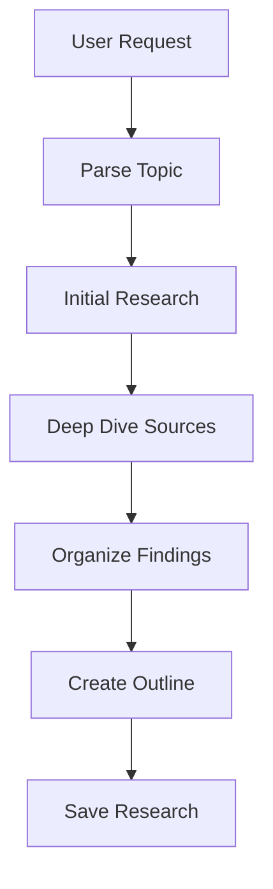

# Research Post Skill

Generates comprehensive research material on a topic, aggregating content from multiple sources and creating an outline for a future article. Output goes to `content/in-research/`.

## Invocation

- `/research-post <topic name>`
- `/research-post WebSocket internals and scaling patterns`

If called without arguments, ask user for topic.

## Purpose

This skill is for **research and content aggregation**, not article writing. It:
- Gathers information from multiple authoritative sources
- Identifies key concepts and areas to cover
- Creates a structured outline for future article writing
- Collects references with annotations
- Flags areas needing deeper investigation

## Workflow



## Output Structure

Create a folder in `content/in-research/`:

```plain
content/in-research/YYYY-MM-DD-[topic-slug]/
├── index.md          # Main research document
├── _sources.md       # Annotated source list
├── _outline.md       # Proposed article outline
└── _notes.md         # Raw research notes
```

## Phase 1: Parse Topic

Extract:
- **Core topic**: Main subject to research
- **Scope hints**: Any specific angles mentioned
- **Target audience context**: Senior/staff engineers

## Phase 2: Initial Research

### Search Strategy

Execute multiple searches to cast a wide net:

```plain
[topic] architecture internals
[topic] design decisions why
[topic] how it works under the hood
[topic] official documentation
[topic] source code github
[topic] specification RFC
[topic] vs alternatives comparison
[topic] production experience case study
[topic] limitations problems pitfalls
[topic] best practices patterns
[topic] history origin evolution
```

### Source Categories to Target

1. **Official Sources**
   - Specifications (RFC, W3C, ECMA)
   - Official documentation
   - Source code repositories

2. **Technical Deep Dives**
   - Engineering blogs from major companies
   - Conference talks (InfoQ, QCon, Strange Loop)
   - Academic papers

3. **Practical Experience**
   - Case studies
   - Production incident reports
   - Performance benchmarks

4. **Community Knowledge**
   - Expert blog posts
   - High-quality Stack Overflow discussions
   - GitHub discussions/issues

## Phase 3: Deep Dive Sources

For each promising source:

### Evaluate Quality
- Is this authoritative? (official docs, recognized expert, peer-reviewed)
- Is this current? (check dates, version numbers)
- Is this accurate? (cross-reference claims)

### Extract Key Information
- Main concepts and definitions
- Design decisions and rationale
- Trade-offs and alternatives
- Real-world examples
- Performance characteristics
- Common pitfalls

### Annotate Sources

For each source, document:

```markdown
## [Source Title]

**URL**: [link]
**Type**: Official Docs | Engineering Blog | Conference Talk | Paper | Other
**Date**: YYYY-MM-DD
**Authority**: High | Medium | Low

### Key Points
- [Point 1]
- [Point 2]

### Relevant Quotes
> "[Direct quote with context]"

### Areas Covered
- [ ] Fundamentals
- [ ] Internals
- [ ] Trade-offs
- [ ] Production usage

### Notes
[Any caveats, disagreements with other sources, areas needing verification]
```

## Phase 4: Organize Findings

### Identify Key Themes

Group research findings into themes:

1. **Fundamentals** - Core concepts everyone needs to understand
2. **Internals** - How it actually works under the hood
3. **Design Decisions** - Why it was built this way
4. **Trade-offs** - What you gain and give up
5. **Production Considerations** - Real-world operational aspects
6. **Common Pitfalls** - What goes wrong and how to avoid it
7. **Alternatives** - Other approaches and when to use them

### Identify Gaps

Note areas where:
- Sources disagree
- Information is outdated
- More depth needed
- No authoritative source found
- Practical examples missing

## Phase 5: Create Outline

Generate a proposed article outline:

```markdown
# [Topic]: [Compelling Subtitle]

## Abstract
[2-3 sentences setting context]
[Overview diagram description]

## TLDR
### [Theme 1]
- [Key point]
- [Key point]

### [Theme 2]
- [Key point]

## Proposed Sections

### Section 1: [Fundamentals/Context]
**Goal**: [What reader should understand]
**Key sources**: [Source references]
**Content ideas**:
- [Subtopic]
- [Subtopic]

### Section 2: [How It Works]
**Goal**: [What reader should understand]
**Key sources**: [Source references]
**Content ideas**:
- [Subtopic]

### Section 3: [Trade-offs]
**Goal**: [What reader should understand]
**Key sources**: [Source references]
**Content ideas**:
- [Comparison topic]

## Diagrams Needed
- [ ] [Diagram description]
- [ ] [Diagram description]

## Code Examples Needed
- [ ] [Example description]

## Open Questions
- [ ] [Question needing resolution]
- [ ] [Area needing more research]
```

## Phase 6: Save Research

### Main Research Document (index.md)

```markdown
---
topic: [Topic Name]
status: research  # research | ready-to-write
researchedOn: YYYY-MM-DD
targetCollection: posts | in-research
estimatedArticles: 1-3
---

# Research: [Topic Name]

## Research Summary

**Topic**: [Description]
**Scope**: [What this research covers]
**Target Audience**: Senior/staff engineers
**Estimated Article Length**: [Short/Medium/Long]

## Key Findings

### [Finding 1]
[Summary with inline source references]

### [Finding 2]
[Summary]

## Theme Breakdown

### Fundamentals
[What we found about core concepts]

### Internals
[Technical details discovered]

### Trade-offs
[Key trade-offs identified]

### Production Considerations
[Real-world aspects]

## Research Gaps

- [ ] [Gap 1]: [What's missing and why it matters]
- [ ] [Gap 2]: [What's missing]

## Proposed Articles

1. **[Article 1 Title]** - [Brief description]
2. **[Article 2 Title]** (if applicable)

## Next Steps

1. [Action item]
2. [Action item]
```

## Quality Checklist

### Research Breadth
- [ ] Official documentation consulted
- [ ] Multiple expert sources found
- [ ] Different perspectives captured
- [ ] Real-world examples identified

### Research Depth
- [ ] Design decisions documented
- [ ] Trade-offs identified
- [ ] Historical context captured
- [ ] Limitations noted

### Organization
- [ ] Clear themes identified
- [ ] Gaps explicitly noted
- [ ] Article outline is actionable
- [ ] Sources properly annotated

### Actionable Output
- [ ] Outline is specific enough to write from
- [ ] Key sources identified for each section
- [ ] Diagrams and examples identified
- [ ] Open questions documented

## Anti-Patterns

- **Surface-level research**: Only reading summaries, not going deep
- **Single-source bias**: Relying too heavily on one source
- **Ignoring contradictions**: Not noting when sources disagree
- **Missing practical angle**: Only theory, no production experience
- **Over-scoping**: Trying to cover too much in one research effort
- **Migration timelines/development plans**: Do NOT include phased rollout plans, week-by-week timelines, or development schedules in research outlines unless explicitly requested by user

## Reference Documents

**IMPORTANT**: Before researching, read these documents from the project root:

| Document | Path (from project root) | Purpose |
|----------|--------------------------|---------|
| Content Guidelines | `llm_docs/content-guidelines.md` | Writing standards, quality expectations for research |
| Project Instructions | `CLAUDE.md` | Project structure, target audience, content categories |

**Usage**: Use the Read tool with absolute paths (e.g., `/path/to/project/llm_docs/content-guidelines.md`) to read these files before starting work.

## Tools Available

- `WebSearch` - Search for sources
- `WebFetch` - Fetch and analyze content
- `Write` - Create research documents
- `Glob` - Find existing related content
- `Read` - Read existing content for context
