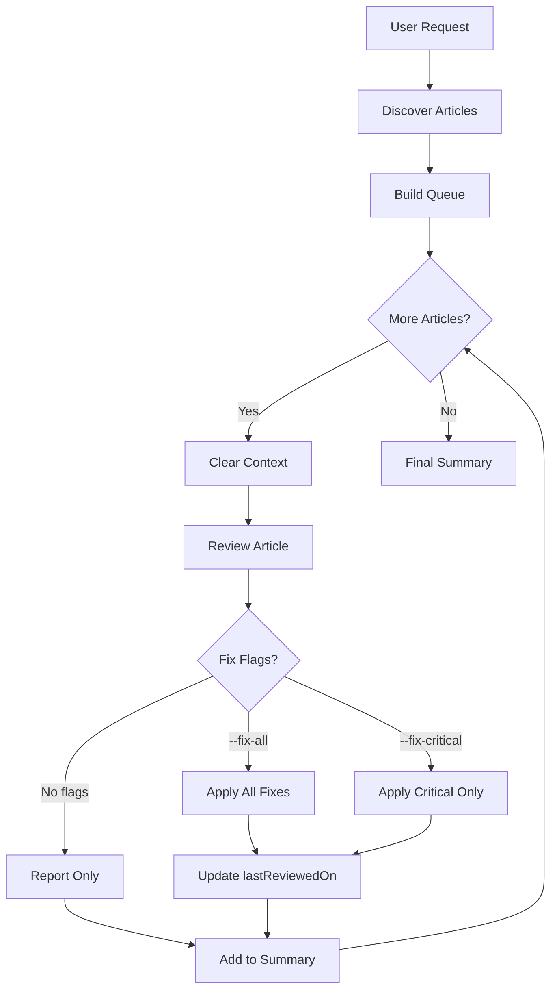

# Review All Posts Skill

Reviews all technical articles on sujeet.pro. Iterates through content directories and applies `/review-posts` to each article.

**Note**: This skill reviews **content only**. For code review, use `/review-code`.

## Invocation

- `/review-all` - Review all posts
- `/review-all --fix-all` - Auto-fix all issues
- `/review-all --fix-critical` - Auto-fix critical only
- `/review-all --dry-run` - List articles without reviewing
- `/review-all --category=web` - Review specific category only

### Flags

- `--fix-all` - Auto-apply all fixes to every article
- `--fix-critical` - Auto-apply critical fixes only
- `--dry-run` - List articles that would be reviewed
- `--category=<name>` - Only review specific category

## Workflow



## Phase 1: Discover Articles

### Content Directories

| Directory              | Description        | Priority |
| ---------------------- | ------------------ | -------- |
| `content/posts/`       | Main blog posts    | High     |
| `content/in-research/` | Research documents | Medium   |

### Discovery

```bash
find content/posts content/in-research -name "*.md" -not -path "*/drafts/*"
```

## Phase 2: Build Article Queue

### Ordering

1. **By last updated** (oldest first) - prioritize stale content
2. **By category** - group related articles
3. **By complexity** - longer articles first

### Display List

```markdown
## Articles to Review

Found **[N]** articles:

### Posts ([count])

1. [title] - `path` - Last updated: [date]
2. [title] - `path` - Last updated: [date]

### In-Research ([count])

1. [title] - `path` - Last updated: [date]

Proceed with review? [Y/n]
```

## Phase 3: Review Each Article

### Context Management

**CRITICAL**: Start fresh for each article:

```markdown
---
## Reviewing Article [N] of [Total]

**Article**: [title]
**Path**: [path]

> Starting fresh context for this review.
---
```

### Comprehensive Review Checklist

For each article, execute ALL of the following checks:

#### 3.1 Metadata Check
- [ ] `lastReviewedOn` present and recent
- [ ] Tags from `content/tags.jsonc` (NOT `src/content/tags.json`)
- [ ] Valid YAML frontmatter
- [ ] Date in folder name matches content

#### 3.1.1 Tag Review (IMPORTANT)
1. **Read** `content/tags.jsonc` to get all valid tag IDs
2. **Analyze** post content to identify relevant topics
3. **Add relevant tags** that match the post content:
   - Use tag `id` values (e.g., `web-performance`, not `Web Performance`)
   - Add all applicable tags based on content topics
   - **NEVER remove existing tags** from the post
4. **Add new tags to tags.jsonc** if needed:
   - If a relevant topic has no matching tag, add it to `content/tags.jsonc`
   - Place new tag in appropriate category section
   - Follow existing format: `{ "id": "slug-format", "name": "Display Name" }`
5. **Validate** all tags in the post exist in tags.jsonc

#### 3.1.2 Title Review (IMPORTANT)
Review the H1 title for quality and appropriateness:
- [ ] Title accurately reflects the content
- [ ] Specific enough to distinguish from similar topics
- [ ] No clickbait or sensationalism
- [ ] Under 70 characters (SEO), but prioritize clarity
- [ ] Uses descriptive technical format

**Update title if:**
- Content has evolved beyond original title scope
- Title is too vague (e.g., "Tips" instead of specific topic)
- Title doesn't match what the article actually covers

#### 3.1.3 Slug Review (IMPORTANT)
Review the folder slug (folder name containing the post):
- [ ] Slug reflects main topic
- [ ] Concise (3-5 words max)
- [ ] Lowercase with hyphens, no special characters
- [ ] Date prefix intact (YYYY-MM-DD)

**Rename folder if:**
- Content topic has significantly changed
- Slug is too vague or generic
- Slug doesn't match updated title

**Renaming process:**
1. Rename folder with new slug
2. Update any internal links referencing old path
3. Verify build succeeds

#### 3.2 Structure Analysis
- [ ] Clear title (H1) - descriptive, not clickbait
- [ ] Abstract paragraph (2-4 sentences) - sets context
- [ ] Overview mermaid diagram - visualizes core concept
- [ ] Comprehensive TLDR section with subsections
- [ ] Proper section hierarchy (H2 → H3 → H4)
- [ ] References section present (REQUIRED)
- [ ] NO manual Table of Contents (auto-generated)

#### 3.3 Content Inventory
Create inventory of:
- All claims made (with/without citations)
- All code examples (collapse usage, correctness)
- All diagrams (mermaid/ASCII/images)
- All external references (URLs, papers, docs)

#### 3.4 Fact-Check (CRITICAL)

**Verify Technical Claims:**
1. Search official documentation for each claim
2. Cross-reference multiple authoritative sources
3. Flag discrepancies, outdated info, or speculation stated as fact
4. Ensure terminology is correct and current

**Check Code Examples:**
1. Syntax correct for stated language/version?
2. Logic correct and idiomatic?
3. Follows current best practices?
4. Error handling appropriate?
5. Boilerplate collapsed? (imports, setup, teardown)
6. Would a staff engineer find issues?

**Validate References:**
1. URLs accessible and not 404?
2. Content at URL actually supports the claim?
3. Better/more authoritative sources available?
4. Every significant claim has inline reference?

#### 3.5 Code Block Review

Every code block must:
- Have `title` attribute for context
- Use `collapse` for any lines not essential to the key concept:
  - Imports and type definitions
  - Setup, configuration, and boilerplate
  - **Middle sections** (helpers between key functions)
  - Utilities and cleanup code
- Use **multiple collapse ranges** when needed: `collapse={1-5, 12-18, 25-30}`
- Use line highlighting `{n-m}` for key concepts within visible sections
- Be syntactically correct
- Follow idiomatic patterns for the language

**Key principle**: Only the lines demonstrating the key concept should be visible. Everything else should be collapsed but expandable.

#### 3.6 TLDR Quality Check
- [ ] Main concept defined (1-2 sentences, not vague)
- [ ] 3-6 themed subsections covering key areas
- [ ] 3-6 bullet points per subsection
- [ ] **Bold** for key terms and concepts
- [ ] Standalone useful (not just a teaser)
- [ ] Includes key trade-offs
- [ ] A staff engineer could use as reference

#### 3.7 Quality Assessment

**Technical Accuracy (HIGHEST PRIORITY):**
- [ ] All claims verifiable and verified
- [ ] Inline references present for claims
- [ ] No speculation presented as fact
- [ ] Correct, current terminology
- [ ] Code would pass PR review

**Authoritative Tone:**
- [ ] Assertive, not hedging unnecessarily
- [ ] Direct statements, not "might be" or "could possibly"
- [ ] Confident where evidence supports
- [ ] Honest about unknowns and limitations

**Conciseness (NO FILLER):**
- [ ] No padding or filler sentences
- [ ] No tutorial-style hand-holding
- [ ] No obvious statements ("security is important")
- [ ] Every paragraph earns its place
- [ ] No "In this article, we will..."
- [ ] Reading time < 30 minutes (60 max)

**Completeness:**
- [ ] Covers design reasoning (why, not just what)
- [ ] Documents assumptions and constraints
- [ ] Historical context where relevant
- [ ] Explicit pros/cons for all approaches
- [ ] Alternative approaches mentioned
- [ ] Real-world examples included
- [ ] Nothing presented as "the best solution"

**Staff/Principal Engineer Standard:**
- [ ] Could be cited as authoritative reference
- [ ] Handles edge cases and subtleties
- [ ] Discusses failure modes
- [ ] Performance implications noted
- [ ] Security considerations covered

Score each area (1-5):
| Area | Score | Notes |
|------|-------|-------|
| Technical accuracy | /5 | |
| Design reasoning | /5 | |
| Trade-off analysis | /5 | |
| Code quality | /5 | |
| Inline citations | /5 | |
| Conciseness | /5 | |
| Authoritative tone | /5 | |

#### 3.8 Generate Report

```markdown
# Review Report: [Article Title]

## Summary
**Overall Quality**: [Excellent/Good/Needs Work/Major Issues]
**Technical Accuracy**: [Score/5]
**Staff Engineer Ready**: [Yes/No]
**Last Reviewed**: [Date]

## Critical Issues (Must Fix)
### Issue 1: [Title]
- **Location**: [Section/line]
- **Problem**: [Description]
- **Evidence**: [Research findings with source]
- **Fix**: [Specific recommended change]

## Fact-Check Results
| Claim | Verified | Source | Notes |
|-------|----------|--------|-------|
| [Claim] | ✓/✗ | [URL] | [Notes] |

## Code Review Results
| Block | File | Issues | Collapse Needed |
|-------|------|--------|-----------------|
| [Title] | [Line] | [Issues] | [Yes/No] |

## Improvements Needed
### Structure
- [Issues]

### Missing Elements
- [ ] Item

### Outdated Information
- [Items needing updates]

## Anti-Patterns Found
- [ ] Tutorial-style content
- [ ] Filler statements
- [ ] Unsubstantiated claims
- [ ] Silver bullet thinking
- [ ] Migration timelines/development plans (should be removed unless explicitly requested)

## Recommendations
### High Priority (Critical)
1. [Fix]

### Medium Priority (Improvements)
1. [Enhancement]

### Low Priority (Polish)
1. [Polish item]
```

### Handle Fixes

**With `--fix-all`:**

- Apply all fixes
- Update lastReviewedOn
- Run build validation at end

**With `--fix-critical`:**

- Apply critical fixes only
- Update lastReviewedOn

**Without flags:**

- Generate report
- No modifications

### Track Progress

```markdown
## Review Progress

| #   | Article | Status      | Critical | Improvements | Polish  |
| --- | ------- | ----------- | -------- | ------------ | ------- |
| 1   | [title] | Done        | 2 fixed  | 5 fixed      | 3 fixed |
| 2   | [title] | In Progress | -        | -            | -       |
| 3   | [title] | Pending     | -        | -            | -       |
```

## Phase 4: Final Summary

```markdown
# Full Site Review Summary

**Date**: YYYY-MM-DD
**Articles Reviewed**: [N]

## Overview

| Category    | Count   | Critical | Improvements | Polish  |
| ----------- | ------- | -------- | ------------ | ------- |
| Posts       | [N]     | [X]      | [Y]          | [Z]     |
| In-Research | [N]     | [X]      | [Y]          | [Z]     |
| **Total**   | **[N]** | **[X]**  | **[Y]**      | **[Z]** |

## Articles by Quality Score

### Excellent (5/5)

- [title] - `path`

### Good (4/5)

- [title] - `path`

### Needs Work (3/5)

- [title] - `path`

### Major Issues (1-2/5)

- [title] - `path`

## Common Issues Found

### Most Frequent Critical Issues

1. **[Issue]** - Found in [N] articles
2. **[Issue]** - Found in [N] articles

### Most Frequent Improvements

1. **[Issue]** - Found in [N] articles

## Articles Requiring Manual Attention

1. **[title]**
   - Issue: [description]
   - Action: [recommended]

## Actions Taken (with --fix-all)

- Critical issues fixed: [N]
- Improvements applied: [N]
- lastReviewedOn updated: [N] files

## Next Steps

1. Review "Major Issues" articles
2. Address manual-attention items
3. Run: `npm run build`
4. Validate: `npm run validate:build`
```

## Batch Processing

### Memory Efficiency

Process in batches of 5 to prevent context overflow:

```plain
Batch 1 (Articles 1-5)
├── Review each
├── Apply fixes
└── Generate batch summary

[Clear detailed context, keep summary]

Batch 2 (Articles 6-10)
├── Review each
├── Apply fixes
└── Merge into cumulative summary

...

Final Summary
```

## Error Handling

### Per-Article Errors

If article fails:

1. Log error details
2. Mark as "Review Failed"
3. Continue with next article
4. Include in "Manual Attention"

### Build Validation

After all fixes:

```bash
npm run build
npm run validate:build
```

## Quality Standards Reference

### Content Quality

- [ ] Abstract sets context
- [ ] Overview diagram present
- [ ] TLDR comprehensive
- [ ] Inline references for claims
- [ ] Trade-offs discussed

### Conciseness

- [ ] No padding/filler
- [ ] No tutorial-style
- [ ] Every paragraph earns place
- [ ] Reading time < 30 min

### Code Blocks

- [ ] All non-essential lines collapsed (imports, setup, middle sections, helpers)
- [ ] Multiple collapse ranges used when needed: `collapse={1-5, 12-18, 25-30}`
- [ ] Titles present
- [ ] Key lines highlighted

### Structure

- [ ] No manual ToC
- [ ] References section
- [ ] Proper hierarchy

### Tags

- [ ] All tags valid (exist in `content/tags.jsonc`)
- [ ] Relevant tags added based on content
- [ ] New tags added to tags.jsonc if needed
- [ ] Existing tags NOT removed

### Title & Slug

- [ ] Title accurately reflects content
- [ ] Title is specific and descriptive
- [ ] Slug matches content topic
- [ ] Slug is concise (3-5 words)

## Example Session

### Dry Run

```
User: /review-all --dry-run

Claude: ## Articles to Review (Dry Run)

Found **24** articles:

### Posts (15)
1. Node.js Event Loop - `content/posts/web/...`
2. HTTP Deep Dive - `content/posts/web/...`

### In-Research (9)
1. WebSocket Research - `content/in-research/...`

Run without --dry-run to start.
```

### Full Review

```
User: /review-all --fix-all

Claude: ## Starting Full Site Review

Found **24** articles. Auto-fixing enabled.

---
### Reviewing Article 1 of 24
**Article**: Node.js Event Loop
**Path**: content/posts/web/2023-12-03-node-js/index.md

[Review process...]

**Fixes Applied**:
- Added 3 inline references
- Updated code blocks with collapse
- Added trade-off table
- Updated lastReviewedOn

---
### Reviewing Article 2 of 24
...

## Final Summary
[Complete report]
```

## Internal Linking

When reviewing, verify all internal links use relative paths to `.md` files. This enables IDE navigation (Cmd+Click) and the rehype plugin transforms them to proper URLs at build time.

**Correct format:**
```markdown
[Link Text](../YYYY-MM-DD-slug.md)
[Link Text](../../category/YYYY-MM-DD-slug/index.md)
```

**Examples:**
```markdown
<!-- Correct - relative .md paths -->
[Web Performance Overview](../2025-03-03-wpo-overview.md)
[JavaScript Optimization](../2025-01-09-wpo-js.md)

<!-- Wrong formats (flag and fix) -->
[Wrong](/posts/deep-dives/web-fundamentals/wpo-overview)  <!-- Direct URL, not IDE navigable -->
[Wrong](wpo-overview)  <!-- Missing .md extension -->
```

**Key rules:**
- Use relative paths from current file to target `.md` file
- Include the full filename with date prefix
- The rehype plugin transforms these to `/posts/<type>/<category>/<slug>` URLs
- Enables Cmd+Click navigation in VS Code and other IDEs

**During review:** Convert direct URL links to relative `.md` paths where possible.

## Reference Documents

**IMPORTANT**: Before reviewing, read these documents from the project root:

| Document             | Path (from project root)               | Purpose                                                 |
| -------------------- | -------------------------------------- | ------------------------------------------------------- |
| Review Posts Skill   | `.claude/skills/review-posts/SKILL.md` | Detailed review process and criteria                    |
| Content Guidelines   | `llm_docs/content-guidelines.md`       | Writing standards, conciseness rules, quality checklist |
| Markdown Features    | `llm_docs/markdown-features.md`        | Expressive Code syntax, Mermaid diagrams, KaTeX         |
| Project Instructions | `CLAUDE.md`                            | Project structure, commands, styling conventions        |

**Usage**: Use the Read tool with absolute paths (e.g., `/path/to/project/llm_docs/content-guidelines.md`) to read these files before starting work.

## Tools Available

- `Glob` - Find articles
- `Grep` - Search content
- `Read` - Read articles
- `Edit` - Apply fixes
- `Bash` - Build validation
- `WebSearch` - Fact-check
- `WebFetch` - Verify references
- `TodoWrite` - Track progress
