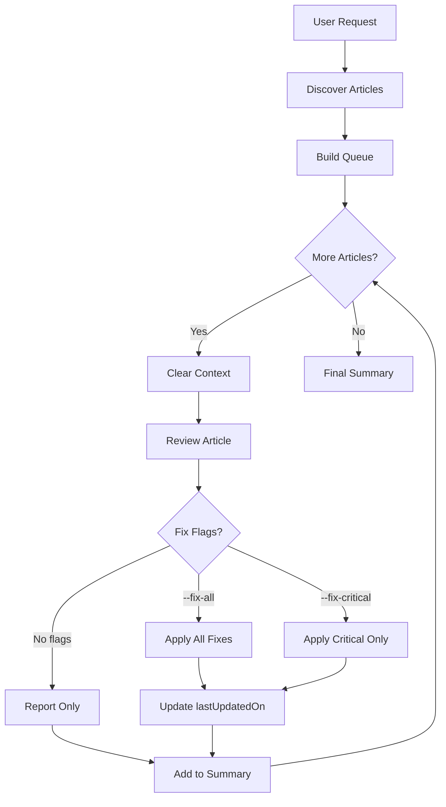

# Review All Posts Skill

Reviews all technical articles on sujeet.pro. Iterates through content directories and applies `/review-posts` to each article.

**Note**: This skill reviews **content only**. For code review, use `/review-code`.

## Invocation

- `/review-all` - Review all posts
- `/review-all --fix-all` - Auto-fix all issues
- `/review-all --fix-critical` - Auto-fix critical only
- `/review-all --dry-run` - List articles without reviewing
- `/review-all --category=web` - Review specific category only

### Flags

- `--fix-all` - Auto-apply all fixes to every article
- `--fix-critical` - Auto-apply critical fixes only
- `--dry-run` - List articles that would be reviewed
- `--category=<name>` - Only review specific category

## Workflow



## Phase 1: Discover Articles

### Content Directories

| Directory | Description | Priority |
|-----------|-------------|----------|
| `content/posts/` | Main blog posts | High |
| `content/in-research/` | Research documents | Medium |

### Discovery

```bash
find content/posts content/in-research -name "*.md" -not -path "*/drafts/*"
```

### Exclusions

- Files in `content/drafts/`
- README.md files
- Files with `draft: true` in frontmatter

## Phase 2: Build Article Queue

### Ordering

1. **By last updated** (oldest first) - prioritize stale content
2. **By category** - group related articles
3. **By complexity** - longer articles first

### Display List

```markdown
## Articles to Review

Found **[N]** articles:

### Posts ([count])
1. [title] - `path` - Last updated: [date]
2. [title] - `path` - Last updated: [date]

### In-Research ([count])
1. [title] - `path` - Last updated: [date]

Proceed with review? [Y/n]
```

## Phase 3: Review Each Article

### Context Management

**CRITICAL**: Start fresh for each article:

```markdown
---
## Reviewing Article [N] of [Total]

**Article**: [title]
**Path**: [path]

> Starting fresh context for this review.
---
```

### Apply Review Process

For each article, follow `/review-posts` workflow:

1. Initial Analysis
2. Fact-Check via Research
3. Structure Review
4. Quality Assessment
5. Generate Report

### Handle Fixes

**With `--fix-all`:**
- Apply all fixes
- Update lastUpdatedOn
- Run build validation at end

**With `--fix-critical`:**
- Apply critical fixes only
- Update lastUpdatedOn

**Without flags:**
- Generate report
- No modifications

### Track Progress

```markdown
## Review Progress

| # | Article | Status | Critical | Improvements | Polish |
|---|---------|--------|----------|--------------|--------|
| 1 | [title] | Done | 2 fixed | 5 fixed | 3 fixed |
| 2 | [title] | In Progress | - | - | - |
| 3 | [title] | Pending | - | - | - |
```

## Phase 4: Final Summary

```markdown
# Full Site Review Summary

**Date**: YYYY-MM-DD
**Articles Reviewed**: [N]

## Overview

| Category | Count | Critical | Improvements | Polish |
|----------|-------|----------|--------------|--------|
| Posts | [N] | [X] | [Y] | [Z] |
| In-Research | [N] | [X] | [Y] | [Z] |
| **Total** | **[N]** | **[X]** | **[Y]** | **[Z]** |

## Articles by Quality Score

### Excellent (5/5)
- [title] - `path`

### Good (4/5)
- [title] - `path`

### Needs Work (3/5)
- [title] - `path`

### Major Issues (1-2/5)
- [title] - `path`

## Common Issues Found

### Most Frequent Critical Issues
1. **[Issue]** - Found in [N] articles
2. **[Issue]** - Found in [N] articles

### Most Frequent Improvements
1. **[Issue]** - Found in [N] articles

## Articles Requiring Manual Attention

1. **[title]**
   - Issue: [description]
   - Action: [recommended]

## Actions Taken (with --fix-all)

- Critical issues fixed: [N]
- Improvements applied: [N]
- lastUpdatedOn updated: [N] files

## Next Steps

1. Review "Major Issues" articles
2. Address manual-attention items
3. Run: `npm run build`
4. Validate: `npm run validate:build`
```

## Batch Processing

### Memory Efficiency

Process in batches of 5 to prevent context overflow:

```plain
Batch 1 (Articles 1-5)
├── Review each
├── Apply fixes
└── Generate batch summary

[Clear detailed context, keep summary]

Batch 2 (Articles 6-10)
├── Review each
├── Apply fixes
└── Merge into cumulative summary

...

Final Summary
```

## Error Handling

### Per-Article Errors

If article fails:
1. Log error details
2. Mark as "Review Failed"
3. Continue with next article
4. Include in "Manual Attention"

### Build Validation

After all fixes:

```bash
npm run build
npm run validate:build
```

## Quality Standards Reference

### Content Quality
- [ ] Abstract sets context
- [ ] Overview diagram present
- [ ] TLDR comprehensive
- [ ] Inline references for claims
- [ ] Trade-offs discussed

### Conciseness
- [ ] No padding/filler
- [ ] No tutorial-style
- [ ] Every paragraph earns place
- [ ] Reading time < 30 min

### Code Blocks
- [ ] Boilerplate collapsed
- [ ] Titles present
- [ ] Key lines highlighted

### Structure
- [ ] No manual ToC
- [ ] References section
- [ ] Proper hierarchy

## Example Session

### Dry Run

```
User: /review-all --dry-run

Claude: ## Articles to Review (Dry Run)

Found **24** articles:

### Posts (15)
1. Node.js Event Loop - `content/posts/web/...`
2. HTTP Deep Dive - `content/posts/web/...`

### In-Research (9)
1. WebSocket Research - `content/in-research/...`

Run without --dry-run to start.
```

### Full Review

```
User: /review-all --fix-all

Claude: ## Starting Full Site Review

Found **24** articles. Auto-fixing enabled.

---
### Reviewing Article 1 of 24
**Article**: Node.js Event Loop
**Path**: content/posts/web/2023-12-03-node-js/index.md

[Review process...]

**Fixes Applied**:
- Added 3 inline references
- Updated code blocks with collapse
- Added trade-off table
- Updated lastUpdatedOn

---
### Reviewing Article 2 of 24
...

## Final Summary
[Complete report]
```

## Reference Documents

- [review-posts SKILL.md](../review-posts/SKILL.md)
- [content-guidelines.md](../../../llm_docs/content-guidelines.md)
- [markdown-features.md](../../../llm_docs/markdown-features.md)
- [CLAUDE.md](../../../CLAUDE.md)

## Tools Available

- `Glob` - Find articles
- `Grep` - Search content
- `Read` - Read articles
- `Edit` - Apply fixes
- `Bash` - Build validation
- `WebSearch` - Fact-check
- `WebFetch` - Verify references
- `TodoWrite` - Track progress
