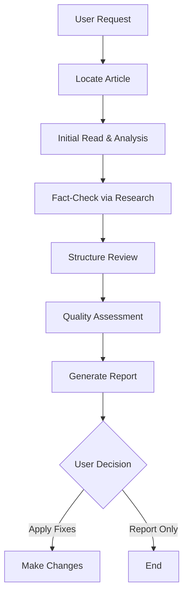
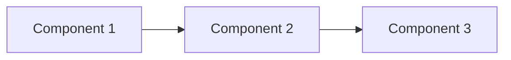

# Review Blog Skill

This skill guides the comprehensive review of existing technical articles on sujeet.pro, ensuring they meet the high standards expected by senior/staff/principal engineers.

## Invocation

This skill is triggered when the user requests:
- "Review blog [path or topic]"
- "Audit article [path or topic]"
- "Improve blog [path or topic]"
- "Check blog [path or topic]"

## Workflow Overview



## Phase 1: Locate Article

Find the article to review:

1. If path provided: Read directly
2. If topic provided: Search in content directories
   - `content/writing/`
   - `content/deep-dives/`
   - `content/work/`
   - `content/uses/`

Use glob patterns to find matching files:
```
content/**/*[topic]*.md
content/**/[topic]/index.md
```

## Phase 2: Initial Analysis

Read the article and extract:

### Metadata Check
- [ ] `lastUpdatedOn` is present and recent
- [ ] Tags are appropriate and from tags.jsonc
- [ ] Frontmatter is valid YAML

### Structure Analysis
- [ ] Has clear title (H1)
- [ ] Has abstract/context paragraph
- [ ] Has overview mermaid diagram
- [ ] Has comprehensive TLDR section
- [ ] Has proper section hierarchy
- [ ] Has References section

### Content Inventory
- List all claims made
- List all code examples
- List all diagrams
- List all external references

## Phase 3: Fact-Check via Research

### Verify Technical Claims

For each significant technical claim:

1. **Search for verification**
   ```
   [claim topic] official documentation
   [claim topic] specification
   [claim topic] how it actually works
   ```

2. **Cross-reference sources**
   - Official docs
   - Source code
   - Expert consensus

3. **Flag discrepancies**
   - Mark outdated information
   - Note corrections needed
   - Identify missing context

### Check Code Examples

1. **Syntax verification**: Does it compile/parse?
2. **Correctness**: Does it work as described?
3. **Best practices**: Does it follow current patterns?
4. **Completeness**: Are error cases handled appropriately?

### Validate References

1. Check that all URLs are accessible
2. Verify referenced content supports claims
3. Check for more authoritative sources
4. Identify missing citations

## Phase 4: Structure Review

### Required Elements Checklist

| Element | Required | Check |
|---------|----------|-------|
| Title (H1) | Yes | Present and descriptive |
| Abstract paragraph | Yes | Sets context, 2-4 sentences |
| Overview diagram | Yes | Mermaid or image |
| TLDR section | Yes | Comprehensive with subsections |
| Main content | Yes | Proper H2/H3 hierarchy |
| Code examples | Context-dependent | Where appropriate |
| Diagrams | Yes | At least one per major concept |
| Tables | Context-dependent | For comparisons |
| References | Yes | All sources cited |

### TLDR Quality Check

The TLDR should:
- [ ] Define the main concept in 1-2 sentences
- [ ] Have 3-6 themed subsections
- [ ] Each subsection has 3-6 bullet points
- [ ] Use **bold** for key terms
- [ ] Be useful standalone (not just a teaser)

### Diagram Quality Check

Each diagram should:
- [ ] Have a `<figure>` wrapper
- [ ] Have a `<figcaption>` describing it
- [ ] Visualize one clear concept
- [ ] Use clear, descriptive labels
- [ ] Render correctly

## Phase 5: Quality Assessment

### Content Quality

#### Depth Assessment
- [ ] Covers "why" behind design decisions
- [ ] Explains trade-offs explicitly
- [ ] Includes edge cases and failure modes
- [ ] No shallow or surface-level coverage

#### Audience Appropriateness
- [ ] No unnecessary explanations of common knowledge
- [ ] Technical precision in terminology
- [ ] Production-ready code examples
- [ ] Real-world considerations included

#### Completeness Assessment
- [ ] Are there gaps in the explanation?
- [ ] Are alternatives discussed?
- [ ] Are limitations acknowledged?
- [ ] Are future considerations mentioned?

### Writing Quality

- [ ] Active voice preferred
- [ ] No padding or filler content
- [ ] Consistent terminology throughout
- [ ] Logical flow between sections
- [ ] Clear transitions

### Technical Accuracy Score

Rate each area 1-5:

| Area | Score | Notes |
|------|-------|-------|
| Core concepts | /5 | |
| Implementation details | /5 | |
| Performance claims | /5 | |
| Code examples | /5 | |
| Diagrams accuracy | /5 | |

## Phase 6: Generate Report

Create a structured review report:

```markdown
# Blog Review: [Article Title]

## Summary

**Overall Quality**: [Excellent/Good/Needs Work/Major Issues]
**Technical Accuracy**: [Score/5]
**Last Updated**: [Date from frontmatter]

## Critical Issues

### Issue 1: [Title]
- **Location**: [Section/line]
- **Problem**: [Description]
- **Evidence**: [Research findings]
- **Fix**: [Recommended change]

## Improvements Needed

### Structure
- [List of structural issues]

### Content Gaps
- [Missing topics or depth]

### Outdated Information
- [Items needing updates]

### Code Issues
- [Problems with examples]

## Recommendations

### High Priority
1. [Most important fix]
2. [Second priority]

### Medium Priority
1. [Enhancement]
2. [Enhancement]

### Low Priority (Nice to Have)
1. [Polish item]
2. [Polish item]

## Research Findings

### New Information Discovered
- [Relevant findings from fact-checking]

### Better Sources Found
- [Superior references to add]

### Industry Updates
- [Recent developments to incorporate]
```

## Phase 7: Apply Fixes (If Requested)

If the user asks to apply fixes:

1. **Backup**: Note original content
2. **Priority order**: Fix critical issues first
3. **Incremental**: Make one change at a time
4. **Verify**: Check each change doesn't break formatting
5. **Update metadata**: Update `lastUpdatedOn` date

### Common Fixes

#### Adding Missing TLDR
```markdown
## TLDR

**[Concept]** is [definition].

### [Theme 1]
- **Point 1**: Description
- **Point 2**: Description

### [Theme 2]
- **Point 1**: Description
- **Point 2**: Description
```

#### Adding Overview Diagram
```markdown
<figure>



<figcaption>High-level architecture showing the relationship between components</figcaption>

</figure>
```

#### Fixing Code Examples
- Add missing error handling
- Update deprecated APIs
- Add TypeScript types
- Include title attribute

#### Adding References
```markdown
## References

- [Source Title](https://url) - Brief description of what this source covers
```

## Review Criteria by Content Type

### Deep Dives (deep-dives/)

Expect:
- Comprehensive coverage of internals
- Multiple mermaid diagrams
- Source code references
- Performance analysis
- Historical context
- 500+ lines typical

### Writing (writing/)

Expect:
- Focused on specific patterns/techniques
- Practical code examples
- Trade-off analysis
- 200-500 lines typical

### Work (work/)

Expect:
- Problem statement and requirements
- Technical approach and rationale
- Implementation details
- Results and learnings

### Uses (uses/)

Expect:
- Practical setup guides
- Tables of tools/shortcuts
- Step-by-step instructions

## Anti-Patterns to Flag

### Content Anti-Patterns
- **Tutorial-style**: "First, let's understand what X is..."
- **Obvious statements**: "Security is important"
- **Unsubstantiated opinions**: "This is the best approach"
- **Shallow coverage**: Skipping edge cases

### Structure Anti-Patterns
- **Missing overview diagram**: No visual context
- **Walls of text**: No visual breaks
- **Shallow TLDR**: Just a teaser, not comprehensive
- **Missing references**: No citations

### Code Anti-Patterns
- **Toy examples**: Not production-quality
- **Missing error handling**: Happy path only
- **Unexplained magic**: Constants without context
- **Outdated APIs**: Deprecated patterns

## Reference Documents

For review standards, consult:
- [content-guidelines.md](../../../llm_docs/content-guidelines.md) - Complete writing standards
- [CLAUDE.md](../../../CLAUDE.md) - Project conventions

## Tools Available

This skill can use:
- `Read` - Read article content
- `Glob` - Find articles by pattern
- `Grep` - Search for specific content
- `WebSearch` - Fact-check claims
- `WebFetch` - Verify references and find better sources
- `Edit` - Apply fixes to content
- `Bash` - Run build validation after changes
