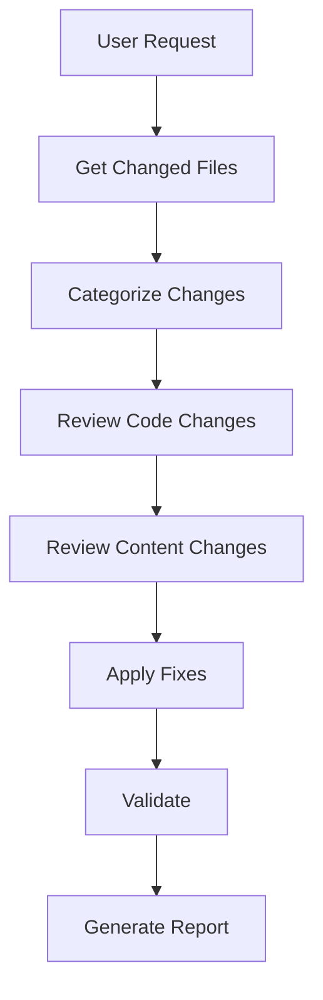

# Review Changes Skill

Reviews uncommitted code changes against project standards. Focused review of only modified files.

## Invocation

- `/review-changes` - Review all uncommitted changes
- `/review-changes --fix` - Review and auto-fix issues
- `/review-changes --staged` - Review only staged changes
- `/review-changes --check` - Dry run, report only

### Flags

- `--check` - Report issues without making changes
- `--fix` - Auto-fix all issues
- `--staged` - Only review staged files (git add)
- `--focus=[area]` - Focus on: `types`, `css`, `unused`, `lint`

## Workflow



## Phase 1: Get Changed Files

### Detect Changes

```bash
# All uncommitted changes
git status --porcelain

# Staged only
git diff --cached --name-only

# Unstaged only
git diff --name-only
```

### File Categories

| Category | Pattern | Review Type |
|----------|---------|-------------|
| Code | `src/**/*.{ts,astro}` | Code standards |
| Plugins | `plugins/**/*.ts` | Code standards |
| Config | `*.config.*` | Code standards |
| Content | `content/**/*.md` | Content guidelines |
| Styles | `**/*.css` | CSS patterns |

## Phase 2: Review Code Changes

For each changed code file, apply relevant checks from `/review-code`:

### Type Safety

- [ ] No new `any` types
- [ ] Explicit return types
- [ ] Null handling
- [ ] Import type syntax

### Code Quality

- [ ] No unused variables/imports
- [ ] Edge cases handled
- [ ] Error handling present
- [ ] Self-explanatory names

### CSS (if applicable)

- [ ] Semantic class names
- [ ] Tailwind values only
- [ ] CSS variables for theme

### Astro Components

- [ ] Proper structure order
- [ ] Props typed
- [ ] Accessibility considered

## Phase 3: Review Content Changes

For changed `.md` files in `content/`, apply `/review-posts` checks:

### Structure

- [ ] Title (H1) present
- [ ] TLDR comprehensive
- [ ] No manual ToC
- [ ] References section

### Code Blocks

- [ ] Boilerplate collapsed
- [ ] Proper language specified
- [ ] Title attribute for context

### Quality

- [ ] Concise writing
- [ ] No filler content
- [ ] Inline references

## Phase 4: Focus Areas

### `--focus=types`

Only check:
- Type annotations
- `import type` usage
- Null handling
- Return types

### `--focus=css`

Only check:
- Inline Tailwind vs classes
- CSS variable usage
- Tailwind value compliance

### `--focus=unused`

Only check:
- Unused imports
- Unused variables
- Unused functions

### `--focus=lint`

Only run:
```bash
npm run lint -- [changed-files]
npm run format -- --check [changed-files]
```

## Phase 5: Apply Fixes

### With `--fix`

1. Apply auto-fixable issues
2. Report manual fixes needed
3. Run validation

### Without `--fix`

1. Report all issues
2. Categorize by severity
3. Suggest fix commands

## Phase 6: Validate Changes

After fixes:

```bash
npm run check     # TypeScript
npm run lint      # ESLint
npm run build     # Build
```

## Phase 7: Generate Report

```markdown
# Changes Review Report

## Files Changed
- Code files: [count]
- Content files: [count]
- Style files: [count]

## Issues Found

### Critical (Must Fix)
- [ ] [File]: [Issue]

### Warnings
- [ ] [File]: [Issue]

### Suggestions
- [ ] [File]: [Suggestion]

## Fixes Applied (with --fix)
- [Fix 1]
- [Fix 2]

## Manual Fixes Needed
- [File]: [What to fix]

## Validation
- TypeScript: PASS/FAIL
- ESLint: PASS/FAIL
- Build: PASS/FAIL
```

## Common Issues by File Type

### TypeScript Files

| Issue | Auto-fix | Manual |
|-------|----------|--------|
| Missing return type | No | Add type |
| Unused import | Yes | - |
| Implicit any | No | Add type |
| Missing null check | No | Add guard |

### Astro Files

| Issue | Auto-fix | Manual |
|-------|----------|--------|
| Missing prop type | No | Add interface |
| Inline Tailwind | No | Extract class |
| Missing aria | No | Add attribute |

### CSS Files

| Issue | Auto-fix | Manual |
|-------|----------|--------|
| Hardcoded color | No | Use variable |
| Custom value | No | Use Tailwind |
| Missing dark mode | No | Add variant |

### Markdown Files

| Issue | Auto-fix | Manual |
|-------|----------|--------|
| Missing collapse | No | Add directive |
| No TLDR | No | Write TLDR |
| No references | No | Add section |

## Integration with Git Hooks

This skill can be run as a pre-commit check:

```bash
# In .husky/pre-commit
/review-changes --staged --check
```

## Quick Commands

```bash
# Quick lint check on changes
npm run lint -- $(git diff --name-only -- '*.ts' '*.astro')

# Type check
npm run check

# Format check
npm run format -- --check $(git diff --name-only)
```

## Reference Standards

- [code-standards.md](../../../llm_docs/code-standards.md)
- [content-guidelines.md](../../../llm_docs/content-guidelines.md)
- [CLAUDE.md](../../../CLAUDE.md)

## Tools Available

- `Bash` - Git commands, npm scripts
- `Read` - Read changed files
- `Edit` - Apply fixes
- `Glob` - Find related files
- `Grep` - Search patterns
