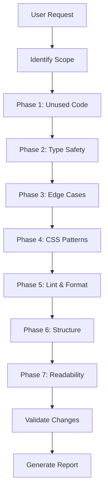

# Review Code Skill

Reviews the entire codebase against project standards. Identifies issues, suggests fixes, and optionally auto-fixes.

## Invocation

- `/review-code` - Review entire codebase
- `/review-code --fix` - Review and auto-fix issues
- `/review-code src/utils/` - Review specific directory
- `/review-code --check` - Dry run, report only

### Flags

- `--check` - Report issues without making changes
- `--fix` - Auto-fix all issues (default: suggest only)
- `--focus=[area]` - Focus on: `types`, `css`, `unused`, `lint`, `structure`

## Scope

This skill reviews **code only**, not content. For content review, use `/review-all`.

```plain
Reviewed:
├── src/           # All source code
├── plugins/       # Remark/rehype plugins
├── scripts/       # Build scripts
└── *.config.*     # Configuration files

NOT Reviewed (use /review-all):
├── content/       # Markdown content
└── llm_docs/      # Documentation (at project root)
```

## Workflow



## Reference Documents

**IMPORTANT**: Before reviewing code, read these documents from the project root:

| Document | Path (from project root) | Purpose |
|----------|--------------------------|---------|
| Code Standards | `llm_docs/code-standards.md` | TypeScript, CSS, accessibility requirements |
| Project Instructions | `CLAUDE.md` | Project structure, commands, styling conventions |
| Astro Docs | https://docs.astro.build/llms-full.txt | Framework documentation (fetch via WebFetch) |

**Usage**: Use the Read tool with absolute paths (e.g., `/path/to/project/llm_docs/code-standards.md`) to read these files before starting work.

## Phase 1: Remove Unused Code

### Unused Variables and Functions

- [ ] Unused local variables
- [ ] Unused function parameters (prefix with `_` if required)
- [ ] Unused imports (including type imports)
- [ ] Unused functions and methods
- [ ] Unused type definitions
- [ ] Unused exports
- [ ] Dead code (unreachable blocks)

**Detection:**
```bash
npx ts-prune    # Unused exports
npm run lint    # Unused variables
```

**Fix pattern:**
```typescript
// Before
import { unused, used } from "./utils"

// After
import { used } from "./utils"
```

### Unused NPM Packages

```bash
npx depcheck
```

Review criteria:
- Not imported anywhere
- Not in config files
- Not used by build tools
- Not a peer dependency

### Empty Folders

```bash
find src -type d -empty
```

Exceptions: `.gitkeep` files, build-time directories

## Phase 2: Enforce Type Safety

Project uses `astro/tsconfigs/strictest`.

### Requirements

- [ ] No `any` types (explicit or implicit)
- [ ] No `@ts-ignore` without justification
- [ ] Explicit function parameters
- [ ] Explicit return types
- [ ] Null/undefined handled explicitly

**Detection:**
```bash
npm run check
```

**Common fixes:**
```typescript
// Before - implicit any
function processData(data) {
  return data.map(item => item.name)
}

// After - explicit types
function processData(data: DataItem[]): string[] {
  return data.map((item) => item.name)
}
```

### Import Type Syntax

Use `import type` for type-only imports:

```typescript
// Before
import { SomeType, someFunction } from "./module"

// After
import type { SomeType } from "./module"
import { someFunction } from "./module"
```

### Path Alias Usage

| Alias | Path |
|-------|------|
| `@/*` | `./src/*` |
| `@constants/*` | `./src/constants/*` |

```typescript
// Before
import { helper } from "../../utils/helper"

// After
import { helper } from "@/utils/helper"
```

## Phase 3: Check Edge Cases

### Function Review

For each function verify:
- [ ] Handles empty inputs
- [ ] Handles boundary conditions
- [ ] Handles invalid inputs
- [ ] Error paths handled
- [ ] Async functions handle rejections

**Fix pattern:**
```typescript
// Before
function getFirstItem<T>(items: T[]): T {
  return items[0]
}

// After
function getFirstItem<T>(items: T[]): T | undefined {
  return items.at(0)
}
```

### Array/Collection Operations

```typescript
// Ensure .find() results checked
const item = items.find((i) => i.id === id)
if (!item) {
  throw new Error(`Item not found: ${id}`)
}
```

## Phase 4: CSS Patterns

### Custom Classes with @apply

HTML should use semantic class names, not inline Tailwind (exception: <=2 utilities).

```astro
<!-- BAD -->
<div class="flex items-center gap-4 p-4 bg-white rounded-lg shadow-md">

<!-- GOOD -->
<div class="card">
```

```css
.card {
  @apply flex items-center gap-4 p-4 rounded-lg shadow-md;
  background: var(--color-bg);
}
```

### Tailwind Values Only

No custom arbitrary values:

```css
/* BAD */
.element {
  @apply p-[13px] text-[17px];
}

/* GOOD */
.element {
  @apply p-3 text-lg;
}
```

### CSS Custom Properties

Use variables for theme-dependent values:

```css
/* BAD */
.element {
  color: #1f2937;
}

/* GOOD */
.element {
  color: var(--color-text);
}
```

### Component Style Reference

In Astro `<style is:global>` with `@apply`:

```astro
<style is:global>
  @reference "tailwindcss";

  .my-component {
    @apply flex items-center;
  }
</style>
```

## Phase 5: Lint and Format

```bash
npm run format      # Prettier
npm run lint        # ESLint
npm run lint:fix    # Auto-fix
npm run check       # TypeScript
```

### Common Lint Fixes

```typescript
// Prefer const
const value = computeValue()

// Arrow functions for callbacks
items.map((item) => item.name)

// No console.log in production
// Remove or use proper logging

// Explicit return types on exports
export function getData(): DataType[] {
  return []
}
```

## Phase 6: Structure and Organization

### Component Creation Rules

Only create components when:
- Used in 2+ places
- Encapsulates significant logic
- Improves organization substantially

Don't create for:
- One-time use code
- Simple HTML structures
- Minor variations (use props)

### File Organization

```plain
src/
├── components/      # Reusable (2+ usages)
├── layout/          # Layouts
├── pages/           # Routes
├── utils/           # Utilities
├── constants/       # Constants
└── styles/          # Global styles
```

### Astro Component Structure

```astro
---
// 1. Type imports
import type { Props } from "./types"

// 2. Component imports
import { Button } from "@/components"

// 3. Utility imports
import { formatDate } from "@/utils"

// 4. Props interface
interface Props {
  title: string
}

// 5. Props destructuring
const { title } = Astro.props

// 6. Data processing
const formatted = formatDate(new Date())
---

<!-- 7. Template -->
<article>{title}</article>

<!-- 8. Styles -->
<style>
  article { }
</style>
```

## Phase 7: Improve Readability

### Self-Explanatory Names

```typescript
// BAD
const d = new Date()
function proc(x: number): number { return x * 2 }

// GOOD
const currentDate = new Date()
function doubleValue(input: number): number { return input * 2 }
```

### Remove Unnecessary Comments

Comments only for:
- Complex algorithms
- Non-obvious business logic
- Workarounds with context

```typescript
// BAD
// Increment counter
counter++

// GOOD
// Use modulo for circular buffer wrap-around
const nextIndex = (currentIndex + 1) % buffer.length
```

### Reduce Cognitive Load

- Single responsibility functions
- Max 3 levels nesting
- Early returns over deep nesting

```typescript
// BAD
function processUser(user: User | null) {
  if (user) {
    if (user.isActive) {
      if (user.hasPermission) {
        return performAction(user)
      }
    }
  }
  return null
}

// GOOD
function processUser(user: User | null) {
  if (!user) return null
  if (!user.isActive) return null
  if (!user.hasPermission) return null
  return performAction(user)
}
```

## Phase 8: Validate Changes

```bash
npm run check           # TypeScript
npm run lint            # ESLint
npm run format          # Prettier
npm run build           # Build
npm run validate:build  # Validation
```

## Phase 9: Generate Report

```markdown
# Code Review Report

## Scope
- Files analyzed: [count]
- Files modified: [count]

## Changes Summary

### Unused Code Removed
- Variables: [count]
- Functions: [count]
- Imports: [count]
- NPM packages: [list]

### Type Safety Improvements
- `any` types removed: [count]
- Return types added: [count]
- Null checks added: [count]

### Edge Cases Fixed
- [Function list with fixes]

### CSS Pattern Fixes
- Inline Tailwind → custom classes: [count]
- Custom values → Tailwind tokens: [count]

### Lint/Format Fixes
- ESLint errors: [count]
- Prettier applied: [count]

### Readability Improvements
- Variables renamed: [count]
- Functions simplified: [count]

## Validation Results
- TypeScript: PASS/FAIL
- ESLint: PASS/FAIL
- Build: PASS/FAIL
```

## Important Notes

1. **Incremental changes** - Fix one category at a time
2. **Validate often** - Run `npm run check` frequently
3. **Preserve functionality** - Never break existing behavior
4. **Follow conventions** - Reference `llm_docs/` (at project root) and `CLAUDE.md`
5. **Don't over-abstract** - Keep solutions simple

## Tools Available

- `Read` - Read files
- `Glob` - Find files
- `Grep` - Search patterns
- `Edit` - Make edits
- `Write` - Create files
- `Bash` - Run npm scripts
