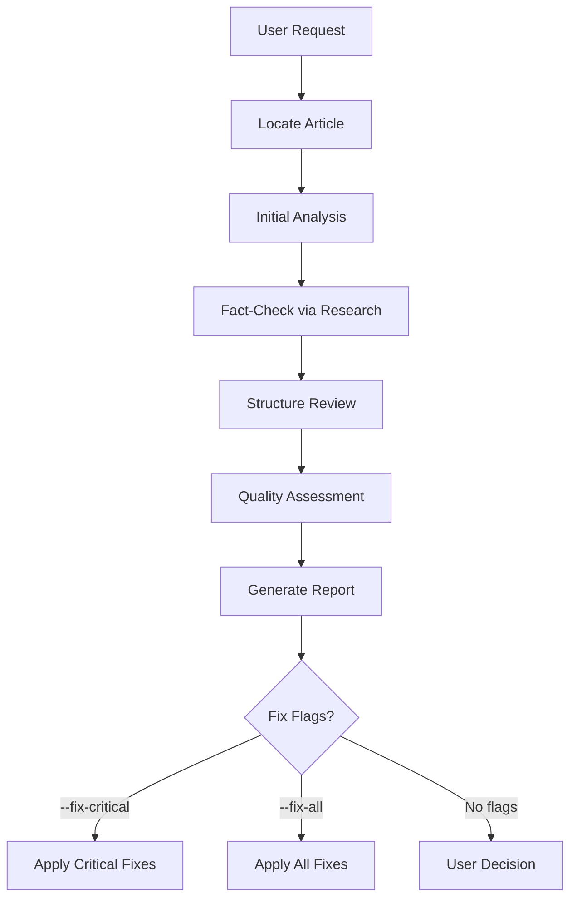

# Review Posts Skill

Reviews existing technical articles for accuracy, depth, and quality. Targets senior/staff/principal engineers.

## Invocation

- `/review-posts [path or topic]`
- `/review-posts content/posts/web/2024-01-15-caching.md`
- `/review-posts caching` (searches for matching article)

### Flags

- `--fix-critical` - Auto-fix critical issues only
- `--fix-all` - Auto-fix all issues

## Workflow



## Phase 1: Locate Article

Find article by path or topic search:

```plain
content/posts/**/*[topic]*.md
content/posts/**/[topic]/index.md
content/in-research/**/*[topic]*.md
```

## Phase 2: Initial Analysis

### Metadata Check
- [ ] `lastReviewedOn` present and recent
- [ ] Tags from tags.jsonc
- [ ] Valid YAML frontmatter

### Structure Analysis
- [ ] Clear title (H1)
- [ ] Abstract paragraph (2-4 sentences)
- [ ] Overview mermaid diagram
- [ ] Comprehensive TLDR section
- [ ] Proper section hierarchy
- [ ] References section (REQUIRED)
- [ ] NO manual Table of Contents (auto-generated)

### Content Inventory
- List all claims (with citations if present)
- List code examples (note collapse usage)
- List diagrams
- List external references

## Phase 3: Fact-Check via Research

**Technical accuracy is HIGHEST priority.**

### Verify Technical Claims

For each significant claim:
1. Search official documentation
2. Cross-reference multiple sources
3. Flag discrepancies and outdated info

### Check Code Examples

1. Syntax correct?
2. Logic correct?
3. Follows current best practices?
4. Error cases handled?
5. **Boilerplate collapsed?** (imports, setup code)

### Validate References
- URLs accessible
- Content supports claims
- Better sources available?
- **Every claim needs inline reference**

## Phase 4: Structure Review

### Required Elements

| Element | Required | Check |
|---------|----------|-------|
| Title (H1) | Yes | Present, descriptive |
| Abstract | Yes | 2-4 sentences, context |
| Overview diagram | Yes | Mermaid or image |
| TLDR | Yes | Comprehensive with subsections |
| Main content | Yes | H2/H3 hierarchy |
| Code examples | Context-dependent | With collapse for boilerplate |
| References | **REQUIRED** | All sources cited |
| Manual ToC | **NO** | Auto-generated |

### Code Block Review

All code must use collapse for irrelevant lines:

````markdown
```ts title="example.ts" collapse={1-4, 10-11}
import { foo } from 'bar'
import { baz } from 'qux'
import { something } from 'somewhere'
import { another } from 'elsewhere'

export function mainFunction() {
  // Main logic here
  return foo(baz())
}

function helperOne() { /* ... */ }
function helperTwo() { /* ... */ }
```
````

**Collapse rules:**
- Imports: Always collapse unless demonstrating import patterns
- Boilerplate: Collapse setup/teardown code
- Type definitions: Collapse unless discussing types
- Helper functions: Collapse unless directly relevant

### TLDR Quality Check

- [ ] Main concept defined (1-2 sentences)
- [ ] 3-6 themed subsections
- [ ] 3-6 bullet points per subsection
- [ ] **Bold** for key terms
- [ ] Standalone useful (not just teaser)

## Phase 5: Quality Assessment

### Content Quality

#### Technical Accuracy (HIGHEST PRIORITY)
- [ ] All claims verifiable
- [ ] Inline references present
- [ ] No speculation as fact
- [ ] Correct terminology

#### Conciseness for Senior Engineers
- [ ] No padding or filler
- [ ] No tutorial-style hand-holding
- [ ] No obvious statements
- [ ] Every paragraph earns its place
- [ ] Reading time < 30 minutes (60 max)

#### Design Reasoning
- [ ] Covers "why" behind decisions
- [ ] Documents assumptions and constraints
- [ ] Historical context where relevant

#### Trade-offs
- [ ] Explicit pros/cons listed
- [ ] Real-world examples included
- [ ] Nothing presented as "the best solution"
- [ ] Alternative approaches mentioned

### Writing Quality
- [ ] Serious but not too formal
- [ ] Active voice preferred
- [ ] No filler content
- [ ] Consistent terminology
- [ ] Logical flow

### Score Each Area (1-5)

| Area | Score | Notes |
|------|-------|-------|
| Core concepts | /5 | |
| Design reasoning | /5 | |
| Trade-off analysis | /5 | |
| Code examples | /5 | |
| Inline citations | /5 | |

## Phase 6: Generate Report

```markdown
# Post Review: [Article Title]

## Summary
**Overall Quality**: [Excellent/Good/Needs Work/Major Issues]
**Technical Accuracy**: [Score/5]
**Last Reviewed**: [Date]

## Critical Issues
### Issue 1: [Title]
- **Location**: [Section/line]
- **Problem**: [Description]
- **Evidence**: [Research findings with source]
- **Fix**: [Recommended change]

## Improvements Needed
### Structure
- [Issues]

### Missing Elements
- [ ] Code block collapse optimization
- [ ] Inline references
- [ ] Trade-off analysis

### Outdated Information
- [Items needing updates]

## Recommendations
### High Priority (Critical)
1. [Fix] - Auto-applied with --fix-critical

### Medium Priority (Improvements)
1. [Enhancement]

### Low Priority (Polish)
1. [Polish item]
```

## Phase 7: Apply Fixes

**With `--fix-critical`:**
1. Apply critical issues
2. Update `lastReviewedOn`
3. Report remaining issues

**With `--fix-all`:**
1. Apply all fixes
2. Update `lastReviewedOn`
3. Run validation

### Common Fixes

#### Adding Inline References
```markdown
// Before
The event loop processes callbacks in a specific order.

// After
The event loop processes callbacks in a specific order ([Node.js Event Loop Documentation](https://nodejs.org/en/docs/guides/event-loop-timers-and-nexttick/)).
```

#### Optimizing Code Block Collapse

Always collapse imports and boilerplate.

#### Removing Manual ToC

Delete any manual Table of Contents - it's auto-generated.

## Anti-Patterns to Flag

### Content Anti-Patterns
- **Tutorial-style**: "First, let's understand what X is..."
- **Obvious statements**: "Security is important"
- **Unsubstantiated claims**: No inline references
- **Silver bullet thinking**: "This is the best approach"
- **Verbose explanations**: Can be said in fewer words

### Structure Anti-Patterns
- **Manual ToC**: Should be auto-generated
- **Missing overview diagram**: No visual context
- **No collapse in code**: All lines visible

### Tone Anti-Patterns
- **Too formal**: Academic/corporate speak
- **Preachy**: "You should..."
- **Dismissive**: "Obviously..." or "Simply..."

## Reference Documents

- [content-guidelines.md](../../../llm_docs/content-guidelines.md)
- [markdown-features.md](../../../llm_docs/markdown-features.md)
- [CLAUDE.md](../../../CLAUDE.md)

## Tools Available

- `Read` - Read article content
- `Glob` - Find articles by pattern
- `Grep` - Search content
- `WebSearch` - Fact-check claims
- `WebFetch` - Verify references
- `Edit` - Apply fixes
- `Bash` - Run build validation
