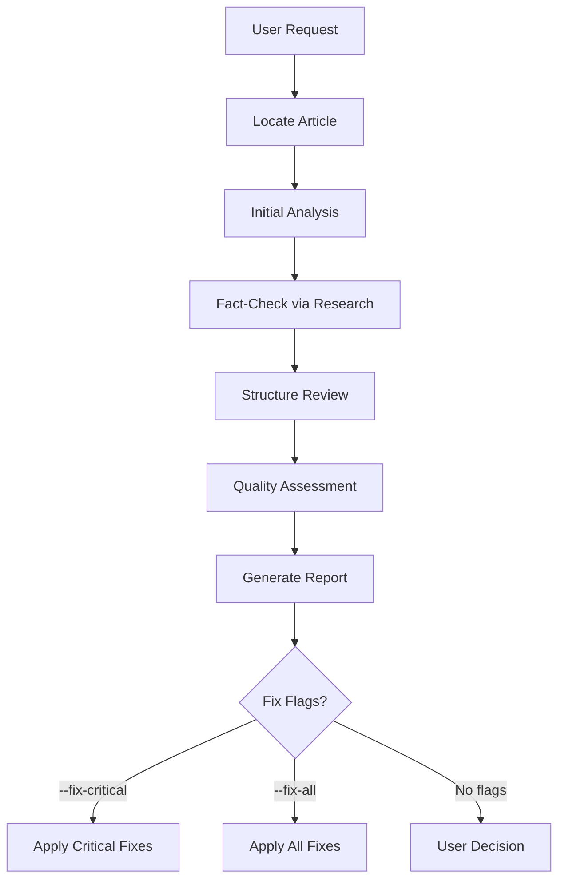

# Review Posts Skill

Reviews existing technical articles for accuracy, depth, and quality. Targets senior/staff/principal engineers.

## Invocation

- `/review-posts [path or topic]`
- `/review-posts content/posts/web/2024-01-15-caching.md`
- `/review-posts caching` (searches for matching article)

### Flags

- `--fix-critical` - Auto-fix critical issues only
- `--fix-all` - Auto-fix all issues

## Workflow



## Phase 1: Locate Article

Find article by path or topic search:

```plain
content/posts/**/*[topic]*.md
content/posts/**/[topic]/index.md
content/in-research/**/*[topic]*.md
```

## Phase 2: Initial Analysis

### Metadata Check
- [ ] `lastReviewedOn` present and recent
- [ ] Tags from `content/tags.jsonc` (NOT `src/content/tags.json`)
- [ ] Valid YAML frontmatter

### Tag Review (IMPORTANT)
1. **Read** `content/tags.jsonc` to get all valid tag IDs
2. **Analyze** post content to identify relevant topics
3. **Add relevant tags** that match the post content:
   - Use tag `id` values (e.g., `web-performance`, not `Web Performance`)
   - Add all applicable tags based on content topics
   - **NEVER remove existing tags** from the post
4. **Add new tags to tags.jsonc** if needed:
   - If a relevant topic has no matching tag, add it to `content/tags.jsonc`
   - Place new tag in appropriate category section
   - Follow existing format: `{ "id": "slug-format", "name": "Display Name" }`
5. **Validate** all tags in the post exist in tags.jsonc

### Title Review (IMPORTANT)
Review the H1 title for quality and appropriateness:
1. **Accuracy**: Does the title accurately reflect the content?
2. **Specificity**: Is it specific enough to distinguish from similar topics?
3. **No clickbait**: Avoid sensationalism, focus on clarity
4. **Format**: Use descriptive technical titles (e.g., "Node.js Event Loop: Phases, Microtasks, and Common Pitfalls")
5. **Length**: Keep under 70 characters for SEO, but prioritize clarity

**Good titles:**
- "Understanding Connection Pooling in PostgreSQL"
- "HTTP/2 Server Push: Trade-offs and When to Use It"
- "Distributed Caching Strategies: Redis vs Memcached"

**Bad titles:**
- "The Complete Guide to Everything You Need to Know About Caching"
- "Why You Should Use Redis"
- "Performance Tips"

### Slug Review (IMPORTANT)
Review the folder slug (the folder name containing the post):
1. **Match content**: Slug should reflect the main topic
2. **Concise**: Keep slug short but descriptive (3-5 words max)
3. **Format**: Use lowercase, hyphens, no special characters
4. **Date prefix**: Keep the YYYY-MM-DD prefix intact
5. **Update if needed**: If content has significantly changed, update slug

**Slug format:** `content/posts/[category]/YYYY-MM-DD-[slug]/index.md`

**Examples:**
- ✅ `2024-03-15-connection-pooling`
- ✅ `2024-03-15-nodejs-event-loop`
- ❌ `2024-03-15-the-complete-guide-to-understanding-connection-pooling-in-postgresql`
- ❌ `2024-03-15-stuff`

**Renaming process:**
1. Rename the folder with new slug
2. Update any internal links referencing the old path
3. Verify build succeeds after rename

### Structure Analysis
- [ ] Clear title (H1)
- [ ] Abstract paragraph (2-4 sentences)
- [ ] Overview mermaid diagram
- [ ] Comprehensive TLDR section
- [ ] Proper section hierarchy
- [ ] References section (REQUIRED)
- [ ] NO manual Table of Contents (auto-generated)

### Content Inventory
- List all claims (with citations if present)
- List code examples (note collapse usage)
- List diagrams
- List external references

## Phase 3: Fact-Check via Research

**Technical accuracy is HIGHEST priority.**

### Verify Technical Claims

For each significant claim:
1. Search official documentation
2. Cross-reference multiple sources
3. Flag discrepancies and outdated info

### Check Code Examples

1. Syntax correct?
2. Logic correct?
3. Follows current best practices?
4. Error cases handled?
5. **Boilerplate collapsed?** (imports, setup code)

### Validate References
- URLs accessible
- Content supports claims
- Better sources available?
- **Every claim needs inline reference**

## Phase 4: Structure Review

### Required Elements

| Element | Required | Check |
|---------|----------|-------|
| Title (H1) | Yes | Present, descriptive |
| Abstract | Yes | 2-4 sentences, context |
| Overview diagram | Yes | Mermaid or image |
| TLDR | Yes | Comprehensive with subsections |
| Main content | Yes | H2/H3 hierarchy |
| Code examples | Context-dependent | With collapse for boilerplate |
| References | **REQUIRED** | All sources cited |
| Manual ToC | **NO** | Auto-generated |

### Code Block Review

All code must use collapse to hide any lines not essential to the key concept. Use **multiple collapse ranges** for non-contiguous sections:

**Collapse Syntax:** `collapse={1-5, 12-18, 25-30}` — any line ranges, including middle sections.

````markdown
```typescript title="api-handler.ts" collapse={1-5, 13-20, 28-35}
// Lines 1-5: Imports (collapsed)
import { Request, Response } from 'express'
import { validateBody, sanitize } from './middleware'
import { UserService } from './services/user'
import type { ApiResponse, UserInput } from './types'

// Lines 6-12: VISIBLE - Key request handling pattern
export async function createUser(req: Request, res: Response): Promise<void> {
  const input = sanitize(req.body) as UserInput
  if (!validateBody(input)) return res.status(400).json({ error: 'Invalid input' })
  const user = await UserService.create(input)
  res.status(201).json({ data: user })
}

// Lines 13-20: Internal validation (collapsed)
function validateUserInput(input: UserInput): string[] {
  const errors: string[] = []
  if (!input.email?.includes('@')) errors.push('Invalid email')
  if (input.password?.length < 8) errors.push('Password too short')
  return errors
}

// Lines 21-27: VISIBLE - Key error handling pattern
export function handleError(err: Error, res: Response): void {
  const status = err.name === 'ValidationError' ? 400 : 500
  res.status(status).json({ error: err.message })
}

// Lines 28-35: Utility functions (collapsed)
function logRequest(req: Request): void { /* ... */ }
function formatResponse<T>(data: T): ApiResponse<T> { /* ... */ }
```
````

**Collapse review checklist:**
- [ ] Imports: Collapsed unless demonstrating import patterns
- [ ] Setup/config: Collapsed unless discussing initialization
- [ ] **Middle sections**: Helper functions between key functions are collapsed
- [ ] Type definitions: Collapsed unless discussing types
- [ ] Error handling: Collapsed unless that's the topic
- [ ] Only key concept lines are visible by default

### TLDR Quality Check

- [ ] Main concept defined (1-2 sentences)
- [ ] 3-6 themed subsections
- [ ] 3-6 bullet points per subsection
- [ ] **Bold** for key terms
- [ ] Standalone useful (not just teaser)

## Phase 5: Quality Assessment

### Content Quality

#### Technical Accuracy (HIGHEST PRIORITY)
- [ ] All claims verifiable and verified via research
- [ ] Inline references present for every significant claim
- [ ] No speculation presented as fact
- [ ] Correct, current terminology
- [ ] Code examples pass conceptual PR review
- [ ] Performance claims backed by evidence
- [ ] Security considerations addressed

#### Authoritative Tone (REQUIRED)
- [ ] Assertive statements, not excessive hedging
- [ ] Direct language: "X does Y" not "X might possibly do Y"
- [ ] Confident where evidence supports
- [ ] Honest and explicit about unknowns/limitations
- [ ] No unnecessary qualifiers weakening claims
- [ ] Reads like a staff engineer explaining to peers

#### Conciseness (NO FILLER)
- [ ] No padding or filler sentences whatsoever
- [ ] No tutorial-style hand-holding ("First, let's...")
- [ ] No obvious statements ("Security is important")
- [ ] No meta-commentary ("In this article, we will...")
- [ ] Every paragraph earns its place with new information
- [ ] Every sentence advances understanding
- [ ] Reading time < 30 minutes (60 max)

#### Completeness Without Verbosity
- [ ] Covers "why" behind decisions (design reasoning)
- [ ] Documents assumptions and constraints explicitly
- [ ] Historical context where it illuminates decisions
- [ ] All edge cases and subtleties addressed
- [ ] Failure modes discussed
- [ ] Performance implications noted where relevant

#### Trade-offs (MANDATORY)
- [ ] Explicit pros/cons for every approach/technology
- [ ] Real-world examples demonstrating trade-offs
- [ ] Nothing presented as "the best solution"
- [ ] Alternative approaches mentioned with reasons
- [ ] Context-dependent recommendations
- [ ] When to use AND when NOT to use

### Writing Quality
- [ ] Serious, professional, but not stiff
- [ ] Active voice preferred
- [ ] Consistent terminology throughout
- [ ] Logical flow between sections
- [ ] Clear topic sentences

### Staff/Principal Engineer Standard
- [ ] Could be cited as authoritative reference
- [ ] Handles nuance and edge cases
- [ ] Discusses operational considerations
- [ ] Addresses real production concerns
- [ ] No oversimplification of complex topics

### Score Each Area (1-5)

| Area | Score | Notes |
|------|-------|-------|
| Technical accuracy | /5 | Verified claims, correct code |
| Design reasoning | /5 | Why, not just what |
| Trade-off analysis | /5 | Complete pros/cons |
| Code examples | /5 | Correct, idiomatic, collapsed |
| Inline citations | /5 | Every claim supported |
| Conciseness | /5 | No filler, every word earns place |
| Authoritative tone | /5 | Assertive, confident, honest |

## Phase 6: Generate Report

```markdown
# Post Review: [Article Title]

## Summary
**Overall Quality**: [Excellent/Good/Needs Work/Major Issues]
**Technical Accuracy**: [Score/5]
**Last Reviewed**: [Date]

## Critical Issues
### Issue 1: [Title]
- **Location**: [Section/line]
- **Problem**: [Description]
- **Evidence**: [Research findings with source]
- **Fix**: [Recommended change]

## Improvements Needed
### Structure
- [Issues]

### Missing Elements
- [ ] Code block collapse optimization
- [ ] Inline references
- [ ] Trade-off analysis

### Outdated Information
- [Items needing updates]

## Recommendations
### High Priority (Critical)
1. [Fix] - Auto-applied with --fix-critical

### Medium Priority (Improvements)
1. [Enhancement]

### Low Priority (Polish)
1. [Polish item]
```

## Phase 7: Apply Fixes

**With `--fix-critical`:**
1. Apply critical issues
2. Update `lastReviewedOn`
3. Report remaining issues

**With `--fix-all`:**
1. Apply all fixes
2. Update `lastReviewedOn`
3. Run validation

### Common Fixes

#### Adding Inline References
```markdown
// Before
The event loop processes callbacks in a specific order.

// After
The event loop processes callbacks in a specific order ([Node.js Event Loop Documentation](https://nodejs.org/en/docs/guides/event-loop-timers-and-nexttick/)).
```

#### Optimizing Code Block Collapse

Always collapse imports and boilerplate.

#### Removing Manual ToC

Delete any manual Table of Contents - it's auto-generated.

#### Updating Title

If the title doesn't accurately reflect the content:
```markdown
// Before
# Performance Tips

// After
# Browser Rendering Performance: Layout, Paint, and Composite Optimization
```

#### Updating Slug (Folder Rename)

If the slug doesn't match the content:
```bash
# Rename folder
mv content/posts/web/2024-03-15-tips content/posts/web/2024-03-15-browser-rendering-performance

# Search for any internal links to update
grep -r "2024-03-15-tips" content/
```

#### Adding Missing Tags

1. Read `content/tags.jsonc` to get valid tags
2. Identify topics covered in the post
3. Add relevant tag IDs to frontmatter:
```yaml
tags:
  - existing-tag  # Keep existing
  - new-relevant-tag  # Add relevant tags
```
4. If a relevant topic has no tag, add it to `content/tags.jsonc` first

## Anti-Patterns to Flag (CRITICAL)

### Content Anti-Patterns
- **Tutorial-style**: "First, let's understand what X is...", "Before we begin..."
- **Obvious statements**: "Security is important", "Performance matters"
- **Unsubstantiated claims**: Any claim without inline reference
- **Silver bullet thinking**: "This is the best approach", "Always use X"
- **Verbose explanations**: Can be said in fewer words
- **Meta-commentary**: "In this article, we will...", "Let me explain..."
- **Filler transitions**: "Now that we've covered X, let's move to Y"
- **Oversimplification**: Glossing over important nuances
- **Missing trade-offs**: Presenting only benefits, no downsides
- **Outdated information**: Old APIs, deprecated patterns, stale benchmarks
- **Migration timelines/development plans**: Do NOT include phased rollout plans, week-by-week timelines, or development schedules unless explicitly requested by user

### Structure Anti-Patterns
- **Manual ToC**: Should be auto-generated
- **Missing overview diagram**: No visual context for complex topics
- **No collapse in code**: All lines visible including boilerplate
- **Missing References section**: No sources cited
- **Wall of text**: No diagrams, tables, or code breaking up prose
- **Shallow TLDR**: Just a teaser, not comprehensive summary
- **Missing/invalid tags**: No tags, insufficient tags, or tags not in tags.jsonc
- **Vague title**: Title doesn't reflect actual content (e.g., "Tips" instead of specific topic)
- **Mismatched slug**: Folder name doesn't match the content topic
- **Overly long slug**: Slug exceeds 5 words or includes unnecessary words

### Tone Anti-Patterns
- **Too formal**: Academic/corporate speak, passive voice
- **Preachy**: "You should...", "You must..."
- **Dismissive**: "Obviously...", "Simply...", "Just..."
- **Excessive hedging**: "might possibly", "could perhaps", "may or may not"
- **False certainty**: Speculation presented as established fact
- **Condescending**: Explaining things that are basic to the target audience

### Technical Anti-Patterns
- **Code without context**: No title, no explanation of what it demonstrates
- **Incorrect code**: Syntax errors, logic bugs, outdated APIs
- **Unidiomatic code**: Not following language conventions
- **Missing error handling**: Where it would be present in production
- **Toy examples**: Over-simplified to the point of being misleading

## Internal Linking

When reviewing, verify all internal links use relative paths to `.md` files. This enables IDE navigation (Cmd+Click) and the rehype plugin transforms them to proper URLs at build time.

**Correct format:**
```markdown
[Link Text](../YYYY-MM-DD-slug.md)
[Link Text](../../category/YYYY-MM-DD-slug/index.md)
```

**Examples:**
```markdown
<!-- Correct - relative .md paths -->
[Web Performance Overview](../2025-03-03-wpo-overview.md)
[JavaScript Optimization](../2025-01-09-wpo-js.md)

<!-- Wrong formats (flag and fix) -->
[Wrong](/posts/deep-dives/web-fundamentals/wpo-overview)  <!-- Direct URL, not IDE navigable -->
[Wrong](wpo-overview)  <!-- Missing .md extension -->
```

**Key rules:**
- Use relative paths from current file to target `.md` file
- Include the full filename with date prefix
- The rehype plugin transforms these to `/posts/<type>/<category>/<slug>` URLs
- Enables Cmd+Click navigation in VS Code and other IDEs

**During review:** Convert direct URL links to relative `.md` paths where possible.

## Reference Documents

**IMPORTANT**: Before reviewing, read these documents from the project root:

| Document | Path (from project root) | Purpose |
|----------|--------------------------|---------|
| Content Guidelines | `llm_docs/content-guidelines.md` | Writing standards, conciseness rules, quality checklist |
| Markdown Features | `llm_docs/markdown-features.md` | Expressive Code syntax, Mermaid diagrams, KaTeX |
| Project Instructions | `CLAUDE.md` | Project structure, commands, styling conventions |

**Usage**: Use the Read tool with absolute paths (e.g., `/path/to/project/llm_docs/content-guidelines.md`) to read these files before starting work.

## Tools Available

- `Read` - Read article content
- `Glob` - Find articles by pattern
- `Grep` - Search content
- `WebSearch` - Fact-check claims
- `WebFetch` - Verify references
- `Edit` - Apply fixes
- `Bash` - Run build validation
