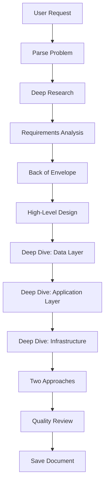

# System Design Skill

Creates comprehensive system design documents targeting senior/staff architects. Learning-focused knowledge-sharing articles, not interview prep checklists.

## Invocation

- `/sys-design <topic / summary>`
- `/sys-design URL shortener - focus on scalability and analytics`

## Philosophy

These articles should read like a senior architect explaining their thought process:
- **Explore the "why"** behind every decision
- **Show the trade-off landscape**, not just the "right answer"
- **Acknowledge context-dependence**: what works for Twitter doesn't work for a startup
- **Include historical context**: how did we get here?
- **Be honest about unknowns**: what would we need to validate?

## Workflow



## Document Structure

```markdown
# [System Name]: A Deep Dive into [Core Challenge]

[Engaging intro framing the problem]

[Overview diagram showing core challenge]

## TLDR
[Comprehensive summary]

## The Problem Space
### What Are We Really Solving?
### Why Is This Hard?
### Historical Context

## Requirements & Constraints
### Functional Requirements
### Non-Functional Requirements
### Explicit Non-Goals

## Back of the Envelope
### Assumptions
### Traffic Modeling
### Storage Modeling
### The Numbers That Matter

## High-Level Architecture
### Design Philosophy
### CAP Theorem Position
### System Components

## Deep Dive: Data Layer
### Data Modeling
### Database Selection
### Caching Strategy
### Data Partitioning

## Deep Dive: Application Layer
### API Design
### Service Architecture
### Core Algorithms
### Resilience Patterns

## Deep Dive: Infrastructure
### Deployment Architecture
### Scaling Strategy
### Observability
### Security

## Advanced Considerations
### Consistency Patterns
### Failure Modes
### Evolution & Migration

## Implementation Approaches
### Approach 1: Cloud-Native
### Approach 2: Custom Infrastructure

## Real-World Examples

## What Would Change at Different Scales

## References
```

## Phase 1: The Problem Space

Start by deeply understanding the problem, not jumping to solutions.

```markdown
## The Problem Space

### What Are We Really Solving?

For a URL shortener, it's not "store short URLs"—it's:
- **Bijective mapping** at scale with low latency
- **Read-heavy workload** with extreme fan-out
- **Durability vs availability** trade-off for redirects

### Why Is This Hard?

| Challenge | Why It's Non-Trivial |
|-----------|---------------------|
| [Challenge 1] | [Explanation with numbers] |
| [Challenge 2] | [Explanation with numbers] |

### Historical Context

How have solutions evolved? What did we learn?
```

## Phase 2: Requirements Analysis

### Functional Requirements

Think in user stories and system behaviors:

| Behavior | Description | Complexity | Notes |
|----------|-------------|------------|-------|
| [Behavior 1] | [Description] | [Simple/Medium/Complex] | [Edge cases] |

### Non-Functional Requirements

| Metric | Target | Rationale | Measurement Point |
|--------|--------|-----------|-------------------|
| Read latency (p50) | X ms | [Why] | Client-perceived |
| Read latency (p99) | Y ms | [Why] | Client-perceived |
| Availability | 99.9% | [Downtime: 8.76 hours/year] | |

### Explicit Non-Goals

**Critical**: What we're NOT building:
- **[Non-goal 1]**: [Why excluding simplifies design]

## Phase 3: Back of the Envelope

**This section teaches estimation thinking, not just numbers.**

```markdown
## Back of the Envelope

### Assumptions

| Assumption | Value | Source/Reasoning | Sensitivity |
|------------|-------|------------------|-------------|
| Daily Active Users | X | [Comparable] | High |
| Read:Write ratio | N:1 | [Reasoning] | High |

### Traffic Modeling

```plain
Writes/second   = DAU × actions_per_user / 86,400
                = [X] × [Y] / 86,400
                = [Z] writes/second

Peak writes/sec = [Z] × peak_ratio
                = [P] writes/second (design target)
```

### The Numbers That Actually Matter

| Metric | Value | Why It Matters |
|--------|-------|----------------|
| Peak QPS | [X] | Determines compute |
| Storage growth/day | [Y] GB | Storage strategy |
| Working set size | [Z] GB | Caching strategy |
```

## Phase 4: High-Level Architecture

### Design Philosophy

| Principle | Meaning | Trade-off Accepted |
|-----------|---------|-------------------|
| [Principle 1] | [Concrete meaning] | [What we give up] |

### CAP Theorem Position

```plain
         Consistency
              ▲
              │    CP Systems
              │    (Banking)
              │         ●
    ──────────┼──────────────────► Availability
              │         ●
              │    AP Systems
              │    (Social feeds)
```

**Our position**: [Explanation of where and why]

### Key Design Decisions

| Decision | Options Considered | Choice | Rationale |
|----------|-------------------|--------|-----------|
| [Decision 1] | [A, B, C] | [Choice] | [Why] |

## Phase 5: Deep Dive - Data Layer

### Database Selection

| Database | Strengths | Weaknesses | Best For |
|----------|-----------|------------|----------|
| PostgreSQL | ACID, complex queries | Horizontal scaling | Transactions |
| DynamoDB | Managed, predictable latency | Cost at scale | Serverless |
| Redis | Speed, data structures | Memory-bound | Caching |

**Decision**: [Database] because:
1. [Primary reason]
2. [Secondary reason]

**What would change this**: If [condition], reconsider [alternative]

### Caching Strategy

| Pattern | Pros | Cons |
|---------|------|------|
| Cache-Aside | Simple, caches what's needed | Cache miss penalty |
| Write-Through | Always consistent | Write latency increased |
| Write-Behind | Fast writes | Data loss risk |

### Data Partitioning

| Strategy | Pros | Cons |
|----------|------|------|
| Range-Based | Range queries efficient | Hot spots |
| Hash-Based | Even distribution | No range queries |
| Consistent Hashing | Minimal data movement | More complex |

## Phase 6: Deep Dive - Application Layer

### API Design

```yaml
POST /api/v1/[resources]
Response: 201 Created
  {
    "id": "abc123",
    "field": "value"
  }
```

### Resilience Patterns

**Circuit Breaker States:**
```plain
CLOSED (normal) → OPEN (fast fail) → HALF-OPEN (test)
```

**Retry with Exponential Backoff:**
```plain
Wait = base × 2^attempt × random(0.5, 1.5)
```

## Phase 7: Deep Dive - Infrastructure

### Deployment Architecture

**Single Region:**
```plain
┌─────────────────────────────────────────────────────────────┐
│                         Region A                             │
│  ┌───────────────────────┐  ┌───────────────────────┐       │
│  │   Availability Zone 1  │  │   Availability Zone 2  │       │
│  └───────────────────────┘  └───────────────────────┘       │
└─────────────────────────────────────────────────────────────┘
```

### Observability

**RED method for services:**
- **R**ate: Requests per second
- **E**rrors: Failed requests per second
- **D**uration: Latency distribution

## Phase 8: Two Implementation Approaches

### Approach 1: Cloud-Native

**When to choose:**
- Team < 10 engineers
- Time-to-market critical
- Moderate scale (< 100K QPS)

| Component | Managed Service | Trade-off |
|-----------|-----------------|-----------|
| Compute | ECS/EKS/Lambda | Ops simplicity vs control |
| Database | RDS/Aurora | Cost vs operational burden |
| Cache | ElastiCache | Same pattern |

**Pros:** Time to market, managed ops, built-in HA
**Cons:** 2-5x more expensive at scale, vendor lock-in

### Approach 2: Custom Infrastructure

**When to choose:**
- Scale > 100K QPS
- Cost optimization critical
- Team has systems expertise

| Component | Choice | Why |
|-----------|--------|-----|
| Compute | Kubernetes | Control, cost |
| Database | PostgreSQL self-managed | Flexibility |
| Cache | Redis Cluster | Performance tuning |

**Pros:** 50-80% cheaper at scale, full control
**Cons:** Months vs weeks, significant ops investment

## Phase 9: What Would Change at Different Scales

| Metric | Startup (1K) | Growth (100K) | Scale (10M) |
|--------|-------------|---------------|-------------|
| Architecture | Monolith | Monolith + cache | Services + sharding |
| Database | Single PostgreSQL | + replicas | Sharded |
| Team size | 2-5 | 10-20 | 50-100 |

## Quality Checks

### Technical Accuracy (HIGHEST PRIORITY)
- [ ] All numbers realistic and sourced
- [ ] Calculations correct
- [ ] Trade-offs fairly represented
- [ ] Inline references present

### Conciseness
- [ ] No padding or filler
- [ ] Every section earns its place
- [ ] Reading time reasonable

### Learning Focus
- [ ] Explains "why" not just "what"
- [ ] Trade-offs for every decision
- [ ] Nothing presented as "best"
- [ ] Historical context included

### Formatting
- [ ] No manual ToC
- [ ] Mermaid diagrams render
- [ ] Code blocks use collapse
- [ ] References complete

## Save Document

Location: `content/posts/design-problems/YYYY-MM-DD-[slug]/index.md`

```yaml
---
lastReviewedOn: YYYY-MM-DD
tags:
  - system-design
  - architecture
  - distributed-systems
---
```

## Reference Documents

- [content-guidelines.md](../../../llm_docs/content-guidelines.md)
- [markdown-features.md](../../../llm_docs/markdown-features.md)
- [CLAUDE.md](../../../CLAUDE.md)

## Tools Available

- `WebSearch` - Research engineering blogs, papers
- `WebFetch` - Fetch detailed content
- `Read` - Read existing content
- `Write` - Create documents
- `Glob` - Find related content
- `Bash` - Build and validation
