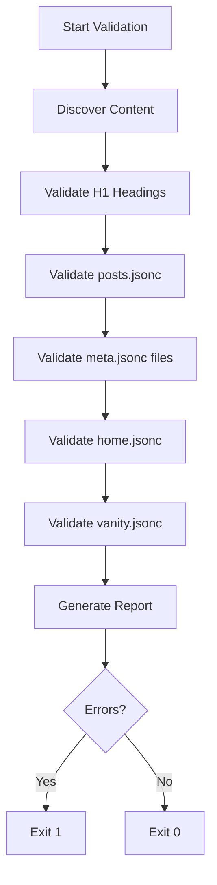

# Validate Content Skill

Validates content structure and configuration files to ensure consistency across the project.

## Invocation

- `/validate-content` - Run all content validations
- `/validate-content --fix` - Run validations and auto-fix issues (not yet implemented)

## What Gets Validated

### 1. H1 Headings

Every README.md file must have exactly one H1 heading. Code blocks are excluded from this check.

- **Valid**: Single `# Title` outside code blocks
- **Error**: Missing H1
- **Error**: Multiple H1 headings (excluding code blocks)

### 2. posts.jsonc Completeness

The `/articles` page ordering file must include all articles.

- **Error**: Article exists but not in posts.jsonc
- **Error**: Orphan entry (path in posts.jsonc but article doesn't exist)

### 3. meta.jsonc Completeness

Each level has a meta.jsonc file that orders its children:

- `content/articles/meta.jsonc` → orders categories
- `content/articles/<category>/meta.jsonc` → orders topics
- `content/articles/<category>/<topic>/meta.jsonc` → orders articles

**Checks:**

- Every category/topic/article must be in its parent's meta.jsonc order
- No orphan entries in meta.jsonc that don't exist on disk

### 4. home.jsonc References

Featured items on the home page must exist.

- **Error**: Featured article doesn't exist
- **Error**: Featured category doesn't exist
- **Error**: Featured topic doesn't exist

### 5. vanity.jsonc Internal Redirects

Internal redirects (targets starting with `/`) must point to valid paths.

- **Error**: Internal redirect target doesn't exist

## Workflow



## Usage

### Basic Validation

```bash
npm run validate:content
```

### Via Claude

```
/validate-content
```

## Example Output

```plain
============================================================
Content Validation
============================================================
Content directory: /path/to/content/articles

Discovering content structure...
Found 7 categories
Found 20 topics
Found 39 articles

Validating H1 headings...
  0 issues found
Validating posts.jsonc...
  0 issues found
Validating meta.jsonc files...
  0 issues found
Validating home.jsonc...
  0 issues found
Validating vanity.jsonc...
  0 issues found

============================================================
Validation Summary
============================================================
Categories: 7
Topics: 20
Articles: 39
Errors: 0
Warnings: 0
All validations passed!
```

## Fixing Issues

### Missing from posts.jsonc

Add the article path to `content/posts.jsonc`:

```jsonc
{
  "order": [
    // ... existing articles
    "category/topic/new-article", // Add new article
  ],
}
```

### Missing from meta.jsonc

Add to the appropriate level's meta.jsonc:

```jsonc
// For categories: content/articles/meta.jsonc
{ "order": ["existing", "new-category"] }

// For topics: content/articles/<category>/meta.jsonc
{ "order": ["existing", "new-topic"] }

// For articles: content/articles/<category>/<topic>/meta.jsonc
{ "order": ["existing", "new-article"] }
```

### Orphan Entries

Remove entries from configuration files that no longer exist on disk.

## Integration with Other Skills

### /write-post

After creating a new article, run `/validate-content` to ensure:

- Article is in posts.jsonc
- Article is in topic's meta.jsonc
- H1 heading is correct

### /review-posts

During content review, validation is automatically checked.

## Logs

Validation logs are saved to: `logs/validate-content-{timestamp}.log`

## Tools Available

- `Read` - Read configuration files
- `Bash` - Run validation script
- `Edit` - Fix configuration files (with --fix)
