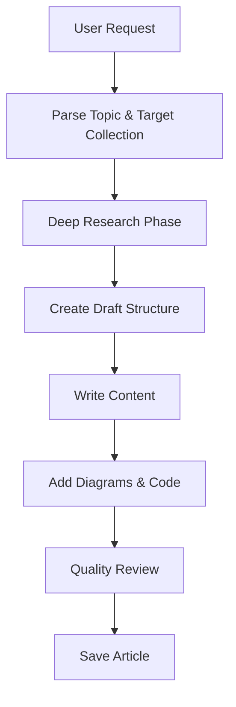
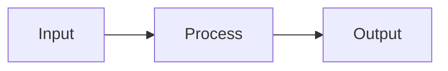
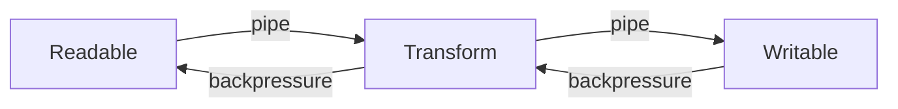

# Write Blog Skill

This skill guides the creation of in-depth technical articles for sujeet.pro, targeting experienced software professionals (senior/staff/principal engineers).

## Invocation

This skill is triggered when the user requests:
- "Write blog about [topic]"
- "Create article on [topic]"
- "Write a deep-dive on [topic]"

## Workflow Overview



## Phase 1: Parse Request

Extract from the user's request:

1. **Topic**: The subject matter to cover
2. **Target collection**: writing | deep-dives | work | uses (default: deep-dives)
3. **Category**: Infer from topic (e.g., "libuv" → tools, "event loop" → web-fundamentals)
4. **Scope**: Specific aspects to focus on (if mentioned)

## Phase 2: Deep Research

### Research Strategy

Perform comprehensive research using web search and fetching:

1. **Official Documentation**
   - Search for official docs, specifications, RFCs
   - Fetch LLM-optimized docs when available (llms.txt, llms-full.txt)

2. **Source Code Analysis**
   - Find GitHub repositories
   - Understand implementation details
   - Identify design decisions and their rationale

3. **Technical Deep Dives**
   - Search for expert blog posts and conference talks
   - Look for benchmarks and performance analyses
   - Find case studies and production experiences

4. **Cross-Reference**
   - Verify claims across multiple sources
   - Note any contradictions or debates
   - Identify areas of consensus

### Research Queries to Execute

For a topic like "[TOPIC]", search for:

```
[TOPIC] architecture internals
[TOPIC] design decisions why
[TOPIC] how it works under the hood
[TOPIC] performance benchmarks
[TOPIC] vs alternatives comparison
[TOPIC] production experience
[TOPIC] official documentation
[TOPIC] source code github
[TOPIC] specification RFC
```

### Source Quality Hierarchy

Prioritize sources in this order:
1. Official specifications (RFC, W3C, ECMA)
2. Official documentation (vendor docs, MDN)
3. Source code (GitHub, GitLab)
4. Peer-reviewed papers (ACM, IEEE)
5. Expert technical blogs
6. Conference talks from recognized experts

## Phase 3: Create Draft Structure

Before writing, create a draft in the drafts folder:

```
content/drafts/[slug]/
├── _meta.yaml       # Metadata
├── notes.md         # Research notes
├── outline.md       # Planned structure
└── references.md    # All sources
```

### _meta.yaml Template

```yaml
target: deep-dives  # or: writing, work, uses
tags:
  - primary-tag
  - secondary-tag
workingTitle: "[TOPIC]: [Subtitle]"
status: drafting
```

### Outline Structure

Create an outline following this template:

```markdown
# [Title]

## Abstract (before ToC)
- Context paragraph
- Overview mermaid diagram

## TLDR
### [Theme 1]
- Point 1
- Point 2
### [Theme 2]
- Point 1
- Point 2

## Main Section 1: [Foundational Concepts]
### Subsection 1.1
### Subsection 1.2

## Main Section 2: [Core Mechanics/How It Works]
### Subsection 2.1
### Subsection 2.2

## Main Section 3: [Advanced Topics/Edge Cases]
### Subsection 3.1
### Subsection 3.2

## Main Section 4: [Practical Considerations]
### Performance
### Trade-offs
### When to Use/Not Use

## Conclusion

## References
```

## Phase 4: Write Content

### Writing Principles

1. **No common knowledge padding**: Skip explanations of concepts senior engineers know
2. **Why before how**: Explain design rationale before implementation
3. **Evidence-based**: Back claims with references
4. **Production reality**: Include operational considerations

### Content Sections

#### Abstract (2-4 sentences)
- Set context for why this matters
- Describe what the reader will learn
- Include overview mermaid diagram

#### TLDR (Comprehensive Summary)
- Main concept definition (1-2 sentences)
- 3-6 themed subsections
- 3-6 bullet points per subsection
- Use **bold** for key terms

#### Main Content
- Hierarchical organization (H2 → H3 → H4)
- Each section answers a specific question
- Include mermaid diagrams for complex concepts
- Code examples where appropriate

### Code Example Guidelines

```typescript title="descriptive-filename.ts"
// Key insight explained in comment
export function example(): Result {
  // Implementation with meaningful variable names
  const meaningfulName = computeValue()
  return meaningfulName
}
```

- Use TypeScript when applicable
- Include title attribute for context
- Comment non-obvious parts
- Show production-quality patterns

### Mermaid Diagram Guidelines

Include diagrams for:
- System architecture
- Process flows
- State machines
- Data flow

Always wrap in figure tags:

```markdown
<figure>



<figcaption>Description of what this diagram shows</figcaption>

</figure>
```

## Phase 5: Quality Checks

Before finalizing, verify:

### Content Quality
- [ ] Abstract sets clear context
- [ ] Overview diagram visualizes main concept
- [ ] TLDR is comprehensive and standalone
- [ ] All claims backed by references
- [ ] Trade-offs explicitly discussed
- [ ] Edge cases and failure modes covered

### Technical Accuracy
- [ ] Code examples are correct
- [ ] Performance claims have evidence
- [ ] Diagrams match described behavior
- [ ] Information is current

### Writing Quality
- [ ] No padding or unnecessary explanations
- [ ] Active voice preferred
- [ ] Consistent terminology
- [ ] Technical precision

### Formatting
- [ ] Mermaid diagrams render correctly
- [ ] Code syntax highlighting works
- [ ] Tables properly formatted
- [ ] All images have alt text and captions
- [ ] References section complete

## Phase 6: Save Article

Move from drafts to production:

1. Create folder: `content/[collection]/[category]/YYYY-MM-DD-[slug]/`
2. Create `index.md` with frontmatter:

```yaml
---
lastUpdatedOn: YYYY-MM-DD
tags:
  - tag-one
  - tag-two
---
```

3. Copy any images/assets
4. Verify build: `npm run build`
5. Validate: `npm run validate:build`

## Example Output Structure

For "Write blog about Node.js streams":

```
content/deep-dives/tools/2026-01-18-nodejs-streams/
├── index.md
├── stream-architecture.svg
└── backpressure-diagram.png
```

With frontmatter:

```yaml
---
lastUpdatedOn: 2026-01-18
tags:
  - node
  - js
  - performance
  - architecture
  - backend
---

# Node.js Streams: A Complete Guide to Backpressure and Flow Control

Understanding how Node.js streams manage memory efficiently through backpressure, enabling processing of data larger than available RAM.

<figure>



<figcaption>Stream pipeline with bidirectional backpressure flow</figcaption>

</figure>

## TLDR

**Node.js Streams** are an abstraction for handling flowing data...
```

## Reference Documents

For detailed guidelines, read:
- [content-guidelines.md](../../../llm_docs/content-guidelines.md) - Complete writing standards
- [CLAUDE.md](../../../CLAUDE.md) - Project conventions and markdown features

## Tools Available

This skill can use:
- `WebSearch` - Search for technical documentation and sources
- `WebFetch` - Fetch content from URLs for analysis
- `Read` - Read existing content for reference
- `Write` - Create draft and final content
- `Glob` - Find related existing content
- `Grep` - Search codebase for patterns
- `Bash` - Run build and validation commands
