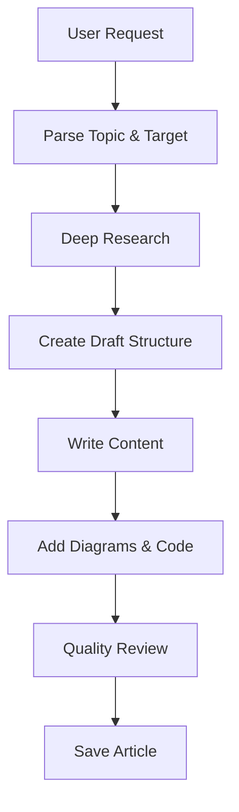
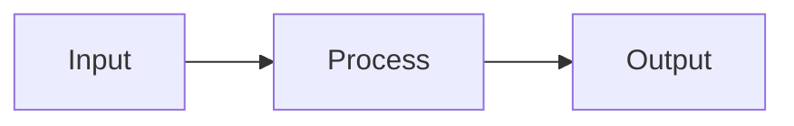

# Write Post Skill

Creates in-depth technical articles for experienced software professionals (senior/staff/principal engineers).

## Invocation

- `/write-post <topic and summary>`
- `/write-post Node.js event loop internals - covering phases, microtasks, and common pitfalls`

If called without arguments, ask user for topic and brief summary.

## Workflow



## Phase 1: Parse Request

Extract from user's request:

1. **Topic**: Subject matter to cover
2. **Target collection**: posts | in-research (default: posts)
3. **Category**: Infer from topic (e.g., "libuv" → tools, "event loop" → web)
4. **Scope**: Specific aspects to focus on

## Phase 2: Deep Research

### Research Strategy

1. **Official Documentation**
   - Search for official docs, specifications, RFCs
   - Fetch LLM-optimized docs when available (llms.txt)

2. **Source Code Analysis**
   - Find GitHub repositories
   - Understand implementation details
   - **Document constraints and assumptions behind design decisions**

3. **Technical Deep Dives**
   - Expert blog posts and conference talks
   - Benchmarks and performance analyses
   - Case studies and production experiences

4. **Historical Context**
   - What problem was this solving?
   - Why was this approach chosen?
   - **What trade-offs were accepted?**

5. **Cross-Reference**
   - Verify claims across multiple sources
   - Note contradictions
   - **Collect interesting facts with sources**

### Source Quality Hierarchy

1. Official specifications (RFC, W3C, ECMA)
2. Official documentation (vendor docs, MDN)
3. Source code (GitHub)
4. Peer-reviewed papers
5. Expert technical blogs
6. Conference talks

**IMPORTANT**: Save all sources for inline citations and References section.

## Phase 3: Create Draft Structure

Before writing, create draft in:

```plain
content/drafts/[slug]/
├── _meta.yaml       # Metadata
├── notes.md         # Research notes
├── outline.md       # Planned structure
└── references.md    # Sources collected
```

### Outline Template

```markdown
# [Title]

## Abstract (before ToC)

- Context paragraph
- Overview mermaid diagram

## TLDR

### [Theme 1]

- Point 1
- Point 2

## Main Section 1: [Context/Why]

### The Problem Being Solved

### Constraints and Assumptions

### Why This Design?

## Main Section 2: [How It Works]

### Subsection 2.1

### Subsection 2.2

## Main Section 3: [Trade-offs and Real-World]

### Pros and Cons

### When to Use

### When NOT to Use

## Conclusion

## References
```

**NOTE**: Do NOT add Table of Contents - it's auto-generated.

## Phase 4: Write Content

### Quality Standard: Staff/Principal Engineer Reference

Content must be usable as authoritative reference by senior technical leadership. Every article should:

- Be citable in technical discussions and design reviews
- Handle nuance and edge cases that matter in production
- Provide complete context for informed decision-making
- Stand up to scrutiny from domain experts

### Writing Principles

1. **Technical accuracy is HIGHEST priority**: Every claim must be verifiable with inline references from authoritative sources
2. **Authoritative and assertive**: Write with confidence where evidence supports. "X does Y" not "X might do Y"
3. **Concise, zero filler**: No padding, no obvious statements, every sentence advances understanding
4. **Complete coverage**: All subtleties, edge cases, failure modes, and trade-offs addressed
5. **Why before how**: Explain design rationale, constraints, and assumptions before implementation
6. **Explicit trade-offs**: Every approach has pros/cons, when to use, when NOT to use
7. **Real-world over theoretical**: Production examples, operational concerns, actual failure modes
8. **Honest about unknowns**: Clearly distinguish verified facts from educated speculation

### Tone Guidelines

**DO:**

- Write directly and assertively
- Make confident statements backed by evidence
- Share insights like a staff engineer explaining to peers
- Be explicit about limitations and unknowns
- Present trade-offs with clear context for decision-making

**DON'T:**

- Use academic/corporate speak
- Be preachy or prescriptive ("You should...")
- Use "Obviously...", "Simply...", or "Just..."
- Present opinions as universal truths
- Hedge excessively ("might possibly", "could perhaps")
- Write filler ("In this article, we will explore...")
- State the obvious ("Security is important")

### Content Sections

#### Abstract (2-4 sentences)

- Set context for why this matters
- What the reader will learn
- Include overview mermaid diagram

#### TLDR (Comprehensive Summary)

- Main concept (1-2 sentences)
- 3-6 themed subsections
- 3-6 bullet points per subsection
- **Bold** for key terms
- Include key trade-offs

#### Main Content

- H2 → H3 → H4 hierarchy
- Each section answers a specific question
- Mermaid diagrams for complex concepts
- **Inline references for all claims**

### Design Reasoning (Required)

```markdown
### Why This Design?

The designers chose this approach because:

1. **Constraint**: [What limitation existed?]
2. **Assumption**: [What was assumed about use case?]
3. **Trade-off**: [What was sacrificed for what gain?]

This was influenced by [historical context](url).
```

### Trade-offs Section (REQUIRED)

```markdown
### Trade-offs

| Aspect      | Pros  | Cons  |
| ----------- | ----- | ----- |
| Performance | [Pro] | [Con] |
| Complexity  | [Pro] | [Con] |

### When to Use

- [Scenario 1]

### When NOT to Use

- [Scenario 1] - [Why]
```

### Code Examples

**ALWAYS use collapse for any lines not essential to the key concept:**

**Collapse Syntax:** `collapse={1-5, 12-20, 30-35}` — use multiple ranges to hide any section.

````markdown
```typescript title="cache-service.ts" collapse={1-6, 14-22, 30-38}
// Lines 1-6: Imports (collapsed)
import { Redis } from "ioredis"
import { Logger } from "./logger"
import type { CacheConfig, CacheResult } from "./types"

const redis = new Redis()
const logger = new Logger("cache")

// Lines 7-13: VISIBLE - Key caching pattern
export async function getOrSet<T>(key: string, fetcher: () => Promise<T>, ttl: number): Promise<T> {
  const cached = await redis.get(key)
  if (cached) return JSON.parse(cached)
  const value = await fetcher()
  await redis.setex(key, ttl, JSON.stringify(value))
  return value
}

// Lines 14-22: Internal helpers (collapsed)
async function invalidatePattern(pattern: string): Promise<number> {
  const keys = await redis.keys(pattern)
  if (keys.length === 0) return 0
  return redis.del(...keys)
}

function buildKey(namespace: string, id: string): string {
  return `${namespace}:${id}`
}

// Lines 23-29: VISIBLE - Key invalidation API
export async function invalidateUser(userId: string): Promise<void> {
  const count = await invalidatePattern(`user:${userId}:*`)
  logger.info(`Invalidated ${count} cache entries for user ${userId}`)
}

// Lines 30-38: Monitoring utilities (collapsed)
export async function getCacheStats(): Promise<Record<string, number>> {
  const info = await redis.info("stats")
  // ... parse stats
  return {}
}
```
````

**Collapse rules:**

- Imports: Always collapse
- Setup/config: Collapse initialization code
- **Middle sections**: Collapse helper functions between key functions
- Type definitions: Collapse unless discussing types
- Error handling: Collapse unless that's the topic
- Use `{lineNumbers}` to highlight specific key lines within visible sections

**Code quality:**

- Use TypeScript when applicable
- Include title for context
- Comment non-obvious parts
- Show production-quality patterns

### Text Diagrams

Use `plain` for ASCII diagrams:

````markdown
```plain
┌─────────────┐     ┌─────────────┐
│   Client    │────▶│   Server    │
└─────────────┘     └─────────────┘
```
````

### Mermaid Diagrams

Always wrap in figure tags:

````markdown
<figure>


````

<figcaption>Description of diagram</figcaption>

</figure>
```

### Inline References

**Every significant claim needs inline reference:**

```markdown
The event loop uses a single thread for JavaScript execution but delegates I/O to the OS kernel ([Node.js Event Loop Documentation](https://nodejs.org/en/docs/guides/event-loop-timers-and-nexttick/)).
```

## Phase 5: Quality Checks

### Technical Accuracy (HIGHEST PRIORITY)

- [ ] Every claim verified against authoritative sources
- [ ] Inline references for all significant claims
- [ ] Code examples syntactically correct and idiomatic
- [ ] Code would pass PR review from senior engineer
- [ ] Performance claims backed by benchmarks/evidence
- [ ] Diagrams accurately represent described behavior
- [ ] No speculation presented as established fact
- [ ] Terminology correct and current

### Authoritative Tone

- [ ] Assertive statements where evidence supports
- [ ] No excessive hedging or unnecessary qualifiers
- [ ] Confident presentation of verified facts
- [ ] Explicit about unknowns and limitations
- [ ] Reads like staff engineer explaining to peers

### Completeness

- [ ] Abstract sets clear context (2-4 sentences)
- [ ] Overview diagram visualizes core concept
- [ ] TLDR is comprehensive and standalone (usable as reference)
- [ ] Design reasoning explained (why, not just what)
- [ ] Assumptions and constraints documented
- [ ] Historical context where it illuminates decisions
- [ ] All edge cases and subtleties addressed
- [ ] Failure modes discussed
- [ ] Performance implications noted

### Trade-offs (MANDATORY)

- [ ] Explicit pros/cons for every approach
- [ ] When to use AND when NOT to use
- [ ] Real-world examples demonstrating trade-offs
- [ ] Nothing presented as "the best solution"
- [ ] Alternative approaches mentioned with reasoning

### Conciseness (ZERO FILLER)

- [ ] No padding or filler sentences
- [ ] No meta-commentary ("In this article...")
- [ ] No tutorial-style hand-holding
- [ ] No obvious statements
- [ ] Every paragraph adds new information
- [ ] Every sentence advances understanding
- [ ] Reading time < 30 minutes (60 max)

### Staff/Principal Engineer Standard

- [ ] Could be cited as authoritative reference
- [ ] Handles nuance senior engineers care about
- [ ] Addresses operational/production concerns
- [ ] No oversimplification of complex topics
- [ ] Complete enough for informed decision-making

### Formatting

- [ ] No manual Table of Contents
- [ ] Mermaid diagrams render correctly
- [ ] Code blocks use collapse for boilerplate
- [ ] Code blocks have title attribute
- [ ] Key lines highlighted in code
- [ ] References section complete
- [ ] Text diagrams use `plain`

### Tags

- [ ] All tags valid (exist in `content/tags.jsonc`)
- [ ] Relevant tags added based on content (typically 3-8)
- [ ] New tags added to tags.jsonc if needed
- [ ] Uses tag IDs, not display names

## Phase 6: Save Article

Move from drafts to production:

1. Create folder: `content/posts/[category]/YYYY-MM-DD-[slug]/`
2. Create `index.md` with frontmatter:

```yaml
---
lastReviewedOn: YYYY-MM-DD
tags:
  - tag-one
  - tag-two
---
```

### Title Selection (IMPORTANT)

Choose a title that accurately represents the content:

1. **Be specific**: "Node.js Event Loop: Phases, Microtasks, and Common Pitfalls" not "Node.js Guide"
2. **Reflect actual content**: Title must match what the article covers
3. **No clickbait**: Avoid sensationalism, focus on clarity and accuracy
4. **Format options**:
   - Topic + Colon + Specifics: "Redis Caching: Strategies, Pitfalls, and Best Practices"
   - Question format: "How Does the Node.js Event Loop Work?"
   - Direct statement: "Understanding Connection Pooling in PostgreSQL"
5. **Length**: Under 70 characters for SEO, but prioritize clarity over length

**Good titles:**

- "Browser Rendering Pipeline: Layout, Paint, and Composite"
- "Distributed Locking with Redis: Implementation and Gotchas"
- "PostgreSQL MVCC: How Transactions See Data"

**Bad titles:**

- "Complete Guide to Redis" (too vague)
- "Everything About Databases" (too broad)
- "Tips and Tricks" (not descriptive)
- "The Ultimate Performance Guide You Need" (clickbait)

### Slug Selection (IMPORTANT)

Choose a folder slug that matches the content:

1. **Format**: `YYYY-MM-DD-[slug]` (e.g., `2024-03-15-nodejs-event-loop`)
2. **Concise**: 3-5 words maximum
3. **Descriptive**: Should hint at the topic
4. **Lowercase**: Use hyphens, no special characters
5. **Match title**: Slug should align with the title topic

**Good slugs:**

- `2024-03-15-nodejs-event-loop`
- `2024-03-15-redis-distributed-locking`
- `2024-03-15-postgres-mvcc`

**Bad slugs:**

- `2024-03-15-guide` (too vague)
- `2024-03-15-the-complete-comprehensive-guide-to-understanding-nodejs-event-loop` (too long)
- `2024-03-15-stuff` (meaningless)

### Tag Selection (IMPORTANT)

1. **Read** `content/tags.jsonc` to get all valid tag IDs
2. **Analyze** post content to identify relevant topics
3. **Add relevant tags** that match the post content:
   - Use tag `id` values (e.g., `web-performance`, not `Web Performance`)
   - Add all applicable tags (typically 3-8 tags per post)
   - Include both broad tags (e.g., `frontend`) and specific tags (e.g., `react`)
4. **Add new tags to tags.jsonc** if needed:
   - If a relevant topic has no matching tag, add it to `content/tags.jsonc` first
   - Place new tag in appropriate category section
   - Follow existing format: `{ "id": "slug-format", "name": "Display Name" }`
5. **Validate** all tags exist in tags.jsonc before using them

6. Copy images/assets
7. **Update configuration files:**
   - Add article to topic's `meta.jsonc`: `content/articles/<category>/<topic>/meta.jsonc`
   - Add article to `posts.jsonc`: `content/posts.jsonc`
   - Consider adding to `home.jsonc` featured articles if cornerstone piece
8. Verify build: `npm run build`
9. Validate content: `npm run validate:content`
10. Validate build: `npm run validate:build`

## Anti-Patterns to Avoid (STRICT)

### Content Anti-Patterns

- **Tutorial-style**: "First, let's understand...", "Before we begin..."
- **Obvious statements**: "Security is important", "Performance matters"
- **Meta-commentary**: "In this article, we will...", "Let me explain..."
- **Filler transitions**: "Now that we've covered X, let's move to Y"
- **Silver bullet thinking**: "This is the best approach", "Always use X"
- **Claims without sources**: Every significant claim needs inline reference
- **Missing reasoning**: What without explaining why
- **Verbose**: Any sentence that can be said in fewer words
- **Oversimplification**: Glossing over nuances that matter
- **Incomplete trade-offs**: Only benefits, no downsides or limitations
- **Migration timelines/development plans**: Do NOT include phased rollout plans, week-by-week timelines, or development schedules unless explicitly requested by user

### Structure Anti-Patterns

- **Manual ToC**: Auto-generated by framework
- **Missing trade-offs**: Every approach needs pros/cons
- **No code collapse**: Imports/boilerplate must be collapsed
- **Missing references**: Every article needs complete References section
- **Shallow TLDR**: Must be comprehensive, not just a teaser
- **No overview diagram**: Complex topics need visual context
- **Invalid tags**: Tags not in tags.jsonc, using display names instead of IDs
- **Missing tags**: No tags or insufficient tags for content topics
- **Vague title**: Generic titles like "Guide", "Tips", "Overview" without specifics
- **Clickbait title**: Sensationalist titles that don't match content depth
- **Mismatched slug**: Folder name doesn't reflect the actual content
- **Overly long slug**: Slug exceeds 5 words or contains unnecessary words

### Tone Anti-Patterns

- **Too formal**: Academic/corporate speak, excessive passive voice
- **Preachy**: "You should...", "You must..."
- **Dismissive**: "Obviously...", "Simply...", "Just..."
- **Excessive hedging**: "might possibly", "could perhaps"
- **False certainty**: Speculation presented as fact
- **Condescending**: Explaining basics to senior audience

### Technical Anti-Patterns

- **Incorrect code**: Syntax errors, logic bugs, deprecated APIs
- **Unidiomatic code**: Not following language/framework conventions
- **Missing context**: Code without title or explanation
- **Toy examples**: Over-simplified to point of being misleading
- **Outdated information**: Old versions, deprecated patterns

## Internal Linking

When referencing other posts, use relative paths to `.md` files. This enables IDE navigation (Cmd+Click) and the rehype plugin transforms them to proper URLs at build time.

```markdown
[Link Text](../YYYY-MM-DD-slug.md)
[Link Text](../../category/YYYY-MM-DD-slug/index.md)
```

**Examples:**

```markdown
[Web Performance Overview](../2025-03-03-wpo-overview.md)
[JavaScript Optimization](../2025-01-09-wpo-js.md)
[Caching Strategies](../../system-design-fundamentals/2024-12-06-caching.md)
```

**Key rules:**

- Use relative paths from current file to target `.md` file
- Include the full filename with date prefix
- The rehype plugin transforms these to `/posts/<type>/<category>/<slug>` URLs
- Enables Cmd+Click navigation in VS Code and other IDEs

## Reference Documents

**IMPORTANT**: Before writing, read these documents from the project root:

| Document             | Path (from project root)         | Purpose                                                 |
| -------------------- | -------------------------------- | ------------------------------------------------------- |
| Content Guidelines   | `llm_docs/content-guidelines.md` | Writing standards, conciseness rules, quality checklist |
| Markdown Features    | `llm_docs/markdown-features.md`  | Expressive Code syntax, Mermaid diagrams, KaTeX         |
| Project Instructions | `CLAUDE.md`                      | Project structure, commands, styling conventions        |

**Usage**: Use the Read tool with absolute paths (e.g., `/path/to/project/llm_docs/content-guidelines.md`) to read these files before starting work.

## Tools Available

- `WebSearch` - Search for documentation and sources
- `WebFetch` - Fetch content from URLs
- `Read` - Read existing content
- `Write` - Create draft and final content
- `Glob` - Find related content
- `Grep` - Search codebase
- `Bash` - Run build and validation
