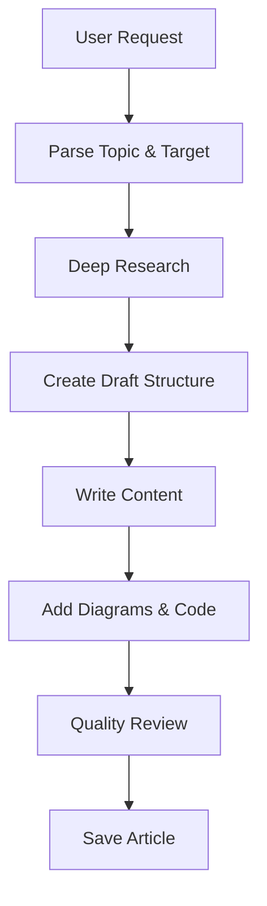
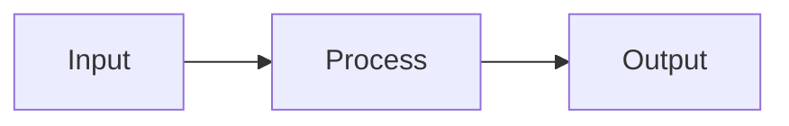

# Write Post Skill

Creates in-depth technical articles for experienced software professionals (senior/staff/principal engineers).

## Invocation

- `/write-post <topic and summary>`
- `/write-post Node.js event loop internals - covering phases, microtasks, and common pitfalls`

If called without arguments, ask user for topic and brief summary.

## Workflow



## Phase 1: Parse Request

Extract from user's request:

1. **Topic**: Subject matter to cover
2. **Target collection**: posts | in-research (default: posts)
3. **Category**: Infer from topic (e.g., "libuv" → tools, "event loop" → web)
4. **Scope**: Specific aspects to focus on

## Phase 2: Deep Research

### Research Strategy

1. **Official Documentation**
   - Search for official docs, specifications, RFCs
   - Fetch LLM-optimized docs when available (llms.txt)

2. **Source Code Analysis**
   - Find GitHub repositories
   - Understand implementation details
   - **Document constraints and assumptions behind design decisions**

3. **Technical Deep Dives**
   - Expert blog posts and conference talks
   - Benchmarks and performance analyses
   - Case studies and production experiences

4. **Historical Context**
   - What problem was this solving?
   - Why was this approach chosen?
   - **What trade-offs were accepted?**

5. **Cross-Reference**
   - Verify claims across multiple sources
   - Note contradictions
   - **Collect interesting facts with sources**

### Source Quality Hierarchy

1. Official specifications (RFC, W3C, ECMA)
2. Official documentation (vendor docs, MDN)
3. Source code (GitHub)
4. Peer-reviewed papers
5. Expert technical blogs
6. Conference talks

**IMPORTANT**: Save all sources for inline citations and References section.

## Phase 3: Create Draft Structure

Before writing, create draft in:

```plain
content/drafts/[slug]/
├── _meta.yaml       # Metadata
├── notes.md         # Research notes
├── outline.md       # Planned structure
└── references.md    # Sources collected
```

### Outline Template

```markdown
# [Title]

## Abstract (before ToC)
- Context paragraph
- Overview mermaid diagram

## TLDR
### [Theme 1]
- Point 1
- Point 2

## Main Section 1: [Context/Why]
### The Problem Being Solved
### Constraints and Assumptions
### Why This Design?

## Main Section 2: [How It Works]
### Subsection 2.1
### Subsection 2.2

## Main Section 3: [Trade-offs and Real-World]
### Pros and Cons
### When to Use
### When NOT to Use

## Conclusion

## References
```

**NOTE**: Do NOT add Table of Contents - it's auto-generated.

## Phase 4: Write Content

### Writing Principles

1. **Technical accuracy is HIGHEST priority**: Every claim must be verifiable with inline references
2. **Concise for senior engineers**: No padding, no filler, no obvious statements
3. **Why before how**: Explain design rationale before implementation
4. **No silver bullets**: Everything has trade-offs
5. **Real-world over theoretical**: Production examples preferred

### Tone Guidelines

**DO:**
- Write directly and clearly
- Share insights like explaining to a peer
- Acknowledge uncertainty
- Present trade-offs objectively

**DON'T:**
- Use academic/corporate speak
- Be preachy or prescriptive
- Use "Obviously..." or "Simply..."
- Present opinions as universal truths

### Content Sections

#### Abstract (2-4 sentences)
- Set context for why this matters
- What the reader will learn
- Include overview mermaid diagram

#### TLDR (Comprehensive Summary)
- Main concept (1-2 sentences)
- 3-6 themed subsections
- 3-6 bullet points per subsection
- **Bold** for key terms
- Include key trade-offs

#### Main Content
- H2 → H3 → H4 hierarchy
- Each section answers a specific question
- Mermaid diagrams for complex concepts
- **Inline references for all claims**

### Design Reasoning (Required)

```markdown
### Why This Design?

The designers chose this approach because:

1. **Constraint**: [What limitation existed?]
2. **Assumption**: [What was assumed about use case?]
3. **Trade-off**: [What was sacrificed for what gain?]

This was influenced by [historical context](url).
```

### Trade-offs Section (REQUIRED)

```markdown
### Trade-offs

| Aspect | Pros | Cons |
|--------|------|------|
| Performance | [Pro] | [Con] |
| Complexity | [Pro] | [Con] |

### When to Use
- [Scenario 1]

### When NOT to Use
- [Scenario 1] - [Why]
```

### Code Examples

**ALWAYS use collapse for boilerplate:**

````markdown
```typescript title="example.ts" collapse={1-5, 20-25} {8-12}
// Collapsed: imports and setup
import { something } from 'somewhere'
import { another } from 'elsewhere'
import type { Type } from 'types'
// setup code...

// Key insight - this is visible
export function example(): Result {
  // Main logic readers care about
  const meaningfulName = computeValue()
  return meaningfulName
}

// Collapsed: helper functions
function helper1() { /* ... */ }
```
````

**Collapse rules:**
- Imports: Always collapse
- Boilerplate: Collapse setup/teardown
- Type definitions: Collapse unless discussing types
- Helper functions: Collapse unless relevant
- Use `{lineNumbers}` to highlight key lines

**Code quality:**
- Use TypeScript when applicable
- Include title for context
- Comment non-obvious parts
- Show production-quality patterns

### Text Diagrams

Use `plain` for ASCII diagrams:

````markdown
```plain
┌─────────────┐     ┌─────────────┐
│   Client    │────▶│   Server    │
└─────────────┘     └─────────────┘
```
````

### Mermaid Diagrams

Always wrap in figure tags:

```markdown
<figure>



<figcaption>Description of diagram</figcaption>

</figure>
```

### Inline References

**Every significant claim needs inline reference:**

```markdown
The event loop uses a single thread for JavaScript execution but delegates I/O to the OS kernel ([Node.js Event Loop Documentation](https://nodejs.org/en/docs/guides/event-loop-timers-and-nexttick/)).
```

## Phase 5: Quality Checks

### Content Quality
- [ ] Abstract sets clear context
- [ ] Overview diagram visualizes main concept
- [ ] TLDR is comprehensive and standalone
- [ ] All claims backed by inline references
- [ ] Trade-offs explicitly discussed
- [ ] Design reasoning explained (why, not just what)
- [ ] Real-world examples included

### Conciseness (CRITICAL)
- [ ] No padding or filler sentences
- [ ] No tutorial-style hand-holding
- [ ] No obvious statements
- [ ] Every paragraph earns its place
- [ ] Reading time < 30 minutes (60 max)

### Technical Accuracy (HIGHEST PRIORITY)
- [ ] Code examples are correct
- [ ] Performance claims have evidence
- [ ] Diagrams match described behavior
- [ ] All inline references valid
- [ ] No speculation as fact

### Formatting
- [ ] No manual Table of Contents
- [ ] Mermaid diagrams render
- [ ] Code blocks use collapse for boilerplate
- [ ] References section complete
- [ ] Text diagrams use `plain`

## Phase 6: Save Article

Move from drafts to production:

1. Create folder: `content/posts/[category]/YYYY-MM-DD-[slug]/`
2. Create `index.md` with frontmatter:

```yaml
---
lastReviewedOn: YYYY-MM-DD
tags:
  - tag-one
  - tag-two
---
```

3. Copy images/assets
4. Verify build: `npm run build`
5. Validate: `npm run validate:build`

## Anti-Patterns to Avoid

### Content Anti-Patterns
- **Tutorial-style**: "First, let's understand what X is..."
- **Obvious statements**: "Security is important"
- **Silver bullet thinking**: "This is the best approach"
- **Claims without sources**: No inline references
- **Missing reasoning**: What without why
- **Verbose**: Can be said in fewer words

### Structure Anti-Patterns
- **Manual ToC**: Auto-generated
- **Missing trade-offs**: Not discussing pros/cons
- **No code collapse**: All lines visible
- **Missing references**: Every article needs one

### Tone Anti-Patterns
- **Too formal**: Academic/corporate speak
- **Preachy**: "You should..."
- **Dismissive**: "Obviously..."

## Reference Documents

**IMPORTANT**: Before writing, read these documents from the project root:

| Document | Path (from project root) | Purpose |
|----------|--------------------------|---------|
| Content Guidelines | `llm_docs/content-guidelines.md` | Writing standards, conciseness rules, quality checklist |
| Markdown Features | `llm_docs/markdown-features.md` | Expressive Code syntax, Mermaid diagrams, KaTeX |
| Project Instructions | `CLAUDE.md` | Project structure, commands, styling conventions |

**Usage**: Use the Read tool with absolute paths (e.g., `/path/to/project/llm_docs/content-guidelines.md`) to read these files before starting work.

## Tools Available

- `WebSearch` - Search for documentation and sources
- `WebFetch` - Fetch content from URLs
- `Read` - Read existing content
- `Write` - Create draft and final content
- `Glob` - Find related content
- `Grep` - Search codebase
- `Bash` - Run build and validation
