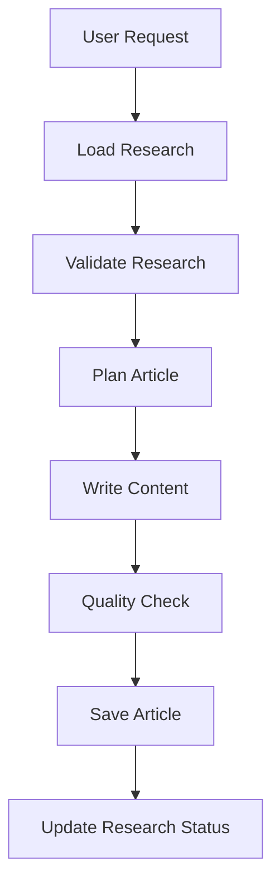

# Write Research Skill

Converts research documents from `content/in-research/` into polished blog posts.

## Invocation

- `/write-research <posttype> <category> <path-to-research>`
- `/write-research posts web content/in-research/2024-01-15-websockets/`

### Arguments

| Argument | Description | Example |
|----------|-------------|---------|
| `posttype` | Target collection | `posts`, `in-research` |
| `category` | Category within collection | `web`, `tools`, `design-problems` |
| `path` | Path to research folder | `content/in-research/2024-01-15-websockets/` |

If called without arguments, ask user for:
1. Path to research document
2. Target post type and category

## Workflow



## Phase 1: Load Research

Read all files from the research folder:

```plain
content/in-research/[slug]/
├── index.md          # Main research
├── _sources.md       # Annotated sources
├── _outline.md       # Proposed outline
└── _notes.md         # Raw notes
```

### Extract Key Information

- Research summary and key findings
- Annotated sources with quality ratings
- Proposed article outline
- Identified gaps and open questions

## Phase 2: Validate Research

Check research is ready to write:

### Research Readiness Checklist

- [ ] Key findings documented
- [ ] Major themes identified
- [ ] Authoritative sources found
- [ ] Outline is specific and actionable
- [ ] Critical gaps addressed or noted

### If Research is Incomplete

Ask user:
1. Proceed with available research?
2. Return to `/research-post` to fill gaps?
3. Specify which gaps to ignore?

## Phase 3: Plan Article

### Map Research to Article

Based on the research outline, create article plan:

```markdown
## Article Plan

**Title**: [From outline or refined]
**Target**: posts/[category]/YYYY-MM-DD-[slug]/

### Sections

1. **Abstract**
   - Sources: [list]
   - Key points to cover: [list]

2. **TLDR**
   - Themes from research: [map]

3. **[Section Name]**
   - Research findings to use: [list]
   - Sources for citations: [list]
   - Diagrams needed: [list]

### Code Examples
- [Example 1]: [Source reference]

### Diagrams
- [Diagram 1]: [Description]
```

### Identify Additional Research Needed

If outline reveals gaps:
- Do quick targeted research
- Note in article if something is unverified
- Flag for future update

## Phase 4: Write Content

Use the `/write-post` skill's content standards, but leverage existing research.

### Writing From Research

#### Abstract
- Use research summary as foundation
- Refine for article context
- Add overview diagram

#### TLDR
- Map research themes to TLDR subsections
- Ensure comprehensive coverage
- Add trade-offs identified in research

#### Main Content

For each section:
1. Review relevant research findings
2. Pull key insights and examples
3. Add inline citations from `_sources.md`
4. Create diagrams from research descriptions
5. Write code examples with collapse

### Citation Integration

Transform source annotations into inline references:

```markdown
// From _sources.md
## Node.js Event Loop Documentation
**URL**: https://nodejs.org/...
**Type**: Official Docs
**Key Points**: Event loop has 6 phases...

// In article
The event loop processes callbacks in six distinct phases ([Node.js Event Loop Documentation](https://nodejs.org/...)).
```

### Code Examples

**Always collapse boilerplate:**

````markdown
```typescript title="example.ts" collapse={1-5}
import { something } from 'somewhere'
import { another } from 'elsewhere'
import type { Type } from 'types'
// setup...

// Main logic - visible
export function example(): Result {
  return computeValue()
}
```
````

## Phase 5: Quality Check

### Technical Accuracy (HIGHEST PRIORITY)
- [ ] Every claim verified against research sources
- [ ] Inline references for all significant claims
- [ ] Code examples syntactically correct and idiomatic
- [ ] Code would pass PR review from senior engineer
- [ ] Performance claims backed by evidence
- [ ] Diagrams accurately represent described behavior
- [ ] No speculation presented as fact
- [ ] Terminology correct and current

### Authoritative Tone
- [ ] Assertive statements where evidence supports
- [ ] No excessive hedging or unnecessary qualifiers
- [ ] Confident presentation of verified facts
- [ ] Explicit about unknowns and limitations
- [ ] Reads like staff engineer explaining to peers

### Research Integration
- [ ] All key findings from research represented
- [ ] Sources properly cited with inline references
- [ ] Gaps explicitly acknowledged if unresolved
- [ ] No research copied verbatim (synthesized into article voice)
- [ ] Research quality validated before use

### Completeness
- [ ] Abstract sets clear context (2-4 sentences)
- [ ] Overview diagram visualizes core concept
- [ ] TLDR is comprehensive and standalone (usable as reference)
- [ ] Design reasoning explained (why, not just what)
- [ ] All edge cases and subtleties addressed
- [ ] Failure modes discussed where relevant

### Trade-offs (MANDATORY)
- [ ] Explicit pros/cons for every approach
- [ ] When to use AND when NOT to use
- [ ] Real-world examples demonstrating trade-offs
- [ ] Nothing presented as "the best solution"
- [ ] Alternative approaches mentioned with reasoning

### Conciseness (ZERO FILLER)
- [ ] No padding or filler sentences
- [ ] No meta-commentary ("In this article...")
- [ ] No tutorial-style hand-holding
- [ ] No obvious statements
- [ ] Every paragraph adds new information
- [ ] Reading time < 30 minutes

### Staff/Principal Engineer Standard
- [ ] Could be cited as authoritative reference
- [ ] Handles nuance senior engineers care about
- [ ] Addresses operational/production concerns
- [ ] Complete enough for informed decision-making

### Formatting
- [ ] No manual ToC
- [ ] Mermaid diagrams render correctly
- [ ] Code blocks use collapse for boilerplate
- [ ] Code blocks have title attribute
- [ ] References section complete

## Phase 6: Save Article

### Create Article

Location: `content/[posttype]/[category]/YYYY-MM-DD-[slug]/`

```yaml
---
lastReviewedOn: YYYY-MM-DD
tags:
  - [tag-from-research]
  - [tag-from-research]
---
```

### Build Verification

```bash
npm run build
npm run validate:build
```

## Phase 7: Update Research Status

After article is saved, update research document:

```yaml
---
topic: [Topic]
status: written  # Changed from research/ready-to-write
researchedOn: YYYY-MM-DD
writtenOn: YYYY-MM-DD
articlePath: content/posts/[category]/YYYY-MM-DD-[slug]/
---
```

## Handling Multiple Articles

If research suggests multiple articles:

1. Ask user which to write first
2. Create article for selected topic
3. Update research with cross-references
4. Note remaining articles in research status

## Anti-Patterns (STRICT)

### Content Anti-Patterns
- **Copy-pasting research**: Synthesize, don't copy verbatim
- **Ignoring gaps**: Unresolved questions must be explicitly noted
- **Missing citations**: Every significant claim needs inline reference
- **Over-verbose**: Research may be detailed; article must be concise
- **Tutorial-style**: "First, let's understand...", "Before we begin..."
- **Obvious statements**: "Security is important", "Performance matters"
- **Meta-commentary**: "In this article, we will..."
- **Silver bullet thinking**: "This is the best approach"
- **Incomplete trade-offs**: Only benefits, no downsides

### Tone Anti-Patterns
- **Excessive hedging**: "might possibly", "could perhaps"
- **False certainty**: Speculation presented as fact
- **Preachy**: "You should...", "You must..."
- **Dismissive**: "Obviously...", "Simply..."

### Technical Anti-Patterns
- **Incorrect code**: Syntax errors, logic bugs, deprecated APIs
- **Unidiomatic code**: Not following language conventions
- **Missing context**: Code without title or explanation
- **Outdated information**: Old versions, deprecated patterns

### Process Anti-Patterns
- **Skipping quality check**: Research quality doesn't guarantee article quality
- **Blind trust**: Not verifying research claims before using
- **Incomplete transfer**: Missing key insights from research

## Reference Documents

**IMPORTANT**: Before writing, read these documents from the project root:

| Document | Path (from project root) | Purpose |
|----------|--------------------------|---------|
| Content Guidelines | `llm_docs/content-guidelines.md` | Writing standards, conciseness rules, quality checklist |
| Markdown Features | `llm_docs/markdown-features.md` | Expressive Code syntax, Mermaid diagrams, KaTeX |
| Write Post Skill | `.claude/skills/write-post/SKILL.md` | Content creation workflow and standards |
| Project Instructions | `CLAUDE.md` | Project structure, commands, styling conventions |

**Usage**: Use the Read tool with absolute paths (e.g., `/path/to/project/llm_docs/content-guidelines.md`) to read these files before starting work.

## Tools Available

- `Read` - Load research documents
- `Write` - Create article
- `Glob` - Find research files
- `Edit` - Update research status
- `WebSearch` - Fill minor gaps
- `WebFetch` - Verify sources still valid
- `Bash` - Build and validation
