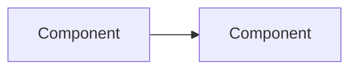

# Cursor Rules

## Project Context

Astro-based technical blog for experienced software professionals. Highly technical content with strict TypeScript.

**Full Documentation**: `llm_docs/` directory contains detailed guides:

- `content.md` - Content categories, schemas, frontmatter rules
- `content-guidelines.md` - Writing standards, research requirements, quality checklist
- `markdown-features.md` - Expressive Code features, Mermaid, KaTeX
- `code-standards.md` - TypeScript strictness, CSS minimalism, accessibility
- `commands.md` - Commands and draft workflow

## Content Operations

### Write Blog Workflow

When asked to "Write blog...", "Create article...", or "Write a deep-dive...":

1. **Research Phase**
   - Search for official documentation, specifications, RFCs
   - Find GitHub repositories and source code
   - Look for benchmarks and expert analyses
   - Cross-reference claims across sources

2. **Draft Structure**
   ```
   content/drafts/[slug]/
   ├── _meta.yaml       # target, tags, status
   ├── notes.md         # Research notes
   ├── outline.md       # Planned structure
   └── references.md    # All sources
   ```

3. **Required Content Elements**
   - Abstract paragraph (2-4 sentences setting context)
   - Overview mermaid diagram
   - Comprehensive TLDR with themed subsections
   - Main content with H2/H3 hierarchy
   - Code examples with collapse for boilerplate
   - References section

4. **Quality Checks**
   - All claims backed by references
   - Trade-offs explicitly discussed
   - Edge cases and failure modes covered
   - No common knowledge padding

### Review Blog Workflow

When asked to "Review blog...", "Audit article...", or "Check blog...":

1. **Locate and analyze** the article structure
2. **Fact-check** claims via web research
3. **Check required elements**: abstract, diagram, TLDR, references
4. **Assess depth**: Why explained? Trade-offs? Edge cases?
5. **Generate report** with issues and recommendations
6. **Apply fixes** if requested

## Essential Rules

### TypeScript (Strictest)

```typescript
// REQUIRED: Type-only imports
import type { Props } from "./types"

// REQUIRED: Explicit types
function process(data: InputData): OutputData {}

// NO: Implicit any
function bad(data) {} // Error
```

### Code Blocks - ALWAYS Collapse Boilerplate

````markdown
```ts title="src/api.ts" collapse={1-5} {8-10}
// Lines 1-5 collapsed (imports)
import { db } from "./db"
import { validate } from "./validate"
import type { User } from "./types"
import { logger } from "./logger"

// Lines 8-10 highlighted (key code)
async function createUser(data: UserInput): Promise<User> {
  const validated = validate(data)
  return db.users.create(validated)
}
```
````

### CSS - Minimalistic Only

```astro
<!-- GOOD: Tailwind utilities -->
<div class="flex gap-4 bg-white p-4 dark:bg-gray-900">
  <!-- BAD: Unnecessary wrappers -->
  <div class="outer-wrapper">
    <div class="inner-wrapper"></div>
  </div>
</div>
```

### Content Structure

```markdown
# Title (becomes frontmatter title)

Description paragraph(s) - sets context for the article.

<figure>



<figcaption>Overview diagram description</figcaption>

</figure>

## TLDR

**Concept** is [definition].

### Theme 1
- **Point 1**: Description
- **Point 2**: Description

## Table of Contents

## Section One

...
```

### File Naming

```
content/writing/category/YYYY-MM-DD-slug.md
content/writing/javascript/2024-03-15-event-loop.md
```

## Content Collections

| Collection | Subcategory Required | Type Field |
| ---------- | -------------------- | ---------- |
| writing    | No                   | No         |
| deep-dives | Yes (`category/sub`) | No         |
| work       | No                   | Optional   |
| uses       | No                   | No         |

## Writing Standards

### Audience
- Experienced software professionals (senior/staff/principal engineers)
- No explanations of common knowledge
- Production-quality code examples
- Real-world considerations

### Focus on Why
- Explain design rationale before implementation
- Discuss trade-offs explicitly
- Cover edge cases and failure modes

### Research Requirements
- Official specs (RFC, W3C, ECMA) > Official docs > Source code > Papers > Blogs
- Verify claims across multiple sources
- Include references section with all sources

## Performance Targets

- LCP < 2.5s
- CLS < 0.1
- INP < 200ms
- Static generation only
