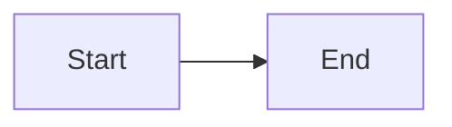

# Gemini Rules

## Project Overview

Astro technical blog for experienced software professionals. Strict TypeScript, static generation, Web Vitals optimized.

**Detailed Documentation**: Read `llm_docs/` for complete guidelines:

- `content.md` - Content schemas, categories, frontmatter
- `content-guidelines.md` - Writing standards, research requirements, quality checklist
- `markdown-features.md` - Code highlighting, diagrams, math
- `code-standards.md` - TypeScript, CSS, accessibility requirements
- `commands.md` - Commands and draft workflow

## Content Operations

### Write Blog Workflow

When asked to "Write blog...", "Create article...", or "Write a deep-dive...":

1. **Deep Research**
   - Search official documentation, specifications, RFCs
   - Find GitHub repositories and analyze source code
   - Look for benchmarks, expert blog posts, conference talks
   - Cross-reference and verify claims

2. **Create Draft**
   ```
   content/drafts/[slug]/
   ├── _meta.yaml       # target, tags, status
   ├── notes.md         # Research notes
   ├── outline.md       # Structure
   └── references.md    # Sources
   ```

3. **Required Elements**
   - Abstract (2-4 sentences)
   - Overview mermaid diagram
   - Comprehensive TLDR with subsections
   - Main content (H2/H3 hierarchy)
   - Code examples (collapse boilerplate)
   - References section

4. **Quality Standards**
   - Why before how (explain design rationale)
   - Trade-offs discussed explicitly
   - Edge cases and failure modes covered
   - No common knowledge padding
   - All claims backed by references

### Review Blog Workflow

When asked to "Review blog...", "Audit article...", or "Check blog...":

1. Locate article by path or topic
2. Fact-check claims via web research
3. Verify structure: abstract, diagram, TLDR, references
4. Assess depth and quality
5. Generate report with recommendations
6. Apply fixes if requested

## Core Requirements

### TypeScript

- Extends `astro/tsconfigs/strictest`
- No implicit `any`
- Use `import type` for types
- Explicit return types

### Content Structure

```markdown
# Title (auto-extracted)

Abstract paragraph - sets context.

<figure>



<figcaption>Overview diagram description</figcaption>

</figure>

## TLDR

**Concept** is [definition].

### Theme 1
- **Point 1**: Description
- **Point 2**: Description

## Table of Contents

## Main Section
...

## References
- [Source](url) - Description
```

### Code Blocks

**Critical**: Collapse irrelevant lines

````markdown
```ts title="file.ts" collapse={1-4, 15-20} {7-9}
// Collapsed imports
import { a } from "a"
import { b } from "b"
import type { C } from "c"

// Highlighted main code
function main(): Result {
  return process()
}

// Collapsed helpers (lines 15-20)
```
````

### CSS

- Tailwind utilities only
- Minimal custom CSS
- Dark mode via `dark:` variants

### Accessibility

- Semantic HTML
- Alt text required
- ARIA labels
- Keyboard navigation

## Collections

```
content/writing/         # Main articles
content/deep-dives/      # Educational (requires subcategory)
content/work/            # Design docs, case studies
content/uses/            # Tools, productivity
content/drafts/          # Draft workflow
```

## Frontmatter

```yaml
---
lastUpdatedOn: 2024-01-15 # Optional
tags:
  - tag-id # From tags.jsonc
subcategory: cat/subcat # deep-dives only
type: design-doc # work only (optional)
---
```

## Writing Standards

### Audience
- Senior/staff/principal engineers
- No common knowledge explanations
- Production-quality examples
- Real-world considerations

### Source Quality Hierarchy
1. Official specifications (RFC, W3C, ECMA)
2. Official documentation
3. Source code (GitHub)
4. Peer-reviewed papers
5. Expert technical blogs

## Performance

| Metric | Target  |
| ------ | ------- |
| LCP    | < 2.5s  |
| CLS    | < 0.1   |
| INP    | < 200ms |
