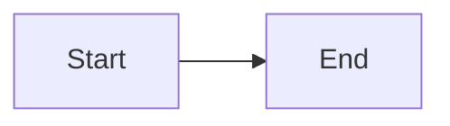

# Codex Instructions

## Project

Astro technical blog. Strict TypeScript. Static generation. Web Vitals optimized.

**Documentation**: See `llm_docs/` directory for detailed guides:

- `content.md` - Content schemas, categories, frontmatter
- `content-guidelines.md` - Writing standards, research requirements, quality checklist
- `markdown-features.md` - Expressive Code, Mermaid, KaTeX
- `code-standards.md` - TypeScript, CSS, accessibility
- `commands.md` - Commands and draft workflow

## Content Operations

### Write Blog Workflow

When asked to "Write blog...", "Create article...", or "Write a deep-dive...":

1. **Research**: Search official docs, specs, source code, benchmarks
2. **Draft**: Create in `content/drafts/[slug]/` with notes, outline, references
3. **Write**: Include abstract, overview diagram, TLDR, main content, references
4. **Quality**: Why explained, trade-offs discussed, edge cases covered, claims backed

### Review Blog Workflow

When asked to "Review blog...", "Audit article...", or "Check blog...":

1. Locate article by path or topic
2. Fact-check claims via research
3. Check structure: abstract, diagram, TLDR, references
4. Assess depth and accuracy
5. Generate report with recommendations
6. Apply fixes if requested

## Critical Rules

### TypeScript

- Strictest mode (`astro/tsconfigs/strictest`)
- `import type` for type-only imports
- No implicit `any`
- Explicit types required

### Content Structure

```markdown
# Title (auto-extracted)

Abstract paragraph - sets context.

<figure>



<figcaption>Overview diagram</figcaption>

</figure>

## TLDR

**Concept** is [definition].

### Theme 1
- **Point 1**: Description

## Table of Contents

## Main Content
...

## References
- [Source](url) - Description
```

### Code Blocks - Collapse Boilerplate

````markdown
```ts title="file.ts" collapse={1-3}
import { x } from "x"
import { y } from "y"
import type { Z } from "z"

function main() {
  // visible code
}
```
````

### CSS

- Tailwind utilities preferred
- Minimal custom styles
- `dark:` for dark mode

### Accessibility

- Semantic HTML
- Alt text on images
- ARIA where needed

## Structure

```
content/
├── writing/        # Articles
├── deep-dives/     # Educational (needs subcategory)
├── work/           # Design docs
├── uses/           # Tools
└── drafts/         # Draft workflow

llm_docs/           # Detailed documentation
```

## Frontmatter

```yaml
---
lastUpdatedOn: 2024-01-15
tags:
  - tag-id
subcategory: category/subcategory # deep-dives only
---
```

## Writing Standards

### Audience
- Senior/staff/principal engineers
- No common knowledge explanations
- Production-quality code
- Real-world considerations

### Quality Requirements
- Why before how (explain design rationale)
- Trade-offs discussed explicitly
- Edge cases and failure modes
- All claims backed by references

### Source Hierarchy
1. Official specs (RFC, W3C, ECMA)
2. Official documentation
3. Source code (GitHub)
4. Peer-reviewed papers
5. Expert blogs
