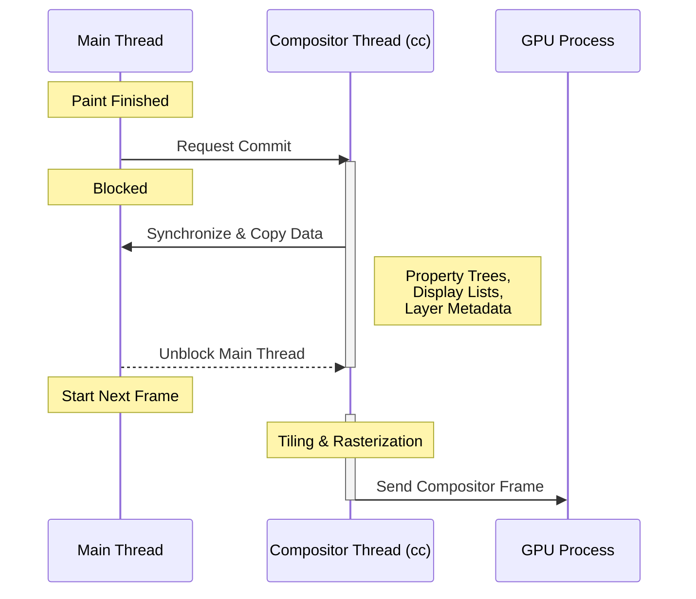

# Critical Rendering Path: Commit

Commit is the synchronization point where the Main Thread hands over the processed frame data to the Compositor Thread. It ensures that the compositor has an immutable, consistent snapshot of the page state required for tiling, rasterization, and final display.

<figure>

<figcaption>The Commit synchronization: A blocking handover of property trees and display lists from the Main Thread to the Compositor Thread.</figcaption>
</figure>

## TLDR

### Core Mechanism

- **Atomic Handoff**: A blocking operation where the Main Thread state is copied to the Compositor Thread (`cc`).
- **Data Payload**: Includes Property Trees (Transform, Clip, Effect, Scroll) and Display Lists.

### Performance Implications

- **Main Thread Blocking**: Commit duration directly impacts frame budget. Large layer counts or complex display lists increase sync time.
- **Pipelining**: Once commit finishes, the Main Thread is free to process the next frame while the Compositor handles rasterization.

---

## The Synchronization Point

The Commit stage is the boundary between the **Main Thread**, which handles the heavy lifting of DOM, CSS, and Layout, and the **Compositor Thread** (specifically the `cc` or Chrome Compositor), which manages the actual display.

Once the Main Thread has completed the **Paint** stage (recording drawing commands into Display Lists), it initiates a commit. This is a synchronous operation: the Main Thread blocks until the Compositor acknowledges and finishes copying the necessary data.

### Why Block?

Atomicity is the primary driver. If the Main Thread were allowed to continue modifying the DOM or Styles while the Compositor was reading them, the resulting frame could be inconsistent (e.g., a "half-moved" element). The commit ensures the compositor works with a stable, immutable snapshot.

## Data Transfer: Property Trees and Display Lists

Unlike legacy architectures that committed a full "Layer Tree," modern engines (RenderingNG) utilize **Property Trees**. This decoupling significantly reduces the overhead of the commit.

1.  **Property Trees**: Four distinct trees (Transform, Clip, Effect, and Scroll) that describe the spatial and visual relationships of the page.
2.  **Layer Metadata**: Information about promoted layers, including their bounds and associated property tree nodes.
3.  **Display Lists**: The actual recording of paint ops. These are shared via `cc::DisplayItemList`, allowing the compositor to rasterize them later.

### Real-World Example: Layer Promotion

Using `will-change: transform` or `opacity` prompts the engine to promote an element to its own layer. During commit, this metadata is transferred. If a site has thousands of layers (e.g., a complex data visualization without virtualization), the "Layer Metadata" portion of the commit can become a bottleneck, leading to increased **Presentation Delay**.

## Performance and Failure Modes

Commit time is a common source of **Interaction to Next Paint (INP)** issues.

- **Commit Jank**: If the main thread is busy with a long-running task, the commit is delayed. Conversely, if the commit itself takes >5ms (due to massive data transfer), it steals time from the 16.6ms (at 60Hz) frame budget.
- **Main Thread Contention**: Since the main thread is blocked, any delay in the compositor's ability to receive the commit (e.g., if the compositor is overwhelmed by rasterization tasks) back-pressures the main thread.

### Historical Evolution: BlinkGenPropertyTrees

Before `BlinkGenPropertyTrees`, the commit was tightly coupled to the Layer Tree. Moving a single element often required a full recursive walk of the layer hierarchy to update positions. Property trees moved this logic into a flat structure where updates are $O(1)$ or $O(\text{tree depth})$ rather than $O(\text{total layers})$, vastly improving commit efficiency for complex pages.

---

## Conclusion

The Commit stage is the "baton pass" of the rendering pipeline. While it introduces a mandatory sync point, its design in modern engines ensures that the Main Thread can be unblocked as quickly as possible, enabling the parallel execution of script/layout and rasterization.

---

## Appendix

### Prerequisites

- Understanding of **Main Thread vs. Compositor Thread** responsibilities.
- Familiarity with the **Paint** stage (Display Lists vs. Bitmaps).

### Terminology

- **cc (Chrome Compositor)**: The multi-threaded system in Chromium that handles animation, input, and frame production.
- **Property Trees**: Specialized data structures that isolate transforms, clips, effects, and scroll offsets from the layout tree.
- **Atomicity**: The property of a system where an operation either happens completely or not at all, preventing partial states.
- **INP (Interaction to Next Paint)**: A Core Web Vital measuring responsiveness to user interactions.

### Summary

- Commit is the blocking handover from Main Thread to Compositor.
- It transfers Property Trees and Display Lists to ensure rendering consistency.
- It enables pipelining: Main Thread works on frame $N+1$ while Compositor rasterizes frame $N$.
- Excessive layer counts or complex styles can inflate commit time and cause jank.

### References

- [Chromium: How cc Works - Commit](https://chromium.googlesource.com/chromium/src/+/master/docs/how_cc_works.md#Commit)
- [Chrome Developers: RenderingNG Architecture](https://developer.chrome.com/docs/chromium/renderingng-architecture)
- [W3C: CSS Will-Change Level 1](https://www.w3.org/TR/css-will-change-1/)
- [web.dev: Interaction to Next Paint (INP)](https://web.dev/articles/inp)
