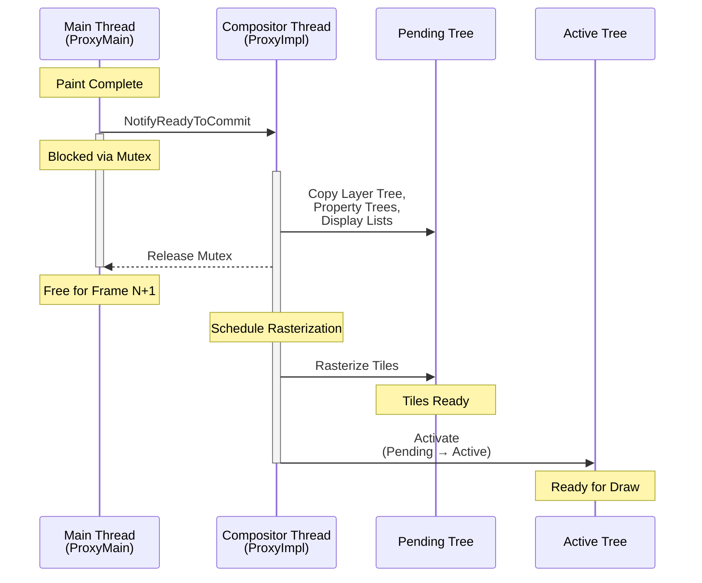

# Critical Rendering Path: Commit

Commit is the synchronization point where the Main Thread hands over processed frame data to the Compositor Thread. This blocking operation ensures the compositor receives an immutable, consistent snapshot of property trees and display lists—enabling the dual-tree architecture that allows rasterization to proceed independently while the main thread prepares the next frame.

<figure>



<figcaption>The Commit synchronization: ProxyMain blocks via mutex while ProxyImpl copies data structures to the pending tree. After commit, the main thread can process the next frame while rasterization proceeds on the pending tree.</figcaption>
</figure>

## Abstract

Commit is the **atomic handoff** from Main Thread to Compositor Thread—a blocking synchronization that enables Chromium's dual-tree architecture.

**The Core Model:**

- **Why blocking?** Atomicity. Multiple JavaScript modifications within a single call stack must appear as a unified frame update. Non-blocking IPC (Inter-Process Communication) would risk partial state transfer (a "half-moved" element).
- **What transfers?** Four property trees (transform, clip, effect, scroll), layer metadata, and display lists. Each DOM element's **PropertyTreeState**—a 4-tuple referencing nodes in each tree—gets synchronized to compositor-side structures.
- **Threading constraint:** Main thread can block waiting on compositor thread, but the reverse is forbidden (prevents deadlocks). This asymmetry is enforced via `DCHECK`s in `ProxyMain` and `ProxyImpl`.

**The Pipeline Flow:**

```
BeginImplFrame → BeginMainFrame → [Main Thread Work] → ReadyToCommit → Commit → Activate → Draw
```

**Dual-Tree Purpose:**

- **Pending Tree**: Receives commits; rasterizes new content
- **Active Tree**: Currently displayed; handles animations and scroll input while pending tree rasterizes

Activation (pending → active) occurs only when sufficient tiles are rasterized, preventing checkerboard artifacts. A second commit cannot start until the pending tree activates—this back-pressure mechanism bounds pipeline depth.

**Performance:** Commits typically take 1-3ms. Durations exceeding 5ms consume significant frame budget (16.6ms at 60Hz) and indicate excessive layer count or complex display lists.

---

## The Synchronization Mechanism

The commit is not a simple data copy—it's a carefully orchestrated synchronization using Chromium's proxy pattern.

### The Proxy Architecture

Chromium's compositor uses two proxy objects to mediate between threads:

| Component             | Thread            | Responsibilities                                                                                   |
| :-------------------- | :---------------- | :------------------------------------------------------------------------------------------------- |
| **ProxyMain**         | Main Thread       | Owns `LayerTreeHost`; sends `NotifyReadyToCommit`; enforces thread-safety via accessor `DCHECK`s   |
| **ProxyImpl**         | Compositor Thread | Owns pending/active trees; performs the actual data copy during commit; controls activation timing |
| **SingleThreadProxy** | Both (fallback)   | Used when compositor runs on main thread (non-threaded mode)                                       |

The proxy pattern enforces a critical invariant: **ProxyImpl only accesses main-thread data structures when the main thread is blocked**. This eliminates the need for fine-grained locking on individual layer properties.

### The Commit Flow in Detail

1. **Main thread completes paint**: Blink finishes style recalculation, layout, and paint recording. The `LayerTreeHost` holds the new frame's property trees and display lists.

2. **ProxyMain sends `NotifyReadyToCommit`**: This synchronous message passes a **mutex** to the compositor thread. The main thread then waits on this mutex—it cannot proceed until the compositor releases it.

3. **Compositor thread schedules commit**: The `SchedulerStateMachine` (which manages pipeline state) determines when to execute `ScheduledActionCommit`. If rasterization from a previous frame is still in progress, commit may be delayed.

4. **ProxyImpl performs the copy**: Layer IDs are used to match main-thread layers to their pending-tree counterparts:
   - Layer 5 on main thread pushes to layer 5 on pending tree
   - `pushPropertiesTo()` recursively synchronizes property tree nodes
   - Display lists (`cc::PaintRecord`) are shared (copy-on-write semantics)

5. **Mutex released**: ProxyImpl signals completion. The main thread unblocks and can immediately begin processing the next frame's JavaScript, style, and layout.

### Why Block the Main Thread?

The blocking behavior is intentional and addresses several constraints:

**Atomicity Guarantee**: JavaScript often makes multiple DOM modifications in a single event handler:

```javascript
element.style.transform = "translateX(100px)"
element.style.opacity = "0.5"
element.style.backgroundColor = "red"
```

Without atomic commit, the compositor might receive transform and opacity changes but miss the background change—producing a visually inconsistent frame. The blocking commit ensures all modifications within a call stack appear together.

**Thread Safety Without Locking**: Alternative designs could use per-property locks or lock-free data structures, but these add complexity and overhead. Blocking for a few milliseconds is acceptable because:

- Commits are fast (typically <3ms)
- The main thread was already idle (waiting for vsync)
- Immediate release enables main thread to start frame N+1 while compositor rasterizes frame N

**Historical Context**: Early Chrome versions attempted non-blocking commits with complex synchronization. The blocking model proved simpler and more predictable, with minimal performance penalty for typical workloads.

---

## Data Transfer: Property Trees

The property tree architecture is central to efficient commits. Rather than transferring a monolithic "layer tree" with entangled spatial relationships, Chromium uses four independent trees.

### The Four Property Trees

| Tree          | Node Type       | What It Represents                              | Example CSS                                 |
| :------------ | :-------------- | :---------------------------------------------- | :------------------------------------------ |
| **Transform** | `TransformNode` | 2D transform matrices, including scroll offsets | `transform`, `translate`, scroll containers |
| **Clip**      | `ClipNode`      | Rectangular clip regions                        | `overflow: hidden`, `clip-path`             |
| **Effect**    | `EffectNode`    | Opacity, filters, blend modes, masks            | `opacity`, `filter`, `mix-blend-mode`       |
| **Scroll**    | `ScrollNode`    | Scroll behavior and offset synchronization      | `overflow: scroll`, scroll containers       |

Each DOM element receives a **PropertyTreeState**—a 4-tuple of node IDs `(transform_id, clip_id, effect_id, scroll_id)`. This design decouples spatial relationships from the DOM hierarchy.

### Why Property Trees Improve Commit

**Before property trees (legacy architecture):** The compositor received a "Layer Tree" where each layer encoded its position relative to ancestors. Moving an element required:

1. Updating the layer's position
2. Walking all descendant layers to recalculate their world-space positions
3. Complexity: $O(\text{total layers})$ per change

**With property trees:** Transform changes update only the affected `TransformNode`. Descendant elements reference this node by ID; their world-space transforms are computed lazily by walking from node to root.

- Complexity: $O(\text{tree depth})$ per change
- Typical tree depth: 5-10 levels, even on complex pages

**Real-world impact**: A page with 1,000 promoted layers and a transform animation on a container:

- Legacy: ~1,000 layer updates per frame
- Property trees: 1 transform node update, descendants computed on demand

### PropertyTreeState and Paint Chunks

During the [Paint](../crp-paint/README.md) stage, display items are grouped into **paint chunks** based on their PropertyTreeState. Adjacent display items with identical `(transform_id, clip_id, effect_id, scroll_id)` share a chunk.

During commit:

1. Blink's property trees are converted to `cc` property trees
2. Paint chunks reference property tree nodes by ID
3. The compositor can apply transforms/effects without re-rasterizing—just update the node and recomposite

This separation is why `transform` and `opacity` animations don't require re-paint or re-rasterization: only the property tree node value changes.

---

## The Dual-Tree Architecture

Commit doesn't push directly to the "active" tree that's currently being displayed. Instead, it targets the **pending tree**—a staging area that allows rasterization to proceed without visual artifacts.

### Pending vs. Active Trees

| Tree             | Purpose                                                | Updated By |
| :--------------- | :----------------------------------------------------- | :--------- |
| **Pending Tree** | Receives new commits; tiles are rasterized here        | Commit     |
| **Active Tree**  | Currently displayed; handles animations, scroll, input | Activation |
| **Recycle Tree** | Cached for allocation reuse (optional)                 | Tree swap  |

**Why two trees?** Without this separation, committing a new frame would immediately expose partially-rasterized content. Users would see **checkerboard artifacts**—empty rectangles where tiles haven't finished rasterizing.

The dual-tree design ensures:

1. Commit populates the pending tree
2. `TileManager` schedules rasterization for pending tree tiles
3. Activation proceeds only when viewport tiles are ready
4. Active tree continues handling scroll/animation during rasterization

### Activation and Blocking

Activation (`pending → active`) is the second critical synchronization point. The `SchedulerStateMachine` tracks:

- Which tiles are required for the current viewport ("NOW" priority)
- Whether rasterization has completed for required tiles
- Whether a new commit is waiting

**Key constraint**: A second commit cannot begin while a pending tree exists. If the main thread calls `NotifyReadyToCommit` before activation:

1. ProxyMain blocks at the mutex
2. Compositor completes current rasterization
3. Activation occurs (pending → active)
4. Pending tree becomes empty
5. Commit proceeds to new pending tree
6. ProxyMain unblocks

This mechanism bounds pipeline depth to two frames: active tree displaying frame N while pending tree rasterizes frame N+1.

### Back-Pressure and Frame Pacing

The activation requirement creates **back-pressure**: if rasterization is slow, commits wait. This prevents unbounded queue growth but can cause jank if commit waits exceed frame budget.

**Symptoms of back-pressure:**

- Main thread stalls in DevTools flame chart with "Commit" marker
- Input events appear delayed (INP degradation)
- `PipelineReporter` traces show "Waiting for activation"

**Common causes:**

- Too many compositor layers (memory pressure)
- Complex display lists (slow rasterization)
- GPU driver issues (slow tile upload)

---

## Performance Characteristics

Commit duration directly impacts frame timing. Understanding what contributes to commit cost helps diagnose performance issues.

### What Takes Time During Commit

| Phase                          | Typical Cost | What Increases It                         |
| :----------------------------- | :----------- | :---------------------------------------- |
| **Property tree sync**         | <1ms         | Deep nesting, many effect/clip nodes      |
| **Layer metadata copy**        | 0.5-2ms      | High layer count (>100 layers)            |
| **Display list serialization** | 0.5-3ms      | Large display lists, complex paint chunks |
| **Mutex acquisition**          | <0.1ms       | Compositor busy with previous frame       |

**Typical total**: 1-3ms for most pages. Exceeding 5ms indicates a problem.

### Measurement with DevTools

Chrome DevTools and tracing tools expose commit metrics:

1. **Performance panel**: Look for "Commit" blocks in the main thread flame chart
2. **`chrome://tracing`**: Record with "cc" category; `PipelineReporter` events show commit duration and breakdown
3. **Lighthouse**: Excessive commit times manifest as "Long Tasks" and INP (Interaction to Next Paint) issues

**What to look for in `PipelineReporter`:**

```
PipelineReporter::StageType::kBeginImplFrame → ... → kCommit → kActivation → kDraw
```

The `kCommit` stage duration shows how long the main thread was blocked.

### Failure Modes

**Commit Jank**: Commit takes >5ms, consuming frame budget:

- _Cause_: Excessive layer count, complex property trees
- _Symptom_: Dropped frames during animations even when JavaScript is fast
- _Fix_: Reduce promoted layers, simplify DOM structure

**Commit Starvation**: Main thread is busy with JavaScript, delaying commit:

- _Cause_: Long-running tasks block `requestAnimationFrame` callback
- _Symptom_: Animations skip frames; INP degradation
- _Fix_: Break up long tasks; use `scheduler.yield()`

**Activation Blocking**: Commit waits for previous frame's activation:

- _Cause_: Slow rasterization (memory pressure, GPU issues)
- _Symptom_: Main thread "Commit" blocks extend unexpectedly
- _Fix_: Reduce layer count; simplify rasterization workload

**PropertyTreeState Explosion**: Many unique property tree states create many paint chunks:

- _Cause_: Deeply nested transforms, clips, effects
- _Symptom_: High "Layer metadata copy" time
- _Fix_: Flatten DOM structure; avoid unnecessary `isolation: isolate`

---

## Historical Evolution

Understanding how commit evolved clarifies current design decisions.

### Pre-BlinkGenPropertyTrees Era

Before 2017, Blink generated "Layer Trees" that encoded hierarchical relationships directly. The compositor received layers with:

- Absolute positions (computed from ancestor chain)
- Explicit parent-child relationships
- Transform/clip inheritance baked into layer data

**Problems:**

1. Moving an element required updating all descendants
2. Scroll offsets were mixed with transforms, complicating fast-path scroll
3. Layer tree modifications triggered expensive recursive walks
4. The boundary between Blink and `cc` was poorly defined

### BlinkGenPropertyTrees (2017-2019)

BlinkGenPropertyTrees restructured the commit boundary:

- Blink generates property trees with explicit nodes for each transform/clip/effect
- Elements reference nodes by ID, not by hierarchy
- `cc` receives property trees and reconstructs spatial relationships

**Benefits:**

- Transform updates: $O(\text{tree depth})$ instead of $O(\text{total layers})$
- Cleaner Blink/cc interface
- Enabled CompositeAfterPaint

### CompositeAfterPaint (2019-2021, shipped M94)

CompositeAfterPaint moved layer decisions _after_ paint:

```
Legacy:     Style → Layout → Compositing → Paint
Modern:     Style → Layout → Prepaint → Paint → Layerize → Commit → Raster
```

**Impact on commit:**

- Commit receives paint artifacts (display lists + paint chunks) rather than pre-layerized content
- Layer decisions happen in `cc` based on paint output
- Eliminated 22,000 lines of heuristic code
- 3.5% improvement in 99th percentile scroll latency

### Current Architecture (2024+)

The modern commit transfers:

1. **Property trees**: Four trees converted from Blink structures to `cc` nodes
2. **Paint artifacts**: Display items grouped into paint chunks by PropertyTreeState
3. **Layer metadata**: Bounds, compositing reasons, scrollability flags

The `cc` layer tree is derived from paint chunks during layerization, not committed directly from Blink.

---

## Optimization Strategies

Reducing commit duration improves frame timing and INP.

### Reduce Layer Count

Each compositor layer adds metadata copy overhead:

```css
/* ❌ Forces layer promotion for every item */
.list-item {
  will-change: transform;
}

/* ✅ Promote only during animation */
.list-item.animating {
  will-change: transform;
}
```

**Target**: Keep promoted layer count under 100 for typical pages.

### Simplify Property Tree Structure

Deep nesting creates tall property trees:

```html
<!-- ❌ Deep nesting = tall property trees -->
<div style="transform: translate(10px)">
  <div style="opacity: 0.9">
    <div style="filter: blur(1px)">
      <div style="clip-path: circle()">
        <!-- content -->
      </div>
    </div>
  </div>
</div>

<!-- ✅ Flattened = shorter property tree paths -->
<div style="transform: translate(10px); opacity: 0.9; filter: blur(1px)">
  <!-- content with clip-path applied directly -->
</div>
```

### Avoid Unnecessary Stacking Contexts

Properties that create stacking contexts also create effect nodes:

```css
/* ❌ Unnecessary stacking context */
.container {
  position: relative;
  z-index: 1; /* Creates stacking context */
}

/* ✅ Only when actually needed */
.container {
  position: relative;
  /* z-index: auto = no stacking context */
}
```

### Use `contain: strict` for Isolated Widgets

Content containment hints to the browser that subtree changes don't affect layout outside:

```css
.widget {
  contain: strict; /* layout + paint + size containment */
}
```

This can reduce property tree propagation during commit.

---

## Conclusion

Commit is the atomic handoff that enables Chromium's pipelined rendering architecture. The blocking synchronization, while counterintuitive, is the simplest correct solution for ensuring frame consistency without per-property locking.

Key takeaways:

1. **Blocking is intentional**: Ensures atomicity; complexity of lock-free alternatives outweighs the few milliseconds of blocking
2. **Property trees enable efficiency**: $O(\text{tree depth})$ updates instead of $O(\text{total layers})$
3. **Dual-tree architecture prevents artifacts**: Pending tree rasterizes while active tree displays
4. **Back-pressure bounds pipeline depth**: Second commit waits for activation, preventing unbounded queue growth
5. **Commit duration impacts INP**: Exceeding 5ms consumes significant frame budget

For production optimization: minimize layer count, flatten property tree structure, and use DevTools tracing to identify commit bottlenecks when animations or interactions feel sluggish.

---

## Appendix

### Prerequisites

- [Paint Stage](../crp-paint/README.md): Understanding display lists and paint chunks
- [Rasterization](../crp-raster/README.md): How tiles are prioritized and rasterized
- [Compositing](../crp-composit/README.md): How compositor layers are assembled
- Thread synchronization concepts (mutex, blocking calls)

### Terminology

| Term                                | Definition                                                                                      |
| :---------------------------------- | :---------------------------------------------------------------------------------------------- |
| **cc (Chrome Compositor)**          | Multi-threaded system in Chromium handling animation, input, scrolling, and frame production    |
| **ProxyMain**                       | Main-thread component that owns `LayerTreeHost` and initiates commits                           |
| **ProxyImpl**                       | Compositor-thread component that owns pending/active trees and performs commit data copy        |
| **Property Trees**                  | Four specialized trees (transform, clip, effect, scroll) isolating spatial/visual relationships |
| **PropertyTreeState**               | 4-tuple `(transform_id, clip_id, effect_id, scroll_id)` identifying an element's visual context |
| **Pending Tree**                    | Staging tree receiving commits; tiles rasterized here before activation                         |
| **Active Tree**                     | Currently-displayed tree; handles animations and input while pending tree rasterizes            |
| **Activation**                      | Process of swapping pending tree to active after sufficient rasterization                       |
| **SchedulerStateMachine**           | Component managing pipeline state transitions (commit, activate, draw)                          |
| **INP (Interaction to Next Paint)** | Core Web Vital measuring responsiveness from user input to visual update                        |
| **BlinkGenPropertyTrees**           | Architecture where Blink generates property trees rather than compositor layer hierarchies      |
| **CompositeAfterPaint**             | Architecture (M94+) where layer decisions occur after paint, not before                         |

### Summary

- Commit is a **blocking synchronization** where ProxyMain passes a mutex to ProxyImpl
- **Atomicity** ensures multiple JavaScript modifications appear as a unified frame update
- **Property trees** (transform, clip, effect, scroll) enable $O(\text{tree depth})$ updates
- **Dual-tree architecture** (pending/active) prevents checkerboard artifacts during rasterization
- **Activation** gates second commit: pipeline depth bounded to two frames
- Typical commit duration: **1-3ms**; exceeding 5ms indicates performance issues
- **BlinkGenPropertyTrees** and **CompositeAfterPaint** dramatically improved commit efficiency
- Optimize by reducing layer count, flattening property trees, and avoiding unnecessary stacking contexts

### References

- [Chromium: How cc Works](https://chromium.googlesource.com/chromium/src/+/HEAD/docs/how_cc_works.md) — Definitive guide to Chrome's compositor architecture, including commit and activation
- [Chromium: Life of a Frame](https://chromium.googlesource.com/chromium/src/+/HEAD/docs/life_of_a_frame.md) — End-to-end frame pipeline including commit timing
- [Chromium: RenderingNG Architecture](https://developer.chrome.com/docs/chromium/renderingng-architecture) — Property trees, threading model, and process architecture
- [Chromium: RenderingNG Data Structures](https://developer.chrome.com/docs/chromium/renderingng-data-structures) — Property tree structure and PropertyTreeState semantics
- [Chromium: BlinkNG](https://developer.chrome.com/docs/chromium/blinkng) — BlinkGenPropertyTrees and CompositeAfterPaint evolution
- [Chromium: Compositor Thread Architecture](https://www.chromium.org/developers/design-documents/compositor-thread-architecture/) — Threading model and synchronization design
- [Chromium: cc README](https://chromium.googlesource.com/chromium/src/+/HEAD/cc/README.md) — Compositor implementation overview
- [W3C: CSS Will-Change Level 1](https://www.w3.org/TR/css-will-change-1/) — Specification for layer promotion hints
- [W3C: CSS Containment Module Level 2](https://www.w3.org/TR/css-contain-2/) — Containment specification for optimization
- [web.dev: Interaction to Next Paint (INP)](https://web.dev/articles/inp) — Core Web Vital impacted by commit timing
