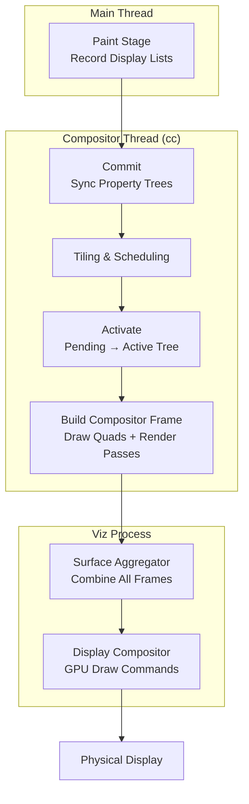

# Critical Rendering Path: Compositing

How the compositor thread assembles rasterized layers into compositor frames and coordinates with the Viz process to display the final pixels on screen.

<figure>



<figcaption>The compositing pipeline: the main thread commits property trees to the compositor thread, which builds compositor frames sent to Viz for final display.</figcaption>
</figure>

## Abstract

Compositing solves a fundamental constraint: the main thread cannot simultaneously execute JavaScript and produce visual updates. Chromium's solution is a multi-threaded architecture where the **compositor thread** (`cc`) operates independently, enabling smooth scrolling and animations even when JavaScript blocks the main thread.

**Core mental model:**

```
Main Thread Tree (authoritative) → Commit → Pending Tree → Activate → Active Tree → Compositor Frame → Viz
       ↑                                        ↑ rasterization          ↑ drawing
       │                                        │ must complete          │ always responsive
       └── Writes only ──────────────────────── └── Never blocks ────────┘
```

The key architectural decisions:

| Decision                         | Why It Exists                                            | What It Enables                                                          |
| :------------------------------- | :------------------------------------------------------- | :----------------------------------------------------------------------- |
| **Two-tree architecture**        | Main thread edits shouldn't affect in-progress rendering | Main thread can prepare frame N+1 while compositor draws frame N         |
| **Property trees (4 types)**     | Flattened structure for O(1) lookups                     | Fast transform, clip, effect, scroll calculations without tree traversal |
| **Compositor-driven animations** | `transform`/`opacity` don't require layout               | 60fps animations independent of main thread load                         |
| **Async input routing**          | Scroll events handled before reaching main thread        | Responsive scrolling during JavaScript execution                         |

The compositor thread **never** makes blocking calls to the main thread—this one-directional dependency is what guarantees responsiveness.

---

## The Chrome Compositor (cc)

The **cc** component (Chrome Compositor) is Chromium's multi-threaded compositing system. It runs in both the renderer process (where Blink is the client) and the browser process (for UI compositing).

### Architecture Overview

```
┌─────────────────────────────────────────────────────────────────┐
│                      Renderer Process                            │
├─────────────────────────────────────────────────────────────────┤
│  Main Thread                    │  Compositor Thread (cc)        │
│  ────────────────────           │  ──────────────────────        │
│  • LayerTreeHost                │  • LayerTreeHostImpl           │
│  • Layer (public API)           │  • LayerImpl (internal)        │
│  • Property trees (source)      │  • Property trees (copy)       │
│                                 │  • TileManager                 │
│         │                       │  • Scheduler                   │
│         │ Commit (blocking)     │         │                      │
│         └──────────────────────▶│         │                      │
│                                 │         ▼                      │
│                                 │  CompositorFrame               │
│                                 │         │                      │
└─────────────────────────────────┼─────────┼──────────────────────┘
                                  │         │ IPC
                                  │         ▼
                        ┌─────────┴─────────────────────────────────┐
                        │              Viz Process                   │
                        │  • SurfaceManager                          │
                        │  • SurfaceAggregator                       │
                        │  • Display Compositor                      │
                        └───────────────────────────────────────────┘
```

The public API (`LayerTreeHost`, `Layer`) lives on the main thread. Embedders create layers, set properties, and request commits. The internal implementation (`LayerTreeHostImpl`, `LayerImpl`) lives on the compositor thread and handles the actual rendering work.

### The Three-Tree System

Chromium maintains three layer trees to decouple content updates from display:

| Tree                 | Location          | Purpose                                                    |
| :------------------- | :---------------- | :--------------------------------------------------------- |
| **Main Thread Tree** | Main thread       | Authoritative source; updated by JavaScript, style, layout |
| **Pending Tree**     | Compositor thread | Staging area for new commits; tiles rasterize here         |
| **Active Tree**      | Compositor thread | Currently being displayed; source for compositor frames    |

A fourth tree, the **Recycle Tree**, caches the previous pending tree to optimize memory allocation.

**Why three trees?** Without this separation:

- Commits would block until rasterization completes (frames would drop)
- Partially-rasterized content would be visible (checkerboard artifacts)
- Main thread couldn't prepare the next frame while the current one renders

### The Commit Operation

The [Commit](../crp-commit/README.md) synchronizes the main thread tree to the pending tree. This is a **blocking operation**: the main thread pauses while the compositor copies:

1. **Property trees** (transform, clip, effect, scroll)
2. **Layer metadata** (bounds, property tree node IDs)
3. **Display lists** (paint records for rasterization)

Once commit completes, the main thread resumes and can immediately begin preparing the next frame.

### Activation

When tiles in the pending tree are sufficiently rasterized, **activation** occurs: the pending tree becomes the new active tree. The `TileManager` controls this timing—activation only proceeds when "NOW" priority tiles (visible in viewport) are ready.

> **Design rationale**: Activation is the safety valve preventing checkerboard. If rasterization falls behind, activation delays rather than showing incomplete content.

---

## Property Trees

Property trees are the modern replacement for hierarchical layer transforms. Instead of walking the entire layer tree to compute a node's final transform, each layer stores **node IDs** pointing into separate trees.

### The Four Trees

| Tree          | Contents                         | Example Properties                            |
| :------------ | :------------------------------- | :-------------------------------------------- |
| **Transform** | 2D/3D transforms, scroll offsets | `transform`, `translate3d()`, scroll position |
| **Clip**      | Overflow clips, clip-path        | `overflow: hidden`, `clip-path`               |
| **Effect**    | Visual effects                   | `opacity`, `filter`, `mix-blend-mode`, `mask` |
| **Scroll**    | Scroll metadata                  | Scroll chain relationships, scroll bounds     |

### Why Property Trees?

Consider computing the screen-space transform for a deeply nested element:

**Legacy approach (layer tree traversal):**

```
transform = identity
for each ancestor from root to element:
    transform = transform × ancestor.localTransform
// O(depth) per element, O(depth × layers) total
```

**Property trees approach:**

```
transformNode = propertyTrees.transform[element.transformNodeId]
transform = transformNode.cachedScreenSpaceTransform
// O(1) lookup
```

Property trees cache computed values at each node. When a transform changes, only affected nodes recompute—not the entire tree. This makes updates **O(interesting nodes)** instead of **O(total layers)**.

### Real-World Impact

A complex page with 1000+ layers (data visualization, infinite scroll) would see catastrophic commit times with layer tree traversal. Property trees keep commit times bounded regardless of layer count—critical for maintaining 60fps.

---

## Compositor Frames

The compositor thread produces **CompositorFrames**, the data structure that travels to Viz for display. A frame is not a bitmap—it's a structured description of what to draw.

### Frame Structure

```
CompositorFrame
├── metadata
│   ├── device_scale_factor
│   ├── frame_token (for timing)
│   └── begin_frame_ack
├── RenderPass[] (from back to front)
│   └── RenderPass
│       ├── id
│       ├── output_rect
│       ├── damage_rect
│       └── DrawQuad[] (drawing primitives)
└── resource_list (texture references)
```

### Draw Quads

Draw quads are the atomic drawing primitives:

| Quad Type            | Purpose                       | Example                 |
| :------------------- | :---------------------------- | :---------------------- |
| `TextureDrawQuad`    | Rasterized tile               | Layer content           |
| `SolidColorDrawQuad` | Color fill                    | Backgrounds, fallbacks  |
| `SurfaceDrawQuad`    | Reference to another surface  | Cross-origin iframe     |
| `TileDrawQuad`       | Single tile of tiled layer    | Large scrolling content |
| `VideoDrawQuad`      | Video frame                   | `<video>` element       |
| `RenderPassDrawQuad` | Output of another render pass | CSS filter result       |

Each quad carries geometry (transform, destination rect, clip), material properties (texture ID, blend mode), and layer information for z-ordering.

### Render Passes

When content requires intermediate textures, multiple **render passes** are used:

| Effect             | Why Intermediate Pass Required                                          |
| :----------------- | :---------------------------------------------------------------------- |
| `filter: blur()`   | Must render content to texture, then apply blur kernel                  |
| `opacity` on group | Children blend with each other first, then group blends with background |
| `mix-blend-mode`   | Requires reading pixels from underlying content                         |

Each additional render pass adds GPU overhead (texture allocation, state changes, draw calls). This is why `filter` and `mix-blend-mode` are more expensive than `transform` and `opacity`.

---

## Compositor Thread Responsibilities

The compositor thread (`LayerTreeHostImpl`) handles four critical functions that must remain responsive regardless of main thread state:

### 1. Input Routing

Scroll and touch events are intercepted **before** reaching the main thread. The compositor implements `InputHandler`, allowing it to:

- Apply scroll offsets immediately to the active tree's property trees
- Handle pinch-zoom by modifying viewport scale
- Route events to the main thread only when necessary (event listeners, non-composited scrollers)

**Design rationale**: If scroll events went to the main thread first, a blocked main thread would freeze scrolling. By routing input through the compositor, scrolling remains responsive during heavy JavaScript execution.

### 2. Compositor-Driven Animations

Animations targeting `transform`, `opacity`, or `filter` can run entirely on the compositor thread:

```css
/* Compositor-driven: runs on compositor thread */
.smooth {
  transition:
    transform 0.3s,
    opacity 0.3s;
}

/* Main-thread required: triggers layout */
.janky {
  transition:
    left 0.3s,
    width 0.3s;
}
```

The animation system works by:

1. Main thread creates animation, marks element for promotion
2. Animation metadata copies to compositor during commit
3. Compositor thread ticks animation each frame, updating property tree values
4. GPU re-composites existing textures with new transform/opacity

No re-layout, no re-paint, no re-raster—the textures already exist.

### 3. Tile Management

The `TileManager` orchestrates rasterization across worker threads:

| Priority Bin | Criteria                    | Treatment                       |
| :----------- | :-------------------------- | :------------------------------ |
| NOW          | Visible in viewport         | Must complete before activation |
| SOON         | Within ~1 viewport distance | Prevents checkerboard on scroll |
| EVENTUALLY   | Further from viewport       | Rasterized when idle            |
| NEVER        | Off-screen, no scroll path  | Skipped entirely                |

Scroll velocity affects binning—fast scrolls expand the "SOON" radius to pre-rasterize more content ahead of the scroll direction.

### 4. Frame Scheduling

The `Scheduler` coordinates the rendering pipeline, managing:

- **BeginFrame** signals from Viz (VSync-aligned)
- **BeginMainFrame** requests to the main thread
- Activation timing based on tile readiness
- Frame submission deadlines

---

## What Stays Responsive During Main Thread Blocks

The compositor thread handles these operations **independently**, meaning they continue during heavy JavaScript execution:

```javascript collapse={1-2}
// Example: 3-second main thread block
button.addEventListener("click", () => {
  const start = Date.now()
  while (Date.now() - start < 3000) {} // Busy loop
  console.log("Done!")
})
```

**Compositor-handled (still works):**

| Behavior                   | Why It Works                             | Caveat                                            |
| :------------------------- | :--------------------------------------- | :------------------------------------------------ |
| **Page scrolling**         | Compositor handles scroll position       | Scroll event listeners won't fire until unblocked |
| **Pinch-to-zoom**          | Compositor modifies viewport transform   | —                                                 |
| **`transform` animations** | Compositor updates transform node values | Only for promoted layers                          |
| **`opacity` animations**   | Compositor updates effect node values    | Only for promoted layers                          |
| **Video playback**         | Decoded in separate process              | Seeking may need main thread                      |
| **OffscreenCanvas**        | Rendering on worker thread               | Requires explicit setup                           |

**Main-thread-dependent (blocked):**

| Behavior                     | Why It's Blocked                             |
| :--------------------------- | :------------------------------------------- |
| Click/touch handlers         | Event dispatch runs on main thread           |
| Hover state changes          | Requires style recalculation                 |
| Layout-triggering animations | `left`, `top`, `width`, `margin` need layout |
| Text selection               | Main thread hit testing                      |
| Form input                   | Main thread event handling                   |
| `requestAnimationFrame`      | Callbacks run on main thread                 |

### Compositor-Only vs Main-Thread Animations

```css
/* ✅ Compositor-only: runs during JS execution */
.smooth-spinner {
  animation: spin 1s linear infinite;
}
@keyframes spin {
  to {
    transform: rotate(360deg);
  }
}

/* ❌ Main-thread required: freezes during JS execution */
.janky-spinner {
  animation: slide 1s linear infinite;
}
@keyframes slide {
  to {
    margin-left: 100px;
  } /* Layout property */
}
```

The `transform` animation updates a property tree node value—the compositor applies it to cached GPU textures. The `margin-left` animation requires layout recalculation, which only the main thread can perform.

---

## Compositor-to-Viz Communication

The compositor thread doesn't draw pixels directly—it produces `CompositorFrame` objects that travel to the **Viz process** (GPU process) for display.

### The Frame Sink Interface

Each compositor has a **CompositorFrameSink** connection to Viz:

```
Renderer Process                           Viz Process
────────────────                           ───────────
CompositorThread                           SurfaceManager
      │                                          │
      │ SubmitCompositorFrame(frame)             │
      ├─────────────────────────────────────────▶│
      │                                          │
      │ DidReceiveCompositorFrameAck()           │
      │◀─────────────────────────────────────────┤
      │                                          │
      │ BeginFrame(args)                         │
      │◀─────────────────────────────────────────┤
```

**Frame submission flow:**

1. Compositor builds `CompositorFrame` (draw quads, render passes, resource references)
2. Frame submitted via `CompositorFrameSink::SubmitCompositorFrame()`
3. Viz acknowledges receipt, allowing compositor to recycle resources
4. Viz sends `BeginFrame` signals (VSync-aligned) to pace frame production

### Surface Aggregation

A web page often involves multiple renderer processes (cross-origin iframes), plus the browser UI. Viz aggregates all their frames:

```
Browser UI Frame ────┐
Main Page Frame ─────┼──▶ Surface Aggregator ──▶ Aggregated Frame ──▶ Display
iframe A Frame ──────┤
iframe B Frame ──────┘
```

The `SurfaceAggregator` walks `SurfaceDrawQuad` references recursively, merging frames from all sources. If an iframe's frame hasn't arrived, Viz uses the previous frame or a solid color—preventing one slow process from stalling the entire page.

### Why Viz Lives in a Separate Process

**Security**: Renderer processes are sandboxed and cannot access GPU APIs directly. All GPU commands go through Viz.

**Stability**: GPU driver crashes terminate only the Viz process; renderers survive and reconnect. Users see a brief flash rather than losing their tabs.

**Resource management**: Viz controls GPU memory allocation across all tabs, preventing any single page from consuming all VRAM (Video Random Access Memory).

---

## Performance Optimization Patterns

### Promote Wisely

Layer promotion enables compositor-driven animations but costs memory:

```css
/* Explicit promotion hint */
.will-animate {
  will-change: transform;
}

/* Implicit promotion (has side effects) */
.promoted {
  transform: translateZ(0); /* Forces own layer */
}
```

**Memory cost**: Each layer consumes `width × height × 4 bytes` (RGBA) of GPU memory. A 1920×1080 layer = ~8MB. Mobile devices with shared GPU memory exhaust resources quickly.

**When to promote:**

- Elements with `transform`/`opacity` animations
- Fixed/sticky positioned elements (scroll independently)
- Content with hardware video or WebGL

**When NOT to promote:**

- Static content (wastes memory)
- Thousands of small elements (layer explosion)
- Content that changes frequently (re-rasterization costs)

### Compositor-Only Animations

For 60fps animations, stick to properties the compositor can handle without main thread involvement:

| Property           | Compositor-Only? | Notes                                          |
| :----------------- | :--------------- | :--------------------------------------------- |
| `transform`        | ✅ Yes           | All transform functions                        |
| `opacity`          | ✅ Yes           | —                                              |
| `filter`           | ⚠️ Partial       | Compositor can apply, but may need render pass |
| `left`, `top`      | ❌ No            | Triggers layout                                |
| `width`, `height`  | ❌ No            | Triggers layout                                |
| `background-color` | ❌ No            | Triggers paint/raster                          |

### Avoid Forced Synchronous Layout

Reading layout properties after writes forces the browser to synchronously recalculate:

```javascript
// ❌ Forces layout thrashing
elements.forEach((el) => {
  el.style.width = `${el.offsetWidth + 10}px` // Read triggers sync layout
})

// ✅ Batch reads, then writes
const widths = elements.map((el) => el.offsetWidth) // All reads
elements.forEach((el, i) => {
  el.style.width = `${widths[i] + 10}px` // All writes
})
```

Layout thrashing on the main thread delays commits, which delays frame production.

---

## Failure Modes and Debugging

### Checkerboarding

When scrolling reveals tiles that haven't been rasterized, users see placeholder rectangles (historically a checkerboard pattern, now typically solid colors).

**Causes:**

- Scroll velocity exceeds rasterization throughput
- Memory pressure evicts pre-rasterized tiles
- Complex content (heavy SVG, many layers) slows rasterization

**Debugging:** Chrome DevTools → Performance → check for "Rasterize Paint" entries extending beyond frame budgets. The "Layers" panel shows which elements are promoted and their memory consumption.

### Layer Explosion

When too many elements are promoted, memory exhausts and performance degrades.

**Symptoms:**

- High GPU memory usage in Task Manager
- Compositor falls back to software raster
- Animations stutter despite being `transform`/`opacity` only

**Debugging:** DevTools → Layers panel → sort by memory. Look for unexpected promotions from overlap (elements stacking above promoted content force-promote).

### Commit Jank

Long commit times steal from the frame budget.

**Causes:**

- Thousands of layers (each must sync metadata)
- Complex property trees (deep nesting)
- Large display lists (many paint operations)

**Debugging:** DevTools → Performance → look for long "Commit" entries. The "Summary" tab shows time breakdown.

---

## Conclusion

Compositing is Chromium's architectural answer to a fundamental constraint: the main thread cannot execute JavaScript and produce visual updates simultaneously. By delegating frame assembly to a dedicated compositor thread with its own layer trees and property trees, the browser maintains responsive scrolling and animations regardless of main thread load.

The key insights for optimization:

1. **Promote judiciously**: Layer promotion enables compositor-driven animations but costs GPU memory
2. **Animate compositor-only properties**: `transform` and `opacity` skip the entire main-thread pipeline
3. **Understand the boundaries**: Knowing what the compositor can and cannot do prevents performance surprises
4. **Respect the frame budget**: Commit, rasterization, and Viz aggregation all compete for the 16ms window

The three-tree architecture (main → pending → active), property tree design, and one-directional dependency (main → compositor, never reverse) are the foundations enabling 60fps+ rendering on complex, multi-process web applications.

---

## Appendix

### Prerequisites

- **[Rendering Pipeline Overview](../crp-rendering-pipeline-overview/README.md)**: The end-to-end journey from HTML to pixels
- **[Paint Stage](../crp-paint/README.md)**: How display lists are recorded
- **[Rasterization](../crp-raster/README.md)**: How display lists become GPU textures
- **[Commit Stage](../crp-commit/README.md)**: The synchronization point between threads

### Terminology

| Term                       | Definition                                                                      |
| :------------------------- | :------------------------------------------------------------------------------ |
| **cc (Chrome Compositor)** | The multi-threaded compositing system in Chromium                               |
| **LayerTreeHost**          | Main thread public API for layer management                                     |
| **LayerTreeHostImpl**      | Compositor thread implementation; handles input, animations, frame production   |
| **Property Trees**         | Four separate trees (transform, clip, effect, scroll) for O(1) property lookups |
| **CompositorFrame**        | Data structure containing draw quads and render passes, sent to Viz             |
| **Draw Quad**              | Atomic drawing primitive (texture, solid color, surface reference)              |
| **Render Pass**            | Set of quads drawn to a target (screen or intermediate texture)                 |
| **Viz (Visuals)**          | Chromium's GPU process; aggregates frames and produces final display            |
| **Surface**                | Compositable unit in Viz that receives compositor frames                        |
| **Activation**             | Transition from pending tree to active tree after rasterization completes       |
| **Checkerboarding**        | Visual artifact when tiles aren't rasterized before becoming visible            |

### Summary

- **cc (Chrome Compositor)** runs on a dedicated thread, enabling responsive scrolling and animations during main thread blocks
- **Three-tree architecture** (main → pending → active) decouples content updates from display
- **Property trees** (transform, clip, effect, scroll) provide O(1) lookups instead of O(depth) traversals
- **Compositor frames** contain draw quads and render passes—abstract descriptions, not bitmaps
- **Viz process** aggregates frames from all renderer processes and browser UI into a single display output
- **Compositor-only properties** (`transform`, `opacity`) animate without main thread involvement
- **One-directional dependency**: main thread can block on compositor, but compositor never blocks on main thread

### References

- **Chromium Design Docs: How cc Works** — [chromium.googlesource.com](https://chromium.googlesource.com/chromium/src/+/master/docs/how_cc_works.md)
  > "The scheduler triggers BeginMainFrame, Blink applies updates, then ProxyImpl copies data to compositor thread structures while temporarily blocking the main thread."
- **Chromium Design Docs: Compositor Thread Architecture** — [chromium.org](https://www.chromium.org/developers/design-documents/compositor-thread-architecture/)
  > "This architecture allows us to snapshot a version of the page and allow the user to scroll and see animations directly even when the main thread is blocked."
- **Chrome Developers: RenderingNG Architecture** — [developer.chrome.com](https://developer.chrome.com/docs/chromium/renderingng-architecture)
- **Chrome Developers: RenderingNG Data Structures** — [developer.chrome.com](https://developer.chrome.com/docs/chromium/renderingng-data-structures)
  > "Every web document has four separate property trees: transform, clip, effect, and scroll."
- **Chromium: Life of a Frame** — [chromium.googlesource.com](https://chromium.googlesource.com/chromium/src/+/lkgr/docs/life_of_a_frame.md)
- **Chromium: Viz Architecture** — [chromium.googlesource.com](https://chromium.googlesource.com/chromium/src/+/main/components/viz/README.md)
- **W3C: CSS Compositing and Blending Level 1** — [w3.org](https://www.w3.org/TR/compositing-1/)
- **web.dev: Stick to Compositor-Only Properties** — [web.dev](https://web.dev/articles/stick-to-compositor-only-properties-and-manage-layer-count)
