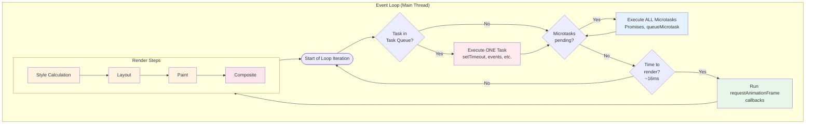

# Critical Rendering Path: Compositing

How the compositor thread assembles rasterized layers and the GPU displays the final pixels on screen.

## What is Compositing?

The compositor thread assembles all [rasterized](../crp-rasterization/README.md) tiles and layers into the final image:

- **Compositor frame**: Describes where each tile should appear, with transforms and effects applied
- **No main thread needed**: This runs on the compositor thread, independent of JavaScript
- **Visual effects**: Applies `transform`, `opacity`, filters at this stage (very cheap!)

---

## What is Draw?

The **Viz process** (in Chromium) executes the compositor frame on the GPU:

- **Aggregate**: Combines compositor frames from all render processes (tabs, iframes)
- **Draw**: GPU sends the final image to the display buffer
- **Screen update**: Monitor displays the pixels

---

## Browser Design: The Threading Model

The compositor thread exists to solve a fundamental problem: **the main thread can't do two things at once**.

When JavaScript runs a long task, the main thread can't:

- Respond to scroll events
- Update animations
- Process user input

### Two-Tree Architecture

Chromium maintains two layer trees:

- **Main Thread Tree**: Authoritative source, updated by JavaScript and style changes
- **Compositor Thread Tree**: Copy used for rendering, updated asynchronously

**The Critical Rule**: The main thread can make blocking calls to the compositor thread, but the compositor thread **never** makes blocking calls to the main thread. This prevents deadlocks and ensures the compositor always remains responsive.

### What This Enables

- Smooth scrolling during JavaScript execution
- 60fps `transform`/`opacity` animations during heavy computation
- Input responsiveness even with main thread work

---

## Compositor Thread Responsibilities

- **Input routing**: Handle scroll and touch events
- **Layer compositing**: Assemble graphics layers into final frame
- **Animations**: Update `transform`/`opacity` without main thread
- **Scrolling**: Smooth scroll with checkerboard prevention
- **Tile management**: Prioritize visible tiles for rasterization

---

## What Stays Responsive During Long JavaScript Tasks

The compositor thread handles these operations **independently of the main thread**, meaning they continue working even during heavy JavaScript execution:

```javascript
// This blocks the main thread for 3 seconds
button.addEventListener("click", () => {
  const start = Date.now()
  while (Date.now() - start < 3000) {
    // Busy loop - main thread completely blocked
  }
  console.log("Done!")
})
```

**Still works during the 3-second block:**

| Behavior                            | Why It Works                                         | Caveat                                                      |
| ----------------------------------- | ---------------------------------------------------- | ----------------------------------------------------------- |
| **Page scrolling**                  | Compositor handles scroll position independently     | Scroll event listeners won't fire until main thread is free |
| **Pinch-to-zoom**                   | GPU handles viewport scaling                         | —                                                           |
| **`transform` animations**          | Compositor applies transforms to cached GPU textures | Only for elements already on compositor layers              |
| **`opacity` animations**            | Compositor adjusts layer transparency                | Only for elements already on compositor layers              |
| **Touch feedback** (native)         | OS handles touch highlighting                        | Custom `:active` styles need main thread                    |
| **Video playback**                  | Decoded in separate process, composited by GPU       | Seeking may stutter if it needs main thread                 |
| **`<canvas>` with OffscreenCanvas** | Rendering happens on worker thread                   | Requires explicit setup                                     |

**Does NOT work during the block:**

| Behavior                            | Why It's Blocked                    |
| ----------------------------------- | ----------------------------------- |
| **Click handlers**                  | Events queue on main thread         |
| **Hover state changes**             | Requires style recalculation        |
| **`left`/`top`/`width` animations** | Requires layout on main thread      |
| **Text selection**                  | Requires main thread hit testing    |
| **Form input**                      | Requires main thread event handling |
| **Scroll event callbacks**          | JavaScript runs on main thread      |
| **`requestAnimationFrame`**         | Callbacks run on main thread        |

### Example: Compositor-Only Animation Survives Main Thread Work

```html
<style>
  .spinner {
    width: 50px;
    height: 50px;
    background: blue;
    /* Compositor-only: keeps spinning during JS execution */
    animation: spin 1s linear infinite;
  }
  @keyframes spin {
    to {
      transform: rotate(360deg);
    }
  }

  .spinner-bad {
    /* Main thread required: freezes during JS execution */
    animation: spin-bad 1s linear infinite;
  }
  @keyframes spin-bad {
    to {
      margin-left: 100px;
    } /* Layout property! */
  }
</style>

<div class="spinner"></div>
<!-- Keeps spinning -->
<div class="spinner-bad"></div>
<!-- Freezes -->

<button onclick="blockMainThread()">Block for 3s</button>
```

The first spinner uses `transform: rotate()`, which the compositor handles. The second uses `margin-left`, which requires layout—so it freezes when JavaScript blocks the main thread.

---

## The Event Loop and Rendering

The main thread runs a single **event loop** that orchestrates both JavaScript execution and rendering. Understanding this loop explains why long-running JavaScript blocks rendering and how to schedule work efficiently.

<figure>



<figcaption>The browser event loop: one task executes, then ALL microtasks, then (if ~16ms elapsed) rendering occurs. Long tasks delay rendering.</figcaption>

</figure>

### The Three Queues

The event loop processes work from three distinct queues, each with different scheduling rules:

**1. Task Queue (Macrotasks)**

- Contains: `setTimeout`, `setInterval`, DOM events, `fetch` callbacks, `postMessage`
- Processing: **One task per loop iteration**
- After each task, the loop checks for microtasks and potentially renders

**2. Microtask Queue**

- Contains: Promise `.then()/.catch()/.finally()`, `queueMicrotask()`, `MutationObserver`
- Processing: **ALL microtasks until queue is empty**
- Runs after each task, before rendering
- New microtasks added during processing run in the same cycle

**3. Animation Frame Queue**

- Contains: `requestAnimationFrame` callbacks
- Processing: **All callbacks queued before this frame** (new ones wait for next frame)
- Runs only when browser decides to render (~60fps / every ~16ms)
- Executes just before Style/Layout/Paint

---

## Developer Optimizations

### Yielding to the Render Pipeline

To keep rendering smooth, break long tasks into smaller chunks:

```javascript
// ✅ GOOD: Yield to browser between chunks
async function processLargeArray(items) {
  const CHUNK_SIZE = 100

  for (let i = 0; i < items.length; i += CHUNK_SIZE) {
    const chunk = items.slice(i, i + CHUNK_SIZE)
    processChunk(chunk)

    // Yield to allow rendering
    await new Promise((resolve) => setTimeout(resolve, 0))
  }
}
```

Using `setTimeout(fn, 0)` schedules a new task, allowing the event loop to:

1. Finish current task
2. Process any microtasks
3. Potentially render a frame
4. Then process the next chunk

### scheduler.yield() (Modern API)

The `scheduler.yield()` API provides a cleaner way to yield:

```javascript
// ✅ BEST: Modern yielding (where supported)
async function processLargeArray(items) {
  for (const item of items) {
    processItem(item)

    if (needsToYield()) {
      await scheduler.yield() // Yields but stays high priority
    }
  }
}
```

Unlike `setTimeout`, `scheduler.yield()` keeps your continuation at the front of the task queue, preventing other lower-priority work from jumping ahead.

**Browser Support**: Chromium 129+, Firefox 142+. Not supported in Safari—use a fallback for cross-browser compatibility:

```javascript
async function yieldToMain() {
  if ("scheduler" in globalThis && "yield" in scheduler) {
    return scheduler.yield()
  }
  return new Promise((resolve) => setTimeout(resolve, 0))
}
```

### Use requestAnimationFrame for Visual Updates

```javascript
// ✅ GOOD: Schedule visual work right before render
function animate() {
  element.style.transform = `translateX(${position}px)`
  position += 1
  requestAnimationFrame(animate)
}
requestAnimationFrame(animate)
```

`requestAnimationFrame` is ideal for animations because:

- Callbacks run right before the browser renders
- Automatically synced to display refresh rate (~60fps)
- Pauses when tab is in background (saves battery/CPU)
- Multiple calls in same frame are batched

---

## References

- [Chromium: Compositor Thread Architecture](https://www.chromium.org/developers/design-documents/compositor-thread-architecture/)
- [Chrome Developers: RenderingNG Architecture](https://developer.chrome.com/docs/chromium/renderingng-architecture)
- [Chromium: How cc Works](https://chromium.googlesource.com/chromium/src/+/master/docs/how_cc_works.md)
