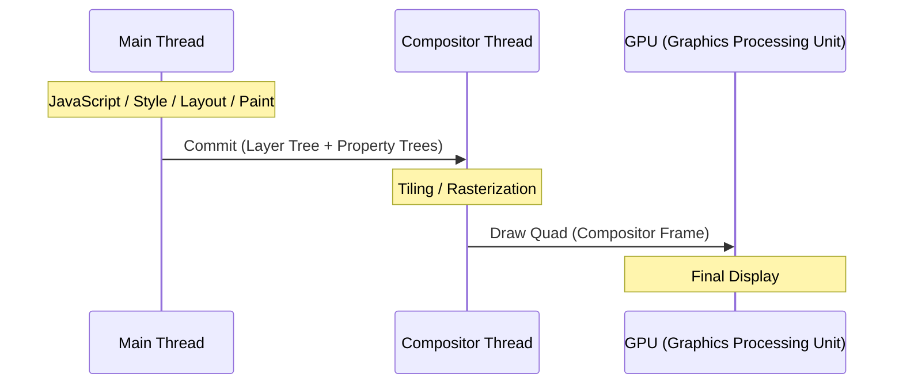

# Critical Rendering Path: Compositing

How the compositor thread assembles rasterized layers and the GPU (Graphics Processing Unit) displays the final pixels on screen.

<figure>



<figcaption>The compositing pipeline: the main thread commits work to the compositor thread, which then coordinates with the GPU to produce the final frame.</figcaption>
</figure>

## TLDR

### The Pivot

Compositing is the final stage of the rendering pipeline where the browser combines independent layers of the page to create the final image. This process is handled by a dedicated thread, decoupling visual updates from the main thread's JavaScript execution.

### The Problem

If the browser tried to render everything on a single thread, heavy JavaScript tasks or complex layouts would block all visual updates, including scrolling and animations. This leads to "jank" and a non-responsive user experience.

### The Solution

By splitting the page into layers and using a multi-threaded architecture (Main Thread vs. Compositor Thread), the browser can maintain smooth 60fps or 120fps interactions even when the main thread is fully saturated.

---

## What is Compositing?

The compositor thread assembles all [rasterized](../crp-rasterization/README.md) tiles and layers into the final image:

- **Compositor frame**: Describes where each tile should appear, with transforms and effects applied.
- **No main thread needed**: This runs on the compositor thread, independent of JavaScript.
- **Visual effects**: Applies `transform`, `opacity`, and filters at this stage (computationally efficient).

---

## What is Draw?

The **Viz (Visuals) service** in Chromium executes the compositor frame on the GPU:

- **Aggregate**: Combines compositor frames from all render processes (browser UI, tabs, iframes).
- **Draw**: The GPU sends the final image to the display buffer.
- **Screen update**: The monitor displays the pixels at its native refresh rate.

---

## Browser Design: The Threading Model

The compositor thread exists to solve a fundamental problem: **the main thread can't do two things at once**.

When JavaScript runs a long task, the main thread can't:

- Respond to scroll events.
- Update animations.
- Process user input.

### Two-Tree Architecture

Chromium maintains two layer trees to ensure responsiveness:

- **Main Thread Tree**: The authoritative source, updated by JavaScript, style changes, and layout.
- **Compositor Thread Tree**: A copy used for rendering, updated asynchronously during the [Commit](../crp-commit-stage/README.md) stage.

**The Critical Rule**: The main thread can make blocking calls to the compositor thread, but the compositor thread **never** makes blocking calls to the main thread. This prevents deadlocks and ensures the compositor always remains responsive to user input like scrolling.

### What This Enables

- **Smooth scrolling**: Even during heavy JavaScript execution.
- **Off-main-thread animations**: 60fps `transform` and `opacity` animations.
- **Low-latency input**: Quick response to touch or wheel events.

---

## Compositor Thread Responsibilities

- **Input routing**: Handles scroll and touch events before they reach the main thread.
- **Layer compositing**: Assembles graphics layers into a final frame.
- **Animations**: Updates `transform` and `opacity` properties without main thread involvement.
- **Scrolling**: Implements smooth scrolling with checkerboard prevention.
- **Tile management**: Prioritizes visible tiles for rasterization based on viewport proximity.

---

## What Stays Responsive During Long JavaScript Tasks

The compositor thread handles these operations **independently of the main thread**, meaning they continue working even during heavy JavaScript execution:

```javascript
// This blocks the main thread for 3 seconds
button.addEventListener("click", () => {
  const start = Date.now()
  while (Date.now() - start < 3000) {
    // Busy loop - main thread completely blocked
  }
  console.log("Done!")
})
```

**Still works during the 3-second block:**

| Behavior                            | Why It Works                                         | Caveat                                                      |
| ----------------------------------- | ---------------------------------------------------- | ----------------------------------------------------------- |
| **Page scrolling**                  | Compositor handles scroll position independently     | Scroll event listeners won't fire until main thread is free |
| **Pinch-to-zoom**                   | GPU handles viewport scaling                         | —                                                           |
| **`transform` animations**          | Compositor applies transforms to cached GPU textures | Only for elements already on compositor layers              |
| **`opacity` animations**            | Compositor adjusts layer transparency                | Only for elements already on compositor layers              |
| **Touch feedback** (native)         | OS handles touch highlighting                        | Custom `:active` styles need main thread                    |
| **Video playback**                  | Decoded in separate process, composited by GPU       | Seeking may stutter if it needs main thread                 |
| **`<canvas>` with OffscreenCanvas** | Rendering happens on worker thread                   | Requires explicit setup                                     |

**Does NOT work during the block:**

| Behavior                            | Why It's Blocked                    |
| ----------------------------------- | ----------------------------------- |
| **Click handlers**                  | Events queue on main thread         |
| **Hover state changes**             | Requires style recalculation        |
| **`left`/`top`/`width` animations** | Requires layout on main thread      |
| **Text selection**                  | Requires main thread hit testing    |
| **Form input**                      | Requires main thread event handling |
| **Scroll event callbacks**          | JavaScript runs on main thread      |
| **`requestAnimationFrame`**         | Callbacks run on main thread        |

### Example: Compositor-Only Animation Survives Main Thread Work

```html
<style>
  .spinner {
    width: 50px;
    height: 50px;
    background: blue;
    /* Compositor-only: keeps spinning during JS execution */
    animation: spin 1s linear infinite;
  }
  @keyframes spin {
    to {
      transform: rotate(360deg);
    }
  }

  .spinner-bad {
    /* Main thread required: freezes during JS execution */
    animation: spin-bad 1s linear infinite;
  }
  @keyframes spin-bad {
    to {
      margin-left: 100px;
    } /* Layout property! */
  }
</style>

<div class="spinner"></div>
<!-- Keeps spinning -->
<div class="spinner-bad"></div>
<!-- Freezes -->

<button onclick="blockMainThread()">Block for 3s</button>
```

The first spinner uses `transform: rotate()`, which the compositor handles. The second uses `margin-left`, which requires layout—so it freezes when JavaScript blocks the main thread.

---

## The Event Loop and Rendering

The main thread runs a single **event loop** that orchestrates both JavaScript execution and rendering. Understanding this loop explains why long-running JavaScript blocks rendering and how to schedule work efficiently.

<figure>


<figcaption>The browser event loop: one task executes, then ALL microtasks, then (if ~16ms elapsed) rendering occurs. Long tasks delay rendering.</figcaption>

</figure>

### The Three Queues

The event loop processes work from three distinct queues, each with different scheduling rules:

**1. Task Queue (Macrotasks)**

- Contains: `setTimeout`, `setInterval`, DOM events, `fetch` callbacks, `postMessage`.
- Processing: **One task per loop iteration**.
- After each task, the loop checks for microtasks and potentially renders.

**2. Microtask Queue**

- Contains: Promise `.then()/.catch()/.finally()`, `queueMicrotask()`, `MutationObserver`.
- Processing: **ALL microtasks until queue is empty**.
- Runs after each task, before rendering.

**3. Animation Frame Queue**

- Contains: `requestAnimationFrame` (rAF) callbacks.
- Processing: **All callbacks queued before this frame** (new ones wait for next frame).
- Runs only when browser decides to render (~60fps / every ~16ms).

---

## Developer Optimizations

### Yielding to the Render Pipeline

To keep rendering smooth, break long tasks into smaller chunks using `setTimeout(fn, 0)` or `scheduler.yield()`.

```javascript
// ✅ GOOD: Yield to browser between chunks
async function processLargeArray(items) {
  const CHUNK_SIZE = 100

  for (let i = 0; i < items.length; i += CHUNK_SIZE) {
    const chunk = items.slice(i, i + CHUNK_SIZE)
    processChunk(chunk)

    // Yield to allow rendering
    await new Promise((resolve) => setTimeout(resolve, 0))
  }
}
```

### Use requestAnimationFrame for Visual Updates

```javascript
// ✅ GOOD: Schedule visual work right before render
function animate() {
  element.style.transform = `translateX(${position}px)`
  position += 1
  requestAnimationFrame(animate)
}
requestAnimationFrame(animate)
```

`requestAnimationFrame` is ideal because it automatically syncs with the display refresh rate and pauses when the tab is in the background.

---

## Conclusion

Compositing is the browser's primary defense against main-thread congestion. By delegating visual assembly to a dedicated compositor thread and leveraging GPU acceleration, modern browsers can maintain smooth user experiences even under heavy computational load. Understanding the boundaries between main-thread and compositor-thread work is essential for building high-performance web applications.

---

## Appendix

### Prerequisites

- **Critical Rendering Path Overview**: Understanding the journey from HTML to pixels.
- **Rasterization**: Knowledge of how layers are turned into bitmap tiles.
- **Browser Threading**: Basic understanding of the multi-process/multi-thread architecture.

### Terminology

| Term                               | Definition                                                                          |
| :--------------------------------- | :---------------------------------------------------------------------------------- |
| **Compositor Thread**              | A background thread responsible for combining rasterized layers into a final image. |
| **Main Thread**                    | The primary thread where JavaScript, DOM, Style, and Layout are processed.          |
| **GPU (Graphics Processing Unit)** | Specialized hardware for efficient image processing and display.                    |
| **Viz (Visuals)**                  | The service in Chromium responsible for display and compositing.                    |
| **Jank**                           | Visual stuttering caused by frame drops during rendering.                           |

### Summary

- Compositing assembles independent layers into a final frame on a dedicated thread.
- This architecture enables smooth scrolling and animations even when JavaScript blocks the main thread.
- Only certain properties (`transform`, `opacity`) can be animated entirely on the compositor thread.
- Efficient scheduling via `requestAnimationFrame` and task yielding is key to maintaining 60fps.

### References

- **HTML Specification: Event Loops**: [WHATWG](https://html.spec.whatwg.org/multipage/webappapis.html#event-loop)
  > "To coordinate events, user interaction, scripts, rendering, networking, and so forth, user agents must use event loops..."
- **CSS Animations Level 1**: [W3C Specification](https://www.w3.org/TR/css-animations-1/)
- **Chromium: Compositor Thread Architecture**: [Design Document](https://www.chromium.org/developers/design-documents/compositor-thread-architecture/)
- **Chrome Developers: RenderingNG**: [Architecture Overview](https://developer.chrome.com/docs/chromium/renderingng-architecture)
