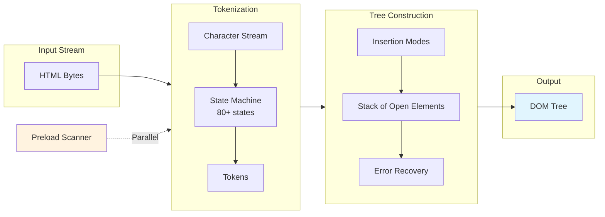

# Critical Rendering Path: DOM Construction

How browsers parse HTML bytes into a Document Object Model (DOM) tree, why JavaScript loading strategies dictate performance, and how the preload scanner mitigates the cost of parser-blocking resources.

<figure>



<figcaption>The HTML parsing pipeline: bytes flow through an 80+ state tokenizer into tree construction, which uses insertion modes and error recovery to build the DOM. The preload scanner runs in parallel to discover resources early.</figcaption>

</figure>

## Abstract

The HTML parser is a **state machine with error recovery**—not a traditional parser that rejects malformed input. This design choice, mandated by the HTML5 specification, ensures every document produces a DOM tree regardless of syntax errors.

**Core mental model:**

- **Two parsers, one goal**: The primary parser builds the DOM sequentially; the preload scanner races ahead to discover resources while the primary parser is blocked on scripts.
- **Scripts block because they can write**: `document.write()` can inject content into the token stream mid-parse, forcing synchronous execution. Modern attributes (`defer`, `async`, `type="module"`) opt out of this legacy behavior.
- **CSS blocks scripts, not parsing**: The parser continues building the DOM while CSS loads, but script execution waits for CSSOM completion because scripts may query computed styles.

**The blocking chain:**

```
HTML Parser → encounters <script> → pauses
                                   ↓
                           Script downloads
                                   ↓
                           CSS finishes (if pending)
                                   ↓
                           Script executes
                                   ↓
                           Parser resumes
```

The preload scanner exists because this chain is expensive. By scanning ahead during parser blocks, browsers achieve ~20% faster page loads.

## The Parsing Pipeline

The HTML parser transforms bytes into a DOM tree through two primary stages defined by the [WHATWG HTML specification](https://html.spec.whatwg.org/multipage/parsing.html):

### Stage 1: Tokenization

The tokenizer is a state machine with **80+ distinct states** that processes the character stream and emits tokens. Key state categories:

| State Category           | Purpose                      | Example Transitions                      |
| ------------------------ | ---------------------------- | ---------------------------------------- |
| **Data states**          | Normal content parsing       | Data → Tag Open → Tag Name               |
| **Tag parsing**          | Element recognition          | `<` triggers Tag Open state              |
| **Attribute handling**   | Name/value extraction        | Attribute Name → Before Attribute Value  |
| **Script data**          | Special script content rules | Handles `</script>` detection in strings |
| **Character references** | Entity decoding              | `&amp;` → `&`                            |

The tokenizer emits five token types: DOCTYPE, start tag, end tag, comment, and character tokens. Each token triggers tree construction actions.

### Stage 2: Tree Construction

Tree construction uses **insertion modes** to determine how tokens modify the DOM. The specification defines 23 insertion modes including:

- `initial`, `before html`, `before head`, `in head`, `after head`
- `in body` (handles most content)
- `in table`, `in row`, `in cell` (table-specific rules)
- `in template` (for `<template>` elements)

The parser maintains two critical data structures:

1. **Stack of open elements**: Tracks the current nesting context
2. **List of active formatting elements**: Handles `<b>`, `<i>`, `<a>` across misnested tags

```html collapse={1-5,8-12}
<!doctype html>
<html>
  <head>
    <link href="style.css" rel="stylesheet" />
  </head>
  <body>
    <p>Hello <span>web performance</span> students!</p>
  </body>
</html>
```

<figure>


<figcaption>DOM tree construction from HTML parsing: each element becomes a node with parent-child relationships preserved.</figcaption>

</figure>

## HTML5 Error Recovery

Unlike XML parsers that reject malformed input, the HTML parser **always produces a DOM tree**. The specification defines exact error recovery behavior for every malformed pattern, ensuring consistent results across browsers.

### The Adoption Agency Algorithm

When formatting elements like `<b>` or `<i>` are improperly nested, the adoption agency algorithm restructures the DOM to match user intent:

```html
<!-- Input: misnested tags -->
<p>One <b>two <i>three</b> four</i> five</p>

<!-- Parsed result: algorithm "adopts" nodes to fix nesting -->
<p>One <b>two <i>three</i></b><i> four</i> five</p>
```

The algorithm earned its name because "elements change parents"—nodes are reparented to produce valid structure. The spec notes this was chosen over alternatives including the "incest algorithm" and "Heisenberg algorithm."

### Foster Parenting

When content appears inside `<table>` where it's not allowed, the parser uses **foster parenting** to place it before the table:

```html
<!-- Input: text directly in table -->
<table>
  Some text
  <tr>
    <td>Cell</td>
  </tr>
</table>

<!-- Parsed result: text "fostered" before table -->
Some text
<table>
  <tbody>
    <tr>
      <td>Cell</td>
    </tr>
  </tbody>
</table>
```

The foster parent is typically the element before the table in the stack of open elements. This explains why stray text inside tables appears above them in the rendered output.

### Common Parse Errors

The specification defines 70+ parse error codes. Common scenarios:

| Error                       | Input                 | Recovery Behavior        |
| --------------------------- | --------------------- | ------------------------ |
| `duplicate-attribute`       | `<div id="a" id="b">` | Second attribute ignored |
| `end-tag-with-attributes`   | `</div class="x">`    | Attributes ignored       |
| `missing-end-tag-name`      | `</>`                 | Treated as bogus comment |
| `unexpected-null-character` | `<div>\0</div>`       | Replaced with U+FFFD     |

---

## Why Incremental Parsing Matters

Unlike [CSSOM construction](../crp-cssom-construction/README.md), DOM construction doesn't require the complete document. The browser parses and builds incrementally, enabling:

- **Early resource discovery**: The preload scanner finds `<link>` and `<script>` tags before the main parser reaches them.
- **Progressive rendering**: Content above the fold displays as soon as it's parsed and styled.
- **Streaming HTML**: Chunked transfer encoding allows parsing to begin before the full response arrives.

---

## Browser Design: Why JavaScript Blocks Parsing

By default, `<script>` tags block HTML parsing because scripts can modify the document during parsing via `document.write()`. This legacy API injects content directly into the token stream:

```html collapse={1-2,7-8}
<head>
  <script>
    // This writes tokens directly into the parser's input stream
    document.write('<link rel="stylesheet" href="injected.css">')
  </script>
</head>
```

Because the parser cannot predict what a script will write, it must pause, execute the script, then continue with any newly injected content. This is why scripts are **parser-blocking** by default.

### The Full Blocking Chain

1. HTML parser encounters a `<script>` tag
2. Parser pauses (cannot proceed—script might call `document.write()`)
3. Script downloads (if external)
4. If CSS is still loading, execution waits for CSSOM completion
5. Script executes (may inject content via `document.write()`)
6. Any written content is tokenized and processed
7. Parser resumes from where it paused

**Critical distinction**: CSS blocks JavaScript **execution**, not **download**. The browser fetches scripts in parallel but won't run them until pending stylesheets complete. This prevents scripts from reading incorrect computed styles via `getComputedStyle()`.

### Chrome's document.write() Intervention

> **Since Chrome 55 (2016)**: Chrome blocks `document.write()`-injected scripts under specific conditions to protect users on slow connections.

The intervention triggers when **all** conditions are met:

- User is on 2G or slow 3G connection
- Script is in the top-level document (not iframes)
- Script is parser-blocking (no `async`/`defer`)
- Script is cross-origin (different eTLD+1)
- Script isn't cached
- Page load wasn't triggered by reload

Chrome's field trial showed dramatic improvements: 10% more pages reaching First Contentful Paint (FCP), 21% faster mean time to FCP, and 38% faster parsing (nearly 6 seconds on 2G).

**Recommendation**: Never use `document.write()` for loading scripts. Use `defer`, `async`, or DOM insertion methods instead.

---

## Browser Design: Why CSS is Render-Blocking

CSS blocks rendering—not parsing—because the cascade cannot be resolved incrementally.

If browsers rendered with a partial CSSOM, users would experience a **Flash of Unstyled Content (FOUC)** or "Flash of Wrong Styles" as later rules override earlier ones. Browsers wait for a complete CSSOM to ensure visual stability and prevent layout shifts.

### When CSS Becomes Parser-Blocking

CSS becomes parser-blocking when a `<script>` follows it in the document:

```html collapse={1}
<head>
  <link rel="stylesheet" href="styles.css" />
  <!-- CSS is downloading... -->

  <script src="app.js"></script>
  <!-- Parser blocks here! Waiting for CSS + JS -->
</head>
```

The browser must wait for CSS to finish to build the CSSOM, so it can safely execute the script, which in turn blocks the parser. This indirect blocking is a common performance bottleneck.

**Design rationale**: Scripts might call `getComputedStyle()` or access `element.offsetWidth`, which require resolved styles. Running a script before CSSOM completion could return incorrect values, leading to layout bugs.

---

## JavaScript Loading Strategies

<figure>


<figcaption>Timeline comparison: default scripts block parsing; async/defer enable parallel download.</figcaption>

</figure>

### Default (Parser-Blocking)

```html
<script src="app.js"></script>
```

- Blocks HTML parsing until download and execution complete
- Preserves document order
- **Use for**: Legacy scripts that require `document.write()` (avoid if possible)

### Async

```html
<script src="analytics.js" async></script>
```

- Downloads in parallel with parsing
- Executes immediately upon download (interrupts parser briefly)
- **Order NOT preserved**—whichever script downloads first runs first
- **Use for**: Independent third-party scripts (analytics, ads, widgets)

**Edge case**: If an async script downloads before parsing reaches it, execution still interrupts the parser. This is why async scripts can cause unpredictable layout shifts if they modify the DOM.

### Defer

```html
<script src="app.js" defer></script>
```

- Downloads in parallel with parsing
- Executes after the DOM is fully parsed but before `DOMContentLoaded`
- **Order preserved**—scripts execute in document order regardless of download completion order
- **Use for**: Primary application scripts

**The DOMContentLoaded timing**: Deferred scripts execute in the gap between DOM completion and `DOMContentLoaded` firing. Event listeners for `DOMContentLoaded` will not run until all deferred scripts complete.

### Module Scripts

```html
<script type="module" src="app.js"></script>
```

- **Deferred by default** (no need to add `defer`)
- Supports ES Module features: `import`/`export`, top-level `await`
- Executes once per URL (singleton behavior)—importing the same module twice returns the same instance
- **Strict mode always enabled**
- **CORS required** for cross-origin modules (unlike classic scripts)

Adding `async` to a module script makes it execute immediately when ready, like async classic scripts:

```html
<script type="module" async src="analytics-module.js"></script>
```

### Modulepreload

> **Browser support (2023+)**: Chrome 66+, Firefox 115+, Safari 17+

`<link rel="modulepreload">` preloads ES modules with parsing and compilation:

```html
<link rel="modulepreload" href="app.js" />
<link rel="modulepreload" href="utils.js" />
<script type="module" src="app.js"></script>
```

Unlike `rel="preload"`, modulepreload:

- **Parses and compiles** the module ahead of time (preload only caches bytes)
- **Uses correct credentials mode** (`omit` by default for modules)
- **Can optionally preload the dependency tree** (browser-dependent behavior)

**Best practice**: List all dependencies explicitly rather than relying on browser tree-walking, which varies by implementation.

### Summary Table

| Mode           | Parser Blocking | Order Preserved | When Executes         | Best For               |
| -------------- | --------------- | --------------- | --------------------- | ---------------------- |
| Default        | Yes             | Yes             | Immediately           | Legacy scripts (avoid) |
| `async`        | No              | No              | When downloaded       | Analytics, ads         |
| `defer`        | No              | Yes             | After DOM, before DCL | App scripts            |
| `module`       | No              | Yes             | After DOM, before DCL | Modern apps            |
| `module async` | No              | No              | When downloaded       | Independent ES modules |

---

## The Preload Scanner

The **preload scanner** (also called "speculative parser" or "lookahead pre-parser") is one of the most significant browser optimizations ever implemented. When Mozilla, WebKit, and IE added preload scanners in 2008, they measured **~20% improvement** in page load times.

### How It Works

When the main parser blocks on a script, a lightweight secondary parser scans ahead through the remaining HTML to discover external resources. It doesn't build a DOM—it only extracts resource URLs and initiates fetches.

```
Main Parser: <html><head><script src="app.js">
                                     ↓ BLOCKED
                          Preload Scanner: scans ahead →
                          Finds: style.css, logo.png, analytics.js
                          Initiates parallel downloads
```

By the time the blocking script completes and the main parser reaches these resources, they may already be downloaded or in progress.

### What It Discovers

The preload scanner examines raw HTML markup for:

- `<link rel="stylesheet" href="...">`
- `<script src="...">`
- `` and `srcset` attributes
- `<link rel="preload" href="...">`
- `<link rel="modulepreload" href="...">`
- Inline `@import` rules in `<style>` blocks (Blink/WebKit)

### What It Misses

Resources invisible to the preload scanner become performance bottlenecks:

| Pattern                            | Why It's Invisible              | Alternative                               |
| ---------------------------------- | ------------------------------- | ----------------------------------------- |
| `document.createElement('script')` | Created by JS execution         | Use declarative `<script async>`          |
| CSS `background-image`             | Inside CSS files, not HTML      | Use `<link rel="preload">`                |
| CSS `@import` in external files    | Scanner doesn't parse CSS files | Inline critical `@import` or use `<link>` |
| Lazy-loaded images (`data-src`)    | Non-standard attribute          | Use native `loading="lazy"`               |
| SPA-rendered content               | Requires JS execution           | Use SSR/SSG for critical content          |
| Font files referenced in CSS       | Inside CSS files                | Use `<link rel="preload" as="font">`      |

### Anti-Patterns That Defeat the Scanner

**Injected scripts**: Creating scripts via JavaScript delays their discovery:

```js
// ❌ Hidden from preload scanner—downloads late
const script = document.createElement("script")
script.src = "/analytics.js"
document.head.appendChild(script)
```

```html
<!-- ✅ Visible to preload scanner—downloads immediately -->
<script src="/analytics.js" async></script>
```

The declarative approach allows parallel loading with CSS; the injected approach waits for preceding resources.

**Above-the-fold lazy loading**: Using JavaScript lazy-loading on viewport-visible images defeats the scanner and delays Largest Contentful Paint (LCP):

```html
<!-- ❌ Scanner sees data-src, not a real image URL -->


<!-- ✅ Scanner discovers immediately; lazy-load below-fold images only -->

```

### When to Use `rel="preload"` Hints

Use preload hints only when resources are genuinely hidden from the scanner:

```html
<head>
  <!-- Preload font referenced in CSS -->
  <link rel="preload" href="/fonts/main.woff2" as="font" type="font/woff2" crossorigin />

  <!-- Preload hero image referenced in CSS background-image -->
  <link rel="preload" href="/hero.jpg" as="image" />

  <link rel="stylesheet" href="/styles.css" />
</head>
```

**Caution**: Overusing preload can backfire. Preloaded resources compete for bandwidth with scanner-discovered resources. Only preload what's truly critical and invisible to the scanner.

---

## Edge Cases and Gotchas

### Script Execution Order Complexities

When mixing loading strategies, execution order can be surprising:

```html
<script defer src="a.js"></script>
<!-- Executes 2nd -->
<script async src="b.js"></script>
<!-- Executes when ready (unpredictable) -->
<script src="c.js"></script>
<!-- Executes 1st (blocks parser) -->
<script defer src="d.js"></script>
<!-- Executes 3rd -->
```

The synchronous script (`c.js`) executes first because it blocks parsing. Deferred scripts maintain their order relative to each other. Async scripts race independently.

### Inline Scripts Cannot Be Deferred

`defer` and `async` have no effect on inline scripts:

```html
<!-- ❌ defer is ignored—executes synchronously -->
<script defer>
  console.log("This runs immediately, blocking the parser")
</script>
```

Module scripts are the exception—inline modules are deferred:

```html
<!-- ✅ This is deferred even though inline -->
<script type="module">
  console.log("This runs after DOM parsing completes")
</script>
```

### DOMContentLoaded Timing

`DOMContentLoaded` fires after:

1. HTML parsing completes
2. All deferred scripts execute (in order)
3. All module scripts execute (in order)

It does **not** wait for:

- Async scripts (may fire before or after)
- Stylesheets (unless they block a script that blocks DOMContentLoaded)
- Images, iframes, or other subresources

### Parser Reentrancy

A script can call `document.write()` during parsing, which injects tokens into the current position. This creates reentrancy:

```html
<script>
  document.write("<p>Injected</p>")
  // Parser processes <p>Injected</p> NOW, before continuing
</script>
```

If the injected content includes a script, that script runs before the outer script completes. The parser maintains a **script nesting level** to handle this complexity.

### Template Element Parsing

`<template>` elements have special parsing rules. Their content is parsed but not rendered—it exists in a separate **document fragment**:

```html
<template id="my-template">
  <script>
    // This script does NOT execute during page load
    console.log("Template content script")
  </script>
</template>
```

Scripts inside templates only execute when the template is cloned and inserted into the main document.

---

## Conclusion

DOM construction is a highly optimized but sensitive process. The HTML5 parser's error-tolerant design ensures every document produces a DOM, but this comes with complex algorithms like adoption agency and foster parenting that can produce surprising results from malformed markup.

Parser-blocking scripts and their indirect dependency on CSSOM remain the primary bottlenecks in the Critical Rendering Path. The preload scanner mitigates these delays by discovering resources early, but only for resources visible in the initial HTML markup.

Modern loading strategies should be the default:

- Use `defer` for application scripts that need ordered execution
- Use `type="module"` for ES Module-based applications
- Use `async` only for truly independent third-party scripts
- Avoid `document.write()` entirely—Chrome actively blocks it on slow connections

The goal is to keep the parser unblocked so DOM construction and resource discovery can proceed as quickly as possible.

---

## Appendix

### Prerequisites

- Understanding of HTTP request-response cycle
- Familiarity with the DOM and how JavaScript interacts with it
- Basic knowledge of CSS and the cascade

### Terminology

- **DOM (Document Object Model)**: Tree representation of HTML structure; nodes have properties and methods for manipulation
- **CSSOM (CSS Object Model)**: Tree representation of parsed CSS rules; required for style calculation
- **CRP (Critical Rendering Path)**: Sequence of steps from bytes to pixels: DOM → CSSOM → Style → Layout → Paint → Composite
- **FOUC (Flash of Unstyled Content)**: Visual artifact when content renders before CSS loads
- **Preload Scanner**: Secondary parser that discovers resources while the primary parser is blocked
- **Parser-Blocking**: Resource that halts HTML parsing (synchronous scripts)
- **Render-Blocking**: Resource that halts first paint (CSS)
- **Insertion Mode**: Parser state determining how tokens are processed during tree construction
- **Adoption Agency Algorithm**: Error recovery for misnested formatting elements like `<b>` and `<i>`
- **Foster Parenting**: Error recovery for content misplaced inside `<table>` elements
- **DCL (DOMContentLoaded)**: Event fired when HTML parsing and deferred scripts complete

### Summary

- The HTML parser is a state machine with 80+ tokenization states and 23 insertion modes
- Error recovery algorithms (adoption agency, foster parenting) ensure malformed HTML produces consistent DOM trees
- Scripts block parsing by default because `document.write()` can modify the token stream
- CSS blocks script execution (not parsing) to ensure correct computed style queries
- The preload scanner achieves ~20% faster loads by discovering resources during parser blocks
- `defer` and `type="module"` are the preferred loading strategies for application scripts
- Chrome blocks `document.write()` on slow connections (since Chrome 55)

### References

- [WHATWG HTML Spec: Parsing HTML documents](https://html.spec.whatwg.org/multipage/parsing.html) — Canonical parsing algorithm, tokenization states, tree construction rules
- [WHATWG HTML Spec: Scripting](https://html.spec.whatwg.org/multipage/scripting.html) — Script element behavior, async/defer/module semantics
- [Chrome DevRel: Intervening against document.write()](https://developer.chrome.com/blog/removing-document-write) — Chrome's document.write intervention details
- [web.dev: Don't fight the browser preload scanner](https://web.dev/articles/preload-scanner) — Preload scanner patterns and anti-patterns
- [web.dev: Modulepreload](https://web.dev/articles/modulepreload) — ES module preloading mechanics
- [MDN: Critical Rendering Path](https://developer.mozilla.org/en-US/docs/Web/Performance/Critical_rendering_path) — Overview of DOM and CSSOM construction
- [MDN: rel="modulepreload"](https://developer.mozilla.org/en-US/docs/Web/HTML/Reference/Attributes/rel/modulepreload) — Modulepreload attribute reference
- [Andy Davies: How the Browser Pre-loader Makes Pages Load Faster](https://andydavies.me/blog/2013/10/22/how-the-browser-pre-loader-makes-pages-load-faster/) — Historical context on preload scanner implementation
