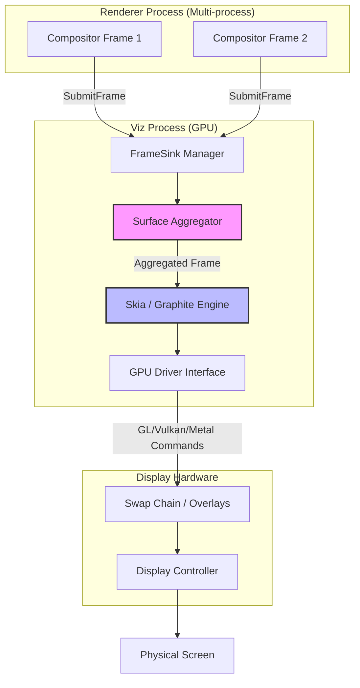

# Critical Rendering Path: Draw

The Draw stage is the final phase of the browser's rendering pipeline. It is where the Viz process (Visuals) in Chromium takes the abstract compositor frames—consisting of render passes and draw quads—and translates them into low-level GPU commands to produce actual pixels on the display.

<figure>

<figcaption>The Viz architecture: Aggregating frames from multiple renderer processes and translating them into hardware-accelerated drawing commands.</figcaption>

</figure>

## TLDR: The Final Hand-off

### The Viz Aggregator

Chromium's Viz process acts as a central compositor. It collects "Compositor Frames" from multiple sources (the main browser UI, various renderer processes for iframes) and merges them into a single, consistent view.

### From Quads to Pixels

Viz converts high-level "Draw Quads" (rectangular primitives) into commands for the Skia graphics library, which then issues calls to the GPU via APIs like Vulkan, Metal, or OpenGL.

### Hardware Optimization

Modern browsers use "Direct Scanout" and "Hardware Overlays" to bypass the system window manager for performance-critical content like full-screen video, reducing latency and power consumption.

---

## Multi-Process Frame Aggregation

In a modern browser, a single web page is often composed of elements from multiple processes. For example, a page with two cross-site iframes involves three different renderer processes. Each process independently produces its own **Compositor Frame**.

The **Viz Process** (running in the GPU process) uses a component called the **Surface Aggregator**. It walks the hierarchy of "Surfaces" (each identified by a `SurfaceId`) and merges their render passes.

- **SurfaceId**: A unique identifier for a surface that can receive compositor frames.
- **FrameSink**: The interface through which a renderer submits frames to Viz.
- **Aggregation Logic**: If an iframe's frame hasn't arrived yet, Viz may use a previous frame or a solid color to maintain the 60/120Hz refresh rate, preventing the entire page from stuttering due to one slow process.

## The Draw Quad Pipeline

A Compositor Frame is not a bitmap; it is a set of **Render Passes**, each containing a list of **Draw Quads**.

1.  **Render Pass**: A set of quads that are drawn into an intermediate texture. This is used for effects like `filter: blur()`, where the browser must first render the content and then apply the effect.
2.  **Draw Quads**: These are the basic primitives, such as `TextureDrawQuad` (for rasterized tiles), `SolidColorDrawQuad`, or `VideoDrawQuad`.
3.  **Command Generation**: Viz iterates through these quads and issues drawing commands. In the past, this was done via OpenGL. Modern Chromium uses **Skia** (and is transitioning to **Graphite**) to abstract away the underlying GPU API (Vulkan, Metal, or D3D).

### Optimization: Overdraw and Batching

To maximize throughput, Viz performs **Overdraw Removal**. If a quad is completely obscured by another opaque quad, Viz skips drawing it. This is critical for mobile devices where memory bandwidth is the primary bottleneck.

Additionally, Viz attempts to **batch** similar quads. Drawing 100 small icons separately is expensive due to the overhead of GPU state changes; batching them into a single draw call significantly improves performance.

## Direct Scanout and Overlays

The most efficient way to draw is to not draw at all—at least not in the traditional sense.

**Direct Scanout** allows the GPU to point the display controller directly at a buffer produced by the browser, bypassing the system's Window Manager (like DWM on Windows or CoreAnimation on macOS).

- **Hardware Overlays**: For content like `<video>` or `<canvas>`, Viz can promote the quad to a "Hardware Overlay."
- **Benefit**: The OS handles the composition of the overlay on top of the browser window at the hardware level. This reduces the need for the GPU to copy pixels between buffers, saving power and reducing "Interaction to Next Paint" (INP) latency.

> [!NOTE]
> **Real-World Constraint**: Direct scanout usually requires the content to be perfectly aligned with screen pixels and have no complex CSS effects (like `mix-blend-mode`) applied to it.

## Synchronization and VSync

The Draw stage is strictly bound by the display's refresh rate, managed via **VSync** (Vertical Synchronization).

If the Viz process finishes drawing too late, it misses the "VSync interval," leading to a "dropped frame" or "jank." Chromium uses a **BeginFrame** signal to coordinate the entire pipeline. When the OS signals a VSync is approaching, Viz sends a `BeginFrame` to the Compositors, which in turn may trigger the Main Thread.

### Jitter and Triple Buffering

To maintain smoothness despite variable processing times, browsers often use **Triple Buffering**. This allows the browser to be working on frame $N+2$ while the GPU is drawing $N+1$ and the screen is displaying $N$. While this increases throughput and reduces jank, it introduces a small amount of input-to-display latency.

---

## Conclusion

The Draw stage represents the culmination of the RenderingNG pipeline. By decoupling frame production (in the Renderer) from frame presentation (in Viz), modern browsers achieve a level of resilience and performance that allows for smooth 120Hz experiences even on complex, multi-process web applications.

---

## Appendix

### Prerequisites

- Understanding of the **[Rendering Pipeline Overview](../crp-rendering-pipeline-overview/README.md)**.
- Understanding of the **[Compositing Stage](../crp-compositing/README.md)**.
- Basic knowledge of **GPU Architecture** (shaders, textures, and buffers).

### Terminology

- **Viz (Visuals)**: The Chromium service responsible for frame aggregation and GPU display.
- **Compositor Frame**: The unit of data submitted by a renderer to Viz, containing render passes and quads.
- **Draw Quad**: A rectangular drawing primitive (e.g., a texture tile or a video frame).
- **VSync**: The synchronization of the frame rate with the monitor's refresh rate.
- **Direct Scanout**: A performance optimization where a buffer is sent directly to the display hardware.
- **Skia**: The cross-platform 2D graphics library used by Chrome and Android.

### Summary

- **Aggregation**: Viz merges frames from multiple renderer processes into one final image.
- **Translation**: Abstract Draw Quads are converted into low-level GPU commands via Skia.
- **Optimization**: Viz uses overdraw removal and batching to minimize GPU load.
- **Overlays**: Video and high-performance content are promoted to hardware overlays for direct scanout.
- **Timing**: The entire process is driven by VSync to ensure smooth motion and minimal jank.

### References

- **HTML Specification**: [Update the Rendering](https://html.spec.whatwg.org/multipage/webappapis.html#event-loop-processing-model) (Step 15.11)
- **Chromium Design Docs**: [Viz Architecture](https://www.chromium.org/developers/design-documents/viz/)
- **Chrome Developers**: [RenderingNG - Draw](https://developer.chrome.com/docs/chromium/renderingng-architecture)
- **Chromium Source**: [How Viz Works](https://chromium.googlesource.com/chromium/src/+/main/components/viz/README.md)
- **W3C Frame Timing**: [Frame Timing API](https://w3c.github.io/frame-timing/)
