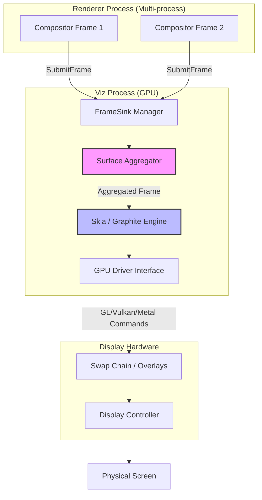
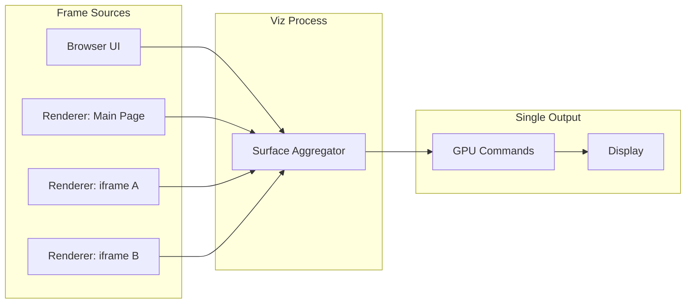

# Critical Rendering Path: Draw

The Draw stage is the final phase of the browser's rendering pipeline. The Viz process (Visuals) in Chromium takes abstract compositor frames—consisting of render passes and draw quads—and translates them into low-level GPU commands to produce actual pixels on the display.

<figure>



<figcaption>The Viz architecture: Aggregating frames from multiple renderer processes and translating them into hardware-accelerated drawing commands.</figcaption>

</figure>

## Abstract

The Draw stage exists to solve a fundamental problem: multiple isolated renderer processes (main page, cross-origin iframes, browser UI) each produce independent compositor frames, but the display requires a single, coherent image.

<figure>



<figcaption>Multiple frame sources converge in Viz to produce a single aggregated output.</figcaption>

</figure>

**Core mental model:**

- **Aggregation**: Surface Aggregator recursively walks surface references, merging frames from all sources into one compositor frame
- **Translation**: Abstract draw quads become Skia API calls, which translate to Vulkan/Metal/D3D commands
- **Optimization**: Overdraw removal, quad batching, and hardware overlays minimize GPU work
- **Timing**: BeginFrame signals from VSync drive the entire pipeline; missed deadlines cause dropped frames

The key insight: Viz operates in a separate GPU process. This isolation means GPU driver crashes don't take down the browser, and the aggregation logic handles missing frames gracefully—using stale frames or solid colors rather than blocking.

---

## The Viz Process Architecture

Viz runs in the GPU process and serves as Chromium's central display compositor. It receives compositor frames from multiple sources and produces the final screen output.

**Two-Thread Design:**

| Thread                        | Responsibility                                                           | Why Separate                                             |
| ----------------------------- | ------------------------------------------------------------------------ | -------------------------------------------------------- |
| **GPU Main Thread**           | Rasterizes display lists into GPU texture tiles; draws compositor frames | Rasterization and drawing both compete for GPU resources |
| **Display Compositor Thread** | Aggregates frames from all processes; optimizes compositing              | Prevents rasterization from blocking frame presentation  |

This separation prevents a bottleneck where slow rasterization delays frame presentation. The display compositor thread can present frames from the active tree while the GPU main thread rasterizes pending tiles.

**Process Isolation Rationale:**

> **Prior to Viz**: The GPU process handled both rasterization and compositing in a tightly coupled manner. GPU driver bugs could destabilize the entire browser. Crashes during complex WebGL operations would terminate all tabs.

Modern Viz provides:

1. **Crash isolation**: GPU driver crashes terminate only the Viz process; renderers survive and can reconnect
2. **Security boundary**: Renderers never access GPU APIs directly—all commands go through Viz
3. **Resource management**: Viz controls GPU memory allocation across all tabs, preventing runaway consumption

---

## Multi-Process Frame Aggregation

A single web page often comprises elements from multiple renderer processes. A page with two cross-origin iframes involves three renderer processes, each producing independent compositor frames.

### The Surface Abstraction

Viz uses **Surfaces** to manage the frame hierarchy. Each surface represents a compositable unit that can receive frames.

- **SurfaceId**: Unique identifier generated by SurfaceManager; used to issue frames or reference other surfaces for embedding
- **FrameSink**: Interface through which renderers submit compositor frames to Viz
- **LocalSurfaceId**: Monotonically increasing identifier that ensures frames are processed in order

### The Aggregation Algorithm

The Surface Aggregator implements a recursive, nearly stateless algorithm:

```
1. Start with the most recent eligible frame from the display's root surface
2. Iterate through quads in draw order, tracking current clip and transform
3. For each quad:
   - If NOT a surface reference → output directly to aggregated frame
   - If IS a surface reference:
     a. Find the most recent eligible frame for that surface
     b. If no frame exists OR cycle detected → skip (use fallback)
     c. Otherwise → recursively apply this algorithm
4. Output the aggregated compositor frame
```

**Resilience Pattern**: If an iframe's frame hasn't arrived, Viz uses a previous frame or solid color. This prevents the entire page from stuttering due to one slow process—critical for maintaining 60fps with site-isolated iframes.

**Edge Case—Cycle Detection**: Surface references can theoretically form cycles (A embeds B embeds A). The aggregator tracks visited surfaces and breaks cycles by skipping already-visited references.

**Memory Pressure**: Under memory constraints, Viz may evict old frames from surfaces. When this happens, the surface falls back to a solid color until a new frame arrives.

---

## The Draw Quad Pipeline

A compositor frame is not a bitmap—it's a structured description of what to draw.

### Frame Structure

```
CompositorFrame
├── RenderPass (root - drawn last)
│   ├── DrawQuad (TextureDrawQuad: rasterized tile)
│   ├── DrawQuad (SolidColorDrawQuad: background)
│   └── DrawQuad (SurfaceDrawQuad: embedded iframe)
├── RenderPass (effect pass - intermediate texture)
│   └── DrawQuad (content for blur effect)
└── metadata (device scale, damage rect, etc.)
```

### Render Passes

A **Render Pass** is a set of quads drawn into a target (the screen or an intermediate texture). Multiple passes enable layered effects:

| Use Case                | Why Intermediate Pass Required                                    |
| ----------------------- | ----------------------------------------------------------------- |
| `filter: blur()`        | Must render content to texture, then apply blur kernel            |
| `opacity` on group      | Children blend with each other, then group blends with background |
| `mix-blend-mode`        | Requires reading pixels from underlying content                   |
| Clip on rotated content | Non-axis-aligned clips require stencil/mask operations            |

**Performance Implication**: Each render pass adds GPU overhead (texture allocation, state changes, draw calls). Complex CSS effects that require intermediate passes are more expensive than compositor-only transforms.

### Draw Quad Types

| Quad Type            | Purpose                                          | Typical Source               |
| -------------------- | ------------------------------------------------ | ---------------------------- |
| `TextureDrawQuad`    | Rasterized tile with position transform          | Tiled layer content          |
| `SolidColorDrawQuad` | Color fill without texture backing               | Backgrounds, fallbacks       |
| `SurfaceDrawQuad`    | Reference to another surface by SurfaceId        | Embedded iframes, browser UI |
| `VideoDrawQuad`      | Video frame (often promoted to hardware overlay) | `<video>` elements           |
| `TileDrawQuad`       | Single tile of a tiled layer                     | Large scrolling content      |
| `RenderPassDrawQuad` | Output of another render pass                    | Effect layers                |

Each quad carries:

- **Geometry**: Transform matrix, destination rect, clip rect
- **Material properties**: Texture ID, color, blend mode
- **Layer information**: Sorting order for overlap resolution

---

## GPU Command Generation

Viz translates draw quads into GPU-native commands through Skia.

### The Translation Pipeline

```
DrawQuad (abstract)
    ↓
Skia API calls (SkCanvas::drawRect, drawImage, etc.)
    ↓
Skia backend (Ganesh or Graphite)
    ↓
GPU command buffer (Vulkan, Metal, D3D, OpenGL)
    ↓
GPU driver
    ↓
Hardware execution
```

### Skia's Role

Skia is the cross-platform 2D graphics library used by Chrome and Android. It abstracts GPU API differences:

- **Shader management**: Compiles and caches GPU shaders
- **State optimization**: Batches state changes to minimize GPU commands
- **Resource handling**: Manages textures, buffers, and GPU memory
- **Fallback paths**: Provides software rasterization when GPU unavailable

### Graphite: The Next Generation Backend

As of 2025, Chrome is transitioning from Ganesh (Skia's aging OpenGL-centric backend) to Graphite.

**Why Graphite exists:**

Ganesh accumulated technical debt:

- Originally designed for OpenGL ES with GL-centric assumptions
- Too many specialized code paths, making it hard to leverage modern graphics APIs
- Single-threaded command recording caused bottlenecks
- Shader compilation during browsing caused "shader jank"

**Graphite's design improvements:**

| Aspect        | Ganesh                         | Graphite                                      |
| ------------- | ------------------------------ | --------------------------------------------- |
| **Threading** | Single-threaded recording      | Independent recorders across multiple threads |
| **Overdraw**  | Software occlusion culling     | Depth buffer for 2D (hardware-accelerated)    |
| **Shaders**   | Dynamic compilation            | Pre-compiled at startup; unified pipelines    |
| **APIs**      | OpenGL-first, others bolted on | Metal/Vulkan/D3D12 native from the start      |

**Performance results (2025):**

- ~15% improvement on MotionMark 1.3 (MacBook Pro M3)
- Reduced frame drops due to shader compilation
- Lower power consumption from efficient GPU utilization

**Rollout status:**

- macOS (including Apple Silicon): Enabled by default
- Windows: Testing with Dawn's D3D11 backend
- Linux/Android: In development

---

## Optimization Strategies

### Overdraw Removal

If a quad is completely obscured by another opaque quad in front of it, Viz skips drawing it entirely.

**Why this matters**: Mobile devices are memory-bandwidth constrained. Drawing pixels that will be overwritten wastes precious GPU bandwidth. A common case: a full-screen opaque background covers all content below it—drawing that underlying content is pure waste.

**Graphite enhancement**: Uses GPU depth testing for 2D rendering. Each quad gets a depth value; the GPU's depth buffer automatically rejects overdraw at the hardware level, eliminating software occlusion calculations.

### Quad Batching

Drawing 100 small quads separately is expensive due to GPU state change overhead (bind texture, set shader, draw, repeat). Batching combines similar quads into fewer draw calls.

**Batching requirements:**

- Same texture (or atlas)
- Same blend mode
- Same shader
- Compatible transforms (can be batched via instancing)

**Real-world impact**: A page with many small icons benefits dramatically from texture atlasing and batching. Without batching: 100+ draw calls. With batching: potentially 1 draw call.

### Damage Tracking

Viz tracks which screen regions changed since the last frame (the "damage rect"). Unchanged regions may skip redrawing entirely.

**Partial swap**: Some platforms support `SwapBuffersWithDamage`, presenting only the damaged region to the compositor. This reduces memory bandwidth for small updates (e.g., blinking cursor).

---

## Hardware Overlays and Direct Scanout

The most efficient drawing is no drawing at all—at least not in the traditional sense.

### Direct Scanout

Normally, the browser renders to a buffer, and the system compositor (DWM on Windows, CoreAnimation on macOS) composites it with other windows. Direct Scanout bypasses this intermediate step.

**How it works:**

1. Browser produces a buffer meeting scanout requirements
2. Viz passes the buffer handle directly to the display controller
3. Display controller reads pixels straight from browser's buffer
4. No copy through system compositor

**Requirements for Direct Scanout:**

- Content pixel-aligned with screen
- No complex CSS effects (blend modes, non-integer opacity)
- Buffer format compatible with display hardware
- Full-screen or in a compatible overlay plane

### Hardware Overlays

For specific content types, the display hardware can composite without GPU involvement.

**Video overlay path:**

```
Platform decoder (VideoToolbox, MediaFoundation, VA-API)
    ↓
Platform-specific buffer (IOSurface, DXGI, AHardwareBuffer)
    ↓
Hardware overlay plane
    ↓
Display controller composites at scanout time
```

**Benefits:**

| Metric                       | Without Overlay                                   | With Overlay                |
| ---------------------------- | ------------------------------------------------- | --------------------------- |
| **Power (fullscreen video)** | 100%                                              | ~50% (macOS measurements)   |
| **GPU copies**               | Multiple (decode → texture → composite → present) | Zero (decode → overlay)     |
| **Latency**                  | +1 frame (GPU composite delay)                    | Minimal (direct to display) |

**Real-world constraint**: Overlays require the content to have no CSS effects applied. A `<video>` with `filter: blur(1px)` falls back to GPU compositing.

**Format requirements**: Overlay planes accept specific pixel formats (NV12, P010 for video). Content must match, or the browser falls back to GPU conversion.

---

## VSync and Frame Timing

The draw stage is strictly bound by the display's refresh rate through VSync (Vertical Synchronization).

### The BeginFrame Signal

Chromium uses a **BeginFrame** message to coordinate the entire pipeline:

```
OS VSync signal (every 16.6ms at 60Hz)
    ↓
Browser process receives VSync
    ↓
Browser sends BeginFrame to Viz
    ↓
Viz sends BeginFrame to compositor threads
    ↓
Compositor may trigger BeginMainFrame to main thread
    ↓
Pipeline work must complete before next VSync deadline
```

**Deadline enforcement**: If Viz doesn't receive a compositor frame by the VSync deadline, it presents the previous frame—a "dropped frame" visible as jank.

### Frame Timing Budget

At 60Hz, each frame has 16.67ms. At 120Hz, only 8.33ms.

| Stage             | Typical Budget (60Hz) |
| ----------------- | --------------------- |
| Input handling    | 0-2ms                 |
| JavaScript        | 0-6ms                 |
| Style/Layout      | 0-4ms                 |
| Paint/Composite   | 2-4ms                 |
| **Draw**          | 2-4ms                 |
| **Buffer margin** | 2-4ms                 |

**Edge case—variable refresh rate (VRR)**: Displays supporting FreeSync/G-Sync allow variable frame presentation timing. Viz can present frames as they're ready rather than waiting for fixed VSync intervals, reducing latency for interactive content.

### Platform-Specific VSync Handling

| Platform    | VSync Source                 | Notes                                                     |
| ----------- | ---------------------------- | --------------------------------------------------------- |
| **Windows** | DWM (Desktop Window Manager) | Queries timebase/interval on each SwapBuffers             |
| **macOS**   | CVDisplayLink                | Callback-driven; integrates with CoreAnimation            |
| **Linux**   | DRM/KMS                      | Direct kernel modesetting                                 |
| **Android** | Choreographer                | VSync callbacks via NDK; used for BeginFrame coordination |

---

## Triple Buffering

To maintain smoothness despite variable processing times, browsers use triple buffering.

### Buffer States

| Buffer | State      | Description                                   |
| ------ | ---------- | --------------------------------------------- |
| N      | **Front**  | Currently displayed on screen                 |
| N+1    | **Queued** | Waiting for next VSync to become front buffer |
| N+2    | **Back**   | Currently being rendered by GPU               |

### Trade-offs

| Aspect         | Double Buffering             | Triple Buffering                   |
| -------------- | ---------------------------- | ---------------------------------- |
| **Latency**    | Lower (1 frame)              | Higher (2 frames)                  |
| **Throughput** | Limited by slowest stage     | Decoupled; render-ahead allowed    |
| **Jank**       | VSync miss = full frame drop | VSync miss = still present a frame |
| **Memory**     | 2 × framebuffer              | 3 × framebuffer                    |

**Design rationale**: Triple buffering allows the GPU to always have work queued. Without it, if frame N+1 isn't ready at VSync, the GPU idles. Triple buffering means frame N+2 can start immediately, keeping the GPU busy.

**Input latency concern**: A frame rendered now appears 2 VSync intervals later. At 60Hz, that's 33ms of inherent latency. High-refresh-rate displays (120Hz+) reduce this to acceptable levels (16ms).

---

## Failure Modes and Edge Cases

### Frame Drops

**Causes:**

1. **Main thread blocked**: Long JavaScript task delays BeginMainFrame response
2. **Rasterization backlog**: Too many tiles pending; pending tree can't activate
3. **GPU saturation**: Complex shaders or excessive draw calls exceed frame budget
4. **Memory pressure**: Tile eviction forces re-rasterization

**Detection**: Chrome's Frame Timing API exposes `PerformanceFrameTiming` entries showing frame presentation times. Gaps larger than expected VSync interval indicate drops.

### Tearing

Occurs when the display reads from a buffer while the GPU is still writing to it.

**Prevention**: VSync ensures buffer swap only during vertical blanking interval. Direct Scanout requires stricter synchronization—the display controller fence must signal completion before GPU writes to the buffer.

### Checkerboarding

When scrolling reveals un-rasterized tiles, the browser shows a checkerboard pattern (or solid color) as a placeholder.

**Mitigation strategies:**

1. **Tile priority**: Visible tiles rasterize first; off-screen tiles at lower priority
2. **Overscroll buffering**: Rasterize beyond visible viewport
3. **Async scroll**: Compositor scrolls immediately; main thread catches up

---

## Conclusion

The Draw stage represents the culmination of the RenderingNG pipeline. By decoupling frame production (renderers) from frame presentation (Viz), modern browsers achieve resilience and performance that enables smooth 120Hz experiences even on complex, multi-process web applications.

The key architectural decisions—process isolation for Viz, surface aggregation for multi-process composition, hardware overlays for power efficiency, triple buffering for throughput—each represent deliberate trade-offs optimized for the web's unique constraints: untrusted content, cross-origin isolation, and the expectation of 60fps on diverse hardware.

---

## Appendix

### Prerequisites

- Understanding of the **[Rendering Pipeline Overview](../crp-rendering-pipeline-overview/README.md)**
- Understanding of the **[Compositing Stage](../crp-composit/README.md)**
- Basic knowledge of GPU architecture (shaders, textures, command buffers)

### Terminology

| Term                 | Definition                                                                      |
| -------------------- | ------------------------------------------------------------------------------- |
| **Viz (Visuals)**    | Chromium service responsible for frame aggregation and GPU display              |
| **Compositor Frame** | Unit of data submitted by a renderer to Viz, containing render passes and quads |
| **Surface**          | Compositable unit that can receive compositor frames, identified by SurfaceId   |
| **FrameSink**        | Interface through which renderers submit frames to Viz                          |
| **Draw Quad**        | Rectangular drawing primitive (e.g., texture tile, video frame, solid color)    |
| **Render Pass**      | Set of quads drawn to a target (screen or intermediate texture)                 |
| **VSync**            | Synchronization of frame presentation with monitor's refresh rate               |
| **Direct Scanout**   | Optimization where display reads directly from browser's buffer                 |
| **Hardware Overlay** | Display plane that composites at scanout without GPU involvement                |
| **Skia**             | Cross-platform 2D graphics library used by Chrome and Android                   |
| **Graphite**         | Next-generation Skia backend optimized for modern GPU APIs                      |

### Summary

- **Viz process** aggregates compositor frames from all renderer processes into a single display output
- **Surface Aggregator** recursively walks surface references, handling missing frames gracefully
- **Draw quads** are abstract primitives translated through Skia to GPU commands
- **Graphite** (2025+) replaces Ganesh with multithreaded recording and hardware depth testing
- **Hardware overlays** bypass GPU compositing for video, cutting power consumption by ~50%
- **Triple buffering** trades latency for throughput, preventing jank from variable processing times
- **VSync coordination** via BeginFrame ensures frame presentation aligns with display refresh

### References

- **Chromium Design Docs**: [Viz Architecture](https://chromium.googlesource.com/chromium/src/+/main/components/viz/README.md) — Authoritative Viz documentation
- **Chromium Design Docs**: [Surfaces](https://www.chromium.org/developers/design-documents/chromium-graphics/surfaces/) — Surface abstraction and aggregation
- **Chrome Developers**: [RenderingNG Architecture](https://developer.chrome.com/docs/chromium/renderingng-architecture) — Pipeline overview
- **Chrome Developers**: [RenderingNG Data Structures](https://developer.chrome.com/docs/chromium/renderingng-data-structures) — Frame and quad structures
- **Chrome Developers**: [VideoNG Deep-Dive](https://developer.chrome.com/docs/chromium/videong) — Hardware overlay implementation
- **Chromium Source**: [Life of a Frame](https://chromium.googlesource.com/chromium/src/+/lkgr/docs/life_of_a_frame.md) — End-to-end frame timing
- **Chromium Source**: [How cc Works](https://chromium.googlesource.com/chromium/src/+/main/docs/how_cc_works.md) — Compositor internals
- **Chromium Blog**: [Introducing Skia Graphite](https://blog.chromium.org/2025/07/introducing-skia-graphite-chromes.html) — Graphite architecture and rollout
- **HTML Specification**: [Update the Rendering](https://html.spec.whatwg.org/multipage/webappapis.html#event-loop-processing-model) (Step 15.11)
- **W3C**: [Frame Timing API](https://w3c.github.io/frame-timing/) — Frame presentation timing specification
