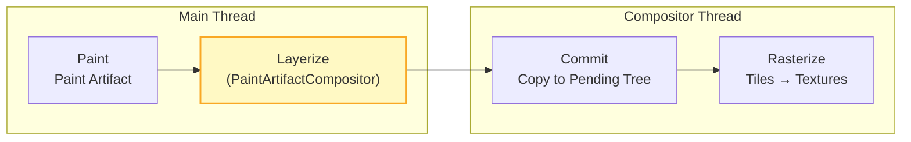

# Critical Rendering Path: Layerize

The Layerize stage converts paint chunks into composited layers (`cc::Layer` objects), determining how display items should be grouped for independent rasterization and animation. This process happens after [Paint](../crp-paint/README.md) produces the paint artifact and before [Rasterization](../crp-raster/README.md) converts those layers into GPU textures.

<figure>



<figcaption>Layerization in the RenderingNG pipeline (M94+): PaintArtifactCompositor converts paint chunks to cc::Layers on the main thread, which are then committed to the compositor thread for rasterization.</figcaption>

</figure>

## Abstract

Layerization is the **merging and grouping** phase that converts paint output into compositor-ready structures.

**The Core Model:**

```
Paint Chunks → PendingLayers → cc::Layers + cc::PropertyTrees
     ↑              ↑                ↑
     │              │                │
  input        intermediate      output
(per PropertyTreeState)  (merged groups)  (compositor-ready)
```

**Key decisions:**

| Decision                                         | Rationale                                         | Trade-off                                                |
| :----------------------------------------------- | :------------------------------------------------ | :------------------------------------------------------- |
| **Merge by default**                             | Fewer layers → less GPU memory                    | More display items per layer → larger rasterization cost |
| **Separate on compositor-changeable properties** | Transform/opacity animations need isolated layers | More layers for animatable content                       |
| **Prevent merge on overlap**                     | Maintain correct z-ordering                       | Forces layer creation for overlapping content            |
| **Sparsity tolerance**                           | Avoid wasting GPU memory on large empty areas     | Algorithm complexity in bounds calculation               |

**Why separate from Paint?** CompositeAfterPaint (M94) moved layerization after paint because:

1. Paint produces immutable output—no circular dependencies
2. Runtime factors (memory pressure, overlap analysis) inform layer decisions
3. The main thread completes paint recording before layerization begins

**Why not on compositor thread?** Layerization examines the paint artifact, which lives on the main thread. The compositor thread receives the finalized layer list and property trees during [Commit](../crp-commit/README.md).

---

## The Layerization Algorithm

The `PaintArtifactCompositor` implements layerization via `LayerizeGroup()`, converting paint chunks into compositor layers through a two-phase process.

### Phase 1: Create PendingLayers

Each paint chunk initially becomes a `PendingLayer`—an intermediate representation that may later merge with others.

```
Paint Chunk A (transform_id=1, clip_id=1, effect_id=1) → PendingLayer A
Paint Chunk B (transform_id=1, clip_id=1, effect_id=1) → PendingLayer B
Paint Chunk C (transform_id=2, clip_id=1, effect_id=1) → PendingLayer C
```

**What PendingLayer holds:**

| Field                      | Purpose                                                              |
| :------------------------- | :------------------------------------------------------------------- |
| `chunks_`                  | Paint chunk subset (display items + property tree state)             |
| `bounds_`                  | Bounding rectangle in property tree state space                      |
| `property_tree_state_`     | Transform, clip, effect node IDs                                     |
| `compositing_type_`        | Classification (scroll hit test, foreign, scrollbar, overlap, other) |
| `rect_known_to_be_opaque_` | Region guaranteed fully opaque (for optimization)                    |
| `hit_test_opaqueness_`     | Whether hit testing can bypass main thread                           |

### Phase 2: Merge PendingLayers

The algorithm attempts to combine PendingLayers to reduce layer count. Merging succeeds when:

1. **Compatible PropertyTreeState**: Adjacent chunks share the same transform, clip, and effect ancestors
2. **No overlap conflicts**: The chunk doesn't interleave with content already assigned to incompatible layers
3. **Within sparsity tolerance**: Combined bounds don't waste excessive GPU memory (`kMergeSparsityAreaTolerance`)

When PropertyTreeStates differ but merging is still beneficial, the algorithm **flattens** the difference by emitting paired display items that adjust the chunk's state to match the target layer.

### Merge Prevention: Direct Compositing Reasons

Certain property nodes carry **direct compositing reasons** that prevent merging:

| Reason                       | CSS Trigger                            | Why Separate Layer Required                   |
| :--------------------------- | :------------------------------------- | :-------------------------------------------- |
| **3D/Perspective transform** | `transform: rotate3d()`, `perspective` | GPU-native operation; benefits from isolation |
| **Compositor animation**     | `animation` on `transform`/`opacity`   | Compositor updates values without re-raster   |
| **Will-change hint**         | `will-change: transform`               | Developer signals animation intent            |
| **Hardware content**         | `<video>`, `<canvas>`, `<iframe>`      | External GPU surface or separate process      |
| **Composited scroll**        | Large scrollable content               | Enables compositor-driven scroll              |

Elements with direct compositing reasons become their own layers regardless of merging opportunities.

### Merge Prevention: Overlap Testing

When a paint chunk overlaps content already assigned to an incompatible layer (different z-order, different PropertyTreeState), it cannot merge with that layer. This **overlap testing** maintains correct visual ordering.

**Example of overlap forcing layer creation:**

```
Layer A: Element with will-change: transform (z-index: 1)
Layer B: ???

Paint Chunk X (z-index: 2, overlaps A)
  → Cannot merge with A (different z-order)
  → Cannot merge with any earlier layer (would violate paint order)
  → Must become new Layer B
```

This cascade can cause **layer explosion**: one promoted element forces neighbors to promote, which forces their neighbors, etc. The compositor mitigates this through **layer squashing**—merging multiple overlapping elements into a single layer when they share the same compositing context.

### Algorithm Complexity

> "In the worst case, this algorithm has an O(n²) running time, where n is the number of PaintChunks."
> — [Chromium Blink Compositing README](https://chromium.googlesource.com/chromium/src/+/HEAD/third_party/blink/renderer/platform/graphics/compositing/README.md)

The quadratic worst case occurs when every chunk must be checked against every preceding layer for overlap. Typical pages have far fewer problematic interactions, making practical complexity closer to O(n × average_layer_count).

---

## From PendingLayers to cc::Layers

Once the PendingLayer list is finalized, `PaintChunksToCcLayer::Convert()` creates actual compositor layers.

### Layer Types Created

| cc::Layer Type    | Content Source                      | Notes                                              |
| :---------------- | :---------------------------------- | :------------------------------------------------- |
| `PictureLayer`    | Painted content (`cc::PaintRecord`) | Most common; holds display lists for rasterization |
| `SolidColorLayer` | Single-color regions                | Optimization avoiding raster work                  |
| `TextureLayer`    | External GPU textures               | Canvas, WebGL, plugins                             |
| `SurfaceLayer`    | Cross-process content               | Iframes, out-of-process video                      |
| `ScrollbarLayer`  | Scrollbar rendering                 | Solid-color (mobile) or painted (desktop)          |

### Property Tree Conversion

Blink property tree nodes referenced by paint chunks are converted to equivalent `cc::PropertyTree` nodes:

```
Blink TransformNode → cc::TransformTree node
Blink ClipNode → cc::ClipTree node
Blink EffectNode → cc::EffectTree node
Blink ScrollNode → cc::ScrollTree node
```

Each `cc::Layer` stores node IDs pointing into these trees, not hierarchical transform chains. This enables O(1) property lookups during compositing.

**Non-composited nodes** (those merged into layers with different PropertyTreeStates) become meta display items within the layer's paint record, effectively baking the transform/clip/effect into the recorded drawing commands.

### Hit-Test Opaqueness Accumulation

During layerization, hit-test opaqueness propagates from paint chunks to layers:

```
Paint Chunk: hit_test_opaqueness_ = OPAQUE
  ↓ accumulate
cc::Layer: hit_test_opaqueness = OPAQUE (can be hit-tested on compositor thread)
```

This enables the compositor to handle hit testing for opaque regions without consulting the main thread—critical for responsive input during JavaScript execution.

---

## Layerization and Memory Trade-offs

Layer decisions directly impact GPU memory consumption and rasterization cost.

### Memory Cost Per Layer

Each composited layer consumes GPU memory proportional to its pixel area:

**Formula**: `Width × Height × 4 bytes (RGBA)`

| Layer Size          | Memory |
| :------------------ | :----- |
| 1920×1080 (Full HD) | ~8 MB  |
| 2560×1440 (QHD)     | ~14 MB |
| 3840×2160 (4K)      | ~33 MB |

Mobile devices with shared GPU memory (2-4 GB total RAM) exhaust resources quickly. Aggressive layerization can cause:

- Checkerboarding during scroll
- Fallback to software rasterization
- Browser process crashes

### The Merge vs. Separate Trade-off

| Fewer Layers (More Merging)                 | More Layers (Less Merging)                |
| :------------------------------------------ | :---------------------------------------- |
| Lower GPU memory usage                      | Higher GPU memory usage                   |
| Larger rasterization surface per layer      | Smaller, isolated rasterization surfaces  |
| Property changes require re-raster          | Property changes = compositor-only update |
| Single point of failure for complex content | Parallelizable rasterization              |

**Example**: A scrollable list with 100 items:

- **Merged approach**: One `PictureLayer` containing all items. Scrolling uses compositor offset; content change re-rasters entire layer.
- **Separated approach**: 100 `PictureLayer` objects. Each change re-rasters one layer, but uses 100× the memory.

The algorithm balances these by merging by default but separating content expected to change independently.

---

## Optimization: Avoiding Full Layerization

`PaintArtifactCompositor::Update()` is expensive. Chromium implements fast paths for common scenarios:

### Repaint-Only Updates

When display items change but layerization structure remains stable:

```
UpdateRepaintedLayers():
  - Skip LayerizeGroup()
  - Update existing cc::Layer display lists in-place
  - No layer tree reconstruction
```

**Triggers**: Color changes, text updates, background modifications that don't affect bounds or PropertyTreeState.

### Direct Property Updates

Transform or opacity changes that don't affect layer structure:

```
DirectCompositorUpdate():
  - Skip both layerization and display list update
  - Modify cc::PropertyTree nodes directly
  - Compositor applies new values during compositing
```

**Triggers**: `transform` or `opacity` animations on already-promoted layers.

### Raster-Inducing Scroll

Scroll position changes within a composited scroller:

```
kRasterInducingScroll:
  - Minimal update path
  - Adjust scroll offset in property trees
  - Rasterize newly-visible tiles only
```

---

## Historical Evolution

### Pre-CompositeAfterPaint (Before M94)

Layerization occurred _before_ paint:

```
Style → Layout → Compositing (layerization) → Paint
```

**Problems:**

1. **Circular dependency**: Paint invalidation needed current layer decisions; layer decisions needed paint output
2. **Heuristic complexity**: 22,000+ lines of C++ to guess which elements needed layers
3. **Correctness bugs**: Fundamental compositing errors from premature decisions

The codebase relied on `DisableCompositingQueryAsserts` objects to suppress safety checks—a code smell indicating architectural problems.

### CompositeAfterPaint (M94+)

The modern pipeline inverts the order:

```
Style → Layout → Prepaint → Paint → Layerize → Commit → Raster
```

**Benefits:**

- Paint produces immutable output before layerization examines it
- Layer decisions based on actual content, not predictions
- Simpler, more correct algorithm
- Enabled Non-Blocking Commit and off-main-thread compositing improvements

### Slimming Paint Project (2015-2021)

The broader architectural shift from "tree of `cc::Layers`" (GraphicsLayer in Blink terminology) to a "global display list" architecture:

- **BlinkGenPropertyTrees (M75)**: Blink generates property trees instead of cc re-generating them
- **Paint Chunks**: Introduced as intermediate representation for raster invalidation and layerization
- **CompositeAfterPaint (M94)**: Final phase completing the architectural transformation

---

## Debugging Layerization

### Chrome DevTools

**Layers Panel** (More Tools → Layers):

- View compositor layer tree
- See compositing reasons for each layer
- Memory consumption per layer
- Paint counts and slow scroll rects

**Performance Panel**:

- "Layerize" events in flame chart (rare; usually batched with "Commit")
- Layer count changes over time
- Correlation with memory pressure

### Compositor Debugging Flags

```bash
# Enable compositing borders (colored borders around layers)
--show-composited-layer-borders

# Log compositing reasons
--log-compositing-reasons
```

### Common Issues

| Symptom                       | Likely Cause                            | Investigation                                             |
| :---------------------------- | :-------------------------------------- | :-------------------------------------------------------- |
| High GPU memory               | Too many layers or oversized layers     | Layers panel → sort by memory                             |
| Unexpected layers             | Overlap forcing promotion               | Check z-index stacking; look for will-change on ancestors |
| Slow layerization             | Many paint chunks with complex overlaps | Reduce DOM complexity; use contain: strict                |
| Missing compositor animations | Element not promoted                    | Verify will-change or check for direct compositing reason |

---

## Conclusion

Layerization is the decision-making phase that transforms paint output into compositor-ready structures. The algorithm balances GPU memory conservation (merge layers) against animation flexibility (separate layers).

Key takeaways:

1. **PendingLayers are intermediate**: Paint chunks first become PendingLayers, then merge into final cc::Layers
2. **Merging is the default**: Fewer layers means less GPU memory; separation requires explicit reasons
3. **Direct compositing reasons prevent merging**: `will-change`, 3D transforms, compositor animations need isolated layers
4. **Overlap forces layer creation**: Maintaining z-order correctness can cascade into layer explosion
5. **CompositeAfterPaint (M94)** moved layerization after paint, eliminating circular dependencies and enabling a cleaner algorithm
6. **Fast paths exist**: Repaint-only and direct property updates skip full layerization

For production optimization: avoid unnecessary `will-change` (causes layer promotion), use `contain: strict` on independent components (limits overlap cascade), and monitor layer count in DevTools to prevent GPU memory exhaustion.

---

## Appendix

### Prerequisites

- [Paint Stage](../crp-paint/README.md): Understanding paint chunks and display items
- [Commit Stage](../crp-commit/README.md): How layers transfer to compositor thread
- [Rasterization](../crp-raster/README.md): How layers become GPU textures
- [Compositing](../crp-composit/README.md): How layers assemble into frames

### Terminology

| Term                          | Definition                                                                       |
| :---------------------------- | :------------------------------------------------------------------------------- |
| **Paint Chunk**               | Contiguous display items sharing identical PropertyTreeState                     |
| **PendingLayer**              | Intermediate representation during layerization; may merge with others           |
| **cc::Layer**                 | Final compositor layer; input to rasterization                                   |
| **PaintArtifactCompositor**   | Class implementing layerization algorithm                                        |
| **Direct Compositing Reason** | Property requiring dedicated compositor layer (3D transform, will-change, etc.)  |
| **Overlap Testing**           | Checking whether paint chunks interleave with existing layers                    |
| **Layer Squashing**           | Merging multiple overlapping elements into single layer to prevent explosion     |
| **PropertyTreeState**         | 4-tuple (transform_id, clip_id, effect_id, scroll_id) identifying visual context |
| **CompositeAfterPaint (CAP)** | Architecture (M94+) where layerization occurs after paint completes              |
| **Hit-Test Opaqueness**       | Whether compositor can handle hit testing without main thread                    |

### Summary

- **Layerization** converts paint chunks → PendingLayers → cc::Layers
- Algorithm **merges by default** to conserve GPU memory
- **Direct compositing reasons** (will-change, 3D transforms, animations) force separate layers
- **Overlap testing** maintains correct z-ordering but can cause layer explosion
- **CompositeAfterPaint** (M94) eliminated circular dependencies by moving layerization after paint
- **O(n²) worst case** complexity; practical performance much better for typical pages
- **Fast paths** (repaint-only, direct property updates) skip full layerization when possible
- **GPU memory** is the primary constraint: each layer costs `width × height × 4 bytes`

### References

- [Chromium Blink Compositing README](https://chromium.googlesource.com/chromium/src/+/HEAD/third_party/blink/renderer/platform/graphics/compositing/README.md) — Layerization algorithm and PendingLayer mechanics
- [Chromium Platform Paint README](https://chromium.googlesource.com/chromium/src/+/HEAD/third_party/blink/renderer/platform/graphics/paint/README.md) — Paint chunks and PaintArtifactCompositor
- [Chromium Core Paint README](https://chromium.googlesource.com/chromium/src/+/HEAD/third_party/blink/renderer/core/paint/README.md) — Paint-to-compositing workflow
- [Chromium: How cc Works](https://chromium.googlesource.com/chromium/src/+/HEAD/docs/how_cc_works.md) — Compositor architecture and layer trees
- [Chromium: RenderingNG Architecture](https://developer.chrome.com/docs/chromium/renderingng-architecture) — Pipeline overview and stage responsibilities
- [Chromium: RenderingNG Data Structures](https://developer.chrome.com/docs/chromium/renderingng-data-structures) — Paint chunks, property trees, composited layers
- [Chromium: BlinkNG](https://developer.chrome.com/docs/chromium/blinkng) — CompositeAfterPaint rationale and benefits
- [Chromium: GPU Accelerated Compositing](https://www.chromium.org/developers/design-documents/gpu-accelerated-compositing-in-chrome/) — Compositing reasons and layer squashing
- [Chromium: Slimming Paint](https://www.chromium.org/blink/slimming-paint/) — Historical evolution from GraphicsLayer tree to display list architecture
