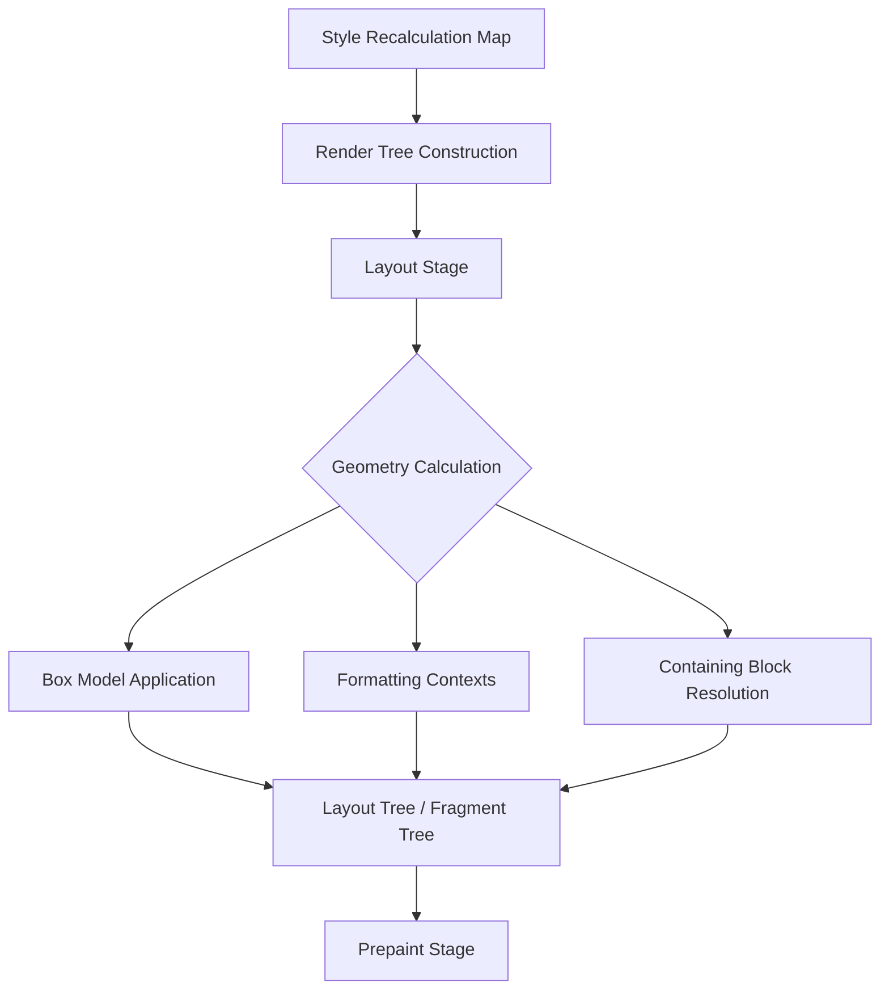

# Critical Rendering Path: Layout Stage

How browsers calculate the exact size and position of every element—the most computationally expensive stage of the rendering pipeline.

<figure>



<figcaption>The Layout stage transforms the logical Render Tree into a physical Layout Tree (or Fragment Tree) by resolving box geometry and formatting contexts.</figcaption>
</figure>

## TLDR

### Concept

Layout (historically called **Reflow**) is the process of calculating the exact physical geometry—position and size—of every element in the render tree. It translates abstract styles (e.g., `width: 50%`) into concrete pixel coordinates.

### Triggers

Any change to an element's geometry (width, height, margin, padding, border) or content (text change, font size) forces a layout pass. Modern engines use a "dirty bit" system to limit recalculation to only affected subtrees.

### Performance

Reading geometry-dependent properties via JavaScript (e.g., `offsetWidth`) can force synchronous, expensive layout calculations if the layout is "dirty." This is known as **Layout Thrashing**.

### Optimization

Minimize layout cost by using `box-sizing: border-box`, leveraging CSS Containment (`contain: layout`), and avoiding layout thrashing by batching DOM reads and writes. Use `content-visibility: auto` to skip layout for off-screen content.

---

## What is Layout?

Layout is where the browser calculates the exact size and position of every element in the [Style Recalculation map](../crp-style-recalculation/README.md). In modern engines like Chromium (RenderingNG), this stage produces the **Fragment Tree**, which describes how elements are broken into boxes (fragments) across lines or pages.

According to the [CSS Display Module Level 3](https://www.w3.org/TR/css-display-3/):

> "The layout of a document is the process of computing the geometry of the boxes generated by the elements in the document."

This is the most computationally expensive stage because geometry calculations cascade through the tree; a single change at the top can force a complete "Reflow" of the entire document.

---

## The Box Model

Every element in the render tree generates a box with four distinct areas. Understanding how these interact is fundamental to layout performance and accuracy.

```plain
┌─────────────────────────────────────────┐
│                 MARGIN                  │
│   ┌─────────────────────────────────┐   │
│   │             BORDER              │   │
│   │   ┌─────────────────────────┐   │   │
│   │   │         PADDING         │   │   │
│   │   │   ┌─────────────────┐   │   │   │
│   │   │   │     CONTENT     │   │   │   │
│   │   │   └─────────────────┘   │   │   │
│   │   └─────────────────────────┘   │   │
│   └─────────────────────────────────┘   │
└─────────────────────────────────────────┘
```

- **Content Box**: Contains actual content (text, images, child elements).
- **Padding Box**: Space between content and border.
- **Border Box**: Contains border, padding, and content.
- **Margin Box**: External space outside the border—never included in element width calculations.

### Box Sizing and Performance

The `box-sizing` property determines what the `width` and `height` properties control.

**`box-sizing: content-box`** (default):

```css collapse={1, 6-7}
.element {
  box-sizing: content-box;
  width: 100px;
  padding: 10px;
  border: 5px solid;
}
/* Total rendered width: 5 + 10 + 100 + 10 + 5 = 130px */
```

**`box-sizing: border-box`**:

```css collapse={1, 6-7}
.element {
  box-sizing: border-box;
  width: 100px;
  padding: 10px;
  border: 5px solid;
}
/* Total rendered width: 100px */
```

**Principal's Insight**: Always prefer `border-box`. It simplifies layout calculations by making the element's size independent of its internal spacing, which reduces the mental (and computational) overhead of nesting components.

---

## Block vs Inline Boxes

Elements generate different box types that follow different layout rules, defined by the [CSS Display specification](https://www.w3.org/TR/css-display-3/).

### Block-Level Boxes

`display: block`, `flex`, `grid`, `table`, etc.:

- Occupy 100% of the containing block width by default.
- Stack vertically.
- Create a Block Formatting Context (BFC) or participate in one.

### Inline-Level Boxes

`display: inline`:

- Flow horizontally and wrap when necessary (in **LTR (Left-To-Right)** or RTL languages).
- **Ignore `width` and `height` properties.**
- **Ignore vertical margins** (only horizontal margins apply).
- Participate in an Inline Formatting Context (IFC).

### Anonymous Boxes

The browser creates anonymous boxes to contain "orphaned" text to ensure the layout tree remains structurally sound:

```html
<div>
  <p>Wrapped in paragraph</p>
  This text gets an anonymous block box
</div>
```

---

## Formatting Contexts

Formatting contexts are isolated regions where elements follow specific layout rules. They are the browser's way of encapsulating layout logic.

### Block Formatting Context (BFC)

A BFC is a mini-layout environment where block boxes stack vertically, and floats are contained.

**Historical Context**: Before `display: flow-root`, developers used the "clearfix" hack or `overflow: hidden` to force BFC creation and contain floats. `flow-root` was explicitly added to the spec to provide a clean, side-effect-free way to create a BFC.

**Why BFC Matters for Performance**: A BFC acts as a layout boundary. Changes inside a BFC often do not require recalculating layout for the parent or siblings, effectively "pruning" the layout search space.

### Inline Formatting Context (IFC)

- Boxes flow horizontally and wrap at the container edge.
- Vertical alignment is controlled via `vertical-align`.
- Line boxes are created to contain each line of inline content.

---

## The Containing Block

The [Containing Block](https://developer.mozilla.org/en-US/docs/Web/CSS/Containing_block) is the reference point for percentage-based sizes and positioning.

- **`static`/`relative`**: The content box of the nearest block-level ancestor.
- **`absolute`**: The padding box of the nearest ancestor with `position` other than `static`.
- **`fixed`**: Usually the viewport, but can be overridden by ancestors with `transform`, `filter`, or `contain` properties.

**Edge Case**: Adding `will-change: transform` to an element makes it a containing block for `fixed` descendants, which can lead to surprising UI bugs where a "fixed" modal is suddenly relative to a scrolling list item.

---

## Browser Design: Why Layout is Expensive

Layout requires a full or partial traversal of the render tree because of dependencies:

1.  **Parent-child dependencies**: A child's percentage width depends on the parent's computed width.
2.  **Sibling relationships**: Floats and inline elements affect the position of subsequent nodes.
3.  **Content dependencies**: A parent's height may be determined by the "intrinsic" height of its children (e.g., a long text block).

### The Dirty Bit System

To avoid re-laying out the entire page on every tiny change, browsers use a **Dirty Bit** system. When a node changes, it and its ancestors are marked as "dirty." The next layout pass only visits these dirty paths.

### Layout Triggers

Any property affecting geometry forces a layout pass:

- **Geometry**: `width`, `height`, `padding`, `margin`, `border`.
- **Content**: `font-size`, `font-family`, `line-height`, `innerText`.
- **Structure**: `appendChild()`, `removeChild()`.

---

## Developer Optimizations

### Avoiding Layout Thrashing

Layout thrashing occurs when JavaScript repeatedly alternates between **writing** (invalidating layout) and **reading** (forcing layout) geometry.

```javascript collapse={1, 3, 7}
// ❌ BAD: Layout thrashing
const elements = document.querySelectorAll(".item")
for (const el of elements) {
  const width = el.offsetWidth // Forces synchronous layout
  el.style.width = width * 2 + "px" // Invalidates layout for next iteration
}

// ✅ GOOD: Batch reads, then batch writes
const elements = document.querySelectorAll(".item")
const widths = Array.from(elements).map((el) => el.offsetWidth) // Batch read
elements.forEach((el, i) => {
  el.style.width = widths[i] * 2 + "px" // Batch write
})
```

### CSS Containment

The `contain` property allows you to explicitly tell the browser that a subtree is independent.

```css
.widget {
  contain: layout; /* Internal changes don't affect external layout */
}
```

**Principal's Recommendation**: Use `contain: layout` or `contain: content` for complex, self-contained widgets (like maps or data grids) to isolate the rest of the page from their internal churn.

### `content-visibility`

`content-visibility: auto` allows the browser to skip the layout and painting of elements that are currently off-screen.

```css
.below-fold-section {
  content-visibility: auto;
  contain-intrinsic-size: 0 500px; /* Essential for scrollbar stability */
}
```

---

## Conclusion

Layout is the bridge between logical structure and physical representation. In modern RenderingNG architectures, optimizing layout is about minimizing the scope of recalculation through effective containment, avoiding forced synchronous layout in JavaScript, and leveraging modern CSS properties like `content-visibility` to defer work until it is strictly necessary.

---

## Appendix

### Prerequisites

- [Critical Rendering Path: Style Recalculation](../crp-style-recalculation/README.md)
- [DOM Construction](../crp-dom-construction/README.md)
- Familiarity with the CSS Box Model

### Terminology

- **BFC (Block Formatting Context)**: A mini-layout environment that isolates elements and prevents margin collapsing.
- **Reflow**: The process of re-calculating the positions and sizes of elements after the initial render.
- **Layout Thrashing**: A performance anti-pattern where synchronous layout is forced multiple times in a single frame.
- **Fragment Tree**: The modern data structure produced by the layout stage in RenderingNG.
- **LTR (Left-To-Right)**: The default horizontal writing direction for most Western languages.

### Summary

- Layout transforms the logical render tree into physical pixel coordinates (the Fragment Tree).
- The CSS Box Model and Formatting Contexts are the primary rulesets for geometry calculation.
- Modern browsers use a "dirty bit" system to optimize re-layouts, but this can be undermined by "forced synchronous layout" in JavaScript.
- CSS Containment (`contain`) and `content-visibility` are powerful tools for limiting the scope of layout work.

### References

- [CSS Box Model Module Level 3](https://www.w3.org/TR/css-box-3/) - W3C Specification
- [CSS Display Module Level 3](https://www.w3.org/TR/css-display-3/) - W3C Specification
- [CSS Containment Module Level 1](https://www.w3.org/TR/css-contain-1/) - W3C Specification
- [What Forces Layout/Reflow](https://gist.github.com/paulirish/5d52fb081b3570c81e3a) - Paul Irish's comprehensive list
- [Chromium: RenderingNG Architecture](https://developer.chrome.com/docs/chromium/renderingng-architecture)
- [web.dev: content-visibility](https://web.dev/articles/content-visibility)
