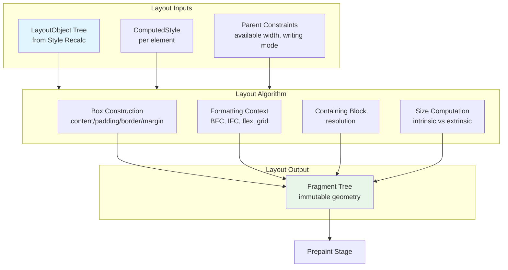

# Critical Rendering Path: Layout Stage

Layout is the rendering pipeline stage that transforms styled elements into physical geometry—computing exact pixel positions and sizes for every visible box. In Chromium's LayoutNG architecture, this stage produces the **Fragment Tree**, an immutable data structure describing how elements are broken into boxes (fragments) with resolved coordinates.

<figure>



<figcaption>Layout receives the LayoutObject Tree and ComputedStyle from Style Recalculation, applies box model rules and formatting contexts, and produces an immutable Fragment Tree consumed by Prepaint.</figcaption>
</figure>

## Abstract

Layout answers: **where does each box go, and how big is it?** The mental model:

1. **Input/Output separation** — Layout receives immutable inputs (LayoutObject Tree, ComputedStyle, parent constraints) and produces an immutable output (Fragment Tree). This separation enables caching, parallelization, and eliminates a class of bugs caused by reading partially-computed state.

2. **Constraint propagation** — Geometry flows in two passes. The **constraint pass** propagates available space downward (parent tells child how much room exists). The **fragment pass** propagates intrinsic sizes upward (child reports how much space it needs). Some layout modes (flex, grid) require multiple passes.

3. **Formatting contexts as boundaries** — Each formatting context (block, inline, flex, grid) follows its own layout algorithm. Establishing a new Block Formatting Context (BFC) isolates internal layout from external influence—changes inside don't force relayout outside.

4. **Immutability prevents hysteresis** — LayoutNG's Fragment Tree is immutable after computation. This prevents "layout jitter" bugs where reading dimensions mid-computation returns stale values, and enables fragment reuse across frames.

The cost scales with: (number of dirty nodes) × (layout passes per node) × (constraint complexity). Deep nesting of two-pass layouts (flex, grid) historically caused O(2^n) complexity; LayoutNG's caching restores O(n).

---

## From Mutable Tree to Fragment Tree

> **Prior to LayoutNG (pre-2019):** Blink used a mutable layout tree where each `LayoutObject` stored both input data (available size, float positions) and output data (final dimensions, positions). Objects persisted between renders and were marked dirty when styles changed. This architecture caused three categories of bugs:
>
> - **Under-invalidation**: Layout incorrectly deemed clean despite changed constraints
> - **Hysteresis**: Non-idempotent layout where results depended on previous state
> - **Over-invalidation**: Fixing under-invalidation often invalidated too much, creating performance cliffs

LayoutNG formalizes the conceptual model by separating inputs from outputs completely. The LayoutObject Tree (created during Style Recalculation) holds input data; the Fragment Tree holds output data. Accessing previous layout state is architecturally prevented.

According to the Chromium LayoutNG design docs:

> "Because we have explicit input and output data-structures, and accessing the previous state isn't allowed, we have broadly mitigated this class of bug from the layout system."

**What changed:**

| Aspect              | Pre-LayoutNG                        | LayoutNG (2019+)            |
| ------------------- | ----------------------------------- | --------------------------- |
| Data structure      | Mutable `LayoutObject` tree         | Immutable Fragment Tree     |
| State access        | Previous values readable mid-layout | Inputs/outputs separated    |
| Caching             | Ad-hoc invalidation flags           | Constraint-based cache keys |
| Two-pass complexity | O(2^n) for nested flex/grid         | O(n) via pass caching       |

---

## The Box Model

Every element generates a box with four nested areas. Understanding their interaction is fundamental to layout calculations.

```plain
┌─────────────────────────────────────────┐
│                 MARGIN                  │ ← External spacing (not part of box size)
│   ┌─────────────────────────────────┐   │
│   │             BORDER              │   │ ← Visual edge
│   │   ┌─────────────────────────┐   │   │
│   │   │         PADDING         │   │   │ ← Internal spacing
│   │   │   ┌─────────────────┐   │   │   │
│   │   │   │     CONTENT     │   │   │   │ ← Actual content
│   │   │   └─────────────────┘   │   │   │
│   │   └─────────────────────────┘   │   │
│   └─────────────────────────────────┘   │
└─────────────────────────────────────────┘
```

Per [CSS Box Model Level 3](https://www.w3.org/TR/css-box-3/):

> "Each CSS box has a rectangular content area, a band of padding around the content, a border around the padding, and a margin outside the border."

### Box-Sizing: Which Dimension Does `width` Control?

The `box-sizing` property determines what `width` and `height` properties measure—a source of layout surprises.

**`content-box`** (default per CSS spec):

```css collapse={1, 6-7}
.element {
  box-sizing: content-box;
  width: 100px;
  padding: 10px;
  border: 5px solid;
}
/* Total rendered width: 5 + 10 + 100 + 10 + 5 = 130px */
```

**`border-box`**:

```css collapse={1, 6-7}
.element {
  box-sizing: border-box;
  width: 100px;
  padding: 10px;
  border: 5px solid;
}
/* Total rendered width: 100px (content shrinks to 70px) */
```

**Why `border-box` is preferred**: With `content-box`, adding padding or border increases the element's outer size—breaking layouts when you add internal spacing. With `border-box`, the outer size stays fixed; only content area shrinks. This makes component sizing predictable and composable.

**Edge case**: Per [CSS Box Sizing Level 3](https://www.w3.org/TR/css-sizing-3/), the content area cannot go negative. If padding + border exceeds the specified `border-box` width, the box expands beyond the specified size.

### Margin Collapsing

Adjacent vertical margins in block flow collapse into a single margin (the larger of the two). This behavior is defined in [CSS2 §8.3.1](https://www.w3.org/TR/CSS2/box.html#collapsing-margins) and affects:

- Adjacent siblings
- Parent and first/last child (when no padding/border separates them)
- Empty blocks

**Why margin collapsing exists**: Without it, spacing between paragraphs would double (bottom margin + next top margin). Collapsing produces typographically correct spacing. The trade-off is counter-intuitive behavior when margins "escape" their containers.

**How to prevent collapse**: Establish a new BFC (Block Formatting Context) via `overflow: hidden`, `display: flow-root`, or `contain: layout`. The BFC boundary prevents margin interaction.

---

## Formatting Contexts

Formatting contexts are isolated regions following specific layout rules. They're the browser's mechanism for encapsulating layout algorithms.

### Block Formatting Context (BFC)

A BFC is a layout environment where:

- Block boxes stack vertically
- Floats are contained (don't escape)
- Margins don't collapse with external elements

**What establishes a BFC** (per [CSS Display Level 3](https://www.w3.org/TR/css-display-3/#block-formatting-context)):

- `overflow` other than `visible` or `clip`
- `display: flow-root` (explicit BFC, no side effects)
- `display: flex`, `grid`, `table`
- `contain: layout` or `contain: paint`
- `float` or `position: absolute/fixed`

> **Historical note**: Before `display: flow-root` (2016), developers used `overflow: hidden` or the "clearfix" hack to create BFCs. These had side effects (clipping overflow, adding pseudo-elements). `flow-root` was added to the spec specifically to provide a clean, side-effect-free BFC.

**Why BFC matters for performance**: A BFC acts as a layout boundary. Changes inside often don't require recalculating layout outside, effectively "pruning" the dirty subtree. The browser can skip ancestor and sibling relayout.

### Inline Formatting Context (IFC)

IFC governs horizontal text flow:

- Inline boxes flow left-to-right (in LTR languages), wrapping at container edges
- Vertical alignment uses `vertical-align` (default: `baseline`)
- **Line boxes** contain each line of inline content

**Key inline behavior**:

- `width` and `height` are **ignored** on inline elements
- Vertical margins are **ignored**; only horizontal margins apply
- Padding and border render but don't affect line box height

### Anonymous Boxes

The browser generates anonymous boxes to maintain structural integrity when content doesn't match formatting expectations:

```html
<div>
  <p>Paragraph</p>
  Orphaned text gets an anonymous block box
</div>
```

The orphaned text receives an anonymous block box so it participates correctly in the parent's block formatting context. Anonymous boxes inherit through the box tree, not the element tree.

---

## The Containing Block

The containing block is the reference rectangle for percentage-based sizes and positioned elements. Its determination depends on `position`:

| Position             | Containing Block                                           |
| -------------------- | ---------------------------------------------------------- |
| `static`, `relative` | Content box of nearest block-level ancestor                |
| `absolute`           | Padding box of nearest ancestor with `position` ≠ `static` |
| `fixed`              | Usually viewport; but see below                            |

### Fixed Positioning Edge Cases

A `position: fixed` element's containing block is normally the viewport. However, these CSS properties on an ancestor change the containing block to that ancestor:

- `transform` (any value including `translateZ(0)`)
- `filter` (any value including `blur(0)`)
- `perspective` (any value)
- `contain: paint` or `contain: layout`
- `backdrop-filter`
- `will-change` referencing transform, filter, or perspective

```css
.modal-container {
  transform: translateZ(0); /* Promotes to layer, BUT... */
}

.modal {
  position: fixed; /* Now relative to .modal-container, not viewport! */
  top: 0;
  left: 0;
}
```

This per-spec behavior surprises developers who expect `fixed` to always be viewport-relative. It's intentional: transforms create a new coordinate space, so "fixed" positions must be relative to that space.

---

## Intrinsic vs Extrinsic Sizing

Layout resolves element sizes through two mechanisms:

**Extrinsic sizing**: Dimensions come from external constraints—explicit `width`/`height`, percentage of containing block, or stretching to fill available space.

**Intrinsic sizing**: Dimensions derive from content. CSS defines three intrinsic sizes per [CSS Sizing Level 3](https://www.w3.org/TR/css-sizing-3/):

| Size          | Definition                                                         | Use Case                    |
| ------------- | ------------------------------------------------------------------ | --------------------------- |
| `min-content` | Smallest size without overflow (takes all soft wrap opportunities) | Text wrapping at every word |
| `max-content` | Ideal size with infinite space (no forced line breaks)             | Single-line text width      |
| `fit-content` | `clamp(min-content, stretch, max-content)`                         | Shrink-to-fit behavior      |

**How the constraint algorithm works:**

1. Parent provides **available space** (the extrinsic constraint)
2. Child computes **intrinsic sizes** based on content
3. Final size = `clamp(min-width, computed-width, max-width)`

**Two-pass layouts**: Flex and grid sometimes need to know child intrinsic sizes before determining final sizes. This requires a "measure pass" followed by a "layout pass."

---

## Layout Performance

### The Dirty Bit System

To avoid relaying the entire page on every change, browsers track layout validity with dirty flags:

| Flag                 | Scope            | Meaning                      |
| -------------------- | ---------------- | ---------------------------- |
| `NeedsLayout`        | Single node      | This node's geometry changed |
| `ChildNeedsLayout`   | Direct children  | Some child needs layout      |
| `SubtreeNeedsLayout` | Deep descendants | Some descendant needs layout |

When a node changes, it and ancestors are marked dirty. The next layout pass visits only dirty paths.

### Layout Triggers

Properties affecting geometry invalidate layout:

- **Size**: `width`, `height`, `min-*`, `max-*`, `padding`, `margin`, `border`
- **Content**: `font-size`, `font-family`, `line-height`, `text-content`
- **Structure**: `appendChild()`, `removeChild()`, `innerHTML`
- **Position**: `top`, `left`, `right`, `bottom` (for positioned elements)

### Forced Synchronous Layout (Layout Thrashing)

Reading geometry properties from JavaScript forces synchronous layout if the layout is dirty. This creates **layout thrashing** when reads and writes interleave:

```javascript collapse={1-2, 11-15}
// Assume elements exist
const items = document.querySelectorAll(".item")

// ❌ BAD: Layout thrashing — O(n) layouts
for (const item of items) {
  const width = item.offsetWidth // READ forces layout
  item.style.width = width * 2 + "px" // WRITE invalidates layout
}

// ✅ GOOD: Batch reads, then batch writes — O(1) layout
const widths = Array.from(items).map((el) => el.offsetWidth) // All reads
items.forEach((el, i) => {
  el.style.width = widths[i] * 2 + "px" // All writes
})
```

**Properties that force layout** (per [Paul Irish's comprehensive list](https://gist.github.com/paulirish/5d52fb081b3570c81e3a)):

- `offsetLeft/Top/Width/Height`, `offsetParent`
- `clientLeft/Top/Width/Height`
- `scrollLeft/Top/Width/Height`, `scrollBy()`, `scrollTo()`, `scrollIntoView()`
- `getClientRects()`, `getBoundingClientRect()`
- `getComputedStyle()` (for layout-dependent properties)
- `innerText` (requires layout to determine visible text)
- `focus()` (may scroll into view)

### CSS Containment for Layout Isolation

The `contain` property explicitly marks layout boundaries:

```css
.widget {
  contain: layout; /* Internal changes don't affect external layout */
}
```

Per [CSS Containment Level 2](https://www.w3.org/TR/css-contain-2/):

> "The contents of separate containment boxes can be laid out in parallel, as they're guaranteed not to affect each other."

**Containment values affecting layout**:

| Value     | Effect                                                         |
| --------- | -------------------------------------------------------------- |
| `layout`  | Establishes independent formatting context; no baseline export |
| `size`    | Element sized as if empty; intrinsic size ignored              |
| `content` | Equivalent to `layout paint style`                             |
| `strict`  | Equivalent to `size layout paint style`                        |

**Design trade-off**: `contain: layout` isolates layout at the cost of baseline alignment. For grid/flex items or text alignment, this may cause visual issues.

### `content-visibility` for Deferred Layout

`content-visibility: auto` skips layout for off-screen content entirely:

```css
.below-fold-section {
  content-visibility: auto;
  contain-intrinsic-size: 0 500px; /* Placeholder size for scrollbar stability */
}
```

**Performance impact**: The web.dev team measured a travel blog demo reducing render time from 232ms to 30ms—a **7x improvement**. Facebook reported up to 250ms improvement in navigation times.

**`contain-intrinsic-size` is essential**: Without it, off-screen elements have zero height, causing scrollbar jumping. The `auto` keyword tells the browser to remember the last-rendered size:

```css
.section {
  content-visibility: auto;
  contain-intrinsic-size: auto 500px; /* Remember actual size after first render */
}
```

**Edge case**: Calling layout-forcing APIs (`offsetWidth`, `getBoundingClientRect()`) on `content-visibility: auto` elements forces their layout, negating the optimization. Chrome logs console warnings when this occurs.

---

## LayoutNG: Complexity Reduction

### The Exponential Layout Problem

Two-pass layouts (flex, grid) previously caused exponential complexity when nested:

```
Nesting depth: 1 → 2 visits
Nesting depth: 2 → 4 visits
Nesting depth: 3 → 8 visits
Nesting depth: n → 2^n visits
```

For a 10-deep flex nesting, this meant 1,024 layout operations. The Chromium team documented cases where small CSS changes caused 50-100ms layout delays.

### LayoutNG's Solution: Pass Caching

LayoutNG caches both measure and layout passes using **parent constraints as cache keys**:

1. Before laying out a child, hash its parent constraints (available width, writing mode, etc.)
2. Check cache for matching constraint set
3. If cache hit, reuse previous fragment
4. If cache miss, compute and cache new fragment

This restores O(n) complexity regardless of nesting depth. Per the Chromium team:

> "When we moved flex over to the new architecture our metrics showed large improvements in very slow layout times in the wild, indicating that we clearly missed some cases which the new system caught."

---

## Conclusion

Layout bridges abstract styles and physical pixels. Modern engines like LayoutNG achieve correctness and performance through:

1. **Immutable outputs**: The Fragment Tree can't be modified after computation, eliminating hysteresis bugs
2. **Constraint-based caching**: Parent constraints serve as cache keys, restoring linear complexity
3. **Explicit boundaries**: Formatting contexts and containment isolate layout scope
4. **Deferred computation**: `content-visibility: auto` skips off-screen work entirely

For developers, optimization means: avoiding forced synchronous layout, leveraging CSS Containment for complex widgets, and using `content-visibility` to defer off-screen content.

---

## Appendix

### Prerequisites

- [Style Recalculation](../crp-style-recalculation/README.md): How ComputedStyle and the LayoutObject Tree are produced
- [Rendering Pipeline Overview](../crp-rendering-pipeline-overview/README.md): Where layout fits in the full pipeline
- Familiarity with CSS Box Model and display property

### Terminology

| Term                                | Definition                                                                                     |
| :---------------------------------- | :--------------------------------------------------------------------------------------------- |
| **LayoutObject Tree**               | Mutable tree created during Style Recalculation; holds input data for layout                   |
| **Fragment Tree**                   | Immutable output of layout; contains resolved positions and sizes                              |
| **BFC (Block Formatting Context)**  | Layout environment where blocks stack vertically and floats are contained                      |
| **IFC (Inline Formatting Context)** | Layout environment for horizontal text flow                                                    |
| **Containing Block**                | Reference rectangle for percentage sizes and positioned elements                               |
| **Intrinsic Size**                  | Dimension derived from content (min-content, max-content, fit-content)                         |
| **Extrinsic Size**                  | Dimension from external constraints (explicit width, percentage, stretch)                      |
| **Layout Thrashing**                | Performance anti-pattern: interleaved DOM reads and writes forcing repeated synchronous layout |
| **LayoutNG**                        | Chromium's 2019+ layout engine with immutable Fragment Tree output                             |

### Summary

- Layout receives the LayoutObject Tree and produces an immutable **Fragment Tree** with resolved geometry
- The CSS Box Model defines content, padding, border, and margin areas; `box-sizing` controls what `width`/`height` measure
- **Formatting contexts** (BFC, IFC, flex, grid) encapsulate layout algorithms and act as optimization boundaries
- **Forced synchronous layout** occurs when reading geometry after DOM changes—batch reads before writes
- **CSS Containment** (`contain: layout`) and `content-visibility: auto` limit layout scope and defer off-screen work
- LayoutNG's constraint-based caching eliminated O(2^n) complexity from nested flex/grid layouts

### References

- [W3C CSS Box Model Level 3](https://www.w3.org/TR/css-box-3/) — Box model specification
- [W3C CSS Display Level 3](https://www.w3.org/TR/css-display-3/) — Display types and formatting contexts
- [W3C CSS Box Sizing Level 3](https://www.w3.org/TR/css-sizing-3/) — Intrinsic/extrinsic sizing, box-sizing property
- [W3C CSS Containment Level 2](https://www.w3.org/TR/css-contain-2/) — Containment and content-visibility specification
- [Chromium LayoutNG Design](https://developer.chrome.com/docs/chromium/layoutng) — LayoutNG architecture and rationale
- [Chromium RenderingNG Data Structures](https://developer.chrome.com/docs/chromium/renderingng-data-structures) — Fragment Tree and immutability
- [Chromium BlinkNG](https://developer.chrome.com/docs/chromium/blinkng) — Pipeline lifecycle and geometry centralization
- [What Forces Layout/Reflow](https://gist.github.com/paulirish/5d52fb081b3570c81e3a) — Paul Irish's comprehensive forced layout list
- [web.dev: content-visibility](https://web.dev/articles/content-visibility) — Performance optimization with content-visibility
