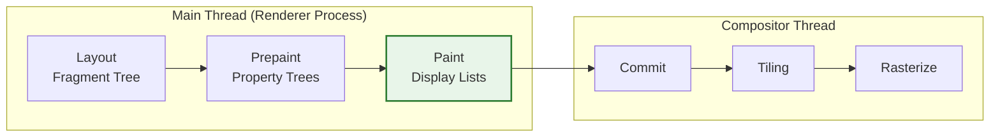

# Critical Rendering Path: Paint Stage

The Paint stage is the process of recording drawing instructions into display lists. It follows [Layout](../crp-layout-stage/README.md) and [Prepaint](../crp-prepaint/README.md) in the rendering pipeline, transforming the geometry of elements into a structured set of commands that describe how to visually represent them.

<figure>



<figcaption>The Paint stage within the RenderingNG pipeline: capturing drawing intent into serializable display lists before committing to the compositor.</figcaption>

</figure>

## TLDR: Paint Stage

### The Recording Phase

- **Display Lists**: Paint does not produce pixels; it produces **Paint Records** (drawing commands) stored in **Display Lists**.
- **Skia**: In Chromium, these are low-level commands for the Skia graphics engine (e.g., `drawRect`, `drawTextBlob`).

### Layerization and Stacking

- **RenderLayers**: Created to manage the **Stacking Context** and z-ordering as defined by the CSS specification.
- **GraphicsLayers**: (Legacy) Subsets of the DOM tree promoted to separate buffers for compositor-side manipulation.

### Performance and Optimization

- **Paint Invalidation**: The browser tracks "dirty" regions to avoid re-recording display lists for unchanged elements.
- **Slimming Paint**: A major architectural shift in Blink that unified the paint and compositing logic into a single "Property Tree" based walk.

---

## What is Paint? (The Recording Phase)

Contrary to common perception, the **Paint** stage in a modern multi-threaded browser does not involve actual pixel manipulation or GPU drawing. Instead, it is a **recording phase**.

The engine walks the Fragment Tree (produced by Layout) and generates a series of **Paint Records**. These records are bundled into **Display Lists**.

> "The painting step... involves converting the render tree into a list of instructions for the graphics engine." — [HTML Specification](https://html.spec.whatwg.org/multipage/rendering.html#update-the-rendering)

### Why Display Lists?

Recording instructions rather than pixels provides several architectural advantages:

1.  **Resolution Independence**: Display lists can be rasterized at different scales (e.g., for HiDPI screens or pinch-to-zoom) without loss of quality.
2.  **Off-Main-Thread Rasterization**: Display lists are serializable and can be sent to the **Compositor Thread** or **GPU Process** to be converted into pixels (Rasterized) without blocking the Main Thread.
3.  **Caching**: The browser can cache display lists for specific layers. If an element's styles change (e.g., a color swap) but its geometry remains static, the engine only needs to re-record the affected display list.

---

## The Stacking Context and Paint Order

Painting follows the **Stacking Context** rules defined in the CSS specs. Even within a single layer, elements must be painted in a specific back-to-front order to ensure correct visual overlap.

### Standard Paint Order (per Stacking Context):

1.  **Background and Borders**: The foundation of the element.
2.  **Negative Z-Index**: Descendant stacking contexts with negative z-index.
3.  **Non-Inline/Non-Positioned Blocks**: Standard in-flow block-level elements.
4.  **Floats**: Non-positioned floating elements.
5.  **In-line Content**: Text, images, and inline-blocks.
6.  **Positive Z-Index**: Positioned elements and new stacking contexts.
7.  **Outlines**: Drawn last, on top of everything else.

---

## Render Layers vs. Graphics Layers

Historically, browsers managed painting through two distinct layer concepts:

### 1. RenderLayers (Main Thread)

These are internal structures used by the engine to handle the CSS Stacking Context. A new RenderLayer is typically created for:

- The root element.
- Positioned elements with `z-index`.
- Elements with `opacity` < 1.
- CSS filters, masks, or `mix-blend-mode`.

### 2. GraphicsLayers (Compositor Thread)

A **GraphicsLayer** (also known as a Composited Layer) is a subset of the RenderTree that is promoted to have its own backing store (a bitmap buffer). This allows the Compositor to move, fade, or transform the layer independently of the rest of the page.

**Promotion Criteria:**

- 3D transforms (`transform: translate3d`).
- `<video>` or `<canvas>` elements.
- CSS animations on `transform` or `opacity`.
- `will-change: transform`.

---

## Slimming Paint: The Evolution of Blink

Before the **Slimming Paint** project (part of RenderingNG), Chromium's paint logic was tightly coupled with the Layer Tree. This led to "O(N^2)" performance issues where updating one layer could trigger expensive recursive walks of the entire tree.

**Slimming Paint v2** (now standard in Blink) replaced this with **Property Trees**:

- **Decoupled Logic**: Paint now walks the Fragment Tree and produces display lists associated with specific nodes in the Property Trees (Transform, Clip, Effect, Scroll).
- **Global Paint Order**: Instead of painting layer-by-layer, the engine generates a flat list of "Paint Chunks" which are then assigned to compositor layers during the [Compositing](../crp-compositing/README.md) stage.

---

## Paint Invalidation and Partial Updates

To maintain 60fps, browsers avoid re-painting the entire viewport whenever possible. This is achieved through **Paint Invalidation**.

When a property changes (e.g., `element.style.color = 'red'`), the browser:

1.  **Invalidates**: Marks the element (and potentially its surroundings) as "dirty."
2.  **Calculates Rects**: Determines the visual bounding box that needs update.
3.  **Re-records**: During the next "Update the Rendering" cycle, it only runs the Paint logic for the invalidated regions.

**Real-World Example**: A blinking cursor in a text field only invalidates a few square pixels. The rest of the page's display lists remain cached and are re-used during the Rasterization stage.

---

## Developer Optimizations

### 1. Minimize Paint Complexity

Some CSS properties are significantly more "expensive" to record and rasterize than others.

- **Expensive**: `box-shadow` with large blurs, `filter: blur()`, `mix-blend-mode`, and complex radial gradients.
- **Cheap**: Solid colors, simple borders.

### 2. Leverage `contain: paint`

The `contain: paint` property tells the browser that an element's descendants will never be painted outside its bounds.

```css
.offscreen-menu {
  contain: paint;
}
```

If the menu is off-screen, the browser can skip the Paint stage for its entire subtree, significantly reducing Main Thread work.

### 3. Avoid Over-promotion

While `will-change: transform` can improve animation performance by creating a GraphicsLayer, every layer consumes **GPU memory**. Excessive layers can lead to memory exhaustion and "checkerboarding" (where the compositor has a layer but the GPU hasn't finished rasterizing it yet).

---

## Conclusion

The Paint stage is the bridge between the geometric layout of the DOM and the bitmapped reality of the screen. By understanding that Paint is a **recording** process rather than a **drawing** process, developers can better optimize for the Main Thread and leverage the power of the Compositor.

---

## Appendix

### Prerequisites

- Understanding of the **DOM and CSSOM**.
- Familiarity with the **CSS Stacking Context**.
- Knowledge of the **Event Loop** and the "Update the Rendering" cycle.

### Terminology

- **Display List**: A sequence of graphics commands (e.g., move-to, line-to, fill).
- **Paint Record**: A single entry in a display list.
- **Skia**: The open-source 2D graphics library used by Chrome, Android, and Flutter.
- **Backing Store**: The memory buffer (bitmap) allocated for a GraphicsLayer.
- **Rasterization**: The process of executing display list commands to produce actual pixels.

### Summary

1.  Paint records **intent** into Display Lists; it does not produce pixels.
2.  Paint order is governed by the **CSS Stacking Context**.
3.  Modern engines (Blink) use **Slimming Paint** to decouple paint recording from layer hierarchy.
4.  **Paint Invalidation** ensures only changed regions are re-recorded.
5.  Developers should avoid expensive effects and over-promotion to maintain smooth frame rates.

### References

- [HTML Specification: Update the Rendering](https://html.spec.whatwg.org/multipage/rendering.html#update-the-rendering)
- [CSS 2.1: Appendix E. Elaborate description of Stacking Contexts](https://www.w3.org/TR/CSS21/zindex.html)
- [Chromium: Slimming Paint Design Doc](https://www.chromium.org/developers/design-documents/slimming-paint)
- [Google Devs: RenderingNG](https://developer.chrome.com/docs/chromium/renderingng-architecture)
- [web.dev: Simplify Paint Complexity](https://web.dev/articles/simplify-paint-complexity-and-reduce-paint-areas)
