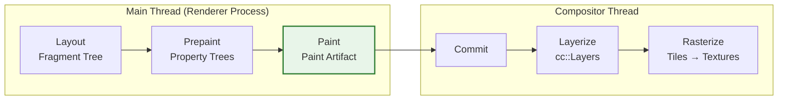

# Critical Rendering Path: Paint Stage

The Paint stage records drawing instructions into display lists—it does not produce pixels. Following [Prepaint](../crp-prepaint/README.md) (property tree construction and invalidation), Paint walks the layout tree and generates a sequence of low-level graphics commands stored in **Paint Artifacts**. These artifacts are later consumed by the [Rasterization](../crp-raster/README.md) stage, which executes them to produce actual pixels on the GPU.

<figure>



<figcaption>The Paint stage within the RenderingNG pipeline (Chromium M94+): Paint produces a Paint Artifact containing display items and paint chunks. CompositeAfterPaint moved layerization after paint, eliminating circular dependencies.</figcaption>

</figure>

## Abstract

Paint is a **recording** phase, not a drawing phase. The key mental model:

```
Fragment Tree + Property Trees → Paint → Paint Artifact (Display Items + Paint Chunks)
```

**Core concepts:**

- **Display Items**: Atomic drawing commands (e.g., `DrawRect`, `DrawTextBlob`) identified by a client pointer (which DOM element) and type. The `PaintController` caches previous display items for reuse.
- **Paint Chunks**: Sequential display items grouped by identical **PropertyTreeState** (transform_id, clip_id, effect_id, scroll_id). Chunks are the unit of compositor layer assignment.
- **Paint Order**: Governed by the CSS stacking context algorithm (CSS 2.1 Appendix E). Elements within a stacking context paint in a strict back-to-front order; different stacking contexts never interleave.

**Why recording, not drawing?**

1. **Resolution independence**: Display lists rasterize at any scale without quality loss (HiDPI, pinch-zoom)
2. **Off-main-thread rasterization**: Artifacts serialize to the compositor/GPU process without blocking JavaScript
3. **Caching**: Unchanged display items are reused; only invalidated items are re-recorded

**Architecture evolution (CompositeAfterPaint, M94+)**: Before M94, compositing decisions happened _before_ paint, creating circular dependencies. Now paint produces a clean artifact first, then layerization occurs—reducing 22,000 lines of code and improving scroll latency by 3.5%+ (99th percentile).

---

## Display Items and the Paint Artifact

Paint transforms the layout tree into a **Paint Artifact**—a data structure containing all information needed for rasterization.

### Display Item Types

Display items are the atomic units of paint output. Each item represents a single drawing operation:

| Type                       | Description                    | Example Source                           |
| :------------------------- | :----------------------------- | :--------------------------------------- |
| `DrawingDisplayItem`       | Contains Skia paint operations | Background colors, borders, text, images |
| `ForeignLayerDisplayItem`  | External content               | Plugins, iframes, `<video>` surfaces     |
| `ScrollbarDisplayItem`     | Scrollbar rendering            | Overlay and classic scrollbars           |
| `ScrollHitTestDisplayItem` | Hit-test regions for scrolling | Scroll containers                        |

**Identity**: Each display item is identified by a **client pointer** (which `LayoutObject` generated it) and a **type enum** (background, foreground, outline, etc.). This identity enables the `PaintController` to match items across frames for caching.

### PaintController and Display Item Caching

The `PaintController` holds the previous frame's paint result as a cache:

> "If some painter would generate results same as those of the previous painting, we'll skip the painting and reuse the display items from cache."
> — [Chromium Paint README](https://chromium.googlesource.com/chromium/src/+/HEAD/third_party/blink/renderer/core/paint/README.md)

**How caching works:**

1. Before painting, the `PaintController` receives the previous artifact
2. During paint, each display item is compared against its cached predecessor by client and type
3. If the item matches exactly (same client, same type, same content), the cached version is reused
4. If different, the new item is recorded and the old one is invalidated

**Subsequence caching** extends this to entire paint subtrees. If a `PaintLayer` hasn't changed, its entire subsequence of display items can be reused without re-walking the layout tree.

### Paint Chunks

Paint chunks partition display items by their **PropertyTreeState**—the 4-tuple `(transform_id, clip_id, effect_id, scroll_id)` from [Prepaint](../crp-prepaint/README.md).

**Why chunks?** During layerization (after paint), the compositor needs to know which display items share the same visual effects. Items with different transform nodes can't be merged into the same compositor layer without visual artifacts. Chunks make this grouping explicit.

**Chunk boundaries occur when:**

- PropertyTreeState changes (different transform, clip, effect, or scroll ancestor)
- Display item type changes require isolation (e.g., foreign layers)
- Hit-test regions need explicit marking

**Real-world example**: A page with 1,000 display items might produce 50 paint chunks. Each chunk references a PropertyTreeState and a contiguous range of display items. The layerization stage maps chunks to `cc::Layer` objects based on compositing requirements.

---

## Paint Order and Stacking Contexts

Paint order is not arbitrary—it follows the CSS stacking context algorithm specified in CSS 2.1 Appendix E. Incorrect paint order produces visual bugs where elements appear behind content they should overlap.

### The Stacking Context Algorithm

For each stacking context, descendants paint in this order:

1. **Stacking context background and borders**
2. **Descendants with negative z-index** (most negative first)
3. **In-flow, non-positioned, block-level descendants**
4. **Non-positioned floats**
5. **In-flow, inline-level descendants** (text, images, inline-blocks)
6. **Positioned descendants with `z-index: auto` or `z-index: 0`**
7. **Positioned descendants with positive z-index** (lowest first)

**Critical property**: Stacking contexts are **atomic**. No descendant of one stacking context can interleave with descendants of a sibling stacking context. This atomicity is why `z-index` on a child cannot escape its parent's stacking context.

### Stacking Context Creation

Properties that create new stacking contexts include:

- `position` (relative/absolute/fixed/sticky) with `z-index` ≠ auto
- `opacity` < 1
- `transform`, `filter`, `perspective`, `clip-path`, `mask`
- `isolation: isolate`
- `mix-blend-mode` ≠ normal
- `will-change` with transform/opacity/filter (in some browsers)
- `contain: paint` or `contain: layout paint`

**Design rationale**: Each property creates a new compositing scope because it requires the subtree to be rendered as a unit before applying the effect. Opacity, for instance, must multiply against the combined alpha of all descendants—not each descendant individually.

### Paint Order Implementation in Blink

Blink implements paint order through **PaintLayerPainter** and **ObjectPainter** classes. The `PaintLayerPainter::Paint()` method walks layers in stacking order, recursively painting:

1. Negative z-index children
2. The layer itself (backgrounds, non-positioned content, floats, inline content)
3. Positive z-index children

**Edge case**: CSS View Transitions can alter paint order dynamically by creating pseudo-elements that participate in the stacking context. Debugging paint order issues during transitions requires inspecting the view-transition pseudo-element tree.

---

## The CompositeAfterPaint Architecture

As of Chromium M94, paint happens **before** compositing decisions—a fundamental shift from the legacy architecture.

### Why CompositeAfterPaint?

**Before M94 (legacy)**:

```
Style → Layout → Compositing → Paint
```

Compositing had to guess which elements needed layers _before_ knowing their paint output. This created circular dependencies:

- Compositing needed to know paint order (which elements overlap)
- Paint order depended on compositing decisions (which elements had layers)

The result: fragile code, 22,000+ lines of heuristics, and difficulty reasoning about behavior.

**After M94 (CompositeAfterPaint)**:

```
Style → Layout → Prepaint → Paint → Layerize → Rasterize
```

Paint produces a clean artifact independent of layer decisions. Layerization examines the artifact and assigns paint chunks to `cc::Layer` objects based on clear criteria.

### Measurable Improvements

The CompositeAfterPaint migration yielded:

| Metric                         | Improvement         |
| :----------------------------- | :------------------ |
| Code removed                   | 22,000 lines of C++ |
| Chrome CPU usage               | -1.3% overall       |
| 99th percentile scroll latency | -3.5%+              |
| 99th percentile input delay    | -2.2%+              |

**Source**: [Chromium BlinkNG](https://developer.chrome.com/docs/chromium/blinkng)

### Paint Chunk → Compositor Layer Mapping

After paint produces chunks, the layerization stage creates `cc::Layer` objects:

1. Each paint chunk has a PropertyTreeState
2. Chunks requiring different composite reasons (e.g., `will-change: transform`) get separate layers
3. Adjacent chunks with compatible states may merge into a single layer
4. Each layer receives a reference to its paint chunks' display items

This separation allows the compositor to optimize layer count independently of paint logic.

---

## Paint Invalidation

Paint invalidation determines which display items need re-recording. While [Prepaint](../crp-prepaint/README.md) marks display item clients as dirty, the actual invalidation logic integrates with paint recording.

### Invalidation Granularity

Paint invalidation operates at two levels:

**Chunk-level invalidation:**

- Triggered when PropertyTreeState changes
- Triggered when display item order within a chunk changes
- The entire chunk's display items are re-recorded

**Display-item-level invalidation:**

- When chunks match (same order, same PropertyTreeState)
- Individual items are compared by client and type
- Only changed items are re-recorded

### Raster Invalidation

After paint produces new display items, the `RasterInvalidator` computes which pixel regions need re-rasterization:

| Invalidation Type | Trigger                                 | Behavior                                             |
| :---------------- | :-------------------------------------- | :--------------------------------------------------- |
| Full              | Layout change, PropertyTreeState change | Invalidates old AND new visual rects                 |
| Incremental       | Geometry change only                    | Invalidates only the delta between old and new rects |

**Real-world example**: A blinking cursor in a text field:

- Only the cursor's `DrawingDisplayItem` is re-recorded (display item invalidation)
- Only the cursor's pixel rect is re-rasterized (~16×20 pixels)
- The surrounding text field's display items are cached and reused

This granular invalidation is why typing in a text field doesn't repaint the entire page.

### Isolation Boundaries (`contain: paint`)

`contain: paint` creates an **isolation boundary**—a barrier that limits invalidation propagation:

```css
.widget {
  contain: paint; /* Isolation boundary */
}
```

**Effects:**

1. Descendants are clipped to the element's padding box
2. A new stacking context is created
3. Paint invalidation inside the boundary doesn't affect outside
4. If the element is off-screen, paint is skipped entirely for the subtree

**Performance impact**: On a page with 50 isolated widgets, invalidating one widget's contents triggers paint only for that widget. Without isolation, invalidation might propagate to sibling widgets or ancestors.

---

## Paint Performance Characteristics

Not all CSS properties have equal paint cost. Understanding relative expense helps diagnose performance issues.

### Expensive vs. Cheap Paint Operations

**Expensive operations:**

| Operation                      | Why Expensive                                      |
| :----------------------------- | :------------------------------------------------- |
| `box-shadow` with large blur   | Generates blur shader; no hardware fast-path       |
| `border-radius` + `box-shadow` | Non-rectangular, can't use nine-patch optimization |
| `filter: blur()`               | Per-pixel convolution                              |
| `mix-blend-mode`               | Requires reading backdrop pixels                   |
| Complex gradients              | Multiple color stops, radial patterns              |
| `background-attachment: fixed` | Repainted every scroll frame                       |

**Cheap operations:**

| Operation      | Why Cheap                    |
| :------------- | :--------------------------- |
| Solid colors   | Single fill operation        |
| Simple borders | Rectangle primitives         |
| `opacity`      | Compositor-only (no repaint) |
| `transform`    | Compositor-only (no repaint) |

### Compositor-Only Properties

Some visual changes skip paint entirely:

- `transform`: Updates PropertyTreeState transform node; no display item change
- `opacity`: Updates PropertyTreeState effect node; no display item change

These changes flow directly to the compositor thread, which applies them during compositing without main-thread involvement.

**Failure mode**: If you animate `left` or `top` instead of `transform`, each frame triggers layout, prepaint, and paint—not just compositor updates. This causes jank when the main thread is busy.

```css
/* ❌ Triggers full pipeline every frame */
.animate-position {
  animation: move 1s;
}
@keyframes move {
  to {
    left: 100px;
  }
}

/* ✅ Compositor-only, smooth even under main-thread load */
.animate-transform {
  animation: slide 1s;
}
@keyframes slide {
  to {
    transform: translateX(100px);
  }
}
```

### DevTools Paint Profiling

Chrome DevTools provides paint debugging:

1. **Performance panel**: Shows "Paint" timing in frame timeline
2. **Rendering tab → Paint flashing**: Green overlays on repainted regions
3. **Layers panel**: Shows compositor layers and their paint reasons

**What to look for:**

- Large green flashes on scroll (indicates main-thread paint, not compositor-only)
- Frequent paint events for static content (indicates invalidation bugs)
- Paint times >10ms (blocks frame budget)

---

## Edge Cases and Failure Modes

### Hit-Test Data Recording

Hit testing is performed in paint order. The paint system records hit-test information alongside visual data:

> "Hit testing is done in paint-order, and to preserve this information the paint system is re-used to record hit test information when painting the background."
> — [Chromium Compositor Hit Testing](https://www.chromium.org/developers/design-documents/compositor-hit-testing/)

**Failure mode**: Non-rectangular opacity or filters can create "holes" in hit-test opaqueness. Clicks in these holes fall through to elements below, even if visually the element appears solid.

### Stacking Context + View Transitions

CSS View Transitions create pseudo-elements (`::view-transition-*`) that participate in stacking contexts. During a transition:

- Old and new content render into separate snapshots
- Pseudo-elements animate between states
- Paint order of transition pseudo-elements can differ from final DOM order

**Gotcha**: Elements with explicit `z-index` during transitions may paint in unexpected order relative to transition pseudo-elements.

### `will-change` Memory Costs

`will-change: transform` promotes elements to compositor layers, consuming GPU memory:

```css
/* ❌ 1000 list items = 1000 layers = memory exhaustion */
.list-item {
  will-change: transform;
}

/* ✅ Promote only during animation */
.list-item.animating {
  will-change: transform;
}
```

**Symptoms of overuse:**

- Checkerboarding (white rectangles) during scroll
- Browser sluggishness
- GPU process crashes on memory-constrained devices

Each layer consumes `width × height × 4 bytes` of GPU memory. A 1920×1080 layer costs ~8MB; 100 such layers consume 800MB.

### `background-attachment: fixed` Performance

Fixed backgrounds repaint on every scroll frame because their position relative to content changes:

```css
/* ❌ Triggers paint every scroll frame */
.hero {
  background-image: url(large-image.jpg);
  background-attachment: fixed;
}
```

This defeats the compositor's ability to scroll content without main-thread involvement.

**Alternative**: Use `position: fixed` on a separate element with `transform: translateZ(0)` to achieve similar visual effect with compositor-only scrolling.

---

## Conclusion

Paint is the recording phase that converts layout geometry into drawing commands. Understanding that paint produces **display items** and **paint chunks**—not pixels—clarifies its role in the rendering pipeline.

Key takeaways:

1. **Paint records, rasterization draws**: Display lists enable caching, resolution independence, and off-main-thread execution
2. **Stacking contexts govern paint order**: The CSS algorithm is deterministic; understanding it prevents z-index bugs
3. **CompositeAfterPaint simplified the architecture**: Paint is now independent of layer decisions, reducing code and improving performance
4. **Invalidation is granular**: Chunk-level and display-item-level caching minimize re-work
5. **`contain: paint` creates isolation**: Boundaries limit invalidation scope and enable paint skipping for off-screen content
6. **Compositor-only properties skip paint**: `transform` and `opacity` animations don't require re-recording

For production optimization, prefer compositor-only animations, use `contain: paint` on independent UI components, and avoid expensive operations like large blur shadows on frequently-changing elements.

---

## Appendix

### Prerequisites

- [Prepaint](../crp-prepaint/README.md): Property trees and paint invalidation marking
- [Layout Stage](../crp-layout/README.md): Fragment tree construction
- [CSS Stacking Context](https://www.w3.org/TR/CSS2/zindex.html): Understanding z-index and paint order
- Familiarity with DevTools Performance panel

### Terminology

| Term                    | Definition                                                                                |
| :---------------------- | :---------------------------------------------------------------------------------------- |
| **Display Item**        | Atomic drawing command in a paint artifact (e.g., `DrawRect`, `DrawTextBlob`)             |
| **Paint Artifact**      | Output of paint stage: display items partitioned into paint chunks                        |
| **Paint Chunk**         | Sequential display items sharing identical PropertyTreeState                              |
| **PropertyTreeState**   | 4-tuple `(transform_id, clip_id, effect_id, scroll_id)` identifying visual effect context |
| **PaintController**     | Component managing display item recording and caching                                     |
| **Stacking Context**    | Isolated 3D rendering context for z-ordering; created by various CSS properties           |
| **CompositeAfterPaint** | Chromium M94+ architecture where paint precedes layerization                              |
| **Isolation Boundary**  | Barrier (e.g., `contain: paint`) limiting paint invalidation propagation                  |
| **Raster Invalidation** | Determining which pixel regions need re-rasterization based on paint changes              |
| **Skia**                | Open-source 2D graphics library executing display item commands                           |

### Summary

- Paint **records** drawing commands into display items; it does not produce pixels
- **Paint Artifacts** contain display items partitioned into **Paint Chunks** by PropertyTreeState
- **Stacking context rules** (CSS 2.1 Appendix E) govern paint order—contexts are atomic and never interleave
- **CompositeAfterPaint** (M94+) moved layerization after paint, eliminating circular dependencies and improving scroll latency 3.5%+
- **PaintController caching** reuses unchanged display items across frames
- **`contain: paint`** creates isolation boundaries for scoped invalidation and off-screen paint skipping
- **Compositor-only properties** (`transform`, `opacity`) bypass paint entirely

### References

- [CSS 2.1: Appendix E - Elaborate description of Stacking Contexts](https://www.w3.org/TR/CSS21/zindex.html) — Specification for paint order algorithm
- [CSS Containment Module Level 2](https://www.w3.org/TR/css-contain-2/) — Specification for `contain: paint` behavior
- [HTML Specification: Update the Rendering](https://html.spec.whatwg.org/multipage/webappapis.html#update-the-rendering) — Where paint fits in the event loop
- [Chromium Blink Paint README](https://chromium.googlesource.com/chromium/src/+/HEAD/third_party/blink/renderer/core/paint/README.md) — Implementation details and caching semantics
- [Chromium Platform Paint README](https://chromium.googlesource.com/chromium/src/+/HEAD/third_party/blink/renderer/platform/graphics/paint/README.md) — Paint artifact and display item structures
- [Chromium RenderingNG Architecture](https://developer.chrome.com/docs/chromium/renderingng-architecture) — Pipeline overview and property tree integration
- [Chromium BlinkNG](https://developer.chrome.com/docs/chromium/blinkng) — CompositeAfterPaint rationale and performance improvements
- [Chromium Slimming Paint](https://www.chromium.org/blink/slimming-paint/) — Evolution from legacy paint to property tree-based architecture
- [Chromium Compositor Hit Testing](https://www.chromium.org/developers/design-documents/compositor-hit-testing/) — Hit test data recording during paint
- [web.dev: Simplify Paint Complexity](https://web.dev/articles/simplify-paint-complexity-and-reduce-paint-areas) — Practical optimization guidance
- [Chrome DevTools: Analyze rendering performance](https://developer.chrome.com/docs/devtools/performance/) — Paint profiling tools
