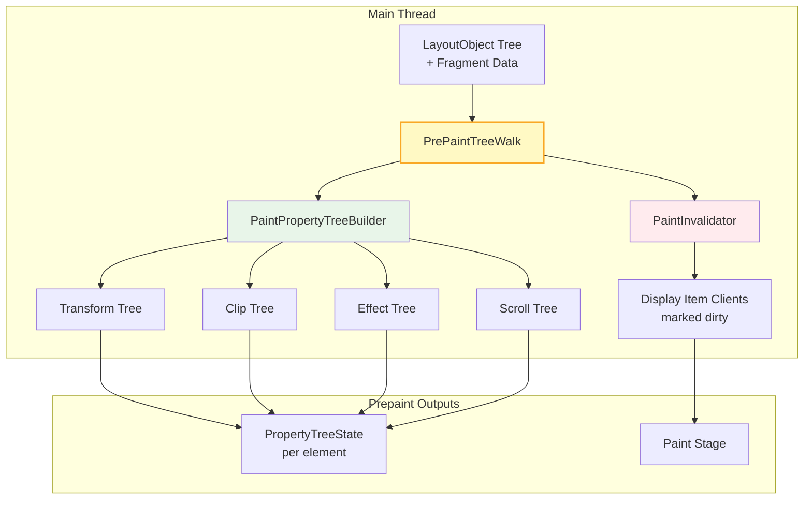

# Critical Rendering Path: Prepaint

Prepaint is a RenderingNG pipeline stage that performs an in-order traversal of the **LayoutObject tree** to build **Property Trees** and compute paint invalidations. It decouples visual effect state (transforms, clips, filters, scroll offsets) from the paint and compositing stages, enabling compositor-driven animations and off-main-thread scrolling.

<figure>



<figcaption>PrePaintTreeWalk traverses the LayoutObject tree, producing four property trees and paint invalidation decisions. Each element receives a PropertyTreeState—a 4-tuple of node references.</figcaption>
</figure>

## Abstract

Prepaint bridges layout geometry and visual rendering through two independent operations:

1. **Property Tree Construction**: Builds four sparse trees (transform, clip, effect, scroll) where each node represents a CSS property that creates a new coordinate space or visual effect. Elements store a `PropertyTreeState`—a 4-tuple `(transform_id, clip_id, effect_id, scroll_id)` pointing to their nearest ancestor nodes in each tree.

2. **Paint Invalidation**: Determines which display items need re-recording by comparing the current visual state against cached paint artifacts.

**Why this matters**: Traditional layer trees required O(layers) traversal to compute any element's final visual state (matrix multiplication through ancestors). Property trees reduce compositor updates to O(affected nodes)—the compositor can apply a different transform matrix by updating a single node, without re-walking layout or paint. This is the architectural foundation for 60fps scrolling and compositor-driven animations even when JavaScript blocks the main thread.

---

## The Problem: O(layers) Compositing Updates

In pre-RenderingNG Chromium (before M94), visual properties were baked into a monolithic **Layer Tree**. Each composited layer stored its own transform matrix, clip rect, and effect values. Computing the final visual state of any element required multiplying matrices through all ancestor layers—an O(layers) operation.

**Concrete impact**: A page with 500 composited layers animating a single element's `transform` would trigger a full layer tree walk on every frame. At 60fps, this meant 30,000 matrix multiplications per second just to update one element. Complex web apps experienced frame drops (jank) whenever the main thread was busy, because scrolling and animations competed for the same layer tree traversal.

### The Slimming Paint Solution

The **Slimming Paint** project (spanning M45–M94) incrementally decoupled visual properties from the layer hierarchy:

| Phase                     | Chromium | Change                                          |
| ------------------------- | -------- | ----------------------------------------------- |
| SlimmingPaintV1           | M45      | Paint using display items                       |
| SlimmingPaintInvalidation | M58      | Property trees introduced in Blink              |
| SlimmingPaintV175         | M67      | Paint chunks with property tree references      |
| BlinkGenPropertyTrees     | M75      | Final property trees generated in Blink, not cc |
| CompositeAfterPaint       | M94      | Compositing decisions moved after paint         |

**Result**: Property trees reduced compositor updates from O(layers) to O(affected nodes). Total Chrome CPU usage dropped 1.3%, with 3.5%+ improvement to 99th percentile scroll latency.

---

## Property Tree Architecture

During Prepaint, the `PaintPropertyTreeBuilder` constructs four sparse trees. Each node represents a CSS property that changes coordinate space or visual effect for its descendants.

### Transform Tree

Stores 4×4 transformation matrices for translations, rotations, scales, and perspective. Each node contains:

- **Transformation matrix**: The local transform (e.g., `rotate(45deg)` → rotation matrix)
- **Transform origin**: The point around which transformations apply (default: `50% 50%`)
- **Flattens inherited transform**: Whether 3D context is preserved or flattened to 2D
- **Rendering context ID**: Groups elements sharing a 3D rendering context

**Design rationale**: Separating transforms into a dedicated tree enables the compositor to update an element's position by swapping a single matrix node. The compositor multiplies matrices lazily—only when drawing—rather than eagerly during main-thread traversal.

**Edge case**: `transform` creates a containing block for `position: fixed` descendants. A `fixed` element inside a transformed parent scrolls with that parent, not the viewport. This surprises developers who expect `fixed` to always be viewport-relative.

```css
.modal-container {
  transform: translateZ(0); /* Promotes to layer */
}

.modal {
  position: fixed; /* Now relative to .modal-container, not viewport! */
  top: 0;
  left: 0;
}
```

### Clip Tree

Defines visible boundaries using float rectangles with optional rounded corners or clip paths. Each node specifies:

- **Clip rectangle**: The clipping boundary in local coordinates
- **Rounded corners**: Border-radius values for soft clips
- **Clip path**: Arbitrary SVG path or CSS shape

**Design rationale**: Separating clips from transforms allows the compositor to update scroll offsets independently. A scroll container's clip rect stays constant while only the scroll offset (in the transform tree) changes—no clip recalculation needed.

**CSS `overflow: clip` vs `hidden`**: Both clip content, but `hidden` allows programmatic scrolling (`scrollTo()`) while `clip` forbids all scrolling. Critically, `clip` doesn't establish a new formatting context, unlike `hidden`. Use `clip` when you need clipping without the side effects of BFC (Block Formatting Context) creation.

### Effect Tree

Manages compositing operations: opacity, filters, blend modes, and masks. Each node contains:

- **Opacity**: The alpha multiplier (0.0–1.0)
- **Filter**: CSS filter functions (`blur()`, `brightness()`, etc.)
- **Blend mode**: How colors combine with backdrop (`multiply`, `screen`, etc.)
- **Mask reference**: Optional clip node constraining effect output

**Design rationale**: Effects like `opacity < 1` create transparency groups—all descendants must be composited together before applying the opacity to the group. Without a dedicated effect tree, the compositor couldn't distinguish "apply opacity to this subtree" from "apply opacity to each element individually."

**Edge case**: `filter` and `opacity` create stacking contexts and containing blocks for fixed/absolute descendants (same as `transform`). A `filter: blur(0)` with no visual effect still triggers these side effects.

**Rendering order** (per CSS Filter Effects spec): filters apply first, then clipping, then masking, then opacity. Getting this wrong produces incorrect visual output when elements combine multiple effects.

### Scroll Tree

Encodes scrollable regions, their offsets, and scroll chaining relationships:

- **Scrollable directions**: Which axes allow scrolling (horizontal, vertical, both)
- **Scroll offset**: Current scroll position (linked to a transform node)
- **Container size vs content size**: Determines scrollbar presence
- **Scroll parent**: Establishes scroll bubbling chain

**Design rationale**: The scroll tree enables **off-main-thread scrolling**. The compositor has all metadata needed to update scroll offsets and transform visible content without main-thread involvement. When JavaScript blocks the main thread for 100ms, scrolling remains smooth because the compositor handles it independently.

**Implementation detail**: Scroll offsets are stored as 2D translations in transform nodes, not directly in scroll nodes. This allows the compositor's transform pipeline to handle scroll position identically to other transforms.

---

## PropertyTreeState: The Per-Element 4-Tuple

After Prepaint, every element stores a `PropertyTreeState`—a 4-tuple of node IDs:

```
PropertyTreeState = (transform_id, clip_id, effect_id, scroll_id)
```

This tuple points to the nearest ancestor nodes in each tree that affect the element. To compute an element's final visual state, the compositor walks from each node to the root, accumulating transforms/clips/effects. Because property trees are sparse (most elements don't create new nodes), these walks are short.

**Example**: A deeply nested `<span>` with no CSS visual properties shares its parent's PropertyTreeState. Only elements with `transform`, `clip-path`, `opacity`, `filter`, `overflow: scroll`, etc., create new tree nodes.

## PrePaintTreeWalk: The LayoutObject Traversal

The `PrePaintTreeWalk` class performs an **in-order traversal** of the LayoutObject tree, beginning from the root `FrameView` and crossing iframe boundaries. This ordering matters: it enables efficient computation of DOM-order relationships like parent containing blocks.

**Correction**: Prepaint traverses the **LayoutObject tree** (created during Style Recalc), not the Fragment Tree. The Fragment Tree provides geometry data, but the traversal follows LayoutObject hierarchy because property tree relationships depend on DOM structure, not physical fragment positions.

### Traversal Steps

For each LayoutObject visited:

1. **Dirty bit check**: If `NeedsPaintPropertyUpdate`, `SubtreeNeedsPaintPropertyUpdate`, or `DescendantNeedsPaintPropertyUpdate` is set, process this node. Otherwise, skip the subtree (major optimization).

2. **Property tree building**: `PaintPropertyTreeBuilder` creates or updates nodes in the four trees based on the element's computed styles. New nodes are created only when CSS properties require them (e.g., `transform`, `clip-path`, `opacity < 1`, `overflow: scroll`).

3. **FragmentData population**: Each LayoutObject's `FragmentData` receives an `ObjectPaintProperties` object pointing to its property tree nodes. Multi-column layouts create multiple FragmentData per LayoutObject.

4. **Paint invalidation**: `PaintInvalidator` compares current visual state against cached paint artifacts, marking display item clients that need re-recording.

### The Dirty Bit System

Prepaint uses three dirty flags to minimize traversal:

| Flag                                 | Scope              | Meaning                        |
| ------------------------------------ | ------------------ | ------------------------------ |
| `NeedsPaintPropertyUpdate`           | Single node        | This node's properties changed |
| `SubtreeNeedsPaintPropertyUpdate`    | Direct descendants | Children need property updates |
| `DescendantNeedsPaintPropertyUpdate` | Deep descendants   | Some descendant needs update   |

**Optimization**: Unchanged subtrees are skipped entirely. On a page with 10,000 elements where only one element's `transform` changed, Prepaint visits only the dirty path from root to that element, not all 10,000 nodes.

### Quick Update Path

Transform and opacity changes can bypass full PrePaintTreeWalk via a "quick update" optimization:

1. During `PaintLayer::StyleDidChange`, the system checks if an update qualifies
2. Qualifying updates are added to a pending list
3. Updates execute directly in `PrePaintTreeWalk::WalkTree`, skipping full traversal

**Qualification criteria**: The change affects only `transform` or `opacity`, with no layout implications. This enables smooth CSS animations without main-thread overhead.

---

## Paint Invalidation

The second output of Prepaint is **paint invalidation decisions**—determining which display items need re-recording during the Paint stage.

### How Invalidation Works

`PaintInvalidator` traverses subtrees marked with invalidation flags, comparing:

- Current computed styles vs. cached styles
- Current geometry vs. cached geometry
- Current property tree state vs. cached state

When differences are detected, the corresponding `DisplayItemClient` is marked dirty. The Paint stage then re-records only dirty items.

### Invalidation Levels

Paint invalidation operates at two granularities:

1. **Paint chunk level**: Matches each paint chunk against previous artifact by ID. If chunks don't match in order, or property trees changed, the entire chunk is invalidated.

2. **Display item level**: When chunks match in order and property trees are unchanged, individual display items are compared for targeted invalidation.

**Real-world example**: Changing an element's `background-color` invalidates only that element's background display item. Changing its `transform` invalidates the paint chunk but potentially allows display item reuse if the chunk simply moves.

### Isolation Boundaries

`contain: paint` establishes an **isolation boundary**—a barrier preventing descendants from being affected by ancestors' property tree changes.

```css
.isolated-widget {
  contain: paint; /* Creates isolation boundary */
}
```

Descendants of an isolation boundary use it as their property tree root. Changes outside the boundary don't trigger invalidation inside it, enabling large subtrees to be skipped during Prepaint.

---

## Compositor-Driven Animations: Bypassing Prepaint

Animations affecting only `transform` or `opacity` can run entirely on the compositor thread, skipping the main thread pipeline (layout, prepaint, paint):

1. The animation system (`AnimationHost` in cc/) maintains active `Animations` on the compositor thread
2. Each animation generates output values via `AnimationCurves`
3. Output values update property tree nodes directly
4. The compositor applies updated transforms/opacity during compositing

**Why only transform and opacity?**: These properties don't affect layout geometry or paint order. The compositor has everything needed (property tree nodes, rasterized tiles) to apply the change without main-thread involvement.

**Failure mode**: If an animation affects layout-dependent properties (e.g., `width`, `left`), it falls back to main-thread animation, running through the full pipeline each frame. This causes jank when the main thread is busy.

```css
/* ✅ Compositor-driven: smooth even when main thread is blocked */
.smooth {
  animation: slide 1s;
}
@keyframes slide {
  to {
    transform: translateX(100px);
  }
}

/* ❌ Main-thread: will jank if main thread is busy */
.janky {
  animation: slide-left 1s;
}
@keyframes slide-left {
  to {
    left: 100px;
  } /* Layout property, forces main thread */
}
```

---

## Real-World Example: Smooth Scrolling Under Load

Consider a news site with infinite scroll, heavy JavaScript analytics, and complex DOM:

```javascript
// Analytics script blocking main thread for 50ms every second
setInterval(() => {
  const start = performance.now()
  while (performance.now() - start < 50) {
    // Simulate heavy computation
  }
}, 1000)
```

**Without property trees (pre-M94)**: During the 50ms block, scrolling freezes. The compositor can't update scroll position because it requires main-thread layer tree traversal.

**With property trees**: The scroll tree contains all metadata the compositor needs. During the 50ms block:

1. User scrolls via touchpad/mouse
2. Compositor receives scroll events directly
3. Compositor updates scroll offset in the scroll tree's transform node
4. Compositor redraws with new scroll position
5. Main thread catches up later, but user sees smooth scrolling

This is why modern browsers achieve responsive scrolling even on pages with expensive JavaScript.

---

## Edge Cases and Gotchas

### Fixed Positioning Inside Transforms

A `position: fixed` element inside a transformed ancestor is positioned relative to that ancestor, not the viewport:

```css
.transformed-parent {
  transform: translateZ(0); /* Any transform, even identity-like */
}

.supposedly-fixed {
  position: fixed;
  top: 0;
  /* Positioned relative to .transformed-parent! */
}
```

This behavior stems from the CSS Transforms spec: transforms create a containing block for fixed descendants. The same applies to `filter`, `perspective`, and `backdrop-filter`.

### `will-change` Memory Cost

`will-change: transform` promotes an element to its own composited layer, consuming GPU memory. Each layer requires:

- Texture memory for the rasterized content
- Property tree nodes
- Compositor bookkeeping

**Failure mode**: Applying `will-change: transform` to hundreds of elements causes GPU memory exhaustion. Symptoms include checkerboarding (white tiles during scroll) and browser sluggishness.

```css
/* ❌ Memory explosion */
.list-item {
  will-change: transform; /* 1000 items = 1000 layers */
}

/* ✅ Promote only during animation */
.list-item.animating {
  will-change: transform;
}
```

### `contain: paint` Breaks Overflow

`contain: paint` clips content to the element's bounds and prevents `position: fixed` descendants from escaping:

```css
.container {
  contain: paint;
}

.tooltip {
  position: fixed; /* Won't escape .container! */
}
```

This is intentional (it creates an isolation boundary), but surprises developers expecting fixed elements to always escape their containers.

### Filter Effects Order

Filters, clips, masks, and opacity apply in a specific order (per CSS Filter Effects spec):

1. **Filter** functions execute first
2. **Clipping** restricts the visible region
3. **Masking** applies luminance/alpha mask
4. **Opacity** multiplies the final result

Getting this wrong in custom rendering produces incorrect output. Browser Prepaint handles this automatically, but understanding the order helps debug visual anomalies.

---

## Performance Debugging

### Identifying Prepaint Bottlenecks

In Chrome DevTools, the Performance panel shows Prepaint as "Pre-Paint" or "Update Layer Tree" (legacy name). Look for:

- **Long Prepaint times** (>5ms): Usually indicates deep dirty subtrees or many property tree changes
- **Frequent Prepaint**: Rapid style changes triggering repeated walks

### Reducing Prepaint Cost

1. **Use `contain: layout paint`**: Limits dirty bit propagation to contained subtrees
2. **Minimize property tree changes**: Batch transform/opacity updates within `requestAnimationFrame`
3. **Avoid layout-triggering properties in animations**: `width`, `height`, `margin` force full pipeline, while `transform` allows quick update path

### DevTools Layers Panel

The Layers panel shows composited layers and their reasons. Each layer has property tree references. Excessive layers indicate potential memory issues from over-promotion.

---

## Conclusion

Prepaint is the architectural linchpin enabling modern web performance. By extracting visual properties into four specialized trees and computing paint invalidation separately from layout, it achieves two critical goals:

1. **Compositor independence**: Transform and opacity animations bypass the main thread entirely
2. **Targeted invalidation**: Only changed display items are re-recorded

The property tree model transformed browser rendering from O(layers) updates to O(affected nodes), making smooth 60fps+ scrolling and animations possible even on pages with complex JavaScript. Understanding Prepaint helps diagnose rendering performance issues and design CSS that works with the architecture rather than against it.

---

## Appendix

### Prerequisites

- [Rendering Pipeline Overview](../crp-rendering-pipeline-overview/README.md): Understanding of the full pipeline from HTML to pixels
- [Layout Stage](../crp-layout/README.md): How the Fragment Tree and LayoutObject Tree are constructed
- [Style Recalculation](../crp-style-recalculation/README.md): How computed styles and the LayoutObject Tree are produced
- Familiarity with CSS visual effects: `transform`, `opacity`, `filter`, `overflow`

### Terminology

| Term                         | Definition                                                                                                             |
| :--------------------------- | :--------------------------------------------------------------------------------------------------------------------- |
| **Property Tree**            | Sparse tree structure storing visual effect state (transform/clip/effect/scroll) independently of the DOM hierarchy    |
| **PropertyTreeState**        | A 4-tuple `(transform_id, clip_id, effect_id, scroll_id)` identifying an element's position in all four property trees |
| **LayoutObject Tree**        | Mutable tree created during Style Recalc, representing elements that generate boxes; Prepaint traverses this tree      |
| **Fragment Tree**            | Immutable tree of `PhysicalFragment` objects with resolved geometry; output of Layout, read by Prepaint                |
| **PrePaintTreeWalk**         | The Chromium class performing in-order LayoutObject traversal to build property trees                                  |
| **PaintPropertyTreeBuilder** | Component creating/updating property tree nodes during Prepaint                                                        |
| **PaintInvalidator**         | Component determining which display items need re-recording                                                            |
| **Isolation Boundary**       | A barrier (e.g., `contain: paint`) preventing property tree changes from propagating into a subtree                    |
| **Compositor Thread**        | Browser thread handling compositing, scrolling, and visual-effect animations without main-thread involvement           |
| **Slimming Paint**           | Multi-year Chromium project (M45–M94) that introduced property trees and decoupled compositing from paint              |

### Summary

- Prepaint traverses the **LayoutObject tree** (not Fragment Tree) to build four **Property Trees**: transform, clip, effect, and scroll
- Each element receives a **PropertyTreeState**—a 4-tuple pointing to its nearest ancestor nodes in each tree
- Property trees reduced compositor updates from O(layers) to O(affected nodes), enabling smooth animations
- **Paint invalidation** determines which display items need re-recording, enabling targeted repaints
- **Dirty bits** (`NeedsPaintPropertyUpdate`, etc.) allow Prepaint to skip unchanged subtrees
- **Quick update path** handles transform/opacity changes without full tree traversal
- Compositor-driven animations (transform, opacity) bypass Prepaint entirely, running on the compositor thread
- `contain: paint` creates **isolation boundaries** that limit invalidation scope

### References

- **W3C CSS Transforms Level 1**: [Specification](https://www.w3.org/TR/css-transforms-1/) — Defines transform property semantics and containing block behavior
- **W3C CSS Overflow Level 3**: [Specification](https://www.w3.org/TR/css-overflow-3/) — Defines overflow clipping and scroll behavior
- **W3C CSS Filter Effects Level 1**: [Specification](https://www.w3.org/TR/filter-effects-1/) — Defines filter functions and their rendering order
- **W3C CSS Masking Level 1**: [Specification](https://www.w3.org/TR/css-masking-1/) — Defines clipping paths and masking
- **W3C CSSOM View Module**: [Specification](https://drafts.csswg.org/cssom-view/) — Defines scrolling APIs and behavior
- **Chromium Blink Paint README**: [Source Documentation](https://chromium.googlesource.com/chromium/src/+/HEAD/third_party/blink/renderer/core/paint/README.md) — Detailed Prepaint implementation
- **Chromium RenderingNG Architecture**: [Design Document](https://developer.chrome.com/docs/chromium/renderingng-architecture) — Pipeline overview and property trees
- **Chromium RenderingNG Data Structures**: [Design Document](https://developer.chrome.com/docs/chromium/renderingng-data-structures) — Property tree implementation details
- **Chromium BlinkNG**: [Design Document](https://developer.chrome.com/docs/chromium/blinkng) — Containment principles and geometry centralization
- **Chromium Slimming Paint**: [Project Overview](https://www.chromium.org/blink/slimming-paint/) — Evolution timeline and performance improvements
- **Chromium How cc Works**: [Technical Document](https://chromium.googlesource.com/chromium/src/+/master/docs/how_cc_works.md) — Compositor internals and property tree usage
