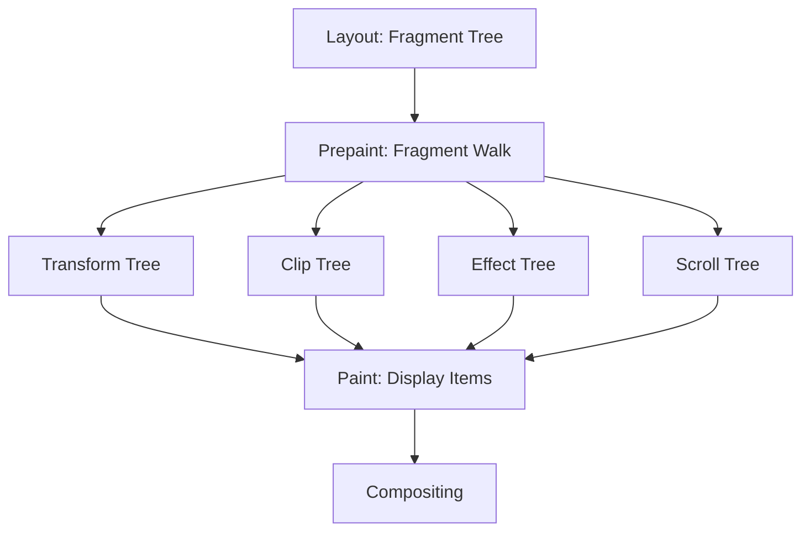

# Critical Rendering Path: Prepaint

Prepaint is a modern rendering pipeline stage that walks the fragment tree to generate **Property Trees**, effectively decoupling layout geometry from the paint and compositing stages. It acts as the "linker" that prepares the visual hierarchy for high-performance rendering.

<figure>



<figcaption>The Prepaint stage transforms the fragment tree into independent property trees, enabling efficient compositor-thread updates.</figcaption>
</figure>

## TLDR

### The Pivot

Prepaint shifts the responsibility of coordinate space and effect state management from the layer hierarchy to a dedicated set of trees. This allows the browser to handle changes in transforms or opacity without re-running layout or full paint.

### The Problem

Legacy browser engines baked property state (like clips and transforms) into a single layer tree. Updating an animation on a single node often required a full `O(N)` walk of the layer hierarchy to re-calculate inherited states, causing frame drops (jank).

### The Solution

By generating immutable **Property Trees** during Prepaint, the compositor can resolve the final visual state of any element by simple index lookups. This enables features like "threaded scrolling" and high-frequency animations to run entirely on the compositor thread.

---

## The Legacy Debt: The "Layer Explosion" Problem

In early versions of WebKit and Chromium, visual properties like `position: fixed` or `clip-path` forced the engine to create new layers (Composited Layers). As web applications became more complex, this led to a "layer explosion" where thousands of layers were created, consuming massive amounts of memory and CPU cycles during tree synchronization.

Prepaint was introduced as part of the **RenderingNG** (specifically Slimming Paint v2) initiative to solve this. Instead of a flat list of layers, the engine now uses property trees to represent the hierarchy of visual effects.

## Property Tree Taxonomy

During the Prepaint walk, the engine builds four primary trees. Each node in these trees represents a change in state that affects its descendants.

### 1. Transform Trees

Transform trees store 4x4 matrices for translations, rotations, and scales. They also handle the relationship between different coordinate spaces (e.g., from the viewport to a nested `iframe`).

- **Optimization**: When an element's `transform` changes, only the specific node in the Transform Tree is updated. The compositor then re-multiplies the matrices without needing to re-paint the element.

### 2. Clip Trees

Clip trees define the visible boundaries of elements. This includes `overflow: hidden`, `clip-path`, and rounded corners (`border-radius`).

- **Design Choice**: By separating clips from transforms, the engine can apply a "scroll clip" once and then simply update the scroll offset in the Transform Tree.

### 3. Effect Trees

Effect trees manage "non-atomic" visual properties like `opacity`, `filter`, and `mix-blend-mode`.

- **Edge Case**: Properties like `opacity < 1` create a new transparency group. If not handled during Prepaint, the engine might incorrectly blend overlapping elements that should have been grouped together.

### 4. Scroll Trees

Scroll trees track scrollable areas, their offsets, and how they chain together (scroll bubbling).

- **Real-world Impact**: This allows the "Compositor Thread" to handle scrolling even when the "Main Thread" is busy executing heavy JavaScript, as the scroll tree provides all the necessary metadata for independent movement.

## The Fragment Tree Walk

Prepaint operates on the **Fragment Tree** (the output of Layout). As it traverses the tree:

1.  **State Tracking**: It maintains a stack of current property tree indices.
2.  **Invalidation Check**: It determines if any display items (cached paint results) need to be invalidated. For example, if a background color changed but the geometry remained the same, it marks the element for "Paint" but skips "Layout".
3.  **Property Mapping**: It assigns each fragment a set of indices pointing to its relevant nodes in the Transform, Clip, Effect, and Scroll trees.

## Real-world Example: Parallax Scrolling

Consider a parallax effect where a background image moves at half the speed of the scroll:

```css
.parallax-bg {
  transform: translateY(calc(var(--scroll-y) * 0.5));
  will-change: transform;
}
```

1.  **Without Prepaint**: Every scroll event would trigger a main-thread task to re-calculate the layer's position, likely causing jank.
2.  **With Prepaint**: The background is assigned its own node in the **Transform Tree**. The compositor can update this node's matrix independently of the main scroll offset, achieving a smooth 60fps/120fps effect.

---

## Conclusion

Prepaint is the architectural bridge that enables modern web performance. By extracting visual properties into specialized trees, it isolates the expensive calculations of "what things look like" from the geometry of "where things are," allowing browsers to leverage GPU-accelerated compositing to its full potential.

---

## Appendix

### Prerequisites

- **Critical Rendering Path Overview**: Knowledge of the pipeline from HTML to Pixels.
- **Layout (Reflow)**: Understanding how the Fragment Tree is constructed.
- **Compositor Basics**: Familiarity with how the browser uses the GPU for rendering.

### Terminology

| Term                  | Definition                                                                                              |
| :-------------------- | :------------------------------------------------------------------------------------------------------ |
| **Property Tree**     | A data structure representing visual effects (transforms, clips, etc.) independently of the layer tree. |
| **Fragment Tree**     | The immutable output of the Layout stage representing the geometry of elements.                         |
| **Compositor Thread** | The thread responsible for combining layers and producing frames for the display.                       |
| **Slimming Paint**    | The multi-year project in Chromium to refactor the rendering pipeline for better performance.           |

### Summary

- Prepaint walks the **Fragment Tree** to build **Property Trees**.
- Property Trees (Transform, Clip, Effect, Scroll) decouple visual effects from layout.
- This decoupling prevents "Layer Explosion" and enables high-performance animations on the compositor thread.
- Prepaint identifies which parts of the screen need to be repainted (Invalidation).

### References

- **CSS Transforms Level 1**: [W3C Specification](https://www.w3.org/TR/css-transforms-1/)
  > "The transform property... creates a new local coordinate system... affecting the rendering of the element and its descendants."
- **Chromium: RenderingNG**: [Design Document](https://developer.chrome.com/docs/chromium/renderingng-architecture)
- **Chromium: Property Trees**: [Technical Overview](https://www.chromium.org/developers/design-documents/compositor-thread-architecture/)
- **CSS Overflow Level 3**: [W3C Specification](https://www.w3.org/TR/css-overflow-3/)
