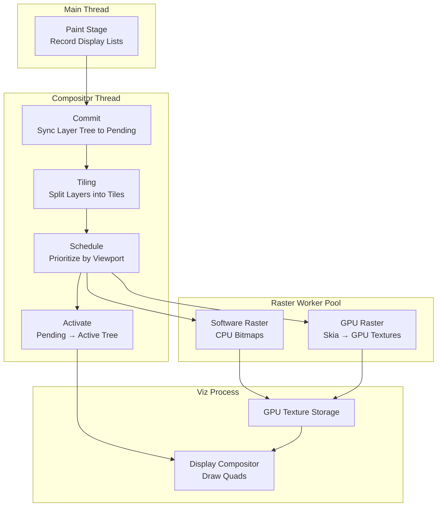

# Critical Rendering Path: Rasterization

Rasterization is the process where the browser converts recorded display lists into actual pixels—bitmaps for software raster or GPU textures for hardware-accelerated paths. This stage marks the transition from abstract paint commands to concrete visual data. In Chromium, rasterization is managed by the compositor thread and executed by worker threads, ensuring smooth interactions even when the main thread is saturated with JavaScript or layout work.

<figure>



<figcaption>The Rasterization Pipeline: Display lists flow from the main thread through tiling and scheduling on the compositor thread, then to worker threads for rasterization, with final textures consumed by the Viz process's display compositor.</figcaption>

</figure>

## Abstract

Rasterization converts display lists into pixels through a tiled, prioritized, multi-threaded architecture designed around three constraints: GPU memory is finite, users scroll faster than pixels can be drawn, and the main thread must remain free for JavaScript.

**The Core Model:**

- **Tiling**: Layers are divided into fixed-size tiles (256×256 px for software, viewport-width × ¼ viewport-height for GPU raster) to bound memory usage and enable incremental rasterization
- **Dual-Tree Architecture**: Pending tree rasterizes new content while active tree continues drawing—activation only occurs when tiles are ready, preventing checkerboard artifacts
- **Prioritization**: Tiles are binned by urgency (NOW, SOON, EVENTUALLY, NEVER) based on viewport distance and scroll velocity, with GPU memory budget distributed in priority order
- **Out-of-Process Execution**: The Viz process owns GPU resources; renderer processes serialize paint commands over IPC (Inter-Process Communication) for security isolation

**The Evolution**: Chromium is transitioning from Ganesh (OpenGL-centric, single-threaded) to Graphite (Vulkan/Metal/D3D12, multi-threaded with depth testing). Graphite achieves ~15% performance gains through reduced overdraw and pipeline pre-compilation.

---

## The Mechanics of Rasterization

Rasterization does not happen all at once for the entire page. The browser employs a tiling system, dual-tree architecture, and priority scheduling to handle documents that may be orders of magnitude larger than available GPU memory.

### From Display Lists to Tiles

Once the [Paint](../crp-paint/README.md) stage records drawing commands into `cc::PaintRecord` (a serializable sequence of Skia operations), the compositor thread takes ownership. Rather than rasterizing entire layers, it decomposes them into **tiles**.

**Why Tiling?** A long-scrolling page might be 50,000 pixels tall. Rasterizing this into a single texture would:

- Exceed GPU memory limits (a 4K layer consumes ~33MB of VRAM (Video Random Access Memory))
- Create massive latency before any pixels appear
- Waste resources on off-screen content the user may never see

**Tile Sizes** vary by rasterization mode:

| Mode            | Tile Dimensions                    | Rationale                                                                          |
| :-------------- | :--------------------------------- | :--------------------------------------------------------------------------------- |
| Software Raster | 256×256 px                         | Small tiles allow fine-grained priority; worker threads can complete tiles quickly |
| GPU Raster      | Viewport width × ¼ viewport height | Larger tiles reduce draw call overhead; GPU handles large textures efficiently     |

Tiles are managed by `PictureLayerImpl`, which maintains multiple `PictureLayerTiling` objects at different scale factors. A 512×512 layer at 1:1 scale produces four 256×256 tiles, but the same layer might have a single 256×256 tile at 1:2 scale for lower-resolution fallbacks during fast scrolling.

### The Dual-Tree Architecture

A critical design decision in Chromium's compositor is the separation between **pending** and **active** layer trees:

- **Pending Tree**: Receives new content from commits; tiles are rasterized here
- **Active Tree**: Currently being displayed; animations and scrolling read from this tree
- **Recycle Tree**: Cached pending tree for allocation reuse

**Why Two Trees?** Without this separation, activating a new commit would immediately expose partially-rasterized content as "checkerboard" artifacts (gray or white rectangles where tiles haven't finished). The dual-tree design ensures activation only occurs when the pending tree's tiles are sufficiently rasterized.

The `TileManager` controls activation timing. It tracks which tiles are required for the current viewport, which are desirable for smooth scrolling, and which can be deferred. Activation proceeds only when "NOW" priority tiles are ready.

### Tile Prioritization

Tiles are assigned to priority bins based on heuristics:

| Priority Bin | Criteria                    | Treatment                                      |
| :----------- | :-------------------------- | :--------------------------------------------- |
| NOW          | Visible in viewport         | Must complete before activation                |
| SOON         | Within ~1 viewport distance | High priority; prevents checkerboard on scroll |
| EVENTUALLY   | Further from viewport       | Rasterized when workers are idle               |
| NEVER        | Off-screen, no scroll path  | Skipped entirely; memory reclaimed             |

The `TileManager` distributes the GPU memory budget in priority order. If memory is constrained, lower-priority tiles are evicted or never rasterized. Scroll velocity affects binning—fast scrolls increase the "SOON" radius.

---

## Rasterization Paths: Software vs. GPU

Chromium supports two rasterization paths, selected based on device capabilities, content complexity, and compositor settings.

### Software Rasterization

Worker threads execute paint commands using Skia's CPU rasterizer, producing bitmaps in shared memory. The `SoftwareImageDecodeCache` handles image decode, scaling, and color correction as prerequisite tasks.

**Buffer Providers:**

- **ZeroCopyRasterBufferProvider**: Maps GPU memory directly; zero CPU-to-GPU copy
- **OneCopyRasterBufferProvider**: Rasterizes to shared memory, then uploads to GPU; required when direct mapping isn't available

Software raster remains the fallback when GPU acceleration fails (driver bugs, unsupported content) and is sometimes faster for very simple content where GPU overhead dominates.

### GPU Rasterization (OOP-R)

Modern Chromium uses **Out-of-Process Rasterization (OOP-R)** (Out-of-Process Rasterization). The renderer process doesn't execute GPU commands directly—it serializes paint operations into a command buffer that the **Viz process** (GPU process) executes.

**Why OOP-R?**

1. **Security**: Renderer processes are sandboxed; they cannot access platform 3D APIs directly
2. **Stability**: GPU driver crashes don't take down the renderer
3. **Parallelism**: CPU and GPU work can overlap across process boundaries

The Viz process uses Skia to execute commands against the actual GPU. Resources are shared via **mailboxes** (opaque identifiers) and synchronized through **sync tokens**.

### Ganesh vs. Graphite: The Backend Evolution

Skia's GPU backend has evolved significantly:

**Ganesh (Legacy)**:

- Designed around OpenGL semantics
- Single-threaded command submission
- No depth testing—overdraw handled by painter's algorithm
- Specialized shader pipelines created performance cliffs (unpredictable hitches when new pipelines compile during animation)

**Graphite (Current/Future)**:

- Built for Vulkan, Metal, and D3D12
- Multi-threaded by default: independent `Recorder` objects produce `Recording` instances on worker threads
- Depth testing for 2D: each draw receives a z-value, allowing opaque objects to be reordered while the depth buffer maintains correctness—reduces overdraw
- Consolidated pipeline compilation at startup, not during animation

> As of Chrome 125+ (mid-2024), Graphite is enabled by default on Apple Silicon Macs. Windows support (via Dawn's D3D11/D3D12 backends) is in progress. The flag `--skia-graphite-backend` enables it on other platforms.

**Performance Impact**: Graphite achieves ~15% improvement on MotionMark 1.3 benchmarks on M3 MacBooks, with measurable improvements in INP (Interaction to Next Paint), LCP (Largest Contentful Paint), and dropped frame rates.

---

## Layerization and Promotion

The compositor decides which parts of the DOM (Document Object Model) should live on their own **composited layers**. This decision, called **layer promotion**, trades memory for animation performance.

### Promotion Criteria

Elements are promoted when they meet criteria suggesting frequent changes or GPU-native content:

| Trigger            | Example                           | Why                                         |
| :----------------- | :-------------------------------- | :------------------------------------------ |
| Explicit hint      | `will-change: transform`          | Developer signals intent to animate         |
| 3D transforms      | `translate3d()`, `perspective`    | Already GPU-native operations               |
| Hardware content   | `<video>`, `<canvas>`, `<iframe>` | Content rendered by GPU or separate process |
| Opacity animation  | `opacity` in CSS animation        | Opacity is a compositor-only property       |
| Overlap correction | Element above a promoted layer    | Prevents incorrect z-ordering artifacts     |

### The Overlap Problem

When a promoted element sits above a non-promoted element in z-order, the browser may **force-promote** the lower element to maintain correctness. Without this, the compositor would blend layers incorrectly since it doesn't have z-buffer information across layers.

This can cascade: one promoted element causes neighbors to promote, which causes their neighbors to promote—resulting in **layer explosion**.

### Layer Squashing

To mitigate layer explosion, the compositor uses **squashing**: multiple overlapping elements that would be promoted for overlap reasons are merged into a single composited layer when possible. This bounds memory growth while preserving correctness.

**When Squashing Fails:**

- Different blend modes between elements
- Different opacity values
- Transform animations that would require re-rasterization
- Elements requiring different scroll containers

---

## Why Graphics Layers Enable 60fps

The primary benefit of layerization is bypassing the main thread for common interactions.

### Compositor-Only Properties

When an element is on its own layer and you animate **compositor-only properties** (`transform`, `opacity`), the pipeline shortcuts to:

1. **Main Thread**: Idle (or busy with JS (JavaScript))
2. **Compositor Thread**: Receives animation tick, updates transform/opacity values in property trees
3. **GPU**: Re-composites existing textures with new transformation matrix

No re-layout, no re-paint, no re-raster. The textures already exist; only the final blend changes.

```css title="Compositor-Only vs Full-Pipeline Animation"
/* ❌ Triggers Layout → Paint → Raster → Composite */
.animate-position {
  transition: top 0.2s;
}

/* ✅ Triggers only Composite */
.animate-transform {
  transition: transform 0.2s;
}
```

### Real-World Example: Fixed Headers

A `position: fixed` header is typically promoted to its own layer. During scroll:

- The content layer's texture is shifted by the scroll offset
- The header layer's texture remains static at viewport position
- The display compositor blends these textures at different offsets

The GPU performs a simple texture blend—no main thread involvement, no rasterization.

---

## Operational Trade-offs and Failure Modes

Layer promotion and GPU rasterization are not free. Understanding the costs prevents performance regressions.

### Memory Pressure

Each composited layer consumes GPU memory proportional to its pixel area:

**Formula**: `Width × Height × 4 bytes (RGBA (Red, Green, Blue, Alpha))`

| Layer Size          | Memory (RGBA) |
| :------------------ | :------------ |
| 1920×1080 (Full HD) | ~8 MB         |
| 2560×1440 (QHD)     | ~14 MB        |
| 3840×2160 (4K)      | ~33 MB        |

Mobile devices with 2-4 GB total RAM and shared GPU memory can exhaust resources quickly. Symptoms: compositor falls back to software raster, animations stutter, browser process crashes.

### Texture Upload Latency

When content changes (e.g., `background-color`), the browser must:

1. Re-rasterize affected tiles
2. Upload new texture data from CPU to GPU memory

On memory-bandwidth-constrained devices, uploading a single 512×512 texture can take 3-5ms—enough to drop a frame. The compositor throttles uploads to avoid this, but rapid content changes can still cause jank.

### The Checkerboard Effect

When scroll velocity exceeds rasterization throughput, the compositor displays the active tree's textures while the pending tree hasn't finished rasterizing new viewport content. Users see empty rectangles (historically gray checkerboard patterns).

**Mitigations:**

- Pre-rasterize tiles outside the viewport (configurable radius)
- Use lower-resolution fallback tilings during fast scroll
- Async image decode prevents blocking raster on image data

**When Mitigations Fail:**

- Extremely fast flings (flick-scroll)
- Complex content (heavy SVG, many layers)
- Memory pressure evicting pre-rasterized tiles

### GPU Process Crashes

Since rasterization runs in the Viz process with real GPU access, driver bugs can crash it. Chromium handles this:

- Viz process restarts automatically
- Renderer processes reconnect
- Visible as brief black flash or texture loss

Frequent crashes may trigger fallback to software rendering for stability.

---

## Conclusion

Rasterization is the heavy-lifting stage where abstract paint commands become concrete pixels. The tiled, dual-tree, priority-based architecture exists to solve fundamental constraints: GPU memory is limited, users scroll unpredictably fast, and the main thread must remain available for JavaScript.

For production optimization:

1. **Minimize layer count**: Each layer costs memory; use `will-change` sparingly
2. **Prefer compositor-only animations**: `transform` and `opacity` skip the entire main-thread pipeline
3. **Avoid unnecessary repaints**: Color and background changes trigger texture re-upload
4. **Test on constrained devices**: Desktop GPU memory hides problems that manifest on mobile

The transition from Ganesh to Graphite represents Chromium's investment in modern GPU APIs, multi-threaded rasterization, and reduced overdraw—improvements that compound as web content grows more complex.

---

## Appendix

### Prerequisites

- **[Paint Stage](../crp-paint/README.md)**: Understanding how display lists (paint records) are generated
- **[Compositing](../crp-composit/README.md)**: How layers are assembled into the final frame
- **GPU Architecture Basics**: Distinction between system RAM and VRAM; texture upload costs

### Terminology

| Term                         | Definition                                                                                   |
| :--------------------------- | :------------------------------------------------------------------------------------------- |
| **OOP-R**                    | Out-of-Process Rasterization; Skia executes in the Viz (GPU) process, not the renderer       |
| **Viz Process**              | Chromium's GPU process; owns GPU resources, runs display compositor                          |
| **VRAM**                     | Video RAM; dedicated GPU memory for textures                                                 |
| **Skia**                     | Open-source 2D graphics library used by Chrome, Android, and Flutter                         |
| **Ganesh**                   | Skia's legacy OpenGL-based GPU backend                                                       |
| **Graphite**                 | Skia's modern GPU backend for Vulkan/Metal/D3D12; multi-threaded with depth testing          |
| **Tiling**                   | Dividing large surfaces into fixed-size rectangles for independent rasterization             |
| **Checkerboarding**          | Visual artifact when tiles haven't been rasterized before becoming visible                   |
| **Layer Squashing**          | Merging multiple overlapping promoted elements into a single layer to reduce memory          |
| **Compositor-Only Property** | CSS properties (`transform`, `opacity`) that can be animated without main thread involvement |

### Summary

- Rasterization converts **paint records** into **GPU textures** (or CPU bitmaps)
- **Tiling** bounds memory usage and enables incremental rasterization (256×256 px software, viewport-based GPU)
- **Dual-tree architecture** (pending/active) prevents checkerboard artifacts during commits
- **Tile prioritization** (NOW/SOON/EVENTUALLY/NEVER) ensures viewport content renders first
- **OOP-R** isolates GPU operations in the Viz process for security and stability
- **Graphite** replaces Ganesh with multi-threaded, depth-tested rasterization (~15% gains)
- **Layer promotion** enables 60fps animations but costs memory; **squashing** mitigates explosion
- Trade-offs: VRAM pressure, texture upload latency, checkerboarding on fast scroll

### References

- [Chromium: How cc Works](https://chromium.googlesource.com/chromium/src/+/HEAD/docs/how_cc_works.md) — Definitive guide to Chrome's compositor architecture
- [Chromium: Impl-Side Painting](https://www.chromium.org/developers/design-documents/impl-side-painting/) — Dual-tree architecture and tile prioritization
- [Chromium: RenderingNG Architecture](https://developer.chrome.com/docs/chromium/renderingng-architecture) — Process model and Viz integration
- [Chromium: GPU Accelerated Compositing](https://www.chromium.org/developers/design-documents/gpu-accelerated-compositing-in-chrome/) — Layer promotion criteria and texture management
- [Chromium Blog: Introducing Skia Graphite](https://blog.chromium.org/2025/07/introducing-skia-graphite-chromes.html) — Graphite architecture and performance improvements
- [W3C: CSS Compositing and Blending Level 1](https://www.w3.org/TR/compositing-1/) — Specification for layer compositing operations
- [web.dev: Stick to Compositor-Only Properties](https://web.dev/articles/stick-to-compositor-only-properties-and-manage-layer-count) — Practical guidance on layer management
- [Chrome Developers: Inside look at modern web browser (Part 3)](https://developer.chrome.com/blog/inside-browser-part3/) — Compositing and rasterization overview
