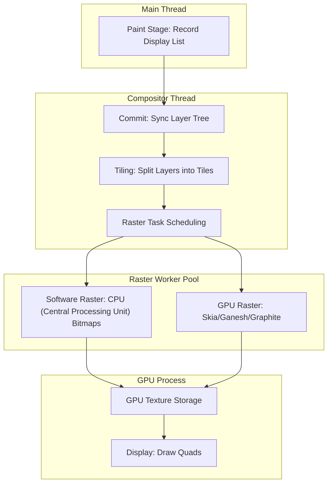

# Critical Rendering Path: Rasterization

Rasterization is the process where the browser converts recorded display lists into actual pixels (bitmaps or GPU (Graphics Processing Unit) textures). This stage marks the transition from abstract paint commands to concrete visual data, primarily managed by the compositor thread to ensure smooth interactions even when the main thread is saturated.

<figure>



<figure-caption>The Rasterization Pipeline: From display list recording on the main thread to texture generation in the GPU process.</figure-caption>

</figure>

## TLDR

### The Bridge to Pixels

- **Input**: Display lists (paint records) from the [Paint Stage](../crp-paint-stage/README.md).
- **Output**: Bitmaps (software) or textures (GPU) ready for the display compositor.
- **Owner**: Managed by the Compositor Thread; executed by Raster Worker Threads.

### Tiling & Prioritization

- **Tiling**: Layers are split into fixed-size tiles (e.g., 256×256px) to manage memory and performance.
- **Prioritization**: Tiles within or near the viewport are rasterized first to minimize "checkerboarding" during scrolls.

### Hardware Acceleration

- **OOP-R (Out-of-Process Rasterization)**: Modern browsers send paint commands to the GPU process to be executed directly on the hardware via Skia.
- **Layer Promotion**: Specific CSS properties trigger the creation of dedicated graphics layers, offloading work from the main thread.

---

## The Mechanics of Rasterization

Rasterization does not happen all at once for the entire page. Instead, the browser employs a sophisticated tiling and scheduling system to handle massive documents efficiently.

### Display Lists to Tiles

Once the [Paint](../crp-paint-stage/README.md) stage records "what" to draw, the **Compositor Thread** takes ownership. It doesn't rasterize the whole layer; it breaks it into **Tiles**.

- **Why Tiling?**: A single long-scrolling page might be 10,000 pixels high. Rasterizing this into one massive bitmap would exceed GPU memory limits (VRAM (Video Random Access Memory)) and cause significant latency.
- **Tile Sizes**: Typically 256×256 or 512×512 pixels. In GPU rasterization, tiles may be sized based on viewport dimensions.

### OOP-R and Skia

In modern Chromium, rasterization is "Out-of-Process" (OOP-R). The compositor sends serialized paint commands over IPC (Inter-Process Communication) to the GPU process.

1.  **Serialization**: Paint commands (like `drawRect`, `drawText`) are bundled.
2.  **GPU Execution**: The GPU process receives these commands and uses **Skia** (the graphics engine) to execute them.
3.  **Backends**: Skia can target different backends:
    - **Ganesh**: Traditional GL (Graphics Library)-based rasterization.
    - **Graphite**: Modern Vulkan/Metal/Dawn-based rasterization for lower overhead.

---

## Layerization and Promotion

The compositor decides which parts of the DOM (Document Object Model) should live on their own "Composited Layers." This is known as **Layer Promotion**.

### Promotion Criteria

Browsers promote elements to a graphics layer when they meet specific criteria that suggest they will change frequently or require isolation:

- **Explicit Hints**: `will-change: transform`, `will-change: opacity`.
- **3D Transforms**: `translate3d`, `rotate3d`, `perspective`.
- **Hardware-accelerated tags**: `<video>`, `<canvas>`, `<iframe>`.
- **Overlapping**: If a promoted element sits "above" a non-promoted element, the browser may promote the latter to prevent "correctness" issues (the overlap problem).

### The Squashing Logic

Too many layers lead to "Layer Explosion," consuming excessive memory. The compositor uses **Layer Squashing** to merge multiple overlapping elements into a single graphics layer where possible, balancing memory vs. redraw costs.

---

## Why Graphics Layers Enable 60fps

The primary benefit of layerization is the ability to bypass the main thread for common interactions.

### The Pipeline Shortcut

When an element is on its own graphics layer and you animate a **Compositor-Only Property** (like `transform` or `opacity`), the browser follows a shortcut:

1.  **Main Thread**: Idle (or busy with JS (JavaScript)).
2.  **Compositor Thread**: Receives the animation update.
3.  **GPU**: Re-composites existing textures with a new transformation matrix.

```css title="Performance Comparison"
/* ❌ BAD: Triggers Layout + Paint + Raster + Composite */
.animate-position {
  transition: top 0.2s;
}

/* ✅ GOOD: Triggers only Composite */
.animate-transform {
  transition: transform 0.2s;
}
```

### Real-World Example: Fixed Headers

A `position: fixed` header is often promoted to its own layer. When the user scrolls:

- The content layer's texture is shifted.
- The header layer's texture remains static.
- The GPU simply blends these two textures at different offsets.

---

## Operational Trade-offs and Failure Modes

As a principal engineer, you must account for the hidden costs of "hardware acceleration."

### Memory Pressure (VRAM)

Each layer is essentially a large array of pixel data.

- **Formula**: `Width × Height × 4 bytes (RGBA (Red, Green, Blue, Alpha))`.
- **Impact**: A full-screen 4K layer (3840×2160) consumes ~33MB of VRAM. Mobile devices with limited memory can crash or exhibit "jank" if too many layers are created.

### Texture Upload Latency

If you trigger a repaint (e.g., changing `color` or `background-color`), the browser must:

1.  Re-rasterize the affected tiles.
2.  **Upload** the new texture from CPU memory to GPU memory.
    Large uploads can cause frame drops, even if the rasterization itself was fast.

### The "Checkerboard" Effect

When you scroll faster than the raster threads can keep up, you see empty space—often called "checkerboarding."

- **Mitigation**: The compositor uses "Pre-paint" to rasterize tiles slightly outside the viewport, but extreme scroll velocities can still outrun the worker pool.

---

## Conclusion

Rasterization is the heavy-lifting stage of the rendering pipeline. By understanding how the compositor utilizes tiling, OOP-R, and layer promotion, engineers can design interfaces that remain responsive under load. The goal is to maximize the use of the compositor thread while minimizing the memory footprint and texture upload overhead of excessive layerization.

---

## Appendix

### Prerequisites

- **[Paint Stage](../crp-paint-stage/README.md)**: Understanding how display lists are recorded.
- **GPU Architecture Basics**: Knowledge of how VRAM and textures differ from system RAM.

### Terminology

| Term                | Definition                                                                                     |
| :------------------ | :--------------------------------------------------------------------------------------------- |
| **OOP-R**           | Out-of-Process Rasterization; running Skia in the GPU process.                                 |
| **VRAM**            | Video RAM; dedicated memory on the graphics card for textures.                                 |
| **Skia**            | The open-source 2D graphics library used by Chrome, Android, and Flutter.                      |
| **Tiling**          | The strategy of dividing a large surface into smaller manageable rectangles.                   |
| **Checkerboarding** | The visual artifact when a user scrolls to a part of the page that hasn't been rasterized yet. |

### Summary

- Rasterization converts **Paint Records** into **GPU Textures**.
- The **Compositor Thread** manages the process, while **Worker Threads** perform the work.
- **Tiling** prevents memory exhaustion for large documents.
- **Layer Promotion** enables 60fps animations by offloading work to the GPU.
- Excessive layers cause **Memory Pressure** and **Texture Upload Latency**.

### References

- **[Chromium: How cc Works](https://chromium.googlesource.com/chromium/src/+/master/docs/how_cc_works.md)**: The definitive guide to the Chrome Compositor.
- **[W3C: CSS Compositing and Blending](https://www.w3.org/TR/compositing-1/)**: The specification for how layers should be combined.
- **[web.dev: Stick to Compositor-Only Properties](https://web.dev/articles/stick-to-compositor-only-properties-and-manage-layer-count)**: Practical performance advice.
- **[GPU Accelerated Compositing in Chrome](https://www.chromium.org/developers/design-documents/gpu-accelerated-compositing-in-chrome/)**: Historical context on the transition to GPU rendering.
