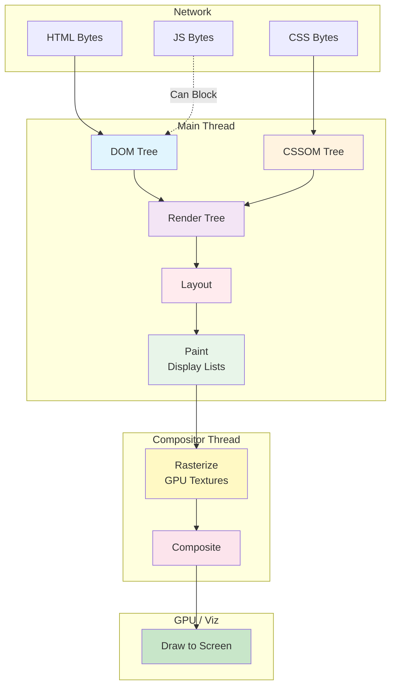
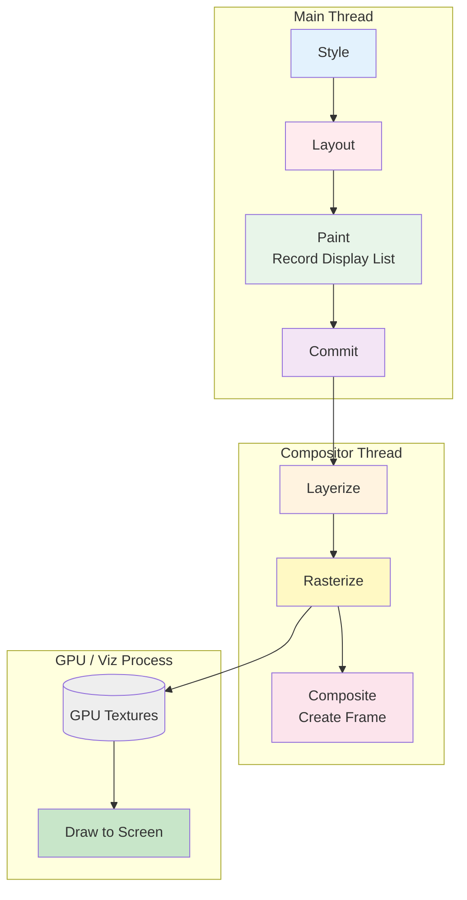

# Critical Rendering Path: Rendering Pipeline Overview

Learn how browsers convert HTML, CSS, and JavaScript into pixels—understanding not just what happens at each stage, but why browsers were designed this way.

<figure>

<figcaption>The Critical Rendering Path: HTML and CSS are parsed into trees, combined into a render tree, laid out, painted (recorded as display lists), rasterized into GPU textures, composited, and drawn to screen</figcaption>

</figure>

## What is the Critical Rendering Path?

**Critical Rendering Path (CRP)** is the browser's process of converting HTML, CSS, and JavaScript into visual pixels. Understanding _why_ each stage exists and _why_ certain resources block rendering is essential for building fast web experiences.

## The Pipeline Stages

Each stage of the rendering pipeline has a specific purpose:

| Stage                                                     | Purpose                                               | Thread         | Blocking Behavior                 |
| --------------------------------------------------------- | ----------------------------------------------------- | -------------- | --------------------------------- |
| [DOM Construction](../crp-dom-construction/README.md)     | Parse HTML into tree structure for resource discovery | Main           | Incremental, can be blocked by JS |
| [CSSOM Construction](../crp-cssom-construction/README.md) | Parse CSS with full cascade resolution                | Main           | Must be complete before rendering |
| [Render Tree](../crp-render-tree/README.md)               | Combine DOM and CSSOM for visible elements only       | Main           | Requires complete CSSOM           |
| [Layout (Reflow)](../crp-layout-stage/README.md)          | Calculate exact size and position of every element    | Main           | Most expensive stage              |
| [Paint](../crp-paint-stage/README.md)                     | Record drawing commands into display lists            | Main           | Creates display lists, not pixels |
| [Rasterize](../crp-rasterization/README.md)               | Execute display lists to produce GPU texture tiles    | Compositor/GPU | Actual pixels created here        |
| [Composite & Draw](../crp-compositing/README.md)          | Assemble rasterized layers and send to screen         | Compositor/GPU | Final assembly and display        |

## What Blocks What

Understanding blocking behavior is crucial for optimization:

- **CSS blocks Rendering**: Prevents Flash of Unstyled Content (FOUC); partial CSSOM cannot be used because later CSS rules override earlier ones
- **JS blocks HTML Parsing**: Scripts can inject HTML via `document.write()`, so parser must wait for script execution
- **CSS blocks JS Execution**: Scripts using `getComputedStyle()` need complete CSSOM for accurate values

## Browser Design Philosophy

Browsers face a fundamental tension: users want to see content immediately, but rendering requires complete information about styles and layout. The rendering pipeline represents decades of optimization around this tension:

1. **Incremental where possible**: DOM parsing happens progressively so resources can be discovered early
2. **Complete where necessary**: CSSOM must be complete because CSS cascade rules mean later declarations override earlier ones
3. **Parallelized where safe**: The compositor thread handles scrolling and animations independently from main thread work
4. **Layered for performance**: Elements that animate frequently get their own GPU-backed layers

## The Complete Pixel Pipeline

## Why This Architecture Matters

| Stage     | Thread         | Can Skip?                 | Cost     |
| --------- | -------------- | ------------------------- | -------- |
| Style     | Main           | No                        | Medium   |
| Layout    | Main           | If only transform/opacity | High     |
| Paint     | Main           | If only transform/opacity | Medium   |
| Rasterize | Compositor/GPU | If tiles cached           | Medium   |
| Composite | Compositor     | No                        | Low      |
| Draw      | GPU            | No                        | Very Low |

**Why Graphics Layers Enable 60fps**: When you animate `transform` or `opacity`, the compositor thread can update the layer's position/transparency without involving the main thread. No style recalculation, no layout, no paint, no re-rasterization—just recompositing existing GPU textures with new transforms.

## Key Optimization Principles

- **Declare resources in HTML** so the preload scanner can find them
- **Use defer/async** appropriately based on script dependencies
- **Inline critical CSS** for above-the-fold content
- **Avoid layout thrashing** by batching DOM reads and writes
- **Animate transform/opacity** for compositor-only 60fps animations
- **Use content-visibility** to skip rendering off-screen content
- **Apply CSS containment** to isolate expensive subtrees

---

## References

### Core Documentation

- [MDN: Critical Rendering Path](https://developer.mozilla.org/en-US/docs/Web/Performance/Critical_rendering_path)
- [web.dev: Understanding the Critical Path](https://web.dev/learn/performance/understanding-the-critical-path)

### Browser Architecture

- [Chromium: Compositor Thread Architecture](https://www.chromium.org/developers/design-documents/compositor-thread-architecture/)
- [Chrome Developers: RenderingNG Architecture](https://developer.chrome.com/docs/chromium/renderingng-architecture)
- [Chromium: GPU Accelerated Compositing](https://www.chromium.org/developers/design-documents/gpu-accelerated-compositing-in-chrome/)
- [Chromium: How cc Works](https://chromium.googlesource.com/chromium/src/+/master/docs/how_cc_works.md)

#### From ByteByteGo

- Downloaded from [Alex Xu](https://twitter.com/alexxubyte/status/1534201523713867777) Twitter post.

<figure>

<figcaption>Comprehensive critical rendering path diagram from ByteByteGo showing the complete browser rendering pipeline</figcaption>

</figure>
