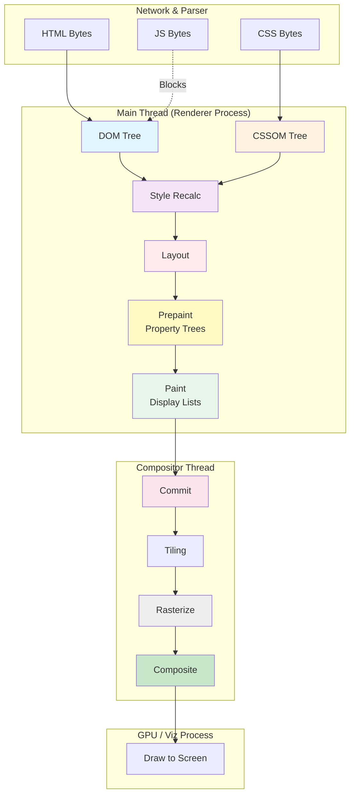

# Critical Rendering Path: Rendering Pipeline Overview

The browser's rendering pipeline transforms HTML, CSS, and JavaScript into visual pixels through a series of discrete, highly optimized stages. Modern browser engines like Chromium employ the **RenderingNG** architecture—a next-generation rendering system developed between 2014 and 2021—which decouples the main thread from the compositor and GPU processes to ensure 60fps+ performance and minimize interaction latency.

<figure>



<figcaption>The RenderingNG pipeline: Main thread stages (DOM → Paint) produce immutable outputs committed to the compositor thread, which handles rasterization and compositing independently.</figcaption>

</figure>

## Abstract

The rendering pipeline is fundamentally a **producer-consumer architecture** split across threads and processes:

- **Main Thread**: Produces structured data (DOM, CSSOM, computed styles, layout geometry, property trees, display lists). Each stage's output is immutable once complete.
- **Compositor Thread**: Consumes committed data to handle scrolling, animations (transform/opacity), and frame assembly without blocking the main thread.
- **Viz Process**: Aggregates compositor frames from all sources and issues GPU draw calls.

The key insight: **Property Trees** (transform, clip, effect, scroll) replaced monolithic layer trees, reducing animation updates from O(layers) to O(affected nodes). This enables compositor-driven animations that bypass the main thread entirely—the architectural foundation for responsive scrolling and 60fps animations even when JavaScript is busy.

Performance impact flows from this split: Interaction to Next Paint (INP) measures how quickly the pipeline can present a frame after user input. Each pipeline stage that runs on the main thread directly contributes to input delay and processing time.

## Pipeline Stages: Inputs and Outputs

Each stage has well-defined inputs and outputs. Understanding this data flow is essential for debugging performance issues.

| Stage                                                         | Input                              | Output                                                                     | Consumed By      |
| ------------------------------------------------------------- | ---------------------------------- | -------------------------------------------------------------------------- | ---------------- |
| [**DOM Construction**](../crp-dom-construction/README.md)     | HTML bytes                         | DOM Tree                                                                   | Style Recalc     |
| [**CSSOM Construction**](../crp-cssom-construction/README.md) | CSS bytes                          | CSSOM Tree                                                                 | Style Recalc     |
| [**Style Recalc**](../crp-style-recalculation/README.md)      | DOM + CSSOM                        | ComputedStyle (per node) + **LayoutObject Tree**                           | Layout           |
| [**Layout**](../crp-layout/README.md)                         | LayoutObject Tree + ComputedStyle  | **Fragment Tree** (immutable geometry)                                     | Prepaint         |
| [**Prepaint**](../crp-prepaint/README.md)                     | LayoutObject Tree + Fragment Tree  | **Property Trees** (transform, clip, effect, scroll) + paint invalidations | Paint            |
| [**Paint**](../crp-paint/README.md)                           | LayoutObject Tree + Property Trees | **Display Lists** (drawing commands)                                       | Commit           |
| [**Commit**](../crp-commit/README.md)                         | Property Trees + Display Lists     | Copied data on compositor thread                                           | Layerize, Raster |
| **Layerize**                                                  | Display Lists                      | Composited layer list                                                      | Raster           |
| [**Raster**](../crp-raster/README.md)                         | Display Lists + Tiles              | GPU texture tiles (bitmaps)                                                | Composite        |
| [**Composite**](../crp-composit/README.md)                    | Texture tiles + Property Trees     | Compositor Frame (DrawQuads)                                               | Draw             |
| [**Draw**](../crp-draw/README.md)                             | Compositor Frame                   | Pixels on screen                                                           | Display          |

**Key distinction**: The **LayoutObject Tree** is created during Style Recalc, not Layout. Layout _annotates_ the LayoutObject tree and produces the immutable **Fragment Tree** as its output. Prepaint then traverses the LayoutObject tree (using Fragment Tree data) to build Property Trees.

## The Critical Rendering Path (CRP)

The **Critical Rendering Path (CRP)** is the sequence of steps the browser undergoes to convert code into a visual frame. While traditionally viewed as a linear flow (DOM → CSSOM → Render Tree → Layout → Paint), modern engines employ a granular multi-threaded architecture designed around a core constraint: the main thread handles both JavaScript execution and rendering pipeline stages, so any work on the main thread delays both script responsiveness and visual updates.

### Design Rationale: Why Multi-Threading Matters

> **Prior to RenderingNG (pre-2021)**: Rendering was deeply coupled. Scrolling could trigger expensive style recalculations. Animation of transforms required full layer tree walks. The single-threaded assumption baked into the original WebKit codebase (dating to 1998) meant rendering work blocked JavaScript and vice versa.

RenderingNG's design addresses this by:

1. **Separating concerns**: Each pipeline stage produces well-defined, immutable outputs
2. **Enabling skip logic**: Stages that aren't needed can be bypassed (e.g., transform animations skip layout and paint)
3. **Offloading work**: Compositor-driven operations don't require main thread involvement

## The RenderingNG Pipeline Stages

The pipeline comprises 12 stages, though several can be skipped when unnecessary. The first six run on the main thread; the remainder run on the compositor thread and Viz process.

### DOM Construction

The browser parses HTML bytes into the Document Object Model (DOM) tree. This process is incremental—the browser starts building the tree before the entire document downloads.

**Blocking Behavior**:

- **JS is Parser Blocking**: Synchronous `<script>` tags halt the HTML parser because scripts can call `document.write()`, which modifies the input stream.
- **JS is Non-Render Blocking**: JavaScript doesn't block rendering directly, but it blocks the parser that generates the DOM required for rendering.
- **Preload Scanner**: A secondary parser scans ahead for external resources (JS, CSS, fonts, images) to start downloads early, mitigating parser-blocking delays.

**Design Trade-off**: The parser-blocking behavior exists because JavaScript can modify the document structure mid-parse via `document.write()`. This legacy API forces sequential processing, though `defer` and `async` attributes provide escape hatches for scripts that don't need synchronous document access.

### CSSOM Construction

The browser parses CSS into the CSS Object Model (CSSOM) tree. Unlike DOM construction, CSSOM must be built in its entirety before rendering can occur.

**Blocking Behavior**:

- **CSS is Render Blocking**: The browser won't render content until CSSOM completes, avoiding Flash of Unstyled Content (FOUC).
- **CSS is JS Execution Blocking**: Scripts can query styles via `getComputedStyle()`, so browsers block JS execution until CSSOM is ready.

**Design Trade-off**: The all-or-nothing CSSOM requirement exists because CSS rules can override each other in complex ways (cascade, specificity, `!important`). Partial rendering would show incorrect styles as later rules load. The browser trades initial latency for visual correctness.

### Style Recalculation

The engine combines DOM and CSSOM to determine final computed styles for every element. This stage produces two outputs:

1. **ComputedStyle** for each node—the resolved CSS property values after cascade, inheritance, and `calc()` resolution
2. **LayoutObject Tree**—the tree structure that establishes the order of operations for the layout phase

**Computed Style + LayoutObject Tree vs. Render Tree**:

> **Legacy architecture**: Older browser documentation refers to a **Render Tree**—a tree structure built by combining DOM and CSSOM that contained only visible elements (excluding `display: none`, `<head>`, etc.). Each render tree node stored both the DOM reference and its computed styles.

Modern engines (RenderingNG, BlinkNG) decouple these concerns:

- **Computed styles** are stored as a map attached to DOM nodes, not in a separate tree
- **Visibility filtering** happens later during layout (the Fragment Tree excludes non-rendered elements)
- **Style calculation** is now a discrete phase that can run independently and be cached

This separation enables better incremental updates—changing an element's `display` from `none` to `block` only requires style recalc and layout, not rebuilding a monolithic tree structure.

**Key Details**:

- **Dirty Bit System**: Only elements marked "dirty" (style-invalidated) are recalculated, enabling O(dirty nodes) instead of O(all nodes).
- **Containment Optimization**: Elements with `contain: style` limit style invalidation scope—descendant changes don't invalidate ancestors.

**Edge Case**: Style recalculation can cascade unexpectedly. A change to a parent's `font-size` invalidates all descendants using relative units (`em`, `%`). Container queries introduced additional invalidation paths where ancestor size changes can trigger descendant style recalc.

### Layout (Reflow)

Layout receives the **LayoutObject Tree** (from Style Recalc) and calculates geometry (width, height, x, y) of every visible element. The output is the **Fragment Tree**—an immutable representation of laid-out boxes with resolved physical coordinates.

**LayoutObject Tree vs. Fragment Tree**:

- **LayoutObject Tree** (input): Mutable tree created during style recalc, points to DOM nodes, receives layout annotations
- **Fragment Tree** (output): Immutable tree of `PhysicalFragment` objects with final positions, sizes, and physical coordinates (left/top, not logical)

The Fragment Tree is the "primary, read-only output of layout." Its immutability enables caching and prevents later stages from accidentally modifying geometry.

**Key Details**:

- **Dirty Bit System**: Layout uses dirty flags to recalculate only affected subtrees. The engine distinguishes between "needs layout" and "needs full layout" states.
- **Layout Containment**: Elements with `contain: layout` become layout roots—their descendants' layout changes don't propagate to ancestors.

**Forced Synchronous Layout (Layout Thrashing)**: Reading geometric properties from JavaScript while layout is dirty forces an immediate, synchronous layout:

```js
// ❌ Layout thrashing: each iteration forces layout
for (const el of elements) {
  el.style.width = container.offsetWidth + "px" // read forces layout, write invalidates it
}

// ✅ Batch reads, then batch writes
const width = container.offsetWidth // single read
for (const el of elements) {
  el.style.width = width + "px" // writes only
}
```

**Properties That Force Layout**: `offsetLeft/Top/Width/Height`, `clientLeft/Top/Width/Height`, `scrollLeft/Top/Width/Height`, `getClientRects()`, `getBoundingClientRect()`, `getComputedStyle()` (for layout-dependent properties), `innerText`, `focus()`, `scrollIntoView()`.

### Prepaint

Introduced in RenderingNG, Prepaint performs an in-order traversal of the **LayoutObject tree** (not the Fragment Tree) to build **Property Trees**—separate tree structures for transform, clip, effect (opacity/filters/masks), and scroll. The traversal order matters: it enables efficient computation of DOM-order hierarchy like parent containing blocks.

**Why Property Trees Exist**:

> **Legacy architecture**: Browsers used a monolithic **Layer Tree** where each layer stored its own transform, clip, and effect values. Updating any property required walking the entire tree—O(N) where N is layers.

Property trees decouple these concerns:

- **Transform Tree**: Spatial positioning (translation, rotation, scale)
- **Clip Tree**: Visibility boundaries (overflow, clip-path)
- **Effect Tree**: Visual effects (opacity, filters, blend modes, masks)
- **Scroll Tree**: Scroll offset relationships

Each layer references nodes in these trees by ID. The compositor can update an element's position by applying a different matrix from the Transform Tree without re-walking layout or style.

**Design Trade-off**: Property trees add complexity (four separate trees instead of one) but enable O(1) property updates and compositor-only animations.

### Paint

The browser records drawing commands into **Display Lists**—a sequence of paint operations like "draw rectangle at (0,0) with blue fill."

**Key Details**:

- **Not Pixels**: Paint produces display lists, not actual pixels. Rasterization happens later on the compositor thread.
- **Caching**: The `PaintController` caches display items. Identical items are reused rather than repainted.
- **Subsequence Recording**: Related display items are grouped and cached together. Unchanged subtrees skip painting entirely.

**Layerization**: Based on CSS properties (`will-change`, `transform`, `opacity`, `position: fixed`), the engine determines which elements get their own composited layers. Layerization decisions happen here, not during compositing.

**Edge Case**: Creating too many layers (e.g., hundreds of `will-change: transform` elements) consumes GPU memory and can degrade performance. The browser uses heuristics to limit layer count.

### Commit

The main thread commits updated property trees and display lists to the Compositor thread.

**Key Details**:

- **Synchronous Handoff**: The main thread blocks while the compositor copies data. This is the handoff point between threads.
- **Atomic Update**: All changes from one frame are committed together, ensuring consistency.

**Implementation Detail**: The `ProxyImpl` class enforces thread safety—it only accesses main-thread data structures when the main thread is blocked, verified via DCHECKs in debug builds.

**Frame Boundaries**: A commit marks the point where the main thread's work for a frame is "done." The main thread can begin work on the next frame while the compositor processes the current one.

### Layerize

The Compositor thread breaks display lists into composited layer lists for independent rasterization.

**Why Separate From Paint**: Layerization decisions depend on runtime factors (memory pressure, GPU capabilities, overlap analysis) that the main thread shouldn't wait for. Moving this to the compositor enables faster commits.

### Rasterization

The Compositor thread converts display lists into bitmapped textures (pixels).

**Key Details**:

- **Tiling**: The viewport divides into tiles (typically 256×256 or 512×512 pixels). Only visible and near-visible tiles are rasterized.
- **GPU Acceleration**: Most modern browsers use GPU rasterization via Skia. Software rasterization is the fallback.
- **Modes**: `ZeroCopyRasterBufferProvider` (direct GPU memory), `OneCopyRasterBufferProvider` (CPU to GPU upload), `GpuRasterBufferProvider` (GPU command buffer).

**Image Decoding**: Image decode is the most expensive raster operation. It runs on separate decode threads with dedicated caches for software vs. GPU paths.

**Limitation**: GPU rasterization is single-threaded due to GPU context locks. Image decoding parallelizes, but pixel generation is sequential per tile.

### Activate

The pending tree (staging rasterization results) becomes the active tree (ready for drawing).

**Three Tree States**:

| Tree    | Purpose                                  |
| ------- | ---------------------------------------- |
| Main    | Source of truth for layers (main thread) |
| Pending | Staging area for rasterization work      |
| Active  | Ready for drawing                        |

**Why Two Compositor Trees**: The pending/active split enables atomic visual updates. The active tree remains drawable (scrollable, animatable) while the pending tree completes rasterization. Once ready, activation is instant.

### Compositing

The Compositor thread assembles rasterized tiles into a single frame based on Property Trees.

**Key Details**:

- **Off-Main-Thread**: Scrolling and compositor-driven animations (transform, opacity) happen here without main thread involvement.
- **Draw Quads**: The compositor produces `DrawQuad` objects describing how to render each tile, ordered back-to-front.
- **RenderPasses**: Complex effects (masks, filters, clips on rotated content) use intermediate render passes.

**Compositor-Only Animations**: Animations affecting only `transform` or `opacity` can run at 60fps even with a busy main thread because the compositor has everything needed in the property trees. This is why `will-change: transform` exists—it hints the browser to promote the element to its own layer.

### Draw

The Viz process issues the final GPU commands to render the composited frame.

**Key Details**:

- **Viz Process**: A separate process that receives compositor frames from all sources (multiple tabs, browser UI) and aggregates them.
- **VSync Synchronization**: Drawing synchronizes with the display's refresh rate (60Hz, 120Hz, 144Hz) to avoid tearing.
- **Final Aggregation**: `SurfaceAggregator` combines frames; `DirectRenderer` executes the actual GL/Vulkan/Metal commands.

**Process Isolation**: Viz runs in a separate process so GPU driver crashes don't take down the entire browser.

## Performance Impact: Interaction to Next Paint (INP)

**Interaction to Next Paint (INP)** is a Core Web Vital measuring responsiveness. It captures the latency from user interaction to the next visual update, comprising three phases:

| Phase                  | Description                          | Pipeline Impact                                         |
| ---------------------- | ------------------------------------ | ------------------------------------------------------- |
| **Input Delay**        | Time before event handlers run       | Blocked by main thread work (long tasks, style, layout) |
| **Processing Time**    | Event handler execution              | JavaScript in event listeners                           |
| **Presentation Delay** | Handler completion → frame displayed | Commit → Raster → Composite → Draw                      |

**Thresholds** (75th percentile):

- **Good**: ≤200ms
- **Needs Improvement**: 201–500ms
- **Poor**: >500ms

**Why Architecture Matters**: RenderingNG's thread isolation means compositor-driven work (scrolling, transform/opacity animations) doesn't contribute to input delay. The main thread stays available for event processing because the compositor handles visual updates independently.

**Optimization Strategies**:

1. **Minimize main thread work**: Long tasks (>50ms) delay both input handling and rendering
2. **Use compositor-friendly properties**: `transform` and `opacity` animations don't require layout or paint
3. **Avoid forced synchronous layout**: Batch DOM reads before writes
4. **Use `content-visibility: auto`**: Defers rendering of off-screen content

## Architecture & Scalability

### Process Isolation

| Process      | Responsibility                       | Count                       |
| ------------ | ------------------------------------ | --------------------------- |
| **Browser**  | UI chrome, navigation, input routing | 1                           |
| **Renderer** | Page rendering, JS execution         | 1 per site (site isolation) |
| **Viz**      | GPU operations, final composition    | 1                           |

The renderer process is sandboxed with minimal OS access. The Viz process handles all GPU communication, isolating graphics driver instability from the rest of the browser.

### Memory Management

- **Tiling**: GPU memory is managed via tiles. Only visible tiles consume GPU resources.
- **Tile Priority**: Tiles are prioritized (visible > soon-visible > prefetch). Under memory pressure, low-priority tiles are discarded.
- **Layer Squashing**: The browser merges layers when possible to reduce memory overhead.

### Scheduler Behavior

The main thread uses priority-based scheduling:

1. **Discrete input events** (click, keydown): Highest priority
2. **Continuous input events** (scroll, mousemove): High priority
3. **Rendering updates** (rAF, style, layout, paint): Normal priority
4. **Background work** (timers, microtasks): Lower priority

**High Latency Mode**: When the main thread can't meet frame deadlines, the scheduler increases pipelining—trading latency for throughput by allowing more frames in flight.

---

## Appendix

### Prerequisites

- Familiarity with the single-threaded event loop model of JavaScript
- Understanding of GPU vs. CPU execution and memory models
- Basic knowledge of CSS cascade, specificity, and inheritance

### Summary

- RenderingNG (2014–2021) replaced monolithic rendering with a pipelined, multi-threaded architecture
- Property Trees enable O(1) compositor-driven animations by decoupling transform, clip, effect, and scroll from the layer hierarchy
- The main thread produces immutable outputs (DOM, styles, layout, paint); the compositor consumes them independently
- Forced synchronous layout occurs when reading geometry properties (e.g., `offsetWidth`) after style/DOM changes
- INP measures the full pipeline latency from interaction to visual update; architecture directly impacts all three phases

### References

- [WHATWG HTML Living Standard - Rendering](https://html.spec.whatwg.org/multipage/rendering.html) — Canonical rendering semantics
- [W3C CSSOM View Module](https://w3c.github.io/csswg-drafts/cssom-view/) — Layout and geometry APIs specification
- [Chromium: RenderingNG Architecture](https://developer.chrome.com/docs/chromium/renderingng-architecture) — Official RenderingNG documentation
- [Chromium: RenderingNG Overview](https://developer.chrome.com/docs/chromium/renderingng) — Design goals and history
- [Chromium: BlinkNG Deep Dive](https://developer.chrome.com/docs/chromium/blinkng) — Main thread pipeline phases
- [Chromium: How cc Works](https://chromium.googlesource.com/chromium/src/+/master/docs/how_cc_works.md) — Compositor internals
- [Chromium: Blink Paint README](https://chromium.googlesource.com/chromium/src/+/refs/heads/main/third_party/blink/renderer/core/paint/README.md) — Paint system implementation
- [web.dev: Interaction to Next Paint](https://web.dev/articles/inp) — INP metric definition
- [Paul Irish: What Forces Layout/Reflow](https://gist.github.com/paulirish/5d52fb081b3570c81e3a) — Comprehensive forced layout list
- [MDN: Critical Rendering Path](https://developer.mozilla.org/en-US/docs/Web/Performance/Critical_rendering_path) — Introduction and overview

### Terminology

- **CRP (Critical Rendering Path)**: The sequence of stages from HTML/CSS/JS to pixels on screen
- **DOM (Document Object Model)**: Tree representation of HTML structure
- **CSSOM (CSS Object Model)**: Tree representation of parsed CSS rules
- **ComputedStyle**: Resolved CSS property values for a node after cascade, inheritance, and calculation
- **LayoutObject Tree**: Mutable tree created during style recalc; establishes layout order; points to DOM nodes
- **Fragment Tree**: Immutable tree of `PhysicalFragment` objects with resolved geometry; output of layout
- **Property Trees**: Separate tree structures for transform, clip, effect, and scroll properties
- **Display Lists**: Recorded drawing commands (not pixels) produced by the paint stage
- **Reflow**: Synonym for layout recalculation
- **Repaint**: Re-recording paint commands when visual styles change without geometry changes
- **Viz**: Chromium's GPU process that aggregates compositor frames and issues draw calls
- **FOUC (Flash of Unstyled Content)**: Visual artifact when content renders before CSS loads
- **INP (Interaction to Next Paint)**: Core Web Vital measuring responsiveness from input to visual update
