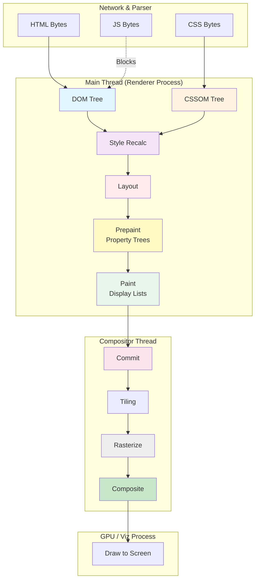

# Critical Rendering Path: Rendering Pipeline Overview

The browser's rendering pipeline transforms HTML, CSS, and JavaScript into visual pixels through a series of discrete, highly optimized stages. Modern browser engines like Chromium now employ the **RenderingNG** (Rendering Next Generation) architecture, which decouples the main thread from the compositor and GPU processes to ensure 60fps+ performance and minimize interaction latency.

<figure>

<figcaption>The RenderingNG pipeline: Decoupling the main thread from the compositor and GPU processes via property trees and display lists.</figcaption>

</figure>

## The Critical Rendering Path (CRP)

The **Critical Rendering Path (CRP)** is the sequence of steps the browser undergoes to convert code into a visual frame. While traditionally viewed as a linear flow (DOM → CSSOM → Render Tree → Layout → Paint), modern engines utilize a more granular multi-threaded architecture to handle complex responsive designs and animations.

## The RenderingNG Pipeline Stages

Modern browser engines break the rendering process into granular stages to maximize parallelization and minimize main-thread contention.

### [DOM Construction](../crp-dom-construction/README.md)

The browser parses HTML bytes into the Document Object Model (DOM) tree. This process is incremental, meaning the browser can start building the tree before the entire document has been downloaded.

- **JS is Parser Blocking**: Synchronous `<script>` tags block the HTML parser unless `defer` or `async` is used.
- **JS is Non-Render Blocking**: JavaScript itself doesn't block the actual rendering process, but it blocks the parser that generates the DOM required for rendering.
- **Preload Scanner**: A secondary parser that scans the HTML for external resources (JS, CSS, fonts) to start downloads early.

### [CSSOM Construction](../crp-cssom-construction/README.md)

The browser parses CSS into the CSS Object Model (CSSOM) tree. Unlike DOM construction, CSSOM must be built in its entirety before any rendering can occur.

- **CSS is Render Blocking**: The browser will not render any content until the CSSOM is complete to avoid a Flash of Unstyled Content (FOUC).
- **CSS is JS Execution Blocking**: Since scripts can query styles (e.g., `getComputedStyle()`), the browser blocks JS execution until the CSSOM is ready.

### [Style Recalculation (Render Tree)](../crp-style-recalculation/README.md)

The engine combines the DOM and CSSOM to determine the final computed styles for every element. Traditionally known as building the **Render Tree**, modern engines now treat this as a discrete phase that produces a "Computed Style" map for each node.

- **Render Tree Legacy**: In older models, the Render Tree was a specific tree structure containing only visible elements. In modern engines, style calculation is decoupled from the tree structure used for layout.

### [Layout (Reflow)](../crp-layout-stage/README.md)

The browser calculates the geometry (width, height, x, y) of every visible element. This stage is responsible for the "Fragment Tree."

- **Dirty Bit System**: Layout is expensive, so the engine marks nodes as "dirty" and only recalculates the affected subtrees.
- **Forced Synchronous Layout**: Reading geometric properties (like `offsetWidth`) in JS while the layout is dirty forces the browser to perform layout immediately, leading to "layout thrashing."

### [Prepaint](../crp-prepaint/README.md)

Introduced in RenderingNG, Prepaint walks the fragment tree to build **Property Trees** (transform, clip, effect, scroll).

- **Decoupling**: It separates geometry and visual effects from the Paint stage.
- **Optimization**: By pre-calculating these trees, the browser can efficiently handle transforms and clips during compositing.

### [Paint](../crp-paint-stage/README.md)

The browser records drawing commands (e.g., "draw rectangle at 0,0", "fill with blue") into **Display Lists**.

- **Not Pixels**: This stage does not produce pixels; it only records the intent to draw.
- **Layerization**: Based on certain CSS properties (like `will-change: transform`), the engine decides which elements should be promoted to their own graphics layers.

### [Commit](../crp-commit-stage/README.md)

The main thread "commits" the updated property trees and display lists to the Compositor thread.

- **Synchronization**: This is a blocking operation where the main thread waits for the compositor to acknowledge the new state.
- **Frame Boundaries**: A commit marks the point where the main thread's work for a specific frame is "done."

### [Rasterization](../crp-rasterization/README.md)

The Compositor thread takes the display lists and converts them into bitmapped textures (pixels).

- **Tiling**: The viewport is divided into tiles. Only visible or near-visible tiles are rasterized.
- **GPU Acceleration**: Most modern browsers use the GPU (via Skia or similar libraries) to perform rasterization rapidly.

### [Compositing](../crp-compositing/README.md)

The Compositor thread assembles the rasterized tiles into a single frame based on the Property Trees.

- **Off-Main-Thread**: Scrolling and certain animations (transform, opacity) happen here without involving the Main Thread.
- **Efficiency**: It only re-assembles existing textures rather than re-calculating styles or layout.

### [Draw](../crp-draw-stage/README.md)

The final step where the GPU "draws" the composited frame to the screen.

- **Viz Process**: In Chromium, the Viz process receives the compositor frame and issues the final GL/Vulkan/Metal commands to the OS.
- **VSync**: Drawing is synchronized with the display's refresh rate (e.g., 60Hz or 120Hz).

## RenderingNG: Property Trees vs. Layer Trees

In legacy architectures, browsers relied heavily on a **Layer Tree**. If an element moved or changed opacity, the browser often had to rebuild the entire layer tree or walk it recursively during every frame, which was O(N) where N is the number of layers.

**RenderingNG** introduced **Property Trees** (Transform, Clip, Effect, and Scroll trees).

1.  **Decoupling**: Instead of baking transforms into the layer hierarchy, the browser stores them in separate trees.
2.  **Efficiency**: The compositor can update an element's position by simply applying a different matrix from the Transform Tree without re-walking the entire layout or style tree.
3.  **Compositor-Only Animations**: Animations affecting `transform` or `opacity` bypass the Main Thread entirely because the Compositor has all the information needed in its property trees to update the frame.

## Performance Impact: Interaction to Next Paint (INP)

**Interaction to Next Paint (INP)** measures how quickly the browser can present the next frame after a user interaction. The rendering pipeline architecture directly dictates INP:

- **Input Delay**: Occurs if the Main Thread is busy with long-running JS, Layout, or Style tasks.
- **Processing Time**: Time taken by Event Listeners.
- **Presentation Delay**: The time required to run the pipeline (Commit → Raster → Draw).

By offloading animations and scrolling to the Compositor thread, browsers ensure that high-frequency visual updates do not block the Main Thread, preserving its availability for processing user inputs.

## Architecture & Scalability

- **Process Isolation**: The **Renderer Process** (where the Main Thread lives) is sandboxed. The **Viz Process** (GPU) is a separate process responsible for final drawing, ensuring that a GPU driver crash doesn't take down the entire browser.
- **Tiling**: To manage GPU memory, the Compositor breaks the viewport into tiles (typically 256x256 or 512x512). Only visible or "near-visible" tiles are rasterized.
- **Main Thread Scheduling**: Modern engines use priority-based scheduling to ensure that input handling and rendering updates take precedence over background tasks.

---

## Appendix

### Prerequisites

- Familiarity with the **Single-Threaded Model** of JavaScript.
- Understanding of **GPU vs. CPU** execution models.
- Basic knowledge of **CSS Cascade and Inheritance**.

### Summary

The Critical Rendering Path has evolved from a simple linear parser into a complex, multi-threaded pipeline known as RenderingNG. By utilizing Property Trees and off-main-thread compositing, browsers isolate expensive operations (Layout/Style) from high-frequency updates (Scroll/Transform), directly improving Core Web Vitals like INP.

### References

- [W3C: HTML Specification - Rendering](https://html.spec.whatwg.org/multipage/rendering.html)
- [W3C: CSS Cascading and Inheritance](https://www.w3.org/TR/css-cascade/)
- [Chromium: RenderingNG Architecture](https://developer.chrome.com/docs/chromium/renderingng-architecture)
- [Chromium: How cc Works (The Compositor)](https://chromium.googlesource.com/chromium/src/+/master/docs/how_cc_works.md)
- [web.dev: Interaction to Next Paint (INP)](https://web.dev/articles/inp)
- [MDN: Critical Rendering Path](https://developer.mozilla.org/en-US/docs/Web/Performance/Critical_rendering_path)

### Terminology

- **DOM (Document Object Model)**: A tree representation of the HTML structure.
- **CSSOM (CSS Object Model)**: A tree representation of the styles associated with the DOM.
- **Reflow**: The process of recalculating the positions and sizes of all elements (Layout).
- **Repaint**: The process of re-recording drawing commands when visual styles (colors, shadows) change without affecting geometry.
- **Viz (Visuals)**: Chromium's service that coordinates the display of pixels from multiple processes.
- **FOUC (Flash of Unstyled Content)**: An artifact where the browser displays content before CSS is fully loaded/parsed.
