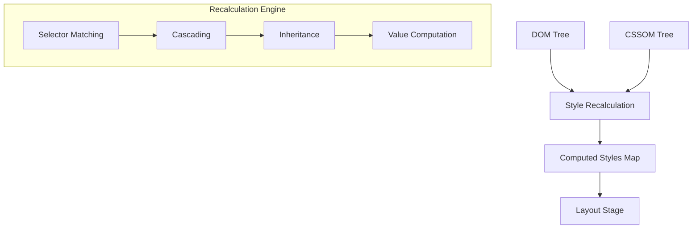

# Critical Rendering Path: Style Recalculation

Style Recalculation is the phase where the browser engine matches CSS selectors against DOM elements to determine the final set of computed styles for every node. It bridges the gap between raw document structure (DOM) and visual geometry (Layout).

<figure>

<figcaption>Figure 1: The Style Recalculation pipeline within the modern rendering engine.</figcaption>
</figure>

## TLDR

### The Goal

Transform the DOM and CSSOM into a "Computed Style" map for every element, resolving conflicts and calculating absolute values.

### Key Constraints

- **Right-to-Left Matching**: Selectors are evaluated from the leaf node up to avoid unnecessary tree traversal.
- **Invalidation Cost**: Small DOM changes can trigger large-scale recalculations if selectors are overly broad.

### Performance Impact

Complex selectors and deep nesting increase per-element matching time. Frequent DOM mutations cause "Style Thrashing" if interleaved with style reads.

## From Render Tree to Style Recalculation

In older browser documentation, this stage was merged with Layout under the term **Render Tree** construction. Modern engines like Chromium (RenderingNG) treat Style Recalculation as a discrete, high-performance phase. It outputs a `ComputedStyle` object for each node, which contains the final, resolved values for all CSS properties.

## The Process

### 1. Selector Matching

The engine iterates through all active stylesheets (User Agent, User, and Author) and matches selectors against DOM nodes.

> "The selector represents a particular pattern of element(s) in a tree structure." — [W3C Selectors Level 4](https://www.w3.org/TR/selectors-4/)

To optimize this, engines like Blink use **Bloom Filters** to quickly skip elements that cannot possibly match a selector based on their ID, class, or tag name.

### 2. Cascading

When multiple rules apply to the same property, the **CSS Cascade** resolves the conflict.

- **Precedence**: Origin (UA vs. Author) and `!important`.
- **Specificity**: ID > Class > Tag.
- **Order of Appearance**: Last rule wins for equal specificity.
- **Cascade Layers**: Modern CSS uses `@layer` to explicitly control precedence regardless of specificity.

### 3. Value Computation

The engine converts relative values (e.g., `2rem`, `50%`, `vh`) and keywords (e.g., `inherit`, `initial`) into absolute pixel values or specific constants. This ensures the **Layout** stage only deals with fixed coordinates.

## Performance Considerations

### Selector Complexity and Right-to-Left Matching

Browsers match selectors from **right to left**. A selector like `.container .nav .item` requires the engine to find all `.item` nodes first, then traverse upwards to check for `.nav` and `.container` ancestors.

- **Anti-pattern**: `div.content ul li a` — Every `<a>` tag on the page must be checked.
- **Optimization**: Use a single class like `.main-nav-link` to make matching $O(1)$ for the target element.

### Style Invalidation and Thrashing

When a DOM node's class or attribute changes, the engine marks it as "dirty."

**Style Thrashing** occurs when JavaScript repeatedly alternates between _writing_ styles and _reading_ computed styles, forcing the browser to perform synchronous recalculations:

```javascript
// BAD: Interleaved Read/Write
items.forEach((item) => {
  const width = container.offsetWidth // READ (Forces Recalc)
  item.style.width = `${width}px` // WRITE (Invalidates)
})

// GOOD: Batch Reads, then Batch Writes
const width = container.offsetWidth // READ once
items.forEach((item) => {
  item.style.width = `${width}px` // WRITE
})
```

## Conclusion

Style Recalculation is a high-frequency operation that requires careful management of CSS complexity and DOM mutation patterns. By favoring shallow selectors and batching DOM interactions, engineers can significantly reduce the "Main Thread" bottleneck during the Critical Rendering Path.

---

## Appendix

### Prerequisites

- Understanding of the **DOM Tree** and **CSSOM**.
- Basic knowledge of **CSS Specificity** (ID, Class, Type).

### Terminology

- **UA Stylesheet**: The default styles provided by the browser (e.g., `display: block` for `<div>`).
- **Computed Value**: The result of resolving inheritance and relative units (e.g., `16px`).
- **Used Value**: The final value after layout (e.g., a percentage converted to pixels).
- **Style Invalidation**: Marking a node as needing style recalculation due to a change.

### Summary

- Style Recalculation produces a **Computed Style** map for every DOM node.
- Engines match selectors **right to left** to optimize tree traversal.
- **The Cascade** resolves property conflicts based on origin, specificity, and order.
- **Style Thrashing** is a primary performance killer caused by interleaved DOM reads and writes.

### References

- [W3C: CSS Cascading and Inheritance Level 5](https://www.w3.org/TR/css-cascade-5/)
- [W3C: Selectors Level 4](https://www.w3.org/TR/selectors-4/)
- [MDN: Computed Styles](https://developer.mozilla.org/en-US/docs/Web/API/Window/getComputedStyle)
- [web.dev: Reduce the Scope and Complexity of Style Calculations](https://web.dev/articles/reduce-the-scope-and-complexity-of-style-calculations)
