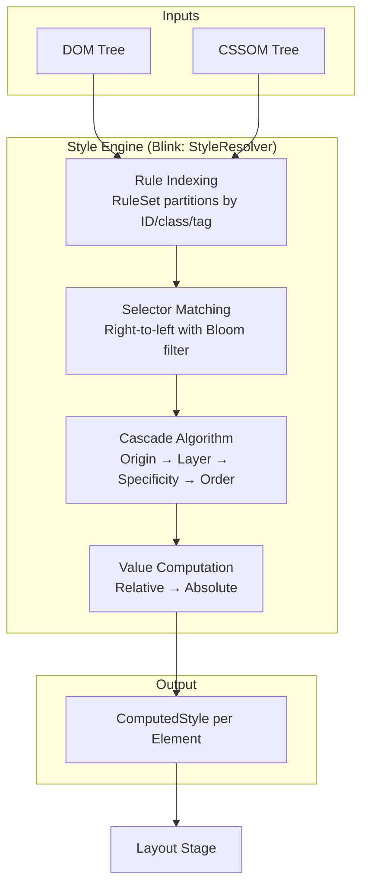

# Critical Rendering Path: Style Recalculation

Style Recalculation transforms the DOM and CSSOM into computed styles for every element. The browser engine matches CSS selectors against DOM nodes, resolves cascade conflicts, and computes absolute values—producing the `ComputedStyle` objects that the Layout stage consumes. In Chromium's Blink engine, this phase is handled by the `StyleResolver`, which uses indexed rule sets, Bloom filters, and invalidation sets to minimize work on each frame.

<figure>



<figcaption>Figure 1: Style Recalculation pipeline in modern browser engines. Blink's StyleResolver orchestrates rule indexing, selector matching, cascading, and value computation.</figcaption>
</figure>

## Abstract

Style Recalculation answers one question for every DOM element: **what is the final value of each CSS property?** The mental model:

1. **Index rules by rightmost selector** — Engines partition stylesheets into hash maps keyed by ID, class, and tag. This lets the matcher skip irrelevant rules entirely.
2. **Match selectors right-to-left** — Starting from the key selector (rightmost) and walking ancestors. Bloom filters enable fast rejection of impossible ancestor chains.
3. **Resolve conflicts via the Cascade** — Origin, encapsulation context, `!important`, layers, specificity, then source order. CSS Cascade Level 5 added `@layer` for explicit precedence control.
4. **Compute absolute values** — Convert relative units (`rem`, `%`, `vh`) and keywords (`inherit`, `initial`) to concrete pixel values or constants.

The cost scales with: (number of elements needing recalc) × (number of rules to consider per element) × (cascade complexity). Minimizing each factor is the optimization target.

## From Render Tree to Style Recalculation

Older browser documentation merged style computation with layout under the term **Render Tree construction**. Modern engines like Chromium (RenderingNG/BlinkNG) treat Style Recalculation as a discrete pipeline phase with strict lifecycle invariants. As of BlinkNG, `ComputedStyle` objects achieve their final values during style recalc and remain immutable thereafter—previously they could be modified during layout, creating subtle bugs.

> **Prior to BlinkNG (pre-2021):** `ComputedStyle` was sometimes updated during the layout phase. This made it difficult to reason about when data was finalized and blocked features like container queries that depend on strict style-layout separation.

The `DocumentLifecycle` class enforces this invariant: modifying a `ComputedStyle` property requires the document state to be `kInStyleRecalc`.

## The Process

### 1. Rule Indexing

Before any matching occurs, the engine compiles and indexes all active stylesheets. In Blink, the `RuleSet` object partitions rules by their **rightmost compound selector** (the "key selector"):

- Rules ending in `#header` go into the `IdRules` map under key `"header"`
- Rules ending in `.nav-link` go into the `ClassRules` map under key `"nav-link"`
- Rules ending in `div` go into the `TagRules` map

This indexing happens via `FindBestRuleSetAndAdd()` during stylesheet parsing. When matching an element, the engine only considers rules from the relevant buckets—not the entire stylesheet.

**Design rationale:** Examining every rule for every element is O(elements × rules). Indexing reduces this to O(elements × relevant-rules), where relevant-rules is typically orders of magnitude smaller for well-structured CSS.

### 2. Selector Matching

The engine evaluates selectors **right to left**, starting from the key selector and walking up the ancestor chain.

> "The selector represents a particular pattern of element(s) in a tree structure." — [W3C Selectors Level 4](https://www.w3.org/TR/selectors-4/)

**Why right-to-left?** Consider `.container .nav .item`:

- **Left-to-right:** Find all `.container` elements, then check if any descendant is `.nav`, then `.item`. Requires traversing down potentially huge subtrees.
- **Right-to-left:** Find all `.item` elements (the key selector), then verify ancestors include `.nav` and `.container`. Most elements fail the key selector immediately—no ancestor traversal needed.

The rightmost selector acts as a filter. Since most rules don't match most elements, failing fast on the key selector avoids expensive ancestor walks.

#### Bloom Filters for Ancestor Matching

When a selector does require ancestor verification (descendant/child combinators), Blink uses a **Bloom filter** to fast-reject impossible matches.

The Bloom filter is a probabilistic data structure where:

- **False positives are possible** — it might say "could match" when it can't
- **False negatives are impossible** — if it says "doesn't match," that's definitive

**Implementation:** As the engine traverses the DOM tree, it maintains a Bloom filter containing the IDs, classes, and tags of all ancestor elements. For a selector like `.container .nav .item`, when evaluating an `.item` element, the engine queries the ancestor filter for `.nav` and `.container`. If either returns "not present," the selector cannot match—skip to the next rule without walking the ancestor chain.

> "WebKit saw a 25% improvement overall with a 2X improvement for descendant and child selectors." — [CSS Selector Performance](https://calendar.perfplanet.com/2011/css-selector-performance-has-changed-for-the-better/)

**Trade-off:** Larger stylesheets increase false positive rates. The filter speeds up rejection, but when it returns "maybe," the engine still performs exact ancestor traversal.

### 3. The Cascade Algorithm

When multiple declarations target the same property on the same element, the CSS Cascade resolves the conflict. As of CSS Cascade Level 5, the cascade applies these criteria in descending priority:

| Priority | Criterion                   | Resolution                                                                                              |
| -------- | --------------------------- | ------------------------------------------------------------------------------------------------------- |
| 1        | **Origin & Importance**     | Transition > `!important` UA > `!important` user > `!important` author > Animation > author > user > UA |
| 2        | **Encapsulation Context**   | For normal rules, outer scope wins. For `!important`, inner scope wins                                  |
| 3        | **Element-Attached Styles** | Inline `style` attribute beats same-origin rule-based declarations                                      |
| 4        | **Cascade Layers**          | For normal rules, later/unlayered wins. For `!important`, earlier layers win                            |
| 5        | **Specificity**             | ID count → class/attribute/pseudo-class count → type/pseudo-element count                               |
| 6        | **Source Order**            | Last declaration wins                                                                                   |

#### Cascade Layers (`@layer`)

CSS Cascade Level 5 introduced `@layer` for explicit precedence control independent of specificity. Layers are ordered by first declaration:

```css collapse={1-2}
/* Layer order: reset < base < components < utilities */
/* Unlayered styles form an implicit final layer with highest normal priority */
@layer reset, base, components, utilities;

@layer reset {
  * {
    margin: 0;
    box-sizing: border-box;
  }
}

@layer components {
  .btn {
    padding: 8px 16px;
  } /* Lower precedence than unlayered */
}

/* Unlayered: wins over all layers for normal declarations */
.btn-override {
  padding: 12px 24px;
}
```

**Key inversion for `!important`:** For normal declarations, later layers win. For `!important` declarations, **earlier layers win**. This lets foundational layers (resets) use `!important` to enforce invariants without being overridden by component layers.

### 4. Value Computation

After cascade resolution, the engine computes absolute values. This involves:

- **Resolving relative units:** `2rem` → `32px` (if root font-size is 16px)
- **Resolving percentages:** `width: 50%` → computed value remains `50%`; the used value (after layout) becomes pixels
- **Applying keywords:** `inherit` copies parent's computed value; `initial` uses the property's initial value
- **Handling `currentcolor`:** Resolves to the element's computed `color` value

**Computed vs. Used vs. Resolved Values:**

| Value Type   | When Determined                   | Example                                                           |
| ------------ | --------------------------------- | ----------------------------------------------------------------- |
| **Computed** | After cascade, before layout      | `width: 50%` stays `50%`                                          |
| **Used**     | After layout                      | `width: 50%` becomes `400px`                                      |
| **Resolved** | What `getComputedStyle()` returns | Returns used value for dimensions if rendered; computed otherwise |

The CSSOM spec notes: "The concept of 'computed value' changed between revisions of CSS while the implementation of `getComputedStyle()` had to remain the same for compatibility." This is why `getComputedStyle()` returns **resolved values**, not strictly computed values.

## Performance Optimization

### Understanding Invalidation

When DOM changes (element added/removed, class toggled, attribute modified), the engine must determine which elements need style recalculation. Blink uses **InvalidationSets** to minimize this scope.

**How InvalidationSets work:**

1. During stylesheet compilation, rules are analyzed for invalidation patterns. The rule `.c1 div.c2 { color: red }` creates invalidation logic: "if `.c1` changes, invalidate descendants matching `div.c2`"
2. DOM changes trigger invalidation collection, accumulating affected elements in `PendingInvalidationsMap`
3. When styles are read (e.g., next frame), `StyleInvalidator::Invalidate()` processes pending invalidations
4. Only invalidated elements enter style recalculation

**Design rationale:** Invalidating everything on every change is correct but expensive. InvalidationSets accept some over-invalidation (marking elements that didn't actually change) to avoid the cost of precise dependency tracking.

### The Matched Properties Cache

Blink's `MatchedPropertiesCache` (MPC) enables style sharing between elements with identical matching rules. When element B would resolve to the same `ComputedStyle` as element A (same matched rules, same inherited values), the cache returns A's style directly.

**When MPC hits:** Sibling elements with identical classes and no style-affecting attributes often share styles. Lists, tables, and repeated components benefit significantly.

**When MPC misses:** Elements with CSS custom properties, animations, or pseudo-class states (`:hover`, `:focus`) may not share styles.

### Selector Complexity and Cost

> "Roughly half of the time used in Blink to calculate the computed style for an element is used to match selectors, and the other half is used to construct the computed style representation from the matched rules." — Rune Lillesveen, Chromium engineer

Selector cost depends on:

| Factor                       | Impact                                                          | Example                 |
| ---------------------------- | --------------------------------------------------------------- | ----------------------- |
| **Key selector specificity** | Classes/IDs are O(1) lookup; universal/tag are broader          | `.nav-link` vs `a`      |
| **Combinator chain length**  | Each combinator requires ancestor/sibling traversal             | `.a .b .c .d`           |
| **Attribute selectors**      | `[attr]` is fast; `[attr*="value"]` requires string scanning    | `[class*="icon-"]`      |
| **Pseudo-classes**           | `:nth-child()` requires sibling counting; `:has()` is expensive | `:nth-last-child(-n+1)` |

**Production measurement:** Edge DevTools (109+) includes **Selector Stats** showing elapsed time, match attempts, and match count per selector. Use this to identify expensive selectors rather than guessing.

### Style Thrashing

Style Thrashing occurs when JavaScript interleaves style reads (`getComputedStyle()`, `offsetWidth`) with style writes (`.style.width = ...`), forcing synchronous recalculation:

```javascript title="style-thrashing.js" collapse={1-2, 14-20}
// Assume container and items exist
const container = document.getElementById("container")
const items = document.querySelectorAll(".item")

// BAD: Interleaved Read/Write — forces recalc on every iteration
items.forEach((item) => {
  const width = container.offsetWidth // READ → Triggers Sync Recalc
  item.style.width = `${width}px` // WRITE → Invalidates styles
})

// GOOD: Batch Reads, then Batch Writes
const width = container.offsetWidth // Single READ
items.forEach((item) => {
  item.style.width = `${width}px` // WRITE (batched)
})

// Helper functions omitted for brevity
function measureAll() {
  /* ... */
}
function applyAll() {
  /* ... */
}
```

**Why it's expensive:** Each read after a write forces the engine to flush pending style changes to return accurate values. With N items, the bad pattern causes N recalculations; the good pattern causes 1.

### Measuring Style Recalculation

**Chrome/Edge DevTools:**

1. Open Performance panel, record interaction
2. Look for purple "Recalculate Style" events
3. Enable "Selector Stats" (Settings → Experiments) to see per-selector costs

**Long Animation Frames API:** For production monitoring, the `LoAF` API captures style recalculation time affecting real users. The `web-vitals` library integrates this for Core Web Vitals tracking.

**Benchmark example:** The Edge DevTools team measured a photo gallery demo:

- Before optimization: ~900ms style recalculation
- After selector simplification: ~300ms (67% reduction)

## Conclusion

Style Recalculation sits at the intersection of CSS language semantics and engine implementation. The cascade algorithm (origin → layer → specificity → order) is specified by W3C; the optimization strategies (rule indexing, Bloom filters, invalidation sets, matched properties cache) are engine implementation details.

For production applications, focus on:

1. **Simple selectors with class-based key selectors** — enables efficient indexing and fast rejection
2. **Avoiding style thrashing** — batch reads before writes
3. **Measuring before optimizing** — use Selector Stats to find actual bottlenecks, not theoretical ones

The rendering pipeline continues to evolve. BlinkNG's strict phase separation now enables features like container queries that require precise style-layout boundaries—a constraint that would have been impossible under the older, leakier architecture.

---

## Appendix

### Prerequisites

- DOM Tree and CSSOM construction (earlier CRP articles)
- CSS Specificity calculation basics
- Basic algorithmic complexity (O-notation)

### Terminology

| Term                         | Definition                                                                                                   |
| ---------------------------- | ------------------------------------------------------------------------------------------------------------ |
| **UA Stylesheet**            | User-Agent stylesheet; browser's default styles (e.g., `display: block` for `<div>`)                         |
| **Computed Value**           | Value after cascade resolution and inheritance, before layout                                                |
| **Used Value**               | Final value after layout calculations (e.g., percentages resolved to pixels)                                 |
| **Resolved Value**           | What `getComputedStyle()` returns; may be computed or used depending on property and render state            |
| **Key Selector**             | Rightmost compound selector; determines which rule bucket an element checks                                  |
| **InvalidationSet**          | Blink data structure tracking which elements need recalculation when specific classes/attributes change      |
| **Bloom Filter**             | Probabilistic data structure for fast set membership testing; allows false positives but not false negatives |
| **Matched Properties Cache** | Blink optimization enabling style sharing between elements with identical matching rules                     |

### Summary

- Style Recalculation produces a `ComputedStyle` for every DOM element by matching rules, resolving cascade conflicts, and computing absolute values
- Engines index rules by rightmost selector and match right-to-left—Bloom filters fast-reject impossible ancestor chains
- The CSS Cascade (Level 5) resolves conflicts via: origin → encapsulation → element-attached → layer → specificity → order
- InvalidationSets minimize recalculation scope by tracking which selectors affect which DOM changes
- Style Thrashing forces synchronous recalculation—always batch reads before writes
- Measure with DevTools Selector Stats; don't optimize selectors blindly

### References

- [W3C CSS Cascading and Inheritance Level 5](https://www.w3.org/TR/css-cascade-5/) — Authoritative cascade algorithm specification
- [W3C Selectors Level 4](https://www.w3.org/TR/selectors-4/) — Selector syntax and matching semantics
- [W3C CSSOM](https://www.w3.org/TR/cssom-1/) — Resolved/computed/used value definitions
- [Chromium: CSS Style Calculation in Blink](https://chromium.googlesource.com/chromium/src/+/HEAD/third_party/blink/renderer/core/css/style-calculation.md) — Blink implementation details
- [Chromium: CSS Style Invalidation in Blink](https://chromium.googlesource.com/chromium/src/+/HEAD/third_party/blink/renderer/core/css/style-invalidation.md) — InvalidationSet mechanics
- [Chrome for Developers: BlinkNG](https://developer.chrome.com/docs/chromium/blinkng) — Rendering pipeline architecture
- [Microsoft Edge Blog: The Truth About CSS Selector Performance](https://blogs.windows.com/msedgedev/2023/01/17/the-truth-about-css-selector-performance/) — Modern selector benchmarks and Selector Stats
- [web.dev: Reduce the Scope and Complexity of Style Calculations](https://web.dev/articles/reduce-the-scope-and-complexity-of-style-calculations) — Practical optimization guidance
- [Performance Calendar: CSS Selector Performance Has Changed](https://calendar.perfplanet.com/2011/css-selector-performance-has-changed-for-the-better/) — Historical Bloom filter impact
