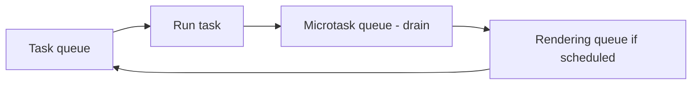
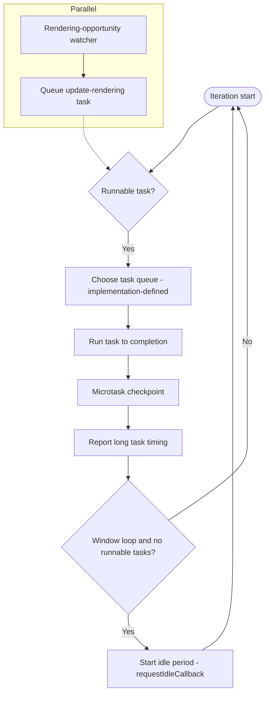

# Browser Event Loop: Rendering, Tasks, and Microtasks

A focused guide to the HTML Standard event loop processing model, moving from a minimal mental model to the full spec flow.

## Progressive Model (from simple to spec-accurate)

<figure>

<figcaption>Minimal mental model: task queue, microtask queue, rendering queue</figcaption>

</figure>

This is a simplified mental model. In the spec, rendering work is queued as tasks from the rendering task source and can interleave with other task sources.

<figure>

<figcaption>Simplified window event loop iteration plus the parallel rendering-opportunity watcher</figcaption>

</figure>

<figure>

<figcaption>Full HTML Standard processing model (window and worker event loops)</figcaption>

</figure>

```mermaid
flowchart TD
  %% =========================================
  %% Event loop processing model (main loop)
  %% =========================================
  subgraph EL["Event loop processing model (runs continually)"]
    EL0([Iteration start]) --> EL1["1. oldestTask = null<br/>1. taskStartTime = null"]

    EL1 --> EL2{"2. Any task queue has<br/>a runnable task?"}

    EL2 -- "Yes" --> EL3["2.1 Choose taskQueue<br/>(implementation-defined)"]
    EL3 --> EL4["2.2 taskStartTime = unsafe shared current time"]
    EL4 --> EL5["2.3 oldestTask = first runnable task in taskQueue<br/>    remove it from taskQueue"]
    EL5 --> EL6{"2.4 oldestTask.document != null?"}

    EL6 -- "Yes" --> EL7["2.4 Record task start time"]
    EL6 -- "No" --> EL8["(skip)"]
    EL7 --> EL9["2.5 Set currentlyRunningTask = oldestTask"]
    EL8 --> EL9

    EL9 --> EL10["2.6 Perform oldestTask.steps"]
    EL10 --> EL11["2.7 Set currentlyRunningTask = null"]
    EL11 --> MC0

    MC13 --> EL12["3. taskEndTime = unsafe shared current time"]
    EL2 -- "No" --> EL12

    EL12 --> EL13{"4. oldestTask != null?"}
    EL13 -- "Yes" --> EL14["4.1 Collect top-level browsing contexts<br/>    from oldestTask's script-eval settings set"]
    EL14 --> EL15["4.3 Report long tasks<br/>(taskStartTime, taskEndTime, contexts, oldestTask)"]
    EL15 --> EL16{"4.4 oldestTask.document != null?"}
    EL16 -- "Yes" --> EL17["4.4 Record task end time"]
    EL16 -- "No" --> EL18["(skip)"]
    EL17 --> EL19
    EL18 --> EL19
    EL13 -- "No" --> EL19

    EL19 --> EL20{"5. Window event loop AND<br/>no runnable tasks?"}
    EL20 -- "Yes" --> ID0["5.1 lastIdlePeriodStartTime = unsafe shared current time"]
    ID0 --> ID1["5.2 computeDeadline(): min(<br/>    lastIdle+50ms,<br/>    next timer deadline,<br/>    next render deadline if pending renders)"]
    ID1 --> ID2["5.3 For each same-loop window:<br/>    start an idle period algorithm<br/>(requestIdleCallback)"]
    ID2 --> WK0
    EL20 -- "No" --> WK0

    WK0{"6. Worker event loop?"}
    WK0 -- "Yes" --> WK1{"6.1 Supported DedicatedWorkerGlobalScope<br/>AND UA wants rendering update now?"}
    WK1 -- "Yes" --> WK2["6.1 now = current high resolution time"]
    WK2 --> WK3["6.1 Run animation frame callbacks(now)"]
    WK3 --> WK4["6.1 Update dedicated worker rendering"]
    WK4 --> WK5{"6.2 No tasks AND closing flag true?"}
    WK1 -- "No" --> WK5

    WK5 -- "Yes" --> WK6([Destroy event loop])
    WK5 -- "No" --> EL0

    WK0 -- "No" --> EL0
  end

  %% =========================================
  %% Microtask checkpoint (invoked after a task)
  %% =========================================
  subgraph MCK["Perform a microtask checkpoint"]
    MC0[[2.8 Perform microtask checkpoint]] --> MC1{"Already performing<br/>a microtask checkpoint?"}
    MC1 -- "Yes" --> MC13[[Return]]
    MC1 -- "No" --> MC2["Set performingMicrotaskCheckpoint = true"]

    MC2 --> MC3{"Microtask queue empty?"}
    MC3 -- "No" --> MC4["Dequeue oldestMicrotask"]
    MC4 --> MC5["Set currentlyRunningTask = oldestMicrotask"]
    MC5 --> MC6["Run oldestMicrotask"]
    MC6 --> MC7["Set currentlyRunningTask = null"]
    MC7 --> MC3

    MC3 -- "Yes" --> MC8["Notify about rejected promises<br/>(settings objects whose responsible loop is this loop)"]
    MC8 --> MC9["Cleanup IndexedDB transactions"]
    MC9 --> MC10["ClearKeptObjects()"]
    MC10 --> MC11["Set performingMicrotaskCheckpoint = false"]
    MC11 --> MC12["Record timing info for microtask checkpoint"]
    MC12 --> MC13[[Return]]
  end

  %% =========================================
  %% Window rendering opportunity watcher (parallel)
  %% =========================================
  subgraph PAR["Window event loop: rendering-opportunity watcher (in parallel)"]
    P0([Loop]) --> P1["Wait until at least one navigable<br/>might have a rendering opportunity"]
    P1 --> P2["lastRenderOpportunityTime = unsafe shared current time"]
    P2 --> P3["For each navigable with a rendering opportunity:<br/>queue a global task (rendering task source)<br/>to update the rendering"]
    P3 --> P0
  end

  %% Show that queued rendering tasks become runnable tasks for the event loop
  P3 -.-> EL2

  %% =========================================
  %% Rendering task body (queued task)
  %% =========================================
  subgraph RT["Rendering task: update the rendering"]
    R0([Run rendering task]) --> R1["frameTimestamp = lastRenderOpportunityTime"]
    R1 --> R2["docs = fully active Documents in this event loop<br/>(ordered by container/shadow-including tree rules)"]
    R2 --> R3["Filter non-renderable docs<br/>(render-blocked, hidden, suppressed, no opportunity)"]
    R3 --> R4["Unnecessary rendering: remove docs where<br/>rendering would have no visible effect AND no rAF callbacks"]
    R4 --> R5["Optionally remove docs UA prefers to skip"]
    R5 --> R6["Reveal docs"]
    R6 --> R7["Flush autofocus candidates (top-level traversable)"]
    R7 --> R8["Run resize steps"]
    R8 --> R9["Run scroll steps"]
    R9 --> R10["Evaluate media queries & report changes"]
    R10 --> R11["Update animations & send events (timestamp)"]
    R11 --> R12["Run fullscreen steps"]
    R12 --> R13["Handle canvas context lost/restored"]
    R13 --> R14["Run animation frame callbacks (rAF)"]
    R14 --> R15["Recalculate style & layout;<br/>process ResizeObserver loop"]
    R15 --> R16["Focus fixup if focused area not focusable"]
    R16 --> R17["Perform pending transition operations"]
    R17 --> R18["Update IntersectionObserver observations (timestamp)"]
    R18 --> R19["Record rendering time; mark paint timing"]
    R19 --> R20["Update rendering / UI for docs & navigables"]
    R20 --> R21["Process top layer removals"]
  end

  %% Indicate the parallel watcher queues this task
  P3 -.-> R0
```

## TLDR

**Browser event loop** coordinates JavaScript execution, microtasks, and rendering updates over the lifetime of a page or worker.

- **Pick a runnable task** from task queues (selection is implementation-defined)
- **Run the task to completion**, then **perform a microtask checkpoint**
- **Rendering updates** are queued as tasks from the rendering task source and only run when selected
- **Idle periods** start when a window loop has no runnable tasks; **workers can shut down** when closing and idle

## Event Loop Processing Model (HTML Standard)

The HTML Standard defines a continual loop that:

1. Chooses a task queue that has a runnable task (if any)
2. Removes the first runnable task from that queue and runs it to completion
3. Performs a microtask checkpoint
4. Records timing information and reports long tasks
5. Starts idle periods when a window event loop has no runnable tasks
6. For workers, optionally updates worker rendering and destroys the loop when closing and idle
7. Separately, in parallel, watches for rendering opportunities and queues update-rendering tasks

## Task Queues, Task Sources, and Microtasks

- **Task queues are sets**, not strict FIFO queues; the model removes the first runnable task from the chosen queue
- **Task sources** group related work (e.g., user interaction, networking, timers) and map to task queues
- **Runnable tasks** are those whose associated document is fully active (or null for non-window loops)
- **Microtasks** live in a separate microtask queue and are drained during the microtask checkpoint

## Rendering Opportunities and Update Rendering

- A window event loop runs a **parallel rendering-opportunity watcher** that queues update-rendering tasks on the rendering task source
- **Update rendering** runs as a normal task when selected by the event loop
- The update-rendering task includes **rAF callbacks**, animation updates, style and layout, and other rendering-related steps
- **Rendering opportunities are implementation-defined** (e.g., 60Hz or throttled for background tabs)

## Idle Periods and requestIdleCallback

When a window event loop has no runnable tasks, it starts an **idle period** and computes a deadline that considers:

- a 50ms cap for responsiveness
- upcoming timer deadlines
- the next render deadline when rendering is pending

This is the basis for `requestIdleCallback` scheduling.

## Why the Browser Event Loop Doesn't Quit

- **Window event loops** persist for the lifetime of the browsing context, not just while queues are non-empty
- **Worker event loops** can be destroyed when the worker is closing and there are no queued tasks

## Did you know?

- **The microtask queue is not a task queue**
- **Task selection is implementation-defined** across task queues, but ordering within a task source is preserved
- **Rendering updates are tasks**, queued via the rendering task source

## Key References

- [HTML Standard - Event loop processing model](https://html.spec.whatwg.org/multipage/webappapis.html#event-loop-processing-model)
- [HTML Standard - Event loops](https://html.spec.whatwg.org/multipage/webappapis.html#event-loops)
