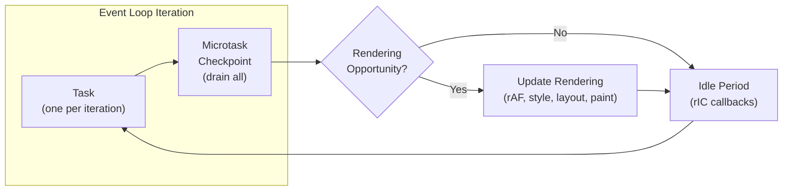
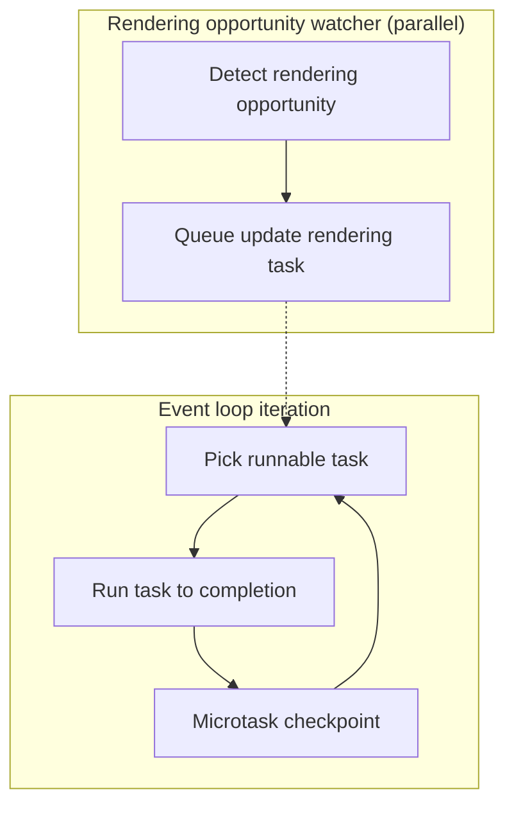

# Browser Event Loop: Tasks, Microtasks, Rendering, and Idle Time

Spec-accurate map of the WHATWG HTML Living Standard event loop in window and worker contexts, centered on task selection, microtask checkpoints, rendering opportunities, and idle scheduling. Focus is on latency and frame-budget trade-offs rather than beginner JavaScript async basics.

<figure>

<figcaption>Event loop iteration: one task → drain microtasks → optional rendering → idle callbacks → repeat.</figcaption>
</figure>

## Abstract

The browser event loop is a **policy-driven, single-threaded scheduler** with three execution tiers:

1. **Tasks** — One task executes per iteration, selected from task queues using UA-defined priority. Task queues are ordered sets (per the Infra Standard); selection across queues is flexible, but order within a task source is preserved.

2. **Microtasks** — Drained completely after each task, before rendering. The microtask queue is separate from task queues. Microtasks spawning microtasks extend the checkpoint, blocking all other work.

3. **Rendering** — Since the December 2023 spec refactor, "update the rendering" is a formal task on the rendering task source, not a post-task operation. rAF callbacks run inside this task, before style/layout. Rendering opportunities are UA-defined, typically aligned to 60Hz (~16.7ms budget).

**Operational invariants:**

- A task is runnable only if its document is fully active (or null for non-window loops)
- Long tasks or microtask loops delay rendering and input
- requestIdleCallback (rIC) runs during idle periods (no runnable tasks), capped at 50ms; callbacks posted during an idle period wait for the next one
- Worker event loops can terminate once closing and idle—schedule cleanup before calling `close()`

## Processing model at a glance

<figure>

<figcaption>Event loop iteration with a parallel rendering-opportunity watcher that queues rendering tasks.</figcaption>
</figure>

The processing model selects a task queue with a runnable task, executes that task to completion, and then performs a microtask checkpoint. Rendering opportunities are detected in parallel and enqueue update-rendering tasks that later compete with other tasks for selection.

> "Set oldestTask to the first runnable task in taskQueue, and remove it from taskQueue."

That single-task removal is the macro-task boundary: one task per iteration, then the microtask checkpoint.

> "A task is runnable if its document is either null or fully active."

> **Spec evolution (December 2023):** Prior to PR #10007, the spec modeled "update the rendering" as a post-task operation rather than a formal task. This created edge cases where microtasks could execute without a current task. The refactor aligned the spec with Chromium and Gecko implementations, which already treated rendering as a special task with its own task source.

**Example:** During a scroll, user-interaction tasks can be selected repeatedly while timer callbacks wait, keeping the UI responsive but delaying timers.

**Trade-offs:** Implementation-defined selection gives the UA room to prioritize input and responsiveness, but it reduces cross-queue fairness and predictability.

**Edge cases:** Tasks tied to non-fully-active documents remain non-runnable and can sit in queues until the document becomes fully active again.

## Task queues and task sources: ordering and prioritization

Task queues are attached to an event loop; task sources map related work (input, timers, networking) onto those queues. Ordering is preserved within each task source, but selection across queues is intentionally flexible.

> "A task queue is a set of tasks."

The term "set" here refers to the Infra Standard definition—an ordered collection that maintains insertion order and rejects duplicates. Despite the name, task queues preserve FIFO (First-In-First-Out) ordering: the spec requires selecting the "oldest" task. The "set" terminology allows UAs to skip non-runnable tasks without violating queue semantics.

> "Task queues are used to coalesce task sources."

Each task source (DOM manipulation, user interaction, networking, timers, etc.) must be associated with a specific task queue. Multiple task sources can share a queue, but each source's tasks stay ordered relative to each other.

> "the processing model still enforces that the user agent would never process events from any one task source out of order."

**Design rationale:** This architecture gives UAs flexibility to prioritize latency-critical sources (like user input) without breaking causal ordering within each source. A UA can maintain separate queues for input, network, and timers, then always select from the input queue first when tasks are pending.

**Example:** Pointer and keyboard events keep their relative order, but a network response task can be interleaved between them if the UA selects the networking queue.

**Trade-offs:** Preserving order within a source maintains causal consistency, while flexible cross-queue selection lets the UA favor latency-critical sources. The cost is that low-priority sources can starve.

**Edge cases:** Do not assume timers fire at their nominal deadlines; a busy interaction source can push them back significantly. The 4ms minimum delay for nested `setTimeout` (per the spec) compounds this—a timer-heavy app can accumulate significant drift.

## Chromium (Blink) main-thread queues and priorities

> **Implementation note:** This section describes Chromium's Blink scheduler as of early 2025. Queue types, priorities, and throttling policies change frequently. Treat this as a conceptual map, not an authoritative reference—consult the source code for current behavior.

Blink's main-thread scheduler defines a fixed set of queue types (`MainThreadTaskQueue::QueueType`) grouped into queue classes (loading, timer, compositor, none). Frame-associated work is posted using a `TaskType`, and `FrameScheduler::GetTaskRunner()` selects a task runner based on that type.

**Design rationale:** Most Blink work is single-threaded (JavaScript, DOM, CSS, layout). The scheduler must prioritize user input over background work to maintain 60fps. Rather than a static priority order, priorities are computed dynamically based on page state, visibility, and user interaction.

**Key priority rules:**

- Input queue has highest priority
- Compositor queue is boosted during user gestures (scrolling, dragging)
- Tasks at the same priority execute in FIFO order
- Background/hidden pages have reduced priority and may be throttled

### Queue inventory (MainThreadTaskQueue::QueueType)

Mapping below is derived from the TaskTypes.md trait matrix and queue-class names; treat it as a policy-level view rather than a strict guarantee for all Chromium branches.
Serial numbers follow the enum order, not a fixed priority ranking.

| # / Queue type          | TaskType groupings (derived)                                                                                                                                                                                                                                                                                                                                                                                                                                             |
| ----------------------- | ------------------------------------------------------------------------------------------------------------------------------------------------------------------------------------------------------------------------------------------------------------------------------------------------------------------------------------------------------------------------------------------------------------------------------------------------------------------------ |
| 1. kControl             | Thread-global control queue (internal; TaskTypes.md does not enumerate)                                                                                                                                                                                                                                                                                                                                                                                                  |
| 2. kDefault             | Thread-global default queue (internal; TaskTypes.md does not enumerate)                                                                                                                                                                                                                                                                                                                                                                                                  |
| 3. kUnthrottled         | Timer-class queue for unthrottled work (policy-driven)                                                                                                                                                                                                                                                                                                                                                                                                                   |
| 4. kFrameLoading        | `kNetworking`, `kNetworkingWithURLLoaderAnnotation`, `kInternalLoading`, `kInternalContinueScriptLoading`                                                                                                                                                                                                                                                                                                                                                                |
| 5. kFrameLoadingControl | `kNetworkingControl`                                                                                                                                                                                                                                                                                                                                                                                                                                                     |
| 6. kFrameThrottleable   | `kJavascriptTimerDelayedLowNesting`, `kJavascriptTimerDelayedHighNesting`, `kWebSchedulingPostedTask` (delay > 0), `kInternalTranslation`, `kInternalContentCapture`                                                                                                                                                                                                                                                                                                     |
| 7. kFrameDeferrable     | `kDOMManipulation`, `kLowPriorityScriptExecution`, `kHistoryTraversal`, `kEmbed`, `kCanvasBlobSerialization`, `kMicrotask`, `kJavascriptTimerImmediate`, `kRemoteEvent`, `kWebSocket`, `kUnshippedPortMessage`, `kFileReading`, `kPresentation`, `kSensor`, `kPerformanceTimeline`, `kWebGL`, `kWebGPU`, `kMiscPlatformAPI`, `kFontLoading`, `kApplicationLifeCycle`, `kBackgroundFetch`, `kPermission`, `kWakeLock`, `kStorage`, `kMachineLearning`, `kInternalDefault` |
| 8. kFramePausable       | `kMediaElementEvent`, `kPostedMessage`, `kBackForwardCachePostedMessage`, `kDatabaseAccess`, `kWorkerAnimation`, `kServiceWorkerClientMessage`, `kInternalWebCrypto`, `kInternalMedia`, `kInternalMediaRealTime`, `kInternalIntersectionObserver`, `kInternalPostMessageForwarding`                                                                                                                                                                                      |
| 9. kFrameUnpausable     | `kWebLocks`, `kInternalIPC`, `kInternalInspector`, `kInternalNavigationAssociated`, `kInternalFreezableIPC`                                                                                                                                                                                                                                                                                                                                                              |
| 10. kCompositor         | Thread-global compositor queue (internal; TaskTypes.md does not enumerate)                                                                                                                                                                                                                                                                                                                                                                                               |
| 11. kIdle               | `kIdleTask`                                                                                                                                                                                                                                                                                                                                                                                                                                                              |
| 12. kTest               | `kInternalTest`                                                                                                                                                                                                                                                                                                                                                                                                                                                          |
| 13. kV8                 | Main-thread V8 queue (internal; TaskTypes.md does not enumerate)                                                                                                                                                                                                                                                                                                                                                                                                         |
| 14. kIPC                | Main-thread IPC queue (internal; TaskTypes.md does not enumerate)                                                                                                                                                                                                                                                                                                                                                                                                        |
| 15. kInput              | `kUserInteraction`, `kInternalUserInteraction`                                                                                                                                                                                                                                                                                                                                                                                                                           |
| 16. kDetached           | Detached-frame queues (internal)                                                                                                                                                                                                                                                                                                                                                                                                                                         |
| 17. kOther              | Metrics grouping (internal)                                                                                                                                                                                                                                                                                                                                                                                                                                              |

### Common event map (practical view)

| Common event                      | TaskType(s) and queue class                                                                                                        |
| --------------------------------- | ---------------------------------------------------------------------------------------------------------------------------------- |
| XHR/fetch responses               | `kNetworking`, `kNetworkingWithURLLoaderAnnotation` → loading class (kFrameLoading)                                                |
| Timers (setTimeout/setInterval)   | `kJavascriptTimerImmediate` and delayed timers (`kJavascriptTimerDelayed*`) → timer class; delayed timers are throttleable         |
| Input (keyboard, pointer, scroll) | `kUserInteraction`, `kInternalUserInteraction` → input priority (kInput)                                                           |
| DOM/observer callbacks            | MutationObserver → microtask checkpoint (not a `TaskType`); `kInternalIntersectionObserver`; DOM task sources → `kDOMManipulation` |
| requestIdleCallback               | `kIdleTask` → idle queue class                                                                                                     |

**Example:** During a scroll plus a burst of timers, input tasks run first, compositor work is boosted, and timer callbacks slip, trading timer accuracy for responsiveness.

**Trade-offs:** Policy-driven routing and dynamic priorities improve interactivity, but reduce cross-queue predictability.

**Edge cases:** Throttlable timers can be delayed when pages are not visible; task types marked deferrable/pausable/freezable can be delayed or paused when lifecycle policy applies.

## Microtasks and microtask checkpoints

Microtasks are drained at each microtask checkpoint after a task completes. Any microtasks enqueued during the checkpoint are also processed before the event loop returns to task selection.

> "The microtask queue is not a task queue."

The microtask queue is a separate data structure from task queues—it has exactly one instance per event loop, not per task source. This distinction matters because microtasks do not compete for selection; they all drain before any new task runs.

> "While the event loop's microtask queue is not empty:"

This is the drain semantics: the checkpoint keeps running until the queue is empty, so microtasks queued by a microtask are executed in the same checkpoint.

**When checkpoints occur:**

- After each task completes (when the JS execution context stack is empty)
- During HTML parsing, after script element execution
- As part of the "clean up after running script" algorithm
- When the execution context stack empties during callback invocation

The checkpoint algorithm sets a `performingMicrotaskCheckpoint` flag to prevent re-entrancy—calling a function that would trigger another checkpoint during a checkpoint is a no-op.

**Example:** A click handler that chains Promises can block rendering until the chain ends; each Promise enqueues more microtasks and the checkpoint drains them before any new task is selected. Insert a task boundary (`setTimeout`, `MessageChannel`, or `scheduler.postTask`) to yield.

**Trade-offs:** Microtasks provide deterministic ordering for promise reactions and DOM mutation delivery, but they can starve tasks and rendering if used as an unbounded loop.

**Edge cases:** Microtask checkpoints also handle rejected promise notifications, IndexedDB transaction cleanup, and `ClearKeptObjects()` (weak reference handling); long microtask runs delay these and any subsequent rendering.

## Rendering opportunities and update the rendering task

Rendering opportunities are UA-defined; when one occurs, the UA queues an update-rendering task on the rendering task source. That task runs rAF callbacks, style and layout, observer notifications, and painting work as part of a single rendering update.

> "queue a global task on the rendering task source to update the rendering"

> "Rendering opportunities occur at a maximum of every 60th of a second (about 16.7ms)."

**rAF timestamp source:** The timestamp passed to rAF callbacks varies by implementation. Chromium and Gecko derive it from vsync signals; WebKit uses the timestamp at the start of the "update the rendering" phase. This can cause observable timing differences in frame-pacing code.

> "Let callbackHandles be the result of getting the keys of callbacks."

**Inference:** Because the algorithm snapshots callback handles and removes each callback before invoking it, callbacks added during a rAF callback are deferred to the next rendering update.

**Example:** If a rAF callback calls `requestAnimationFrame()` again, the new callback runs on the next frame, not in the current batch; at 60Hz a 25ms task drops a frame and delays the next rAF run.

**Trade-offs:** Treating rendering as a task keeps the model uniform and allows input tasks to preempt rendering, but it also means rendering is not guaranteed every loop iteration.

**Browser inconsistencies:**

- **rAF timing:** Chrome and Firefox run rAF before the next render (spec-compliant). Safari historically ran rAF before the _following_ render, causing a one-frame delay. Per WHATWG GitHub issue #2569, developer expectations were split 60/40.
- **Iframe ordering:** The spec requires processing documents in a specific order (container/shadow-including tree rules), but implementations differ on whether iframes without rAF callbacks are skipped entirely.

**Edge cases:** For non-visible documents, the UA may reduce rendering opportunities dramatically (the spec notes as low as 4 per second), so rAF-driven work effectively pauses or throttles. Hidden tabs may receive zero rendering opportunities.

## Idle periods and requestIdleCallback

When a window event loop has no runnable tasks, the spec computes an idle deadline using three bounds: a 50ms cap from the last idle period start time, the nearest timer deadline, and (when renders are pending) the next render deadline.

**Design rationale:** The 50ms cap ensures the UA can respond to user input within 100ms (the threshold for perceived instantaneous response). Even if an idle callback starts just before user input, the worst-case response time is 50ms idle + time to process the input.

> "Let deadline be this event loop's last idle period start time plus 50."

> "If nextRenderDeadline is less than deadline, then return nextRenderDeadline."

requestIdleCallback (rIC) queues work onto the idle-task task source and runs idle callbacks in FIFO order until the idle period ends or the runnable list is empty. Only callbacks posted before the idle period begins are eligible; callbacks posted during a callback wait for the next idle period.

> "Only idle tasks which posted before the start of the current idle period are eligible"

This eligibility rule prevents a callback from monopolizing idle time by immediately re-posting itself—each re-post waits for the next idle period.

Idle periods are UA-defined and singular per window; the UA may end them early, and heavy load can mean no idle periods at all.

> "There can only be one idle period active at a given time"

> "there is no guarantee that a user agent will have any idle CPU time available"

**IdleDeadline interface:**

- `timeRemaining()` — Returns milliseconds until deadline, clamped to ≥0
- `didTimeout` — True when the callback runs via the timeout path rather than inside an idle period

> "if the specified timeout is reached before the callback is executed within an idle period, a task is queued to execute it."

Each `requestIdleCallback` schedules a single callback; to keep running work, re-post at the end of the callback.

**Example:** Break a 50ms analytics batch into 2–5ms chunks. If `timeRemaining()` drops below 2ms, reschedule with rIC; add a 2000ms timeout to guarantee completion even under continuous load.

**Trade-offs:** Idle scheduling maximizes responsiveness and power efficiency, but the deadline is a hint and can end early or never arrive under load.

**Edge cases:**

- Callbacks posted during an idle callback run in the next idle period, not the current one
- A timeout callback can fire outside idle time with `didTimeout=true` and `timeRemaining()=0`
- Safari does not support `requestIdleCallback`; use a polyfill based on `setTimeout` with frame-timing heuristics

**Browser support:** Chrome, Firefox, Edge. Not supported in Safari as of January 2025.

## Worker event loops and shutdown

Worker event loops follow the same task and microtask mechanics, but they can be destroyed when closing and idle. Dedicated workers may also run rendering updates when the UA supports it.

**Example:** A DedicatedWorker should post any final results before calling close(); once the closing flag is set and queues drain, the loop can terminate.

**Trade-offs:** Automatic teardown frees resources quickly, but it can surprise code that assumes the loop will stay alive until explicit termination is observed.

**Edge cases:** Tasks queued after close() or during shutdown may never run.

## Conclusion

The browser event loop is a policy-driven scheduler with three execution tiers: tasks (one per iteration, selected from ordered sets using UA-defined priority), microtasks (drained completely after each task), and rendering (a formal task since the December 2023 spec refactor). The practical outcomes are input-first scheduling, microtask starvation risks, and rendering timing that is intentionally UA-defined.

Key operational insights:

- **Yield to rendering** by inserting task boundaries (`setTimeout`, `MessageChannel`, `scheduler.postTask`) rather than chaining microtasks
- **Don't rely on timer accuracy**—busy interaction sources push timers back, and the 4ms nested timer clamp compounds drift
- **Use rIC timeouts for must-run work**—idle periods are not guaranteed under load
- **Account for browser differences**—rAF timing, rIC support, and task prioritization vary across engines

## Appendix

### Prerequisites

- JavaScript run-to-completion semantics and the call stack model.
- High-level understanding of the rendering pipeline (style, layout, paint).

### Terminology

- **Task**: A unit of work queued on a task queue for an event loop. Consists of steps, a source, a document, and a script evaluation environment settings object set.
- **Task queue**: An ordered set (per Infra Standard) of tasks associated with a specific event loop. Despite the name "set," FIFO ordering is preserved.
- **Task source**: A category of tasks with ordering guarantees. Each task source maps to a specific task queue; order within a source is preserved, but the UA chooses which queue to select from.
- **Runnable task**: A task whose associated document is fully active, or whose document is null (for non-window tasks).
- **Microtask**: High-priority work run during a microtask checkpoint. Not part of any task queue.
- **Microtask queue**: A separate queue (one per event loop) that holds microtasks. Drained completely at each checkpoint.
- **Microtask checkpoint**: The algorithm that drains the microtask queue. Occurs after tasks, during parsing, and during script cleanup. Uses a re-entrancy guard.
- **Idle period**: A UA-defined window (max 50ms) when no runnable tasks exist. Used for running idle callbacks.
- **Idle callback**: A `requestIdleCallback` handler invoked during an idle period or via timeout.
- **IdleDeadline**: Object passed to idle callbacks; exposes `timeRemaining()` (clamped to ≥0) and `didTimeout`.
- **Rendering opportunity**: A UA-defined point when rendering can be updated, typically aligned to 60Hz.
- **Update the rendering task**: A task on the rendering task source that runs rAF callbacks, style recalculation, layout, and paint-related work.
- **requestAnimationFrame (rAF)**: API to schedule a callback for the next rendering update. Callbacks are snapshotted; new callbacks added during execution run in the next frame.
- **requestIdleCallback (rIC)**: API to schedule best-effort work during idle periods. Not supported in Safari.
- **User Agent (UA)**: The browser engine implementing the event loop (e.g., Blink, Gecko, WebKit).

### Summary

- Task queues are ordered sets (per Infra Standard); task selection across queues is UA-defined, but ordering within each task source is preserved.
- Each task runs to completion and is followed by a microtask checkpoint that drains the microtask queue completely—including microtasks spawned during the checkpoint.
- The microtask queue is separate from task queues; microtask checkpoints also occur during parsing and script cleanup, not just after tasks.
- Since December 2023, "update the rendering" is a formal task on the rendering task source (previously a post-task operation).
- Idle callbacks run FIFO during UA-defined idle periods capped at 50ms; callbacks posted during a period wait for the next one. Safari does not support `requestIdleCallback`.
- Worker event loops can terminate automatically when closing and idle; schedule cleanup before calling `close()`.

### References

**Specifications**

- [WHATWG HTML Living Standard - Event loop processing model](https://html.spec.whatwg.org/multipage/webappapis.html#event-loop-processing-model)
- [WHATWG HTML Living Standard - Task queues](https://html.spec.whatwg.org/multipage/webappapis.html#task-queues)
- [WHATWG HTML Living Standard - Task sources](https://html.spec.whatwg.org/multipage/webappapis.html#task-sources)
- [WHATWG HTML Living Standard - Microtask queue](https://html.spec.whatwg.org/multipage/webappapis.html#microtask-queue)
- [WHATWG HTML Living Standard - Perform a microtask checkpoint](https://html.spec.whatwg.org/multipage/webappapis.html#perform-a-microtask-checkpoint)
- [WHATWG HTML Living Standard - Rendering opportunities](https://html.spec.whatwg.org/multipage/webappapis.html#rendering-opportunities)
- [WHATWG HTML Living Standard - Update the rendering](https://html.spec.whatwg.org/multipage/webappapis.html#update-the-rendering)
- [WHATWG HTML Living Standard - Animation frames](https://html.spec.whatwg.org/multipage/imagebitmap-and-animations.html#animation-frames)
- [WHATWG Infra Standard - Sets](https://infra.spec.whatwg.org/#sets) - Definition of "set" used by task queues
- [DOM Standard - MutationObserver](https://dom.spec.whatwg.org/#mutationobserver)
- [W3C requestIdleCallback](https://www.w3.org/TR/requestidlecallback/)

**Spec Issues and PRs**

- [WHATWG HTML Issue #9824 - Event loop: update the rendering step mismatches implementations](https://github.com/whatwg/html/issues/9824) - Discussion of spec vs implementation discrepancies
- [WHATWG HTML Issue #2569 - rAF timing differences](https://github.com/whatwg/html/issues/2569) - Chrome/Firefox vs Safari rAF behavior
- [WHATWG HTML PR #10007](https://github.com/whatwg/html/pull/10007) - December 2023 refactor making rendering a formal task

**Official Documentation**

- [MDN - Using microtasks in JavaScript](https://developer.mozilla.org/en-US/docs/Web/API/HTML_DOM_API/Microtask_guide)
- [MDN - In depth: Microtasks and the JavaScript runtime](https://developer.mozilla.org/en-US/docs/Web/API/HTML_DOM_API/Microtask_guide/In_depth)

**Core Maintainer Content**

- [Tasks, Microtasks, Queues and Schedules - Jake Archibald](https://jakearchibald.com/2015/tasks-microtasks-queues-and-schedules/) - Interactive visualization of event loop execution

**Implementation References (Chromium)**

- [Chromium Docs - Task Scheduling in Blink](https://chromium.googlesource.com/chromium/src/+/HEAD/third_party/blink/renderer/platform/scheduler/TaskSchedulingInBlink.md)
- [Chromium Docs - Threading and Tasks in Chrome](https://chromium.googlesource.com/chromium/src/+/main/docs/threading_and_tasks.md)
- [Chromium Docs - Threading and Tasks FAQ](https://chromium.googlesource.com/chromium/src/+/HEAD/docs/threading_and_tasks_faq.md)
