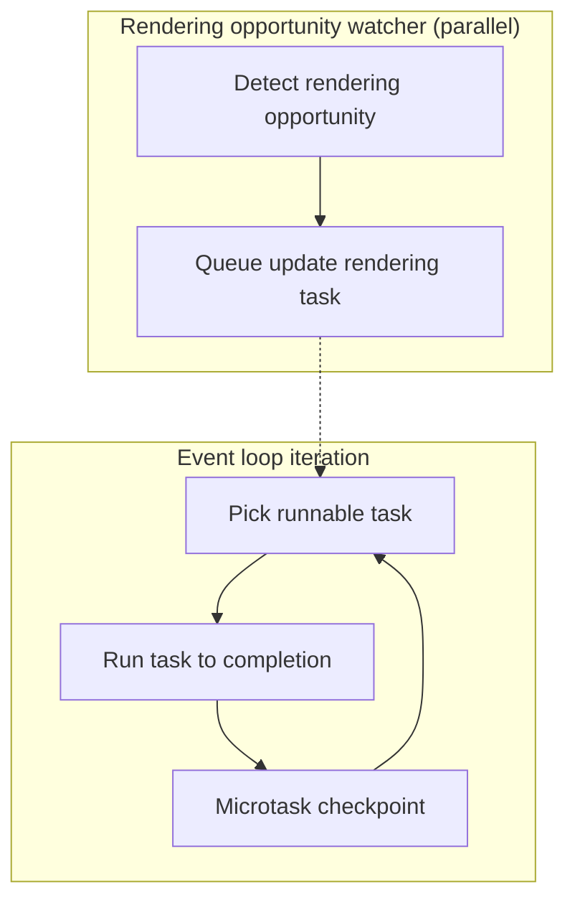

# Browser Event Loop: Tasks, Microtasks, Rendering, and Idle Time

Spec-accurate map of the HTML Standard event loop in window and worker contexts, centered on task selection, microtask checkpoints, rendering opportunities, and idle scheduling.
Focus is on latency and frame-budget trade-offs rather than beginner JavaScript async basics.

## TLDR

### Scheduling invariants

- Task queues are sets; the event loop selects a runnable task from a chosen queue using implementation-defined policy.
- Each loop iteration runs a single runnable task to completion, then a microtask checkpoint drains the microtask queue.
- A task is runnable only when its document is fully active (or null for non-window loops).

### Rendering integration

- Rendering opportunities are User Agent (UA) defined and can align with display refresh.
- Update-the-rendering work is queued as a task; requestAnimationFrame (rAF) callbacks run inside that task.

### Operational pitfalls

- Long tasks or microtask loops delay rendering and input; the 60Hz budget is about 16.7ms.
- requestIdleCallback (rIC) is best-effort and time-capped; callbacks posted during an idle period run in the next one, so use timeouts for must-run work.
- Worker event loops can terminate once closing and idle; schedule cleanup before calling close().

### Example snapshot

- A scroll-driven input stream can keep input tasks selected while a timer callback waits, preserving responsiveness but delaying timers.

## Processing model at a glance

<figure>

<figcaption>Event loop iteration with a parallel rendering-opportunity watcher that queues rendering tasks.</figcaption>
</figure>

The processing model selects a task queue with a runnable task, executes that task to completion, and then performs a microtask checkpoint. Rendering opportunities are detected in parallel and enqueue update-rendering tasks that later compete with other tasks for selection.

> "Set oldestTask to the first runnable task in taskQueue, and remove it from taskQueue."

That single-task removal is the macro-task boundary: one task per iteration, then the microtask checkpoint.

> "A task is runnable if its document is either null or fully active."

**Example:** During a scroll, user-interaction tasks can be selected repeatedly while timer callbacks wait, keeping the UI responsive but delaying timers.

**Trade-offs:** Implementation-defined selection gives the UA room to prioritize input and responsiveness, but it reduces cross-queue fairness and predictability.

**Edge cases:** Tasks tied to non-fully-active documents remain non-runnable and can sit in queues until the document becomes fully active again.

## Task queues and task sources: ordering and prioritization

Task queues are attached to an event loop; task sources map related work (input, timers, networking) onto those queues. Ordering is preserved within each task source, but selection across queues is intentionally flexible.

> "Task queues are sets, not queues."

> "Task queues are used to coalesce task sources."

> "the processing model still enforces that the user agent would never process events from any one task source out of order."

**Example:** Pointer and keyboard events keep their relative order, but a network response task can be interleaved between them if the UA selects the networking queue.

**Trade-offs:** Preserving order within a source maintains causal consistency, while set-based queues let the UA favor latency-critical sources. The cost is that low-priority sources can starve.

**Edge cases:** Do not assume timers fire at their nominal deadlines; a busy interaction source can push them back significantly.

## Chromium (Blink) main-thread queues and priorities

Blink’s main-thread scheduler defines a fixed set of queue types (`MainThreadTaskQueue::QueueType`) grouped into queue classes (loading, timer, compositor, none). Frame-associated work is posted using a `TaskType`, and `FrameScheduler::GetTaskRunner()` selects a task runner based on that type; the TaskTypes.md matrix records the throttling/deferral/pausing traits for each frame task type.

Priorities are computed dynamically: tasks at the same priority run in order, input is highest, compositor is boosted during gestures, and the default is normal. There is no single static total order across queue types.

### Queue inventory (MainThreadTaskQueue::QueueType)

Mapping below is derived from the TaskTypes.md trait matrix and queue-class names; treat it as a policy-level view rather than a strict guarantee for all Chromium branches.
Serial numbers follow the enum order, not a fixed priority ranking.

| # / Queue type          | TaskType groupings (derived)                                                                                                                                                                                                                                                                                                                                                                                                                                             |
| ----------------------- | ------------------------------------------------------------------------------------------------------------------------------------------------------------------------------------------------------------------------------------------------------------------------------------------------------------------------------------------------------------------------------------------------------------------------------------------------------------------------ |
| 1. kControl             | Thread-global control queue (internal; TaskTypes.md does not enumerate)                                                                                                                                                                                                                                                                                                                                                                                                  |
| 2. kDefault             | Thread-global default queue (internal; TaskTypes.md does not enumerate)                                                                                                                                                                                                                                                                                                                                                                                                  |
| 3. kUnthrottled         | Timer-class queue for unthrottled work (policy-driven)                                                                                                                                                                                                                                                                                                                                                                                                                   |
| 4. kFrameLoading        | `kNetworking`, `kNetworkingWithURLLoaderAnnotation`, `kInternalLoading`, `kInternalContinueScriptLoading`                                                                                                                                                                                                                                                                                                                                                                |
| 5. kFrameLoadingControl | `kNetworkingControl`                                                                                                                                                                                                                                                                                                                                                                                                                                                     |
| 6. kFrameThrottleable   | `kJavascriptTimerDelayedLowNesting`, `kJavascriptTimerDelayedHighNesting`, `kWebSchedulingPostedTask` (delay > 0), `kInternalTranslation`, `kInternalContentCapture`                                                                                                                                                                                                                                                                                                     |
| 7. kFrameDeferrable     | `kDOMManipulation`, `kLowPriorityScriptExecution`, `kHistoryTraversal`, `kEmbed`, `kCanvasBlobSerialization`, `kMicrotask`, `kJavascriptTimerImmediate`, `kRemoteEvent`, `kWebSocket`, `kUnshippedPortMessage`, `kFileReading`, `kPresentation`, `kSensor`, `kPerformanceTimeline`, `kWebGL`, `kWebGPU`, `kMiscPlatformAPI`, `kFontLoading`, `kApplicationLifeCycle`, `kBackgroundFetch`, `kPermission`, `kWakeLock`, `kStorage`, `kMachineLearning`, `kInternalDefault` |
| 8. kFramePausable       | `kMediaElementEvent`, `kPostedMessage`, `kBackForwardCachePostedMessage`, `kDatabaseAccess`, `kWorkerAnimation`, `kServiceWorkerClientMessage`, `kInternalWebCrypto`, `kInternalMedia`, `kInternalMediaRealTime`, `kInternalIntersectionObserver`, `kInternalPostMessageForwarding`                                                                                                                                                                                      |
| 9. kFrameUnpausable     | `kWebLocks`, `kInternalIPC`, `kInternalInspector`, `kInternalNavigationAssociated`, `kInternalFreezableIPC`                                                                                                                                                                                                                                                                                                                                                              |
| 10. kCompositor         | Thread-global compositor queue (internal; TaskTypes.md does not enumerate)                                                                                                                                                                                                                                                                                                                                                                                               |
| 11. kIdle               | `kIdleTask`                                                                                                                                                                                                                                                                                                                                                                                                                                                              |
| 12. kTest               | `kInternalTest`                                                                                                                                                                                                                                                                                                                                                                                                                                                          |
| 13. kV8                 | Main-thread V8 queue (internal; TaskTypes.md does not enumerate)                                                                                                                                                                                                                                                                                                                                                                                                         |
| 14. kIPC                | Main-thread IPC queue (internal; TaskTypes.md does not enumerate)                                                                                                                                                                                                                                                                                                                                                                                                        |
| 15. kInput              | `kUserInteraction`, `kInternalUserInteraction`                                                                                                                                                                                                                                                                                                                                                                                                                           |
| 16. kDetached           | Detached-frame queues (internal)                                                                                                                                                                                                                                                                                                                                                                                                                                         |
| 17. kOther              | Metrics grouping (internal)                                                                                                                                                                                                                                                                                                                                                                                                                                              |

### Common event map (practical view)

| Common event                      | TaskType(s) and queue class                                                                                                        |
| --------------------------------- | ---------------------------------------------------------------------------------------------------------------------------------- |
| XHR/fetch responses               | `kNetworking`, `kNetworkingWithURLLoaderAnnotation` → loading class (kFrameLoading)                                                |
| Timers (setTimeout/setInterval)   | `kJavascriptTimerImmediate` and delayed timers (`kJavascriptTimerDelayed*`) → timer class; delayed timers are throttleable         |
| Input (keyboard, pointer, scroll) | `kUserInteraction`, `kInternalUserInteraction` → input priority (kInput)                                                           |
| DOM/observer callbacks            | MutationObserver → microtask checkpoint (not a `TaskType`); `kInternalIntersectionObserver`; DOM task sources → `kDOMManipulation` |
| requestIdleCallback               | `kIdleTask` → idle queue class                                                                                                     |

**Example:** During a scroll plus a burst of timers, input tasks run first, compositor work is boosted, and timer callbacks slip, trading timer accuracy for responsiveness.

**Trade-offs:** Policy-driven routing and dynamic priorities improve interactivity, but reduce cross-queue predictability.

**Edge cases:** Throttlable timers can be delayed when pages are not visible; task types marked deferrable/pausable/freezable can be delayed or paused when lifecycle policy applies.

## Microtasks and microtask checkpoints

Microtasks are drained at each microtask checkpoint after a task completes. Any microtasks enqueued during the checkpoint are also processed before the event loop returns to task selection.

> "The microtask queue is not a task queue."

> "While the event loop's microtask queue is not empty:"

This is the drain semantics: the checkpoint keeps running until the queue is empty, so microtasks queued by a microtask are executed in the same checkpoint.

**Example:** A click handler that chains Promises can block rendering until the chain ends; each Promise enqueues more microtasks and the checkpoint drains them before any new task is selected. Insert a task boundary (setTimeout or MessageChannel) to yield.

**Trade-offs:** Microtasks provide deterministic ordering for promise reactions and DOM mutation delivery, but they can starve tasks and rendering if used as an unbounded loop.

**Edge cases:** Microtask checkpoints also handle rejected promise notifications and IndexedDB transaction cleanup; long microtask runs delay these and any subsequent rendering.

## Rendering opportunities and update the rendering task

Rendering opportunities are UA-defined; when one occurs, the UA queues an update-rendering task on the rendering task source. That task runs rAF callbacks, style and layout, observer notifications, and painting work as part of a single rendering update.

> "queue a global task on the rendering task source to update the rendering"

> "Rendering opportunities occur at a maximum of every 60th of a second (about 16.7ms)."

> "Let callbackHandles be the result of getting the keys of callbacks."

**Inference:** Because the algorithm snapshots callback handles and removes each callback before invoking it, callbacks added during a rAF callback are deferred to the next rendering update.

**Example:** If a rAF callback calls `requestAnimationFrame()` again, the new callback runs on the next frame, not in the current batch; at 60Hz a 25ms task drops a frame and delays the next rAF run.

**Trade-offs:** Treating rendering as a task keeps the model uniform and allows input tasks to preempt rendering, but it also means rendering is not guaranteed every loop iteration.

**Edge cases:** For non-visible documents, the UA may reduce rendering opportunities dramatically (the spec notes as low as 4 per second), so rAF-driven work effectively pauses or throttles.

## Idle periods and requestIdleCallback

When a window event loop has no runnable tasks, the HTML Standard computes an idle deadline using three bounds: a 50ms cap from the last idle period start time, the nearest timer deadline, and (when renders are pending) the next render deadline.

> "Let deadline be this event loop's last idle period start time plus 50."

> "If nextRenderDeadline is less than deadline, then return nextRenderDeadline."

requestIdleCallback (rIC) queues work onto the idle-task task source and runs idle callbacks in first-in, first-out (FIFO) order until the idle period ends or the runnable list is empty. Only callbacks posted before the idle period begins are eligible; callbacks posted during a callback wait for the next idle period.

> "Queue a task on the queue associated with the idle-task task source."

> "run idle callbacks in FIFO order"

> "Only idle tasks which posted before the start of the current idle period are eligible"

Idle periods are UA-defined and singular per window; the UA may end them early, and heavy load can mean no idle periods at all.

> "There can only be one idle period active at a given time"

> "The user agent is free to end an idle period early"

> "there is no guarantee that a user agent will have any idle CPU time available"

IdleDeadline exposes timeRemaining() and didTimeout. timeRemaining() is clamped to zero, and didTimeout is true when the callback runs via the timeout path rather than inside an idle period.

> "If timeRemaining is negative, set it to 0."

> "The didTimeout getter MUST return timeout."

> "if the specified timeout is reached before the callback is executed within an idle period, a task is queued to execute it."

Each requestIdleCallback schedules a single callback; to keep running work, re-post at the end of the callback.

> "requestIdleCallback() only schedules a single callback."

**Example:** Break a 50ms analytics batch into 2–5ms chunks. If timeRemaining() drops below 2ms, reschedule with rIC; add a 2000ms timeout to guarantee completion.

**Trade-offs:** Idle scheduling maximizes responsiveness and power efficiency, but the deadline is a hint and can end early or never arrive under load.

**Edge cases:** Callbacks posted during an idle callback run in the next idle period; a timeout callback can fire outside idle time with didTimeout=true and timeRemaining()=0.

## Worker event loops and shutdown

Worker event loops follow the same task and microtask mechanics, but they can be destroyed when closing and idle. Dedicated workers may also run rendering updates when the UA supports it.

**Example:** A DedicatedWorker should post any final results before calling close(); once the closing flag is set and queues drain, the loop can terminate.

**Trade-offs:** Automatic teardown frees resources quickly, but it can surprise code that assumes the loop will stay alive until explicit termination is observed.

**Edge cases:** Tasks queued after close() or during shutdown may never run.

## Conclusion

The browser event loop is a policy-driven scheduler: tasks are selected from sets of queues, microtasks are drained deterministically after each task, and rendering is just another task that competes for time. The practical outcomes are input-first scheduling, microtask starvation risks, and rendering timing that is intentionally UA-defined.

## Appendix

### Prerequisites

- JavaScript run-to-completion semantics and the call stack model.
- High-level understanding of the rendering pipeline (style, layout, paint).

### Terminology

- **Task**: A unit of work queued on a task queue for an event loop.
- **Task queue**: A set of tasks associated with a specific event loop.
- **Task source**: A category of tasks with ordering guarantees mapped to task queues.
- **Runnable task**: A task whose associated document is fully active, or whose document is null.
- **Microtask**: High-priority work run during a microtask checkpoint.
- **Microtask checkpoint**: The step that drains the microtask queue after each task.
- **Idle period**: A UA-defined idle window with a deadline for running idle callbacks.
- **Idle callback**: A `requestIdleCallback` handler invoked during an idle period.
- **IdleDeadline**: Object passed to idle callbacks; exposes `timeRemaining()` and `didTimeout`.
- **Rendering opportunity**: A UA-defined point when rendering can be updated.
- **Update the rendering task**: The rendering task that runs rAF callbacks, style/layout, and paint-related work.
- **requestAnimationFrame (rAF)**: API to schedule a callback for the next rendering update.
- **requestIdleCallback (rIC)**: API to schedule best-effort work during idle periods.
- **User Agent (UA)**: The browser engine implementing the event loop.

### Summary

- Task selection is implementation-defined across task queues, but ordering within a task source is preserved.
- Each task runs to completion and is followed by a microtask checkpoint that drains the microtask queue.
- Rendering updates are queued as tasks and are gated by UA-defined rendering opportunities.
- Idle callbacks run FIFO during UA-defined idle periods; callbacks posted during a period run in the next, and timeouts can force execution outside idle time.
- Worker event loops can terminate automatically when closing and idle.

### References

- [HTML Standard - Event loop processing model](https://html.spec.whatwg.org/multipage/webappapis.html#event-loop-processing-model)
- [HTML Standard - Task queues](https://html.spec.whatwg.org/multipage/webappapis.html#task-queues)
- [HTML Standard - Task sources](https://html.spec.whatwg.org/multipage/webappapis.html#task-sources)
- [HTML Standard - Microtask queue](https://html.spec.whatwg.org/multipage/webappapis.html#microtask-queue)
- [HTML Standard - Perform a microtask checkpoint](https://html.spec.whatwg.org/multipage/webappapis.html#perform-a-microtask-checkpoint)
- [HTML Standard - Rendering opportunities](https://html.spec.whatwg.org/multipage/webappapis.html#rendering-opportunities)
- [HTML Standard - Update the rendering](https://html.spec.whatwg.org/multipage/webappapis.html#update-the-rendering)
- [HTML Standard - Animation frames](https://html.spec.whatwg.org/multipage/imagebitmap-and-animations.html#animation-frames)
- [DOM Standard - MutationObserver](https://dom.spec.whatwg.org/#mutationobserver)
- [W3C - requestIdleCallback](https://www.w3.org/TR/requestidlecallback/)
- [Chromium Docs - Document Index](https://chromium.googlesource.com/chromium/src/+/HEAD/docs/README.md#document-index)
- [Chromium Docs - Threading and Tasks in Chrome](https://chromium.googlesource.com/chromium/src/+/main/docs/threading_and_tasks.md)
- [Chromium Docs - Threading and Tasks in Chrome - FAQ](https://chromium.googlesource.com/chromium/src/+/HEAD/docs/threading_and_tasks_faq.md)
- [Chromium Docs - Chromium Design Docs](https://chromium.googlesource.com/chromium/src/+/main/docs/design/README.md)
