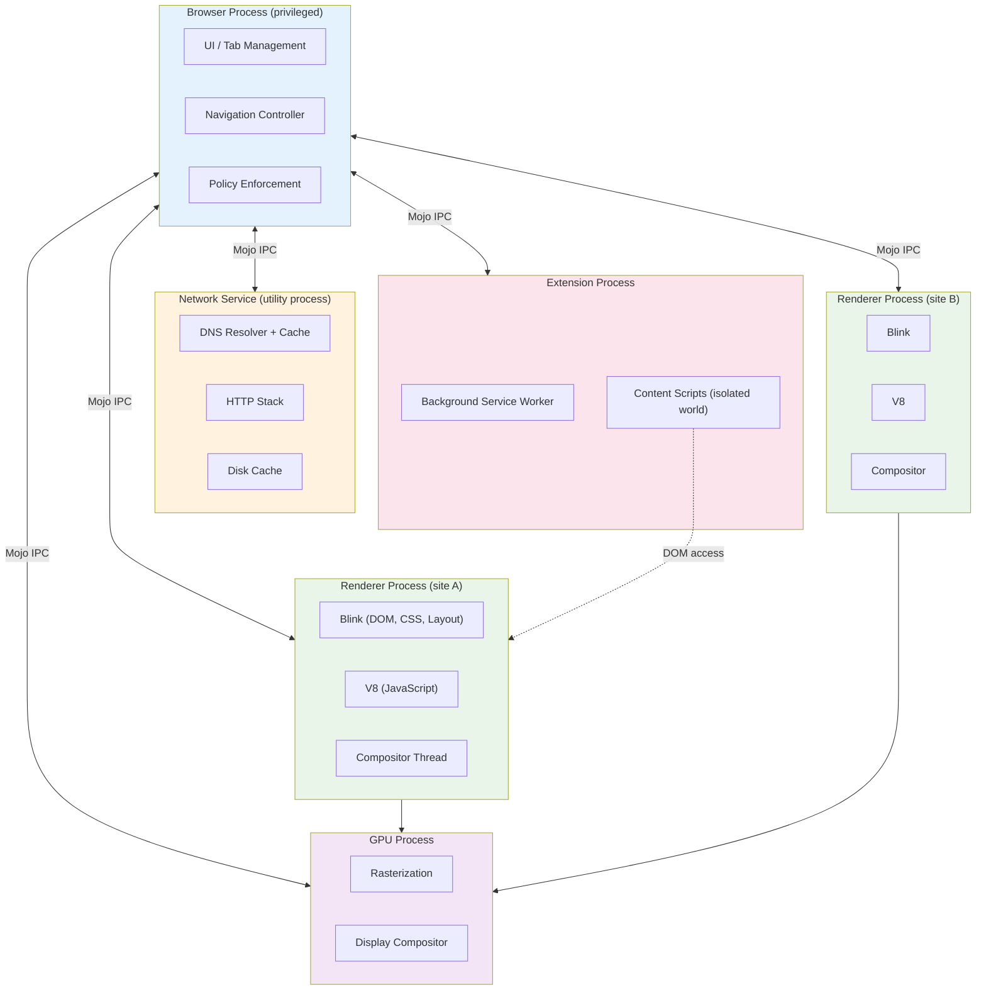

# Browser Architecture: Processes, Caching, and Extensions

Modern browsers are multi-process systems with sophisticated isolation boundaries, layered caching hierarchies, and extension architectures that modify page behavior at precise lifecycle points. This article maps Chromium's process model (browser, renderer, GPU, network, utility processes), the threading architecture within renderers (main thread, compositor, raster workers), caching layers from DNS through HTTP disk cache, speculative loading mechanisms, and extension content script injection timing.

<figure>



<figcaption>Chromium multi-process architecture: browser process coordinates sandboxed renderers, network service, GPU process, and extension processes via Mojo IPC</figcaption>

</figure>

## Abstract

A browser is a **privilege-separated, multi-process operating system for the web**. The architecture solves three fundamental problems:

1. **Security isolation**: Untrusted web content runs in sandboxed renderer processes with minimal OS privileges. The browser process acts as a privileged kernel, mediating all system access.

2. **Stability**: A crashed renderer takes down only its tabs, not the entire browser. The GPU process can restart independently. The network service recovers from failures.

3. **Performance isolation**: Heavy JavaScript on one site doesn't block rendering on another. The compositor thread enables smooth scrolling even when the main thread is blocked.

**The process hierarchy:**

| Process   | Privileges              | Responsibility                                       |
| --------- | ----------------------- | ---------------------------------------------------- |
| Browser   | Full OS access          | UI, navigation, policy enforcement, IPC coordination |
| Renderer  | Sandboxed, site-locked  | DOM, CSS, JavaScript, layout (one per site-instance) |
| GPU       | Limited graphics access | Rasterization, compositing, display                  |
| Network   | Network stack only      | DNS, HTTP, caching, TLS                              |
| Utility   | Task-specific           | Audio, video decoding, data decoding                 |
| Extension | Semi-privileged         | Background workers, content scripts                  |

**The caching hierarchy:**

```
DNS cache (browser) → Socket pool (keep-alive) → Memory cache (renderer)
                                               → HTTP cache (disk)
```

**Extension injection timing**: Content scripts inject at three points—`document_start` (after CSS, before DOM), `document_end` (DOM complete, before subresources), or `document_idle` (browser-optimized timing between `document_end` and `load`). Each script runs in an **isolated world**—a separate JavaScript execution context that shares DOM access but not variables with the page.

## The Multi-Process Model

Chromium's multi-process architecture emerged from a fundamental insight: browsers execute untrusted code (JavaScript from any website), so the rendering engine must be treated as a hostile environment.

### Why Multi-Process?

**Single-process browsers (pre-Chrome era)** suffered from cascading failures. A bug in Flash crashed the entire browser. A malicious page could access cookies from other tabs. Memory leaks accumulated across all sites.

**The Chrome design (2008)** applied OS security principles: each site runs in a sandbox with minimal privileges, communicating with the privileged browser process through validated IPC channels.

**Trade-offs:**

- **Memory overhead**: Each renderer process has its own V8 heap, Blink data structures, and system libraries. Chrome consumes more memory than single-process browsers.
- **IPC latency**: Cross-process communication adds microseconds of overhead. For most operations this is negligible, but it affects architectures requiring tight coupling.
- **Complexity**: The codebase must handle process crashes, IPC message validation, and distributed state.

The trade-offs are worth it. A compromised renderer cannot access the filesystem, network stack, or other tabs without exploiting additional vulnerabilities in the browser process.

### Process Types and Responsibilities

**Browser Process (privileged kernel)**

The browser process has full OS privileges and runs no untrusted content. It manages:

- Window and tab lifecycle
- Navigation decisions (URL bar, bookmarks, history)
- Permission prompts (geolocation, camera, notifications)
- Cookie and storage management
- IPC routing between all other processes
- Policy enforcement (blocking malicious sites, enforcing CSP)

For each renderer, the browser maintains a `RenderProcessHost` object that handles communication. For each document (including iframes), it maintains a `RenderFrameHost` tracking security state and capabilities.

**Renderer Process (sandboxed, site-locked)**

Renderers execute web content: HTML parsing, CSS cascade, JavaScript execution, layout, and painting. Each renderer is:

- **Sandboxed**: On Linux, seccomp-bpf restricts system calls. On Windows, process tokens are restricted. On macOS, the App Sandbox limits file and network access.
- **Site-locked** (with Site Isolation): A renderer can only access content from its assigned site (scheme + eTLD+1). Cross-site iframes run in separate renderer processes.

A single renderer may host multiple frames from the same site (in-process frames) or serve as a dedicated process for a single tab.

**GPU Process**

The GPU process handles all graphics operations:

- Rasterization (converting paint commands to pixels)
- Compositing (combining layers from multiple renderers)
- Video decode (hardware acceleration)
- WebGL/WebGPU execution

Separating GPU operations isolates graphics driver bugs. A driver crash restarts the GPU process, not the browser.

**Network Service (utility process)**

The network service handles all network I/O:

- DNS resolution and caching
- HTTP/HTTPS connections
- TLS handshakes
- Disk cache management
- Cookie storage (at the request of the browser process)

On desktop platforms, the network service runs in a dedicated utility process. On Android (for memory reasons), it runs in-process with the browser. The service exposes `NetworkContext` and `URLLoader` Mojo interfaces to the browser process—these interfaces are never exposed to renderers.

**Utility Processes**

Specialized processes handle untrusted data parsing:

- Audio/video decoding
- PDF rendering
- Data URL parsing
- Archive extraction

Each utility process is spawned for a specific task and terminated when complete, minimizing attack surface.

### Site Isolation: The Security Boundary

Site Isolation ensures pages from different sites run in different processes. This is the primary defense against compromised renderers and side-channel attacks (Spectre).

**Site vs. Origin:**

- **Origin**: `https://sub.example.com:443` (scheme + host + port)
- **Site**: `https://example.com` (scheme + eTLD+1)

Site Isolation uses sites rather than origins because same-site cross-origin pages can synchronize via `document.domain`. Two pages setting `document.domain = 'example.com'` gain synchronous DOM access, requiring them to share a process.

**Process allocation:**

```
https://a.example.com/page → Renderer A
https://b.example.com/page → Renderer A (same site)
https://other.com/page     → Renderer B (different site)
https://a.example.com/     → Renderer A (even in different tab)
  └── <iframe src="https://other.com/embed"> → Renderer B (OOPIF)
```

**Out-of-Process Iframes (OOPIFs)**: Cross-site iframes run in separate renderer processes. The browser process coordinates rendering, compositing the iframe's pixels into the parent frame's display.

**Process locking**: Once a renderer is assigned a site, it's locked to that site for its lifetime. A renderer locked to `https://example.com` cannot load content from `https://other.com`. The browser process enforces this, rejecting IPC messages that would violate the lock.

**Security benefits:**

- **Renderer exploits contained**: An attacker who gains code execution in a renderer can only access data for that renderer's site
- **UXSS mitigated**: Universal XSS bugs cannot cross process boundaries
- **Spectre defense**: Side-channel attacks cannot read memory from other processes

### Mojo IPC: The Communication Layer

Chromium's Inter-Process Communication (IPC) uses Mojo, a capability-based system with strongly-typed interfaces.

**Why Mojo over legacy IPC?**

- **3x faster** with 1/3 the context switches compared to the original IPC system
- **Type-safe**: Interfaces defined in `.mojom` IDL files, generating C++ bindings
- **Capability-based**: Processes receive interface endpoints, not raw process handles

**Core primitives:**

- **Message pipes**: Bidirectional channels for structured messages
- **Data pipes**: Unidirectional byte streams for bulk data (network responses)
- **Shared buffers**: Memory shared between processes (compositor surfaces)

**Example: Renderer requesting a network fetch**

```
Renderer Process                    Browser Process
      |                                   |
      |-- CreateLoaderAndStart() -------->|
      |   (URLLoaderFactory interface)    |
      |                                   |
      |<---- OnReceiveResponse() ---------|
      |   (URLLoaderClient interface)     |
      |                                   |
      |<---- OnReceiveBody() -------------|
      |   (Data pipe for body bytes)      |
```

The renderer never directly accesses the network. It holds a `URLLoaderFactory` endpoint provided by the browser, which validates requests against the renderer's site lock before forwarding to the network service.

## Threading Architecture in the Renderer

Within each renderer process, work is distributed across specialized threads to maintain responsiveness.

### Main Thread: The JavaScript Bottleneck

The main thread runs:

- JavaScript execution (V8)
- DOM construction and manipulation
- CSS cascade and style resolution
- Layout calculation
- Hit testing for input events
- HTML parsing

**The problem**: JavaScript blocks the main thread. A 100ms computation prevents scrolling, animations, and input handling.

**Design rationale**: JavaScript has synchronous DOM access by design. Moving DOM operations off the main thread would require fundamental API changes that break the web platform.

### Compositor Thread: Smooth Scrolling and Animations

The compositor thread runs in parallel with the main thread, handling:

- Scroll event processing (for non-JS scrolls)
- CSS animations and transitions (when not JavaScript-driven)
- Layer compositing decisions
- Coordination with the GPU process

**The key insight**: Most scrolls and animations don't require JavaScript. By intercepting these events on the compositor thread, the browser delivers 60fps even when the main thread is blocked.

**Example: Scroll performance**

```
User scrolls                    Compositor Thread           Main Thread
    |                                  |                        |
    |-- scroll input ----------------->|                        |
    |                                  |-- transform layers --->| (async)
    |<-- updated frame ----------------|                        |
    |                                  |                        |
    |   (continues at 60fps)           |   (can be blocked)     |
```

If the page has a scroll event listener with `passive: false`, the compositor must wait for JavaScript—breaking this optimization.

### Raster Threads and GPU Process Coordination

Paint operations generate display lists (Skia commands). These are sent to the GPU process for rasterization:

```
Main Thread      Compositor Thread     Raster Workers     GPU Process
    |                   |                    |                |
    |-- paint --------->|                    |                |
    |                   |-- raster tasks --->|                |
    |                   |                    |-- GPU cmds --->|
    |                   |<-- tiles done -----|                |
    |                   |-- composit ------->|                |
    |                   |                    |                |
```

Multiple raster worker threads parallelize tile rasterization. The compositor assembles rasterized tiles into the final frame.

### The Blink-V8 Relationship

Blink (the rendering engine) and V8 (JavaScript engine) are tightly integrated:

- **1:1 isolate-to-thread**: Each thread with JavaScript has exactly one V8 isolate
- **Binding layer**: `platform/bindings` connects DOM objects to JavaScript wrappers
- **Microtask integration**: V8 microtasks (Promise reactions) integrate with Blink's event loop

When JavaScript accesses `document.body`, V8 calls through the binding layer to Blink's DOM implementation. When Blink dispatches a DOM event, it invokes V8 to run the handler.

## Caching Hierarchy

Browsers implement multiple cache layers, each optimized for different access patterns.

### DNS Caching

**The problem**: DNS resolution adds 20-120ms to every new origin connection. Caching eliminates this latency for repeat visits.

**Chromium's DNS architecture:**

```
HostResolverManager (browser process)
         |
         |-- Check HostCache (per-context)
         |       |
         |       └── Cache hit → return immediately
         |
         |-- System resolver (getaddrinfo)
         |       └── OS DNS cache, /etc/hosts, upstream DNS
         |
         └-- Built-in resolver (DnsClient)
                 └── DoH/DoT, bypasses OS
```

**Design decisions:**

- **Per-context cache**: Each `URLRequestContext` has its own `HostCache`, enabling isolation between profiles
- **Request merging**: Multiple requests for the same hostname share a single resolution job
- **TTL-based expiration**: Cache entries expire based on the DNS record's Time-To-Live
- **Stale-while-revalidate**: In some configurations, stale results return immediately while fresh resolution proceeds in the background

**Limits:** The host cache typically holds several thousand entries. Entries are evicted by LRU when space is needed.

**Visibility**: `chrome://net-internals/#dns` shows the current cache state and allows manual clearing.

### Connection Pooling and Keep-Alive

**The problem**: TCP+TLS handshake adds 100-300ms per new connection. Connection reuse eliminates this overhead.

**Chromium's socket pool:**

- Maintains persistent connections per origin
- HTTP/1.1: Multiple sockets per host (typically 6)
- HTTP/2: Single socket per origin, multiplexed streams
- HTTP/3: Single QUIC connection per origin

**Keep-alive behavior:**

- Idle connections remain open for ~60 seconds (configurable by server)
- Connections are reused for subsequent requests to the same origin
- The socket pool tracks which connections are available for reuse

### HTTP Cache: Memory and Disk

The HTTP cache stores responses for future use, avoiding network roundtrips entirely.

**Architecture:**

```
Network request → HttpCache::Transaction
                        |
                        |-- Check in-memory index
                        |-- Check disk cache (if not in memory)
                        |-- Validate freshness (Cache-Control, ETag)
                        |-- Return cached response or fetch from network
```

**The disk cache backend:**

- **Index file**: Memory-mapped hash table mapping URLs to cache addresses
- **Block files**: Fixed-size blocks (256B, 1KB, 4KB) for small entries
- **Separate files**: Large entries (>16KB) get individual files
- **LRU eviction**: Multiple lists (not-reused, low-reuse, high-reuse) with time-based eviction

**Cache locking**: Single-writer, multiple-reader. Only one network request per resource in flight at a time, preventing redundant fetches.

**Sparse entries**: Large media files use sparse storage—only fetched ranges are cached. Enables resumable downloads and efficient video seeking.

**Renderer memory cache (distinct from HTTP cache)**: Blink maintains an in-memory cache for recently used resources within a renderer. This cache lives in the renderer process and provides sub-millisecond access for repeated resource requests within a page.

### Cache Lookup Priority

When the renderer requests a resource:

1. **Renderer memory cache**: Check Blink's in-memory cache (same-process, fastest)
2. **HTTP cache (disk)**: Check the network service's disk cache
3. **Socket reuse**: If fetching, check for available keep-alive connection
4. **DNS cache**: If new connection, check DNS cache
5. **Network**: Fetch from origin server

## Speculative Loading Mechanisms

Browsers speculatively fetch resources before they're needed, hiding latency from users.

### The Preload Scanner

**The problem**: HTML parsing blocks on synchronous scripts. While waiting for script execution, the parser cannot discover subsequent resources.

**The solution**: A secondary, lightweight HTML parser (the preload scanner) runs ahead of the main parser, discovering resources in the markup.

```
Main Parser                     Preload Scanner
    |                                 |
    |-- blocked on <script> --------->| continues scanning
    |                                 |-- discovers 
    |                                 |-- discovers <link>
    |                                 |-- initiates fetches
    |<-- script executed              |
    |-- continues parsing             |
```

**What the preload scanner finds:**

- `` and `srcset`
- `<link rel="stylesheet">`
- `<script src>` (including `async`/`defer`)
- `<link rel="preload">`

**What it cannot find:**

- JavaScript-injected elements
- CSS `background-image`
- Dynamically added scripts
- Resources in `data-` attributes (lazy loading patterns)

### Resource Hints

Developers can hint future resource needs:

**`dns-prefetch`**: Resolve DNS only

```html
<link rel="dns-prefetch" href="https://api.example.com" />
```

Cost: ~0.5KB memory, one DNS lookup. Use for third-party origins you'll connect to.

**`preconnect`**: DNS + TCP + TLS handshake

```html
<link rel="preconnect" href="https://cdn.example.com" />
```

Cost: Socket and memory overhead. Use sparingly (2-4 origins max).

**`prefetch`**: Fetch resource with low priority for future navigation

```html
<link rel="prefetch" href="/next-page.html" />
```

Cost: Network bandwidth, disk cache space. Use for likely next pages.

**`preload`**: Fetch resource with high priority for current page

```html
<link rel="preload" href="/critical.css" as="style" />
```

Cost: Network bandwidth, competes with other critical resources. Use for late-discovered critical resources.

### Prerendering and Speculation Rules

**Prerendering** renders an entire page in a hidden tab before navigation. When the user clicks, the page activates instantly.

**Speculation Rules API** (Chrome 109+):

```html
<script type="speculationrules">
  {
    "prerender": [{ "urls": ["/next-page", "/product/123"] }]
  }
</script>
```

**Eagerness levels:**

| Level          | Trigger                 | Use Case              |
| -------------- | ----------------------- | --------------------- |
| `immediate`    | As soon as rules appear | High-confidence links |
| `eager`        | 10ms hover (desktop)    | Likely clicks         |
| `moderate`     | 200ms hover             | Medium confidence     |
| `conservative` | Pointer down            | Just-in-time          |

**Limits:**

- Maximum 10 concurrent prerenders per page
- Blocked in Save-Data mode, low battery, memory pressure
- Cross-origin iframes not rendered until activation

**Cost**: Significant memory and CPU. Only prerender pages with high navigation probability.

## Workers and Thread Isolation

Web Workers enable background JavaScript execution without blocking the main thread.

### Dedicated Workers

A dedicated worker runs in a separate thread, with its own V8 isolate:

```javascript
// main.js
const worker = new Worker("worker.js")
worker.postMessage({ data: largeArray })
worker.onmessage = (e) => console.log(e.data)

// worker.js
self.onmessage = (e) => {
  const result = heavyComputation(e.data)
  self.postMessage(result)
}
```

**Isolation model:**

- Separate thread (not just async)
- No DOM access
- Communication via structured clone (serialization) or transferable objects
- Own global scope (`self`, not `window`)

**Process placement**: Workers typically run in the same renderer process as their parent document but on a separate thread.

### Shared Workers

Shared workers are accessible from multiple browsing contexts (tabs, iframes) on the same origin:

```javascript
// tab1.js and tab2.js
const shared = new SharedWorker("shared.js")
shared.port.postMessage("hello")

// shared.js
self.onconnect = (e) => {
  const port = e.ports[0]
  port.onmessage = (e) => {
    /* handle */
  }
}
```

**Use case**: Coordinating state across tabs without the main thread overhead of `BroadcastChannel`.

**Limit**: One instance per origin. If multiple pages connect, they share the same worker instance.

### Service Workers

Service Workers intercept network requests, enabling offline functionality and caching control:

```javascript
// sw.js
self.addEventListener("fetch", (event) => {
  event.respondWith(caches.match(event.request).then((cached) => cached || fetch(event.request)))
})
```

**Architecture in Chromium:**

- **Browser process**: `ServiceWorkerContextCore` manages registration and lifecycle
- **Renderer process**: Worker thread executes the service worker code
- **Activation**: Browser dispatches `fetch` events through Mojo to the worker thread

**Lifecycle:**

1. **Registration**: Browser downloads and parses the script
2. **Installation**: `install` event fires; cache resources
3. **Activation**: `activate` event fires; claim clients
4. **Idle termination**: Worker stops when idle (no pending events)
5. **Restart**: Browser restarts the worker for new events

**Scope**: Service workers control all fetches within their scope (URL path prefix).

## Extension Architecture and Injection

Browser extensions modify and extend browser behavior through a privileged API surface.

### Extension Components

**Background service worker** (Manifest V3):

- Runs in the extension process
- Access to Chrome APIs (`chrome.tabs`, `chrome.storage`, etc.)
- Event-driven: loaded when needed, unloaded when idle
- No DOM access

**Content scripts**:

- Injected into web pages
- Full DOM access
- Limited Chrome API access (`chrome.runtime` for messaging)
- Runs in an isolated world (separate JavaScript context)

**Popup/options pages**:

- Extension UI
- Same privileges as background service worker

### Content Script Injection Timing

Content scripts inject at three lifecycle points:

**`document_start`**:

- Executes after CSS files begin loading but before DOM construction
- The document exists but is empty (`<html>` may not exist yet)
- Use case: Intercept or modify initial page state

```javascript
// document_start
console.log(document.documentElement) // may be null
document.addEventListener("DOMContentLoaded", () => {
  /* DOM ready */
})
```

**`document_end`**:

- Executes when DOM is complete but before subresources (images, frames) load
- Equivalent to `DOMContentLoaded`
- Use case: Manipulate DOM before it renders

```javascript
// document_end
document.body.classList.add("extension-modified")
```

**`document_idle`** (default):

- Browser chooses optimal time between `document_end` and `load`
- Prioritizes page load performance
- Use case: Non-critical modifications

**Injection order:**

1. Manifest-declared content scripts (in declaration order)
2. Programmatically registered scripts (via `chrome.scripting.registerContentScripts`)

### Isolated Worlds

Content scripts run in an **isolated world**—a separate JavaScript execution context with its own global object.

**What is shared:**

- DOM tree (same `document.body`)
- DOM events (both worlds see `click` events)

**What is isolated:**

- Global variables (`window.foo` in page !== `window.foo` in content script)
- Prototypes (`Array.prototype` modifications don't cross)
- JavaScript APIs (page can't call content script functions)

**Security implications:**

- Page JavaScript cannot detect or tamper with content scripts
- Content scripts cannot accidentally pollute page globals
- XSS in a content script is contained (attacker can't access extension APIs)

**Communication between worlds:**

```javascript
// Content script
window.postMessage({ source: "extension", data: "hello" }, "*")

// Page script
window.addEventListener("message", (e) => {
  if (e.data.source === "extension") {
    /* handle */
  }
})
```

### How Extensions Affect Page Load

**Performance impact:**

- **`document_start` scripts**: Block DOM construction until script completes
- **`document_end` scripts**: Run after DOM, may delay rendering
- **`document_idle` scripts**: Minimal impact (browser-optimized timing)

**Best practices:**

- Use `document_idle` unless early injection is required
- Keep content script code minimal
- Defer heavy processing with `requestIdleCallback` or `setTimeout`
- Use `run_at` manifest field to specify timing

**Content Security Policy**: Extensions have their own CSP, restricting `eval()` and external script loading. Content scripts cannot bypass the page's CSP for injected elements.

## Conclusion

Browser architecture reflects decades of security and performance optimization:

- **Multi-process isolation** contains compromised renderers, limiting attack scope
- **Site Isolation** prevents cross-site data leakage, even via Spectre-class attacks
- **Threading separation** (main, compositor, raster) enables smooth animations despite main thread work
- **Layered caching** (DNS, sockets, disk, memory) eliminates redundant network operations
- **Speculative loading** (preload scanner, prefetch, prerender) hides latency before users notice
- **Extension isolation** (separate worlds) enables powerful DOM modification without security compromise

The architecture trades memory for security and responsiveness. A Chrome instance with many tabs consumes gigabytes of memory—but each tab's crash is isolated, each site's JavaScript is contained, and each scroll remains smooth even under load.

## Appendix

### Prerequisites

- Basic understanding of process and thread concepts
- Familiarity with HTTP caching headers (Cache-Control, ETag)
- Understanding of JavaScript execution model (event loop, async)

### Terminology

- **OOPIF (Out-of-Process Iframe)**: A cross-site iframe that runs in a separate renderer process from its parent frame
- **Site**: Scheme plus eTLD+1 (e.g., `https://example.com`). Used for Site Isolation process boundaries
- **Origin**: Scheme plus host plus port (e.g., `https://sub.example.com:443`). The security boundary for same-origin policy
- **eTLD+1**: Effective top-level domain plus one label (e.g., `example.com`, `example.co.uk`)
- **Mojo**: Chromium's IPC framework using strongly-typed interfaces defined in `.mojom` files
- **Isolated World**: A separate JavaScript execution context that shares DOM access but not global variables with other contexts
- **Content Script**: Extension code injected into web pages, running in an isolated world
- **Preload Scanner**: A secondary HTML parser that discovers resources while the main parser is blocked
- **Site Isolation**: The security feature ensuring different sites run in different processes
- **Service Worker**: A programmable network proxy running in a worker thread, enabling offline functionality
- **Renderer Process**: A sandboxed process executing web content (Blink, V8, compositor)

### Summary

- Chromium uses a multi-process model: browser (privileged), renderers (sandboxed, site-locked), GPU, network service, and utilities
- Site Isolation runs cross-site content in separate processes, defending against compromised renderers and Spectre attacks
- Renderers have three key threads: main (JavaScript/DOM), compositor (scrolling/animations), and raster workers (painting)
- DNS caching uses per-context caches with TTL-based expiration; request merging prevents duplicate resolution
- HTTP disk cache uses memory-mapped index, block files for small entries, and LRU eviction with reuse tracking
- The preload scanner discovers resources while the main parser is blocked, but cannot find JavaScript-injected resources
- Prerendering (Speculation Rules API) renders pages in hidden tabs for instant navigation
- Service Workers run in renderer processes on dedicated threads, restarting on-demand for events
- Extension content scripts inject at `document_start`, `document_end`, or `document_idle`, each running in an isolated world

### References

#### Specifications and Standards

- [HTML Living Standard - Workers](https://html.spec.whatwg.org/multipage/workers.html) - Web Worker specification
- [Service Workers W3C Spec](https://w3c.github.io/ServiceWorker/) - Service Worker lifecycle and API
- [Speculation Rules](https://wicg.github.io/nav-speculation/speculation-rules.html) - Prerendering and prefetch specification

#### Chromium Design Documents

- [Multi-process Architecture](https://www.chromium.org/developers/design-documents/multi-process-architecture/) - Process model overview
- [Site Isolation](https://www.chromium.org/Home/chromium-security/site-isolation/) - Security isolation design
- [Inter-process Communication](https://www.chromium.org/developers/design-documents/inter-process-communication/) - Mojo IPC framework
- [HTTP Cache](https://www.chromium.org/developers/design-documents/network-stack/http-cache/) - Cache architecture
- [Disk Cache](https://www.chromium.org/developers/design-documents/network-stack/disk-cache/) - Disk cache backend design
- [Process Model and Site Isolation](https://chromium.googlesource.com/chromium/src/+/main/docs/process_model_and_site_isolation.md) - Detailed process allocation
- [Service Worker README](https://chromium.googlesource.com/chromium/src/+/master/content/browser/service_worker/README.md) - Service worker implementation
- [DNS README](https://chromium.googlesource.com/chromium/src/+/main/net/dns/README.md) - DNS resolution architecture

#### Chrome Developer Documentation

- [RenderingNG Architecture](https://developer.chrome.com/docs/chromium/renderingng-architecture) - Thread and process model
- [BlinkNG Deep-Dive](https://developer.chrome.com/docs/chromium/blinkng) - Rendering engine architecture
- [Content Scripts](https://developer.chrome.com/docs/extensions/develop/concepts/content-scripts) - Extension injection and isolation
- [Extension Service Workers](https://developer.chrome.com/docs/extensions/develop/concepts/service-workers) - Manifest V3 background scripts
- [Prerender Pages](https://developer.chrome.com/docs/web-platform/prerender-pages) - Speculation Rules API

#### Web Performance Resources

- [Don't Fight the Preload Scanner](https://web.dev/articles/preload-scanner) - Preload scanner mechanics and optimization
- [HTTP Cache](https://web.dev/articles/http-cache) - HTTP caching strategies
- [Resource Hints](https://web.dev/articles/preconnect-and-dns-prefetch) - dns-prefetch and preconnect usage

#### MDN Web Docs

- [Web Workers API](https://developer.mozilla.org/en-US/docs/Web/API/Web_Workers_API) - Worker types and usage
- [Service Worker API](https://developer.mozilla.org/en-US/docs/Web/API/Service_Worker_API) - Service worker lifecycle
- [Speculative Loading](https://developer.mozilla.org/en-US/docs/Web/Performance/Guides/Speculative_loading) - Prefetch and prerender overview
