# JS Event Loop: Tasks, Microtasks, and Rendering (For Browser & Node.js)

The event loop is not a JavaScript language feature—it is the host environment's mechanism for orchestrating asynchronous operations around the engine's single-threaded execution. Browsers implement the WHATWG HTML Standard processing model optimized for UI responsiveness (60 frames per second, ~16.7ms budgets). Node.js implements a phased architecture via libuv, optimized for high-throughput I/O (Input/Output). Understanding both models is essential for debugging timing issues, avoiding starvation, and choosing the right scheduling primitive.

<figure>


<figcaption>Node.js event loop phases showing the libuv-managed execution order</figcaption>

</figure>

## Abstract

The JavaScript runtime consists of two distinct components: the **engine** (V8, SpiderMonkey, JavaScriptCore) that executes ECMAScript with a call stack, heap, and run-to-completion guarantee; and the **host environment** (browser or Node.js) that provides the event loop, timers, and I/O APIs.

The event loop implements a two-tier priority system:

1. **Microtasks** (high priority): Promise reactions, `queueMicrotask()`, `MutationObserver`. Drain completely after each macrotask, before rendering.
2. **Macrotasks** (lower priority): `setTimeout`, `setInterval`, I/O callbacks, UI events. One per event loop iteration.

**Browser model**: Task → Microtask checkpoint → Rendering (rAF → Style → Layout → Paint → Composite) → Idle callbacks → Loop.

**Node.js model** (as of Node.js 20+): Six libuv phases (timers → pending → idle/prepare → poll → check → close). `process.nextTick()` and microtasks run between phases—nextTick first in CommonJS modules, microtasks first in ECMAScript Modules (ESM).

**Key design tradeoffs**:

- Microtasks before rendering enables consistent DOM state but risks UI starvation
- Node.js's phased model optimizes I/O throughput but adds scheduling complexity
- The 4-thread default pool handles blocking operations (file I/O, DNS) without stalling the main loop

## The Runtime Architecture

JavaScript's characterization as a "single-threaded, non-blocking, asynchronous, concurrent language" obscures the division of labor between engine and host. The ECMAScript specification (ECMA-262) defines the language semantics—call stack, heap, run-to-completion—but delegates asynchronous scheduling to the host via abstract "Jobs" and "Job Queues." The host environment (browser or Node.js) implements the concrete event loop that processes these jobs.

<figure>

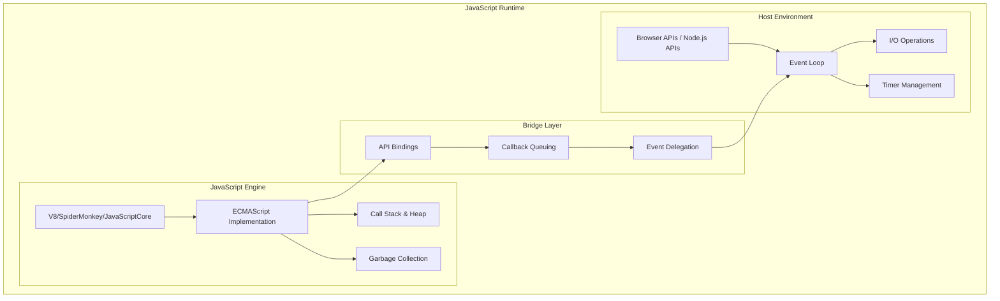

<figcaption>JavaScript runtime architecture showing the relationship between the engine, host environment, and bridge layer components</figcaption>

</figure>

### Core Execution Primitives

The ECMAScript specification defines three fundamental primitives:

1. **Call Stack**: LIFO (Last-In-First-Out) data structure tracking execution contexts. Each function call pushes a new context; returns pop it.
2. **Heap**: Unstructured memory region for object allocation, managed by the garbage collector.
3. **Run-to-Completion Guarantee**: Once a function starts, it runs without preemption until it returns or throws. No other JavaScript can interrupt mid-execution.

This run-to-completion model simplifies reasoning about shared state (no need for locks) but means long-running synchronous code blocks everything—including rendering in browsers.

<figure>

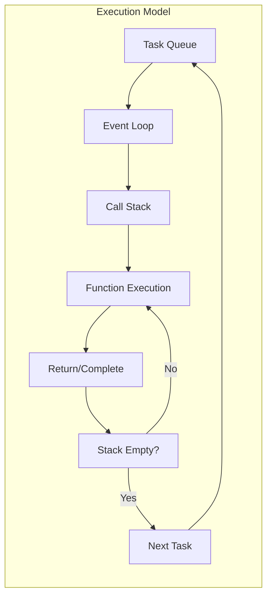

<figcaption>Core execution model showing the flow between task queue, event loop, and call stack</figcaption>

</figure>

### Specification Hierarchy

<figure>

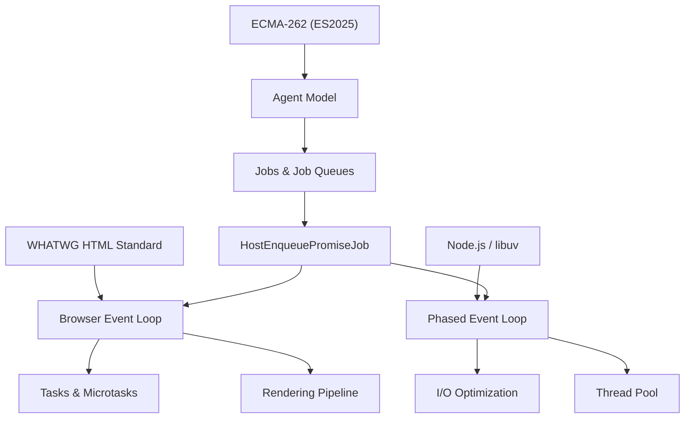

<figcaption>ECMAScript defines abstract Jobs; host environments implement concrete event loops</figcaption>

</figure>

The ECMAScript 2025 specification (16th edition) defines an **Agent** as the execution context for JavaScript code—comprising a call stack, running execution context, and job queues. The spec provides abstract operations like `HostEnqueuePromiseJob` that hosts must implement. This separation allows browsers and Node.js to optimize for different workloads while maintaining language semantics.

## Universal Priority System: Tasks and Microtasks

All modern JavaScript environments implement a two-tiered priority system. Per the WHATWG HTML Standard: "All microtasks are completed before any other event handling or rendering or any other macrotask takes place." This guarantee is why Promise callbacks run before the next `setTimeout`, regardless of timer delay.

### Queue Processing Model

<figure>

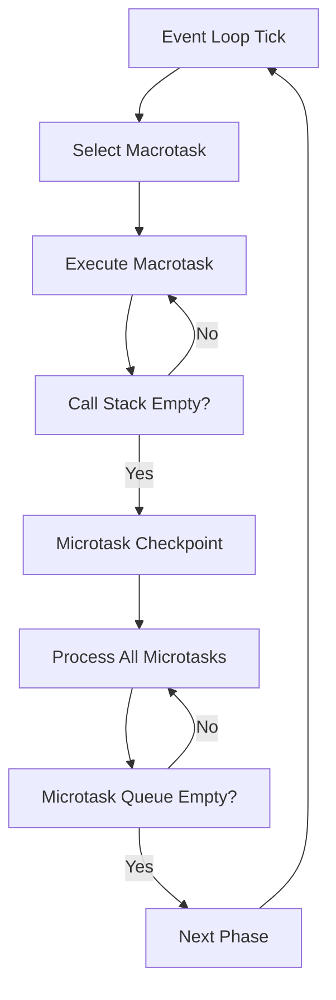

<figcaption>Queue processing model showing the priority system between macrotasks and microtasks in the event loop</figcaption>

</figure>

### Priority Hierarchy

<figure>

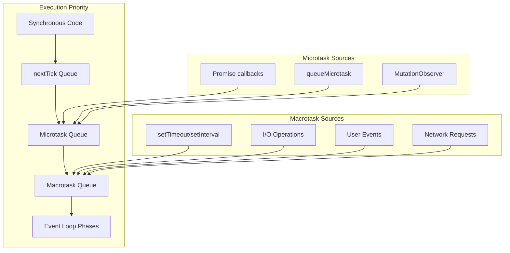

<figcaption>Priority hierarchy showing the execution order from synchronous code through microtasks to macrotasks</figcaption>

</figure>

### Microtask Starvation Pattern

The event loop drains the microtask queue completely before proceeding. If microtasks enqueue more microtasks recursively, the queue never empties—starving macrotasks, I/O, and rendering indefinitely.

```javascript title="microtask-starvation.js"
// Pathological microtask starvation - DO NOT use in production
function microtaskFlood() {
  Promise.resolve().then(microtaskFlood) // Recursive microtask
}
microtaskFlood()

// This macrotask NEVER executes - the microtask queue never empties
setTimeout(() => {
  console.log("Starved macrotask")
}, 1000)

// In browsers: UI freezes, no rendering occurs
// In Node.js: I/O callbacks never fire, server becomes unresponsive
```

**Production impact**: A server handling 1000 req/s with a recursive microtask pattern will stop accepting connections entirely. The socket accept queue fills, clients timeout, and monitoring shows 100% CPU with zero throughput.

**Detection**: Event loop lag metrics exceeding 100ms consistently. In Node.js, use `monitorEventLoopDelay()` from `perf_hooks`.

## Browser Event Loop Architecture

The browser event loop is optimized for UI (User Interface) responsiveness, integrating directly with the rendering pipeline. At 60 fps (frames per second), each frame has approximately 16.7ms for JavaScript execution, style calculation, layout, paint, and composite operations. Exceeding this budget causes dropped frames—visible as jank or stutter.

### WHATWG Processing Model

The WHATWG HTML Living Standard (January 2026) defines the event loop processing model:

<figure>

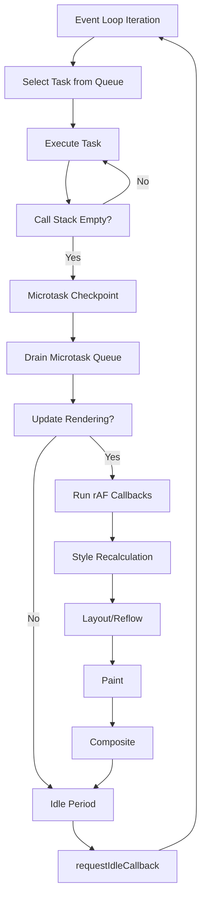

<figcaption>WHATWG processing model: Task → Microtasks → Rendering → Idle</figcaption>

</figure>

**Design rationale**: Running all microtasks before rendering ensures the DOM (Document Object Model) reaches a consistent state. If microtasks ran interleaved with rendering, intermediate states could flash on screen. The tradeoff: long microtask chains can delay rendering, causing dropped frames.

### Rendering Pipeline Integration

<figure>

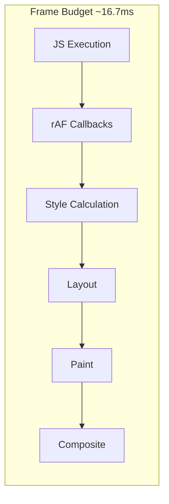

<figcaption>Frame budget allocation at 60fps. Exceeding 16.7ms drops frames.</figcaption>

</figure>

**requestAnimationFrame (rAF) timing**: Per the spec, rAF callbacks run after microtasks but before style recalculation—the optimal point for DOM mutations that should appear in the next frame.

**Browser inconsistency**: Chrome and Firefox run rAF before the next render (spec-compliant). Safari historically ran rAF before the _following_ render, causing a one-frame delay. Per WHATWG GitHub issue #2569, "Developers are pretty confused about this, with currently 60% expecting the [Safari] behaviour."

**Timer inaccuracy**: `setTimeout(fn, 0)` does not execute immediately. Browsers clamp delays to ≥1ms (Chrome historically used 4ms for nested timers). The actual delay includes:

1. Minimum delay clamp
2. Time until next event loop iteration
3. Queue position behind other macrotasks

### Task Source Prioritization

The WHATWG spec allows browsers to prioritize task sources but doesn't mandate specific priorities. In practice, browsers implement:

| Task Source                   | Typical Priority | Rationale                               |
| ----------------------------- | ---------------- | --------------------------------------- |
| User interaction (click, key) | Highest          | Immediate feedback critical for UX      |
| `MessageChannel`              | High             | Used for inter-frame communication      |
| DOM manipulation              | Medium           | Balance responsiveness with batching    |
| Networking (fetch callbacks)  | Medium           | Async by nature, less latency-sensitive |
| Timers (`setTimeout`)         | Lower            | Explicit deferral implies tolerance     |

**Scheduler API (Chrome 115+)**: The `scheduler.postTask()` API exposes explicit priority levels:

```javascript title="scheduler-api.js" collapse={1-2}
// Check for scheduler support
if ("scheduler" in window) {
  // user-blocking: highest, for input response
  scheduler.postTask(() => handleInput(), { priority: "user-blocking" })

  // user-visible: default, for non-critical rendering
  scheduler.postTask(() => updateChart(), { priority: "user-visible" })

  // background: lowest, for analytics/logging
  scheduler.postTask(() => sendAnalytics(), { priority: "background" })
}
```

**Browser support**: Chrome, Edge, Opera. Not supported in Firefox or Safari as of January 2026.

## Node.js Event Loop: libuv Integration

Node.js implements a phased event loop architecture via libuv, optimized for high-throughput I/O. The event loop runs on a single thread, abstracting platform-specific polling mechanisms: epoll on Linux, kqueue on macOS/BSD, and IOCP (I/O Completion Ports) on Windows.

**Historical context**: Node.js originally used libev (event loop) and libeio (async I/O). Per Bert Belder (libuv co-creator), these libraries assumed the select() model worked universally and that system calls behaved identically across platforms—both false. libuv was created to provide consistent cross-platform I/O while enabling Windows support via IOCP.

### libuv Architecture

<figure>

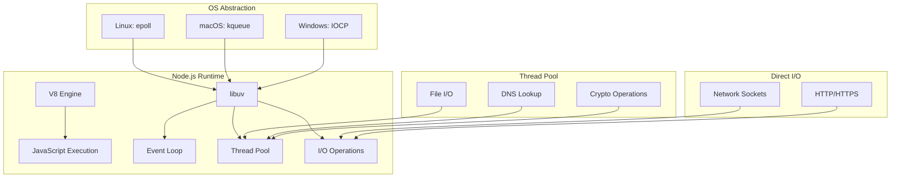

<figcaption>libuv architecture showing the integration between V8 engine, libuv event loop, and OS-specific I/O mechanisms</figcaption>

</figure>

### Phased Event Loop Structure

As of Node.js 20+, the event loop executes in six phases. Each phase has a FIFO (First-In-First-Out) queue; all callbacks in that queue execute before moving to the next phase:

<figure>

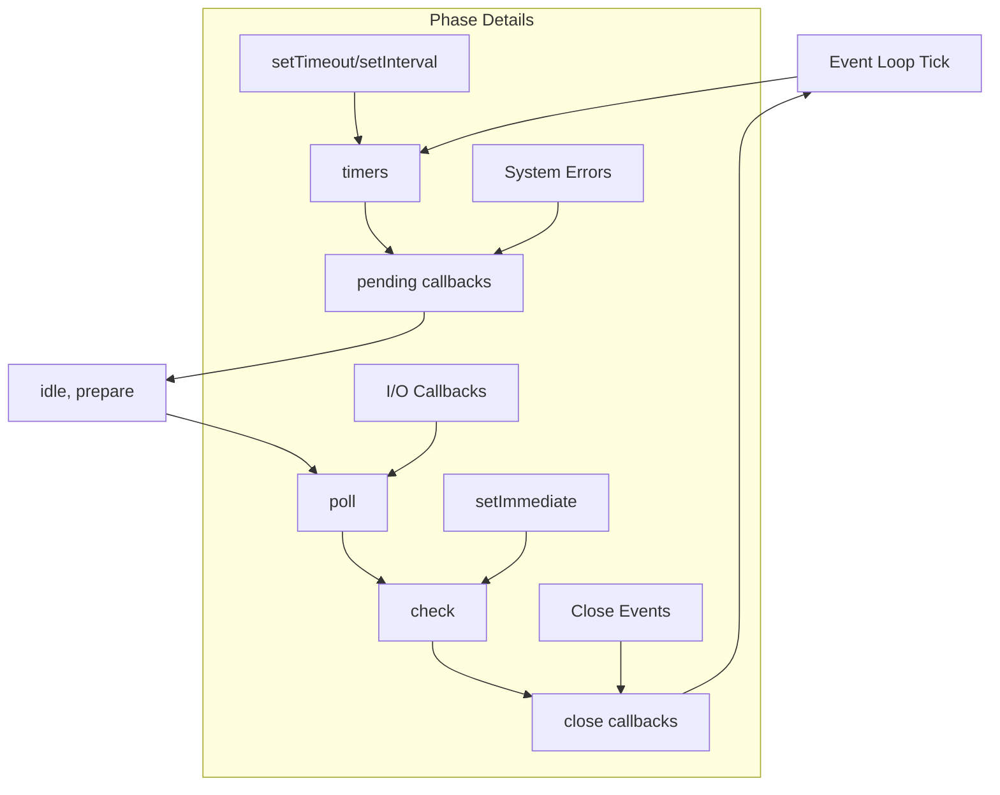

<figcaption>Six phases of the Node.js event loop</figcaption>

</figure>

| Phase                 | Executes                                       | Examples                       |
| --------------------- | ---------------------------------------------- | ------------------------------ |
| **timers**            | Expired `setTimeout`/`setInterval` callbacks   | Timer-based polling            |
| **pending callbacks** | I/O callbacks deferred from previous iteration | TCP errors, some system errors |
| **idle, prepare**     | Internal libuv operations                      | Not user-facing                |
| **poll**              | Retrieve new I/O events; execute I/O callbacks | Most async I/O                 |
| **check**             | `setImmediate()` callbacks                     | Post-I/O processing            |
| **close callbacks**   | Close event handlers                           | `socket.on('close')`           |

**Node.js 20+ change (libuv 1.45.0)**: Prior versions ran timers both before and after the poll phase. Since libuv 1.45.0, timers run only after poll. This can affect `setImmediate()` callback timing—existing timing-dependent code may break.

### Poll Phase Logic

<figure>

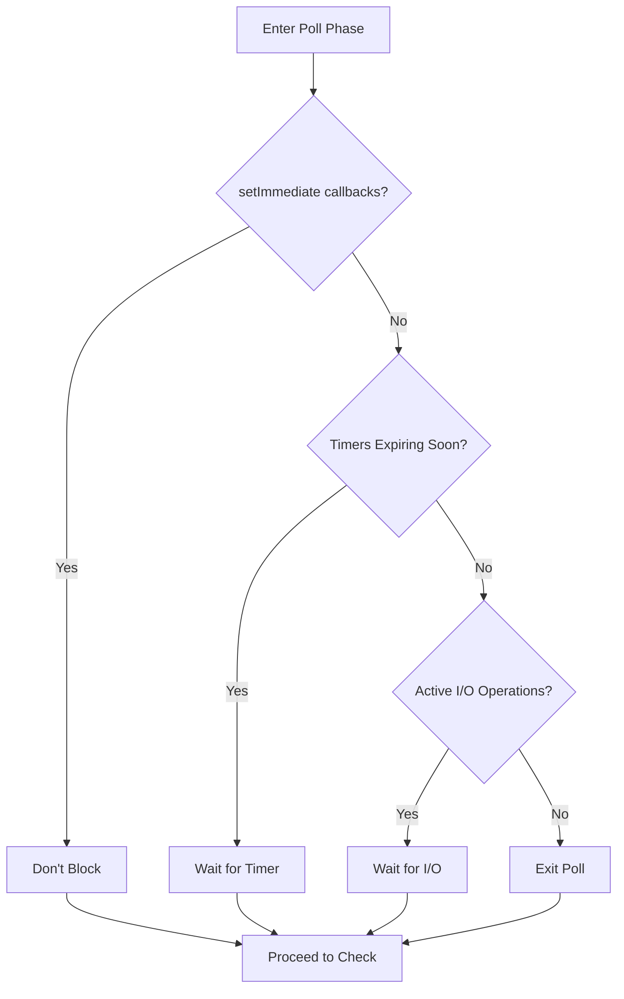

<figcaption>Poll phase decision tree: block for I/O, timers, or proceed immediately</figcaption>

</figure>

The poll phase is where libuv spends most of its time in I/O-heavy applications. It blocks waiting for new I/O events unless:

1. `setImmediate()` callbacks are pending → proceed to check phase
2. Timers are about to expire → wrap back to timers phase
3. No active handles remain → exit the event loop

### Thread Pool vs Direct I/O

Network I/O is **always** performed on the event loop's thread using non-blocking OS primitives (epoll, kqueue, IOCP). File system operations use the thread pool because, per the libuv design docs: "Unlike network I/O, there are no platform-specific file I/O primitives libuv could rely on."

<figure>

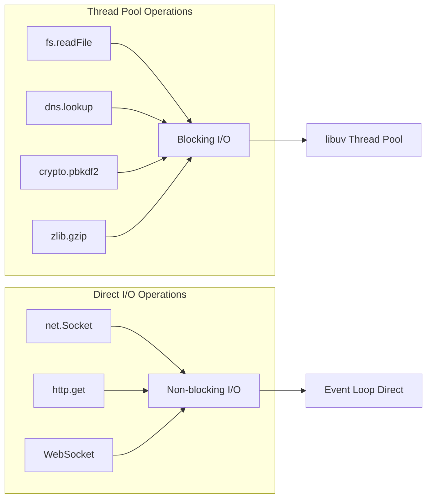

<figcaption>Thread pool for blocking operations; event loop for non-blocking network I/O</figcaption>

</figure>

**Thread pool configuration**:

| Setting      | Value     | Notes                                |
| ------------ | --------- | ------------------------------------ |
| Default size | 4 threads | Set via `UV_THREADPOOL_SIZE` env var |
| Maximum size | 1024      | Increased from 128 in libuv 1.30.0   |
| Stack size   | 8 MB      | Since libuv 1.45.0                   |

**Why 4 threads?** Per libuv maintainer Andrius Bentkus: "The thread pool primarily emulates async behavior for blocking operations. Since these are I/O-bound rather than CPU-bound, more threads don't improve throughput. There is no deterministic way of a perfect size."

**Production consideration**: If your application performs many concurrent file operations (e.g., static file server), 4 threads may bottleneck. Increase `UV_THREADPOOL_SIZE` to match expected concurrency—but not beyond, as threads consuming CPU-bound work (crypto, zlib) could block legitimate I/O.

**Linux AIO and io_uring**: libuv explored native async file I/O via Linux AIO and io_uring (8x throughput improvement reported). However, as of libuv 1.49.0, io_uring support was reverted to thread pool by default due to stability concerns.

## Node.js-Specific Scheduling

Node.js provides unique scheduling primitives with distinct priority levels. Critically, `process.nextTick()` is **not part of the event loop**—it executes after the current operation completes, before the event loop continues to the next phase.

### Priority Hierarchy

<figure>

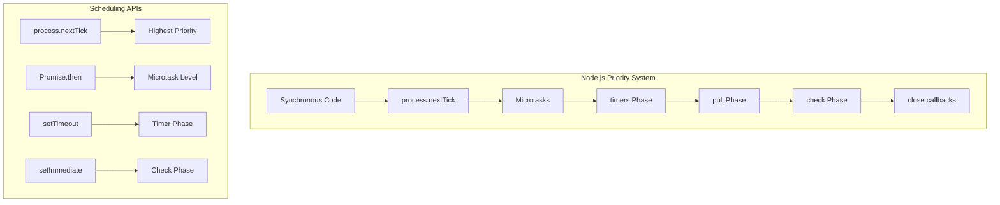

<figcaption>Node.js priority: nextTick → microtasks → event loop phases</figcaption>

</figure>

### process.nextTick() vs queueMicrotask()

| Feature         | `process.nextTick()`                 | `queueMicrotask()`           |
| --------------- | ------------------------------------ | ---------------------------- |
| Queue           | nextTick queue (Node.js-managed)     | Microtask queue (V8-managed) |
| Priority in CJS | Higher (runs first)                  | Lower (runs after nextTick)  |
| Priority in ESM | **Lower** (runs after microtasks)    | **Higher** (runs first)      |
| Standard        | Node.js-specific                     | Web standard, cross-platform |
| Additional args | `nextTick(fn, arg1, arg2)` supported | Requires closure             |
| Starvation risk | High (can starve I/O if recursive)   | Lower                        |

**Critical ESM/CJS difference**: In ESM modules, Node.js is already draining the microtask queue when your code runs, so `queueMicrotask()` callbacks execute **before** `process.nextTick()`. This reverses the CJS behavior and can break code ported between module systems.

**Official recommendation** from Node.js docs: "For most userland use cases, `queueMicrotask()` provides a portable and reliable mechanism for deferring execution."

### nextTick vs setImmediate Execution

<figure>

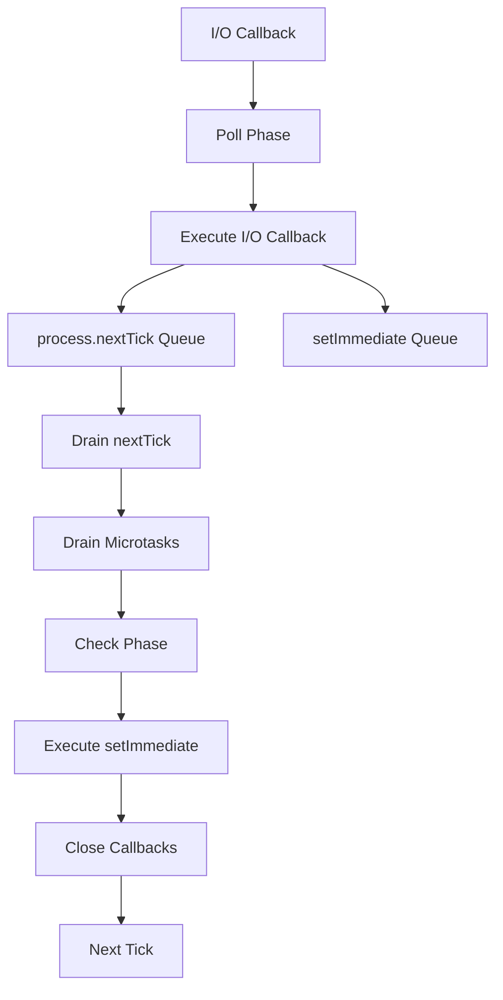

<figcaption>nextTick vs setImmediate execution showing the timing difference between these two Node.js-specific scheduling mechanisms</figcaption>

</figure>

### setTimeout vs setImmediate Ordering

Within an I/O callback, `setImmediate()` always executes before `setTimeout(fn, 0)` because the poll phase proceeds to the check phase before wrapping back to timers. Outside I/O callbacks (e.g., in the main module), the order is **non-deterministic** and depends on process performance at startup.

<figure>

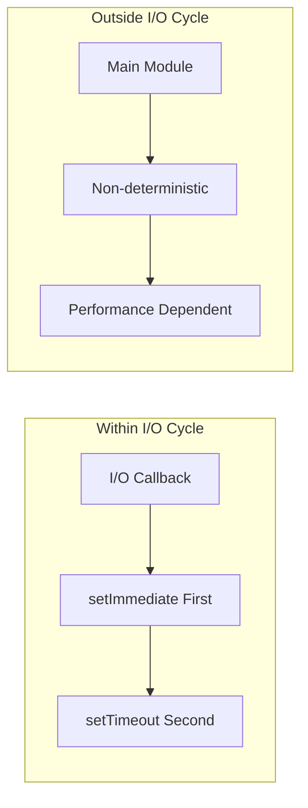

<figcaption>Inside I/O: deterministic (setImmediate first). Outside I/O: non-deterministic.</figcaption>

</figure>

```javascript title="timer-ordering.js"
const fs = require("fs")

// In main module: non-deterministic order
setTimeout(() => console.log("setTimeout"), 0)
setImmediate(() => console.log("setImmediate"))
// Output varies between runs

// Inside I/O callback: always setImmediate first
fs.readFile(__filename, () => {
  setTimeout(() => console.log("setTimeout (I/O)"), 0)
  setImmediate(() => console.log("setImmediate (I/O)"))
})
// Output: "setImmediate (I/O)" then "setTimeout (I/O)" - guaranteed
```

**Recommendation from Node.js docs**: "We recommend developers use `setImmediate()` in all cases because it's easier to reason about."

## True Parallelism: Worker Threads

Worker threads (browser Web Workers or Node.js `worker_threads`) provide true parallelism by creating independent JavaScript execution contexts with their own event loops.

### Worker Architecture

<figure>

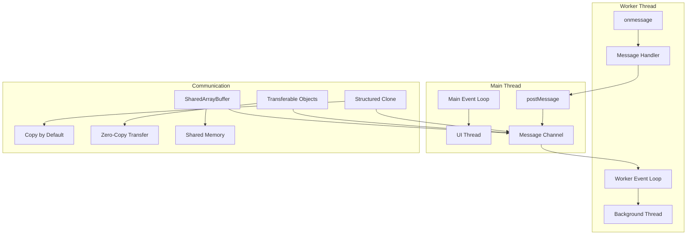

<figcaption>Workers have independent event loops; communication via message passing</figcaption>

</figure>

### Data Transfer Mechanisms

| Method                         | Performance   | Use Case                                          |
| ------------------------------ | ------------- | ------------------------------------------------- |
| **Structured Clone** (default) | O(n) copy     | Small messages, primitives, plain objects         |
| **Transferable Objects**       | O(1) transfer | ArrayBuffer, MessagePort, ImageBitmap             |
| **SharedArrayBuffer**          | Zero-copy     | High-frequency updates, lock-free data structures |

**Structured Clone** serializes and deserializes the data, suitable for small payloads. For large binary data (e.g., image processing), use **Transferable Objects** to avoid copying—ownership transfers to the worker, making the original reference unusable.

**SharedArrayBuffer** enables true shared memory between threads. Use `Atomics` for synchronization to avoid race conditions. Per ECMAScript 2025: "The memory model ensures no undefined behavior from data races."

```javascript title="worker-transfer.js" collapse={1-3, 12-15}
// Main thread
const worker = new Worker("processor.js")
const buffer = new ArrayBuffer(1024 * 1024) // 1MB

// Transfer ownership - buffer becomes detached (length: 0)
worker.postMessage({ data: buffer }, [buffer])
console.log(buffer.byteLength) // 0 - transferred

// For shared memory (requires cross-origin isolation)
const shared = new SharedArrayBuffer(1024)
const view = new Int32Array(shared)
Atomics.store(view, 0, 42) // Thread-safe write
worker.postMessage({ shared })
```

## Performance Monitoring and Debugging

### Node.js Event Loop Metrics

The `perf_hooks` module provides event loop delay monitoring:

```javascript title="event-loop-monitor.js" collapse={1-2}
const { monitorEventLoopDelay } = require("perf_hooks")

const histogram = monitorEventLoopDelay({ resolution: 20 })
histogram.enable()

// Check every 5 seconds
setInterval(() => {
  console.log({
    min: histogram.min / 1e6, // Convert ns to ms
    max: histogram.max / 1e6,
    mean: histogram.mean / 1e6,
    p99: histogram.percentile(99) / 1e6,
  })
  histogram.reset()
}, 5000)
```

**Healthy thresholds**:

- **mean < 10ms**: Good—event loop is responsive
- **p99 < 50ms**: Acceptable for most applications
- **p99 > 100ms**: Problematic—indicates blocking operations or CPU-bound work

### Bottleneck Identification

| Symptom                          | Likely Cause               | Diagnostic                              |
| -------------------------------- | -------------------------- | --------------------------------------- |
| High event loop lag, high CPU    | CPU-bound JavaScript       | CPU profiler, look for hot functions    |
| High event loop lag, low CPU     | Blocking I/O in event loop | Check for `*Sync` APIs                  |
| Normal lag, slow file operations | Thread pool saturation     | Increase `UV_THREADPOOL_SIZE`           |
| Slow network, normal lag         | Network I/O capacity       | Check connection counts, socket buffers |

### Browser Performance APIs

For browser event loop monitoring, use `PerformanceObserver` with `longtask` entries:

```javascript title="long-task-monitor.js"
const observer = new PerformanceObserver((list) => {
  for (const entry of list.getEntries()) {
    // Long tasks are > 50ms
    console.log(`Long task: ${entry.duration}ms`, entry.attribution)
  }
})
observer.observe({ entryTypes: ["longtask"] })
```

`requestIdleCallback` indicates when the browser has idle time—useful for deferring non-critical work:

```javascript title="idle-callback.js"
requestIdleCallback(
  (deadline) => {
    // deadline.timeRemaining() reports ms until next frame
    while (deadline.timeRemaining() > 0 && workQueue.length > 0) {
      processItem(workQueue.shift())
    }
  },
  { timeout: 2000 }, // Force execution after 2s even if busy
)
```

**Note**: `requestIdleCallback` is not supported in Safari. Maximum idle period is 50ms per the W3C spec to ensure 100ms response time for user input.

## Conclusion

The JavaScript event loop is an abstract concurrency model with environment-specific implementations. The ECMAScript specification defines Jobs and Agents; hosts implement concrete event loops optimized for their workloads—browsers for UI responsiveness at 60fps, Node.js for high-throughput I/O via libuv's phased architecture.

The key insight: microtasks always drain completely before the next macrotask or render. This enables consistent DOM state before paint but risks starvation if microtasks spawn recursively. Understanding this priority system—and the environment-specific scheduling APIs (`requestAnimationFrame`, `setImmediate`, `scheduler.postTask`)—is essential for building responsive applications.

## Appendix

### Prerequisites

- JavaScript async/await and Promise fundamentals
- Basic understanding of operating system I/O models
- Familiarity with browser rendering concepts (for browser section)

### Terminology

| Term             | Definition                                                                       |
| ---------------- | -------------------------------------------------------------------------------- |
| **Agent**        | ECMAScript execution context with call stack, job queues, and running context    |
| **Macrotask**    | A task scheduled for future event loop iteration (setTimeout, I/O callback)      |
| **Microtask**    | A high-priority task that drains completely before next macrotask (Promise.then) |
| **Event Loop**   | Host-provided mechanism that schedules JavaScript execution                      |
| **libuv**        | Cross-platform async I/O library used by Node.js                                 |
| **IOCP**         | I/O Completion Ports—Windows async I/O mechanism                                 |
| **epoll/kqueue** | Linux/macOS async I/O notification mechanisms                                    |

### Summary

- The event loop is a host environment feature, not a JavaScript language feature
- Two-tier priority: microtasks (high) drain completely before macrotasks (lower)
- Browsers integrate with rendering: Task → Microtasks → rAF → Style → Layout → Paint
- Node.js uses 6 libuv phases: timers → pending → idle → poll → check → close
- `process.nextTick()` has higher priority than microtasks in CJS, but lower in ESM
- Thread pool (default 4) handles blocking operations; network I/O is non-blocking
- Worker threads provide true parallelism with separate event loops
- Monitor event loop lag; healthy p99 < 50ms

### References

**Specifications**

- [WHATWG HTML Living Standard - Event Loops](https://html.spec.whatwg.org/multipage/webappapis.html#event-loops) - Authoritative browser processing model
- [ECMAScript 2025 - Jobs and Job Queues](https://tc39.es/ecma262/#sec-jobs-and-job-queues) - Language specification for async scheduling
- [W3C requestIdleCallback](https://w3c.github.io/requestidlecallback/) - Idle callback specification

**Official Documentation**

- [Node.js Event Loop Documentation](https://nodejs.org/en/learn/asynchronous-work/event-loop-timers-and-nexttick) - Phases, `process.nextTick`, `setImmediate`
- [libuv Design Overview](https://docs.libuv.org/en/v1.x/design.html) - Thread pool, OS abstraction, I/O model
- [libuv Thread Pool](https://docs.libuv.org/en/v1.x/threadpool.html) - Configuration, sizing, operations
- [MDN - Using Microtasks](https://developer.mozilla.org/en-US/docs/Web/API/HTML_DOM_API/Microtask_guide) - Microtask behavior
- [MDN - Prioritized Task Scheduling API](https://developer.mozilla.org/en-US/docs/Web/API/Prioritized_Task_Scheduling_API) - scheduler.postTask

**Core Maintainer Content**

- [Tasks, Microtasks, Queues and Schedules - Jake Archibald](https://jakearchibald.com/2015/tasks-microtasks-queues-and-schedules/) - Interactive visualization
- [Bert Belder libuv Talk Notes](https://baking-code.dev/post/my-notes-from-bert-belders-talk-on-libuv/) - libuv design rationale
- [Video: Everything You Need to Know About Node.js Event Loop - Bert Belder, IBM](https://youtu.be/PNa9OMajw9w)
- [Video: Node's Event Loop From the Inside Out - Sam Roberts, IBM](https://youtu.be/P9csgxBgaZ8)
- [The Dangers of setImmediate - Platformatic](https://blog.platformatic.dev/the-dangers-of-setimmediate) - Node.js 20 timing changes
