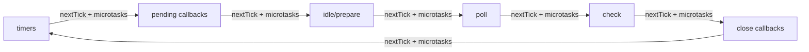

# Node.js Event Loop: Phases, Queues, and Process Exit

A mental-model-first explanation of how Node.js schedules input/output (I/O): libuv phases first, then V8 (the JavaScript engine) microtasks and `process.nextTick()`, and finally process exit conditions. Includes a spec-precise contrast to the Hypertext Markup Language (HTML) event loop and the ECMAScript job queue.

<figure>


<figcaption>Phased diagram of the Node.js event loop showing the libuv phase order.</figcaption>

</figure>

## TLDR

### Mental model (first pass)

- The loop is a phased scheduler in libuv (Node's cross-platform async I/O library): timers -> pending callbacks -> idle/prepare -> poll -> check -> close callbacks.
- After each callback, Node drains `process.nextTick()` and then the microtask queue (Promises and `queueMicrotask()`).
- The process exits when there is no pending I/O and no timers left to run.

### Operational consequences

- The poll phase can block waiting for readiness; recursive `process.nextTick()` can starve I/O.
- Network sockets are non-blocking; file system operations and `dns.lookup()` use the libuv thread pool (default 4 threads, shared process-wide).
- Short scripts exit naturally; long-lived servers stay alive because they keep active I/O sources (for example, open sockets).

## Mental Model First: Two Layers of Scheduling

Think of Node as two schedulers stacked together. The outer scheduler is libuv's phased loop; the inner scheduler is the microtask and `process.nextTick()` queues owned by V8 and Node. A single "tick" is one pass through the phases; after each JavaScript callback (and before the loop continues), Node drains `process.nextTick()` and then microtasks.

Simplified flow (intentionally ignoring edge cases you will see later):

1. Pick the next phase in the fixed order and run its callbacks.
2. After each callback, drain `process.nextTick()`.
3. Drain microtasks (Promise reactions and `queueMicrotask()`).
4. Repeat until there is no pending I/O or timers.

Example: A Hypertext Transfer Protocol (HTTP) server accepts a socket, runs the poll callback, schedules a Promise to update metrics, and calls `setImmediate()`. The callback runs, then `process.nextTick()`, then the Promise microtask, and the `setImmediate()` fires later in the check phase.

## Phase Order and Semantics (libuv detail)

Node follows libuv's six phases, each with its own callback queue. The order is fixed; what changes is how much work is queued in each phase and how long poll blocks.

<figure>



<figcaption>Phase order annotated with the post-callback drain points for `process.nextTick()` and microtasks.</figcaption>
</figure>

> "Each phase has a FIFO queue of callbacks to execute." - Node.js Event Loop docs.

- **timers**: Executes expired `setTimeout()` / `setInterval()` callbacks.
- **pending callbacks**: Executes callbacks deferred from the previous loop iteration (for example, certain networking errors).
- **idle, prepare**: Internal libuv bookkeeping; no user-visible callbacks.
- **poll**: Pulls new I/O events from the operating system (OS) and runs their callbacks; may block if no timers are due.
- **check**: Executes `setImmediate()` callbacks.
- **close callbacks**: Handles `close` events (for example, on sockets).

> "A timer specifies the threshold after which a provided callback may be executed." - Node.js Event Loop docs.

Timers are best-effort; operating system scheduling and other callbacks can delay them.

Edge case: Since libuv 1.45.0 (Node 20), timers are checked only after poll; older releases could also check timers before poll. This can affect how timers interleave with `setImmediate()` in some scenarios.

Example: Schedule a 100 ms timeout, then start an `fs.readFile()` that finishes in 95 ms and runs a 10 ms callback. The timer fires around 105 ms, not 100 ms, because the callback delays the timers phase.

## Microtasks and `process.nextTick()`

Node maintains two high-priority queues outside libuv's phases: the `process.nextTick()` queue and the microtask queue.

> "This queue is fully drained after the current operation on the JavaScript stack runs to completion and before the event loop is allowed to continue." - Node.js `process.nextTick()` docs.

> "Within Node.js, every time the 'next tick queue' is drained, the microtask queue is drained immediately after." - Node.js `process.nextTick()` docs.

In CommonJS (CJS), `process.nextTick()` callbacks run before `queueMicrotask()` ones. In ECMAScript modules (ESM), module evaluation itself runs as a microtask, so microtasks can run before `process.nextTick()`.

> "This can create some bad situations because it allows you to \"starve\" your I/O by making recursive `process.nextTick()` calls." - Node.js Event Loop docs.

Ordering example from the Node.js `queueMicrotask()` vs `process.nextTick()` docs: ([Node.js - `process.nextTick()` vs `queueMicrotask()`](https://nodejs.org/docs/latest/api/process.html#when-to-use-queuemicrotask-vs-processnexttick))

```js title="cjs.js" collapse={1}
const { nextTick } = require("node:process")
Promise.resolve().then(() => console.log("resolve"))
queueMicrotask(() => console.log("microtask"))
nextTick(() => console.log("nextTick"))
// Output (CJS):
// nextTick
// resolve
// microtask
```

```js title="esm.mjs" collapse={1}
import { nextTick } from "node:process"
Promise.resolve().then(() => console.log("resolve"))
queueMicrotask(() => console.log("microtask"))
nextTick(() => console.log("nextTick"))
// Output (ESM):
// resolve
// microtask
// nextTick
```

Example: A logging middleware that schedules itself with `process.nextTick()` can starve I/O if it creates an unbounded chain; use `queueMicrotask()` or `setImmediate()` when fairness matters more than immediate priority.

## I/O Boundaries: Kernel Readiness vs. libuv Thread Pool

Network I/O is readiness-based and handled by the kernel with non-blocking sockets. libuv polls using platform mechanisms such as epoll, kqueue, and I/O Completion Ports (IOCP) and runs callbacks on the loop thread. By contrast, work that cannot be made non-blocking is pushed onto the libuv thread pool.

The thread pool is global to the process, defaults to 4 threads, and is configurable via `UV_THREADPOOL_SIZE` (maximum 1024). It services file system operations and certain Domain Name System (DNS) lookups (`getaddrinfo` / `getnameinfo`). In Node, `dns.lookup()` uses the thread pool, while `dns.resolve*()` performs network DNS queries and does not.

Example: A build tool that starts 1,000 parallel `fs.readFile()` calls will queue 996 tasks behind the 4-thread pool, inflating tail latency; increasing `UV_THREADPOOL_SIZE` helps but competes with central processing unit (CPU) time for the event loop.

## Process Exit and Liveness

Node checks between iterations whether it is still waiting for asynchronous I/O or timers; if not, the process exits. This is why short scripts terminate as soon as their last callback completes.

Example: A script with a single `setTimeout()` exits immediately after the timer fires; removing the timer makes the process exit with no delay.

## Browser Event Loop Contrast (Spec-precise)

The HTML event loop model is similar in spirit but not identical in mechanism. The spec explicitly separates task queues from the microtask queue:

> "Task queues are sets, not queues." - Hypertext Markup Language (HTML) Standard, "Event loop processing model".

> "The microtask queue is not a task queue." - Hypertext Markup Language (HTML) Standard, "Event loop processing model".

The spec also preserves ordering within a single task source:

> "the user agent would never process events from any one task source out of order." - Hypertext Markup Language (HTML) Standard, "Event loop processing model".

ECMAScript specifies job queues as FIFO queues:

> "A Job Queue is a FIFO queue of PendingJob records." - ECMAScript Language Specification, "Jobs and Job Queues".

Net effect: because task queues are sets and the user agent selects a runnable task from a chosen queue, ordering across different HTML task sources is not guaranteed, but ordering within a given source is. Node's fixed phase order and its extra `process.nextTick()` queue make scheduling more predictable for server workloads but easier to starve if high-priority queues are abused.

Example: In a browser, a user input task can run before a timer task depending on task source selection; in Node, an I/O callback and a `setImmediate()` follow the poll -> check phase order.

## Conclusion

Node's event loop is a deliberate trade-off: fixed phases and a dedicated thread pool make I/O-heavy servers predictable and scalable, while the extra high-priority queues (`process.nextTick()` and microtasks) offer low-latency scheduling at the cost of potential starvation. Use the simplified model to reason quickly, then drop to the phase-level view when debugging ordering and latency.

## Appendix

### Prerequisites

- Familiarity with Promises, timers, and non-blocking I/O in Node.js.

### Terminology

- **Tick**: One pass through the libuv phases.
- **Phase**: A libuv stage that owns a callback queue (timers, poll, check, etc.).
- **Task**: A unit of work scheduled onto an HTML task queue.
- **Task source**: A category of tasks in HTML (for example, timers, user interaction, networking).
- **Microtask**: A high-priority job processed after tasks/phases (Promises, `queueMicrotask()`).
- **Handle**: A long-lived resource that can keep the event loop active (for example, a listening socket).

### Summary

- libuv executes callbacks in fixed phases; Node drains `process.nextTick()` then microtasks after each callback.
- Timers are "minimum delay" thresholds, not precise scheduling guarantees, and can be delayed by other callbacks.
- The libuv thread pool is small and shared; file system operations and `dns.lookup()` can bottleneck it.
- The process exits when no timers or pending I/O remain.
- HTML and ECMAScript specs model tasks and microtasks differently from Node's phase-based loop.

### References

- [HTML Standard - Event loop processing model](https://html.spec.whatwg.org/multipage/webappapis.html#event-loop-processing-model)
- [ECMAScript 2015 Language Specification (ECMA-262 6th Edition) - Jobs and Job Queues](https://262.ecma-international.org/6.0/#sec-jobs-and-job-queues)
- [Node.js - The Node.js Event Loop](https://nodejs.org/en/guides/event-loop-timers-and-nexttick)
- [Node.js - `process.nextTick()`](https://nodejs.org/docs/latest/api/process.html#processnexttickcallback-args)
- [Node.js - `process.nextTick()` vs `queueMicrotask()`](https://nodejs.org/docs/latest/api/process.html#when-to-use-queuemicrotask-vs-processnexttick)
- [Node.js - DNS module](https://nodejs.org/api/dns.html)
- [libuv - Design overview](https://docs.libuv.org/en/latest/design.html)
- [libuv - Thread pool work scheduling](https://docs.libuv.org/en/v1.x/threadpool.html)
