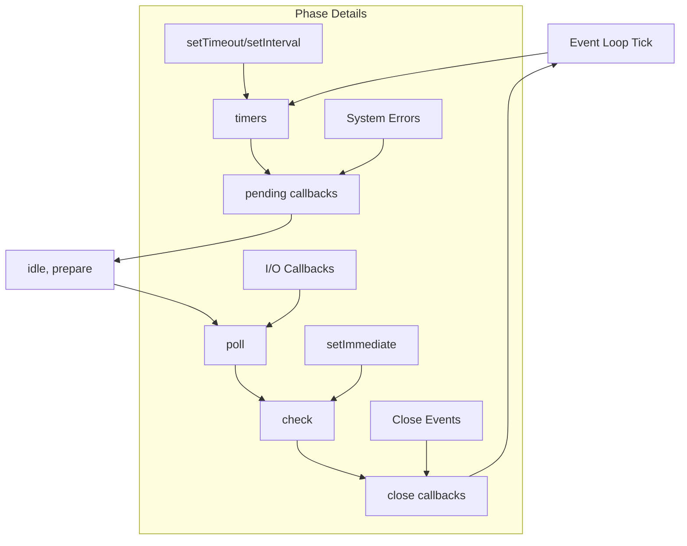

# Node.js Event Loop: libuv Phases and Process Exit

A focused guide to Node.js's phased event loop, why the phases exist, and how Node's loop differs from the browser's lifecycle.

<figure>

<figcaption>Detailed diagram showing the phases of the Node.js event loop and their execution order</figcaption>

</figure>

## TLDR

**Node.js event loop** is a libuv-powered, phased scheduler optimized for high-throughput I/O. It runs callbacks in distinct phases, integrates with OS I/O notifications, and exits the process when there's no remaining work.

### Node-Specific Characteristics

- **Phased architecture**: timers -> pending callbacks -> idle/prepare -> poll -> check -> close callbacks
- **I/O-optimized**: poll phase blocks for I/O readiness; network I/O is handled on the event loop thread
- **Thread pool for blocking work**: filesystem, DNS, crypto, and user work items run on libuv's worker pool
- **Process lifecycle**: the event loop quits when no handles, timers, or pending work remain

## Phased Event Loop Structure (libuv)

Node's event loop executes in six phases, each with its own FIFO queue of callbacks. This structure is documented in the Node.js event loop guide and implemented by libuv. ([Node.js Event Loop Docs](https://nodejs.org/en/learn/asynchronous-work/event-loop-timers-and-nexttick))

<figure>

<figcaption>Phased event loop structure showing the six phases of the Node.js event loop and their execution order</figcaption>

</figure>

## Why a Phased Event Loop?

Node's phased design exists to make I/O-heavy workloads predictable and efficient:

- **Separation of concerns**: timers, I/O, immediates, and close callbacks are serviced in clear, repeatable order
- **Efficient I/O waiting**: the poll phase can block for readiness notifications without burning CPU
- **Fairness and latency control**: timers don't starve I/O, and I/O doesn't starve timers
- **OS integration**: libuv maps phases onto platform I/O mechanisms (epoll, kqueue, IOCP) for scalability

## Thread Pool vs Direct I/O

Network sockets run on the event loop thread using non-blocking I/O. Operations that can't be made non-blocking (filesystem, DNS, certain crypto) are offloaded to libuv's worker pool. ([libuv Design Overview](https://docs.libuv.org/en/v1.x/design.html))

## Microtasks and nextTick (Outside libuv Phases)

Node layers V8 microtasks and `process.nextTick()` on top of libuv's phases. `process.nextTick()` runs before microtasks, and both run outside the phase queues, which can affect ordering and starvation if overused. ([Node.js Event Loop Docs](https://nodejs.org/en/learn/asynchronous-work/event-loop-timers-and-nexttick))

## When the Node Event Loop Quits

Unlike browsers, Node.js is process-based. If there are **no active timers, no pending I/O, and no referenced handles**, the event loop finishes and the process exits. This is why servers keep the loop alive with sockets or timers, while short scripts terminate naturally after their work completes. ([Node.js Event Loop Docs](https://nodejs.org/en/learn/asynchronous-work/event-loop-timers-and-nexttick))

## Did you know? (Spec terminology for contrast)

Even though Node.js isn't defined by the HTML Standard, these spec terms help when comparing environments:

- **Task queues are sets**, not strict FIFO queues
- **An event loop has one or more task queues** (often represented as task sources)
- **The microtask queue is not a task queue** and is processed separately

([HTML Standard - Event loop processing model](https://html.spec.whatwg.org/multipage/webappapis.html#event-loop-processing-model))

## Key References

- [Node.js Event Loop Docs](https://nodejs.org/en/learn/asynchronous-work/event-loop-timers-and-nexttick)
- [libuv Design Overview](https://docs.libuv.org/en/v1.x/design.html)
- [HTML Standard - Event loop processing model](https://html.spec.whatwg.org/multipage/webappapis.html#event-loop-processing-model)
