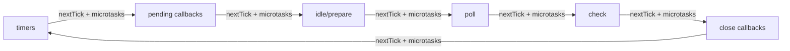

# Node.js Event Loop: Phases, Queues, and Process Exit

As of Node.js 22 LTS (libuv 1.48.0), this article covers how Node schedules input/output (I/O): libuv phases first, then V8 (the JavaScript engine) microtasks and `process.nextTick()`, and finally process exit conditions. Includes a spec-precise contrast to the Hypertext Markup Language (HTML) event loop and the ECMAScript job queue.

<figure>


<figcaption>Phased diagram of the Node.js event loop showing the libuv phase order.</figcaption>

</figure>

## Abstract

### Mental model

- The loop is a phased scheduler in libuv (Node's cross-platform async I/O library): timers → pending callbacks → idle/prepare → poll → check → close callbacks.
- After each callback, Node drains `process.nextTick()` and then the microtask queue (Promises and `queueMicrotask()`).
- The process exits when no ref'd handles or active requests remain.

### Operational consequences

- The poll phase can block waiting for I/O readiness; recursive `process.nextTick()` or microtask chains can starve I/O indefinitely.
- Network I/O is non-blocking (epoll/kqueue/IOCP); file system operations, `dns.lookup()`, crypto, and zlib use the libuv thread pool (default 4 threads, max 1024, shared process-wide).
- `setImmediate()` always fires before timers when called from an I/O callback; outside I/O callbacks, the order is non-deterministic.
- Timers have millisecond resolution with ±0.5 ms jitter; they specify a minimum delay threshold, not a precise schedule.

## Mental Model: Two Layers of Scheduling

Think of Node as two schedulers stacked together. The outer scheduler is libuv's phased loop; the inner scheduler is the microtask and `process.nextTick()` queues owned by V8 and Node. A single "tick" is one pass through the phases; after each JavaScript callback (and before the loop continues), Node drains `process.nextTick()` and then microtasks.

Simplified flow (intentionally ignoring edge cases covered later):

1. Pick the next phase in the fixed order and run its callbacks.
2. After each callback, drain `process.nextTick()`.
3. Drain microtasks (Promise reactions and `queueMicrotask()`).
4. Repeat until no ref'd handles or active requests remain.

Example: A Hypertext Transfer Protocol (HTTP) server accepts a socket, runs the poll callback, schedules a Promise to update metrics, and calls `setImmediate()`. The callback runs, then `process.nextTick()`, then the Promise microtask, and the `setImmediate()` fires later in the check phase.

## Phase Order and Semantics (libuv detail)

Node follows libuv's six phases, each with its own callback queue. The order is fixed; what changes is how much work is queued in each phase and how long poll blocks.

<figure>



<figcaption>Phase order annotated with the post-callback drain points for `process.nextTick()` and microtasks.</figcaption>
</figure>

> "Each phase has a FIFO queue of callbacks to execute." - Node.js Event Loop docs.

- **timers**: Executes expired `setTimeout()` / `setInterval()` callbacks.
- **pending callbacks**: Executes callbacks deferred from the previous loop iteration (for example, certain networking errors).
- **idle, prepare**: Internal libuv bookkeeping; no user-visible callbacks.
- **poll**: Pulls new I/O events from the operating system (OS) and runs their callbacks; may block if no timers are due.
- **check**: Executes `setImmediate()` callbacks.
- **close callbacks**: Handles `close` events (for example, on sockets).

> "A timer specifies the threshold after which a provided callback may be executed." - Node.js Event Loop docs.

Timers are best-effort; operating system scheduling and other callbacks can delay them. libuv only supports millisecond resolution by rounding higher-precision clocks to integers—timers can be off by ±0.5 ms even in ideal conditions.

> **Breaking change in Node.js 20 (libuv 1.45.0):** Prior to this version, libuv executed timers both before and after the poll phase. As of libuv 1.45.0, timers run only after poll. This changes how timers interleave with `setImmediate()` in edge cases—code that relied on timers firing before I/O polling may behave differently. Node.js 22 LTS ships with libuv 1.48.0, which carries this behavior forward.

Repeating timers (`setInterval`) do not adjust for callback execution time. A 50 ms repeating timer whose callback takes 17 ms will reschedule after 33 ms, not 50 ms, because libuv rearms relative to its current idea of "now."

Example: Schedule a 100 ms timeout, then start an `fs.readFile()` that finishes in 95 ms and runs a 10 ms callback. The timer fires around 105 ms, not 100 ms, because the callback delays the timers phase.

## Microtasks and `process.nextTick()`

Node maintains two high-priority queues outside libuv's phases: the `process.nextTick()` queue and the microtask queue.

> "This queue is fully drained after the current operation on the JavaScript stack runs to completion and before the event loop is allowed to continue." - Node.js `process.nextTick()` docs.

> "Within Node.js, every time the 'next tick queue' is drained, the microtask queue is drained immediately after." - Node.js `process.nextTick()` docs.

In CommonJS (CJS), `process.nextTick()` callbacks run before `queueMicrotask()` ones. In ECMAScript modules (ESM), module evaluation itself runs as a microtask, so microtasks can run before `process.nextTick()`.

> "This can create some bad situations because it allows you to \"starve\" your I/O by making recursive `process.nextTick()` calls." - Node.js Event Loop docs.

Ordering example from the Node.js `queueMicrotask()` vs `process.nextTick()` docs: ([Node.js - `process.nextTick()` vs `queueMicrotask()`](https://nodejs.org/docs/latest/api/process.html#when-to-use-queuemicrotask-vs-processnexttick))

```js title="cjs.js" collapse={1}
const { nextTick } = require("node:process")
Promise.resolve().then(() => console.log("resolve"))
queueMicrotask(() => console.log("microtask"))
nextTick(() => console.log("nextTick"))
// Output (CJS):
// nextTick
// resolve
// microtask
```

```js title="esm.mjs" collapse={1}
import { nextTick } from "node:process"
Promise.resolve().then(() => console.log("resolve"))
queueMicrotask(() => console.log("microtask"))
nextTick(() => console.log("nextTick"))
// Output (ESM):
// resolve
// microtask
// nextTick
```

Example: A logging middleware that schedules itself with `process.nextTick()` can starve I/O if it creates an unbounded chain; use `queueMicrotask()` or `setImmediate()` when fairness matters more than immediate priority. Detection: Use `monitorEventLoopDelay()` from `perf_hooks`—consistent lag > 100 ms indicates starvation.

## `setImmediate()` vs `setTimeout()` Determinism

The ordering of `setImmediate()` and `setTimeout(..., 0)` depends on context:

**Inside an I/O callback (deterministic):** `setImmediate()` always fires first because the loop is in the poll phase and proceeds directly to check before looping back to timers.

```js title="deterministic.js" collapse={1-2}
const fs = require("node:fs")
fs.readFile(__filename, () => {
  setTimeout(() => console.log("timeout"), 0)
  setImmediate(() => console.log("immediate"))
})
// Output: "immediate" then "timeout" (100% deterministic)
```

**Outside I/O callbacks (non-deterministic):** Whether the timer or immediate fires first depends on process startup performance—if the loop enters the timers phase before the 1 ms minimum delay elapses, the timer fires first; otherwise, the immediate does.

```js title="non-deterministic.js"
setTimeout(() => console.log("timeout"), 0)
setImmediate(() => console.log("immediate"))
// Output order varies between runs
```

Design reasoning: `setImmediate()` exists specifically to schedule work immediately after I/O without waiting for timers. When predictability matters, prefer `setImmediate()` inside I/O callbacks or use explicit sequencing with Promises.

## I/O Boundaries: Kernel Readiness vs. libuv Thread Pool

Network I/O is readiness-based and handled by the kernel with non-blocking sockets. libuv polls using platform mechanisms such as epoll (Linux), kqueue (macOS/BSD), event ports (SunOS), and I/O Completion Ports (IOCP, Windows), then runs callbacks on the event loop thread. By contrast, work that cannot be made non-blocking is pushed onto the libuv thread pool.

| Property      | Value                | Notes                                                                                  |
| ------------- | -------------------- | -------------------------------------------------------------------------------------- |
| Default size  | 4 threads            | Set at process startup                                                                 |
| Maximum size  | 1024 threads         | Increased from 128 in libuv 1.30.0                                                     |
| Configuration | `UV_THREADPOOL_SIZE` | Environment variable; must be set before process starts                                |
| Thread stack  | 8 MB                 | Changed in libuv 1.45.0; was platform default (often too small for deeply nested code) |
| Thread naming | `libuv-worker`       | Added in libuv 1.50.0                                                                  |

The thread pool services:

- **File system operations**: All `fs.*` calls except those using `fs.watch()` (which uses kernel notifications)
- **DNS lookups via `getaddrinfo`**: `dns.lookup()` and `dns.lookupService()` use the thread pool; `dns.resolve*()` performs network DNS queries and does not
- **Crypto operations**: `crypto.pbkdf2()`, `crypto.scrypt()`, `crypto.randomBytes()` (async), `crypto.generateKeyPair()`
- **Compression**: `zlib.gzip()`, `zlib.gunzip()`, `zlib.deflate()`, `zlib.inflate()` (async variants)
- **Custom work**: `uv_queue_work()` for user-specified tasks

> **Warning:** The thread pool is **not thread-safe for user data**. While the pool itself is global and shared across all event loops, accessing shared data from worker threads requires explicit synchronization.

Example: A build tool that starts 1,000 parallel `fs.readFile()` calls will queue 996 tasks behind the 4-thread pool, inflating tail latency. Increasing `UV_THREADPOOL_SIZE` to 64 or 128 helps I/O throughput but increases memory usage and competes with central processing unit (CPU) time for the event loop.

## Process Exit and Liveness

Node checks between iterations whether the loop is "alive." The loop is alive if any of these conditions hold:

- Active and ref'd handles exist (timers, sockets, file watchers)
- Active requests are pending (I/O operations in flight)
- Closing handles are still in flight

When none of these conditions hold, the process exits. This is why short scripts terminate as soon as their last callback completes.

### `ref()` and `unref()`

By default, all timers and immediates are **ref'd**—the process will not exit while they are active. Calling `timeout.unref()` allows the process to exit even if the timer is still pending; `timeout.ref()` reverses this. Both are idempotent. Use `timeout.hasRef()` to check current status.

```js title="unref-example.js" collapse={1}
const timeout = setTimeout(() => console.log("never runs"), 10000)
timeout.unref() // Process exits immediately; timer does not keep it alive
```

Example: A background heartbeat timer that should not prevent graceful shutdown uses `unref()`. A critical timeout that must fire before exit uses `ref()` (the default).

Design reasoning: `unref()` exists because long-running servers often have background tasks (health checks, metrics flushing) that should not block shutdown. Without `unref()`, you would need to manually clear every timer during shutdown.

## Browser Event Loop Contrast (Spec-precise)

The HTML event loop model is similar in spirit but not identical in mechanism. The spec explicitly separates task queues from the microtask queue:

> "Task queues are sets, not queues." - Hypertext Markup Language (HTML) Standard, "Event loop processing model".

> "The microtask queue is not a task queue." - Hypertext Markup Language (HTML) Standard, "Event loop processing model".

The spec also preserves ordering within a single task source:

> "the user agent would never process events from any one task source out of order." - Hypertext Markup Language (HTML) Standard, "Event loop processing model".

ECMAScript specifies job queues as FIFO queues:

> "A Job Queue is a FIFO queue of PendingJob records." - ECMAScript Language Specification, "Jobs and Job Queues".

Net effect: because task queues are sets and the user agent selects a runnable task from a chosen queue, ordering across different HTML task sources is not guaranteed, but ordering within a given source is. Node's fixed phase order and its extra `process.nextTick()` queue make scheduling more predictable for server workloads but easier to starve if high-priority queues are abused.

Example: In a browser, a user input task can run before a timer task depending on task source selection; in Node, an I/O callback and a `setImmediate()` follow the poll -> check phase order.

## Conclusion

Node's event loop is a deliberate trade-off: fixed phases and a dedicated thread pool make I/O-heavy servers predictable and scalable, while the high-priority queues (`process.nextTick()` and microtasks) offer low-latency scheduling at the cost of potential starvation. The libuv 1.45.0 timer change (Node.js 20+) affects edge cases around timer/immediate ordering, and the CJS vs ESM microtask ordering difference can cause subtle bugs when porting code.

Use the simplified two-scheduler mental model to reason quickly, then drop to the phase-level view when debugging ordering and latency. When in doubt, prefer `setImmediate()` inside I/O callbacks for deterministic scheduling and `queueMicrotask()` over `process.nextTick()` for portability.

## Appendix

### Prerequisites

- Familiarity with Promises, timers, and non-blocking I/O in Node.js.

### Terminology

- **Tick**: One pass through the libuv phases.
- **Phase**: A libuv stage that owns a callback queue (timers, poll, check, etc.).
- **Handle**: A long-lived libuv resource (timer, socket, file watcher) that keeps the event loop alive while active and ref'd.
- **Request**: A short-lived libuv operation (write, DNS lookup) that keeps the loop alive while pending.
- **Task**: A unit of work scheduled onto an HTML task queue (browser concept).
- **Task source**: A category of tasks in HTML (for example, timers, user interaction, networking).
- **Microtask**: A high-priority job processed after tasks/phases (Promises, `queueMicrotask()`).

### Summary

- libuv executes callbacks in fixed phases; Node drains `process.nextTick()` then microtasks after each callback.
- Timers have millisecond resolution with ±0.5 ms jitter; they specify a minimum delay threshold, not a precise schedule.
- Since Node.js 20 (libuv 1.45.0), timers execute only after the poll phase—a breaking change from prior versions.
- The libuv thread pool (default 4, max 1024 threads) services fs, dns.lookup(), crypto, and zlib; it can bottleneck I/O-heavy workloads.
- `setImmediate()` always fires before timers inside I/O callbacks; outside them, the order is non-deterministic.
- The process exits when no ref'd handles or active requests remain; use `unref()` for background timers that should not block shutdown.
- HTML and ECMAScript specs model tasks and microtasks differently from Node's phase-based loop.

### References

- [HTML Standard - Event loop processing model](https://html.spec.whatwg.org/multipage/webappapis.html#event-loop-processing-model)
- [ECMAScript 2015 Language Specification (ECMA-262 6th Edition) - Jobs and Job Queues](https://262.ecma-international.org/6.0/#sec-jobs-and-job-queues)
- [libuv - Design overview](https://docs.libuv.org/en/v1.x/design.html)
- [libuv - Thread pool work scheduling](https://docs.libuv.org/en/v1.x/threadpool.html)
- [libuv - Timer handle](https://docs.libuv.org/en/v1.x/timer.html)
- [Node.js - The Node.js Event Loop](https://nodejs.org/en/learn/asynchronous-work/event-loop-timers-and-nexttick)
- [Node.js - Understanding `process.nextTick()`](https://nodejs.org/en/learn/asynchronous-work/understanding-processnexttick)
- [Node.js - `process.nextTick()` API](https://nodejs.org/docs/latest/api/process.html#processnexttickcallback-args)
- [Node.js - `process.nextTick()` vs `queueMicrotask()`](https://nodejs.org/docs/latest/api/process.html#when-to-use-queuemicrotask-vs-processnexttick)
- [Node.js - Timers API](https://nodejs.org/api/timers.html)
- [Node.js - DNS module](https://nodejs.org/api/dns.html)
- [Node.js - Performance measurement APIs (`monitorEventLoopDelay`)](https://nodejs.org/api/perf_hooks.html#perf_hooks_monitoringeventloopdelay_options)
